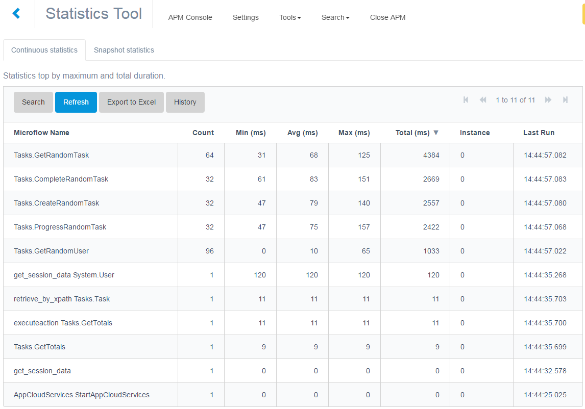
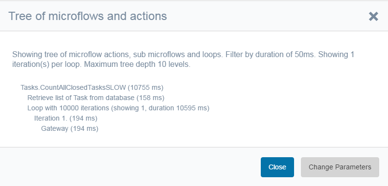
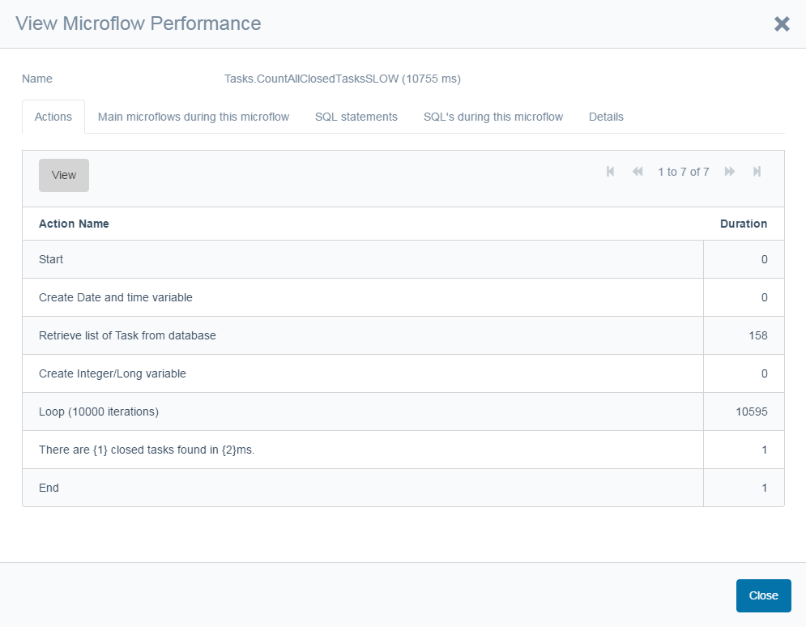
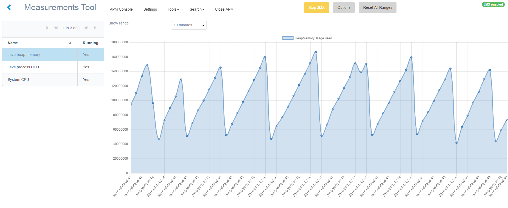

This introduction gives an explanation in short what APM is, which tools are in the APM suite and what they are used for. After that some use cases are presented.

# Definition of APM

On the wiki you can read a nice [definition of Application Performance Management](http://en.wikipedia.org/wiki/Application_performance_management). APM is the monitoring and management of performance and availability of software applications. APM strives to detect and diagnose application performance problems to maintain an expected level of service. APM is “the translation of IT metrics into business meaning ([i.e.] value)”.

Off course you need the basic infra-structure probes to measure you hardware parts like CPU, memory and disk as well as your components like the database and the web server. However for higher quality support you should also look at the application and how it is performing especially linking this to the end-user’s business perspective.

We all know software contains bugs, and of course we all test before we bring something into production. For the end-users, an error is a sign that the application is not functioning. If the error appears unexpected, the user loses his trust in the system. The standard reaction of our support was always to ask questions, including whether the customer can reproduce the issue, to turn on logging and to ask for a database dump, so our support can investigate the issue in a safe environment.

# The Statistics Tool to see performance issues coming

We also know that performance in applications is difficult to test in the initial stage. The data set is small and the exact usage of, for example search behavior of end-users is unknown. Therefore even if all good performance practices are applied in building a Mendix application, some issues still appear in production. Usually they appear over time, so the question is how to see them coming.

The APMx Statistics tool collects statistical data on microflows and client API requests. These statistics are stored periodically (usually daily, configurable) and from these statistics you can see a trend long before the users are ringing the bell. Also, as a good habit, our support frequently checks the longest and most often running microflows to see if they can be improved.

_Screenshot of the statistics tool. For load balanced environments you see the server where the microflow runs. _

__

# The Performance Tool to record microflows

When our support wants to investigate a performance issue, either pro-actively coming from the statistics tool or reactively when a customer reports an issue they use the APMx Performance tool. With this tool they can see on the action level the duration of the steps in the microflow. They can drill down and see individual SQL statements. They can even ask the database for an explain plan that tells you how the database processes the query, which indexes it uses and more. This tool quickly helps to pinpoint where the issue is.

_Screenshot of call tree. Gives you an overview of what happens, showing called microflows and 1 iteration of a loop, filtering by duration._

_Screenshot of the performance tool output. You can double click on all actions and in the case of microflow call, you browse to the next microflow and in the case of loops you will see the individual iterations._

 

_Screenshot of SQL statements during an action._

# The Measurements Tool to collect even more information and trigger an alarm when needed

The APMx Measurements tool is measurements to linking business logic and is bridging the gap between the model and the infrastructure metrics, like CPU measurements. The APMx Measurements get information from several different sources. First a simple APMx JVM browser to present similar information as shown in the standard java management tool like JConsole, VisualVM and JMC. Second the APMx query tool to perform business and database queries to monitor database specific meta information and/or business values. Third the internal metrics of Mendix and the APMx tool are available as well via the APMx JVM Browser or other Java JVM management platforms.

The measurements can be used to trigger events on thresholds. For example if more than 80% if memory is used or if more than 80% of the CPU is used a trigger fires. At some customers, our support has configured a trigger on a model change so they are informed when a new deployment is done.

The trigger can be to trap logging, to execute a microflow, for example to send an email or to make a heap dump.

# The Trap Tool is your flight data recorder

The APM Trap tool is always listening on all levels of logging up to the highest TRACE level and remembers the last several seconds (configurable!). When an error occurs the last few seconds of logging leading up to the error are saved in the database. The APM Measurements tool can also monitor memory usage or CPU and trap logging when a threshold is reached. In this way, the information is collected the first time something occurs and this speeds up the problem resolution considerably.

# Other tools

The following additional tools are used to support the tools mentioned above.

*   The **Log Tool** is used to collect Mendix Runtime log messages and store them in the database. This gives remote access to log information, makes it available to consultants, and allows for easy searching and analyzing.
*   The **JVM Browser** can be used to see JVM information similar to tools like JConsole, JVisualVM or JMC. This gives the information to more functional people without the need for specialists and technical access to the machines running the Mendix application.
*   The **Query Tool** allows to perform XPath, OQL and JDBC queries to collect either business statistics (report like), application statistics (number of scheduled events running at the same time) or database specific statistics like the number of sessions. This module is also used for the explain plan functionality in the performance tool.
*   The **Log rerouting** makes sure that java messages that are sent to the Java console, to the java util library or to the log4j library are rerouted to the Mendix log. For example javamail sends debug output to the console and with this option you can collect that information and make it visible in the Mendix log as well as in the APMx Log Tool and APMx Trap Tool. This helped our support a lot in solving email issues and issues with web services security and certificates.
*   The **JMX Tool** exposes statistics of Mendix, the Mendix Application Monitoring and Analysis Tools and custom application metrics to the Java Management eXtensions (JMX) for usage in other management platforms.

The APM tools give valuable information for analyzing the behavior and performance of an application in production. Off course the tool can and should also be used during development and test phases.