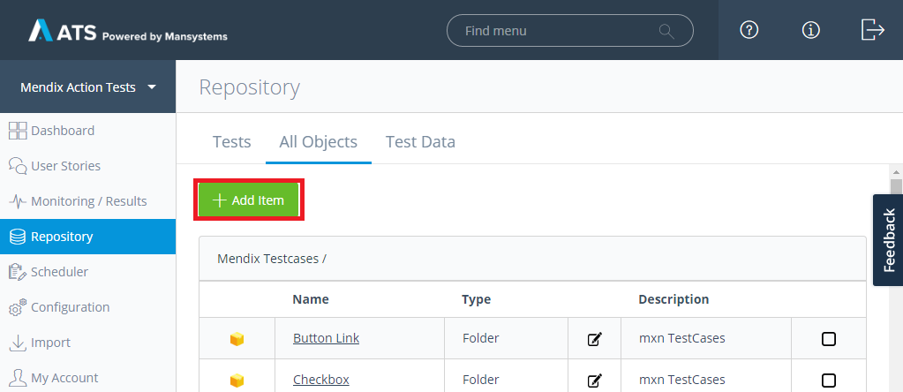
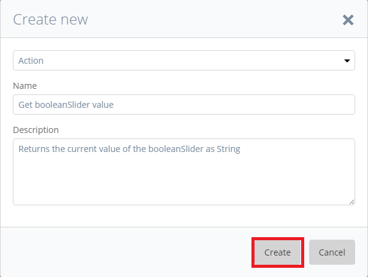
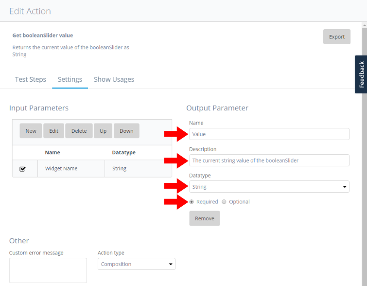
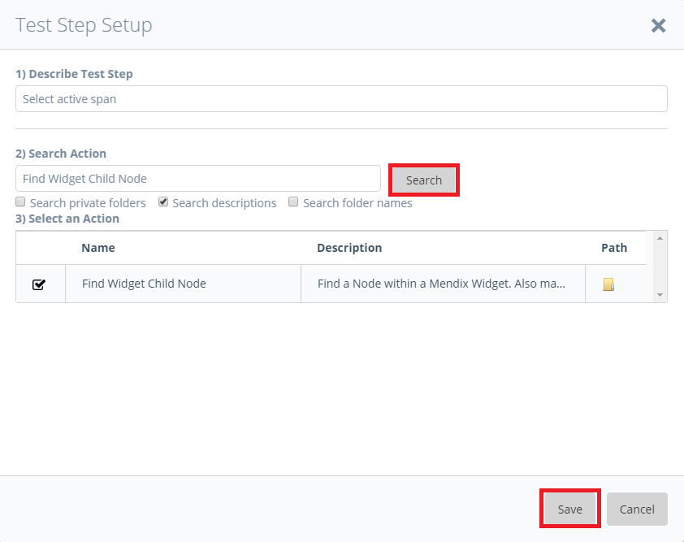
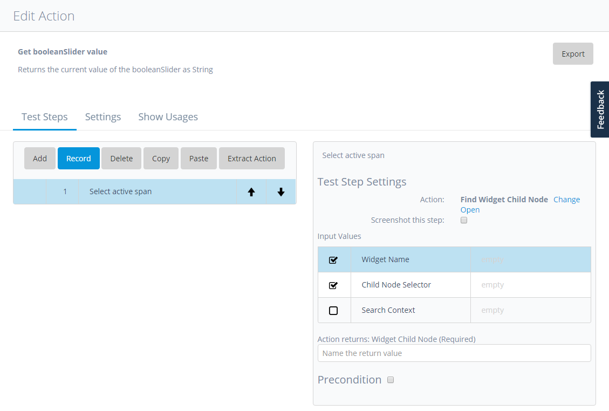
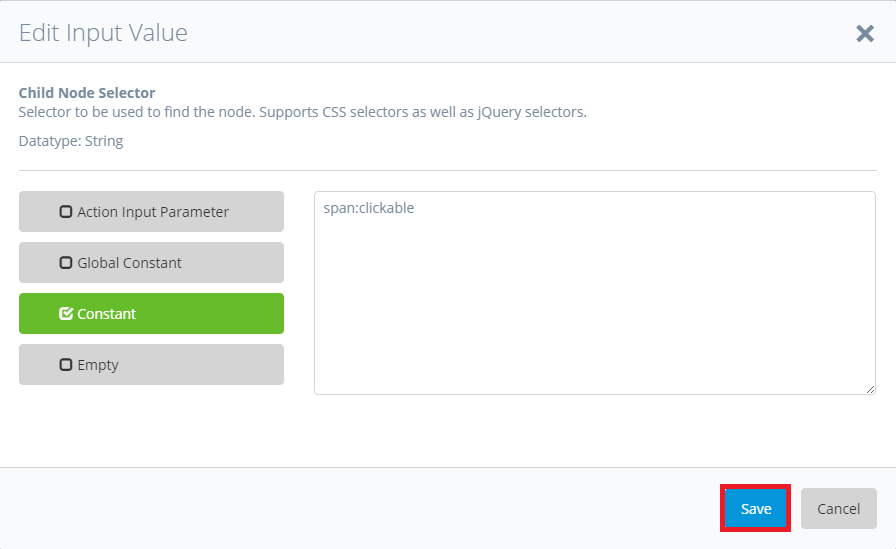

Welcome to the custom action creation tutorial. You will learn how to create a custom action for an appstore widget from scratch.

*  [Introduction](Custom+Action+Creation+Tutorial.md#Introduction)
*  [Create a Custom Action](Custom+Action+Creation+Tutorial.md#Create+a+Custom+Action)
*  [Setting Input- and Outputparameters](Custom+Action+Creation+Tutorial.md#Setting+Input-+and+Outputparameters)
*  [Adding Subactions](Custom+Action+Creation+Tutorial.md#Adding+Subactions)
*  [Set Return Value](Custom+Action+Creation+Tutorial.md#Set+Return+Value)
## Introduction
We will create a custom action based on the Boolean Slider Appstore widget. The following image shows the application we want to test. It consists of the Boolean Slider Appstore Widget whose current value we want to retrieve as a string.


If we would use the [Get Checkbox Value action](/Mendix+Actions/Input/Get+Checkbox+Value),it would only return true or false for the current state of the boolean slider.
Because we want the string value, and there is no standard action for retrieving it, we will have to write our own custom action for it.

Before we start creating our own custom action, we will look at the HTML source code of the widget in our application.

```HTML
<div class="wgt-BooleanSlider mx-name-booleanSlider1" id="BooleanSlider_widget_BooleanSlider_0" data-mendix-id="27_3" focusindex="0" widgetid="BooleanSlider_widget_BooleanSlider_0" style="display: block;">
    <div class="wgt-BooleanSlider_control form-control btn btn-primary" data-dojo-attach-point="controlNode">
        <input type="checkbox" class="wgt-BooleanSlider__input" data-dojo-attach-point="inputNode" checked="">
        <div class="wgt-BooleanSlider__toggle">
            <span class="wgt-BooleanSlider__toggletrue" data-dojo-attach-point="trueNode">Sure</span>
            <span class="wgt-BooleanSlider__togglefalse" data-dojo-attach-point="falseNode">No</span>
        </div>
    </div>
</div>
```

We see, that the string values of the boolean slider are stored inside the two ``<span>-elements`` of the widget, so we have to select the current active ``<span>-element`` and return its value.

## Create a Custom Action
Now that we know, where the value we want to retrive is located, we can go on with the custom action creation. Switch to ATS to begin.

Go to the repository, switch to the All Objects tab and create a new action by clicking **Add Item**. A popup window will appear.



In that window you can choose wich type of item you want to create.
Choose **Action** and give it the name **"Get booleanSlider value"** and set **"Returns the current value of the booleanSlider as String"** as description. You can change the name and the description later on if you want. Now click on **Create**.



The **Edit Action** page should have openend, where you can edit your newly created **Get booleanSlider value** action.


## Setting Input- and Outputparameters
Before we add subactions to our custom action, we will edit the input and output settings. Switch to the **Settings** tab.


Now click on **New** in the **Input Parameters** section. The **Edit Input Parameter** dialog will open.
Set **Widget Name** as name of the input parameter and add the description **"The name of the booleanSlider widget"**.
Set **Datatype** to **String**, **Show as Password** to **No**, **Required/Optional** to **Required** and **Type** to **Default**. Click on **Save**.   


We have successfully added the Widget Name as input parameter for our action. But we're not done yet. We have to add an output parameter to our action, to make the string value of the booleanSlider widget available to other actions. Click on **Set** in the **Output Parameter** section.


Input areas for the output parameter settings will appear. Now enter **Value** as name and **The current string value of the booleanSlider** as **Description** for the output parameter. Set the **datatype** to **String** and select the **Required** radiobutton.  



ATS will automatically save your changes as new settings for the output parameter.

## Adding Subactions
Now that we have completed the groundwork, we can add subactions to our custom action. Switch back to the **Test Steps** tab and click **Add**.

  

The **Test Step Setup** dialog will open. Enter **"Select active span"** as description for the action in textfield 1 and **"Find Widget Child Node"**in textfield 2. Now press **Search**. The [Find Widget Child Node](/Mendix+Actions/System/Find+Widget+Child+Node) action will appear in the search results table. Select the action, by clicking the corresponding row in the table and press **Save**. We have succesfully added the [Find Widget Child Node](/Mendix+Actions/System/Find+Widget+Child+Node) action as subaction.



Next, we have to configure the Find Widget Child node subaction. Make sure that the subaction, we have just added, is highlighted in the step order table. On the right side of the page you will see the **Test Step Settings** section for the Find Widget Child Node action. Double click the **Widget Name** row in the **Input Values** table.



The **Edit Input Value** dialog will open. Select the **Action Input Parameter** category. Make sure that **Widget Name** is selected as Action Input parameter. Now click **Save**.

<div class="alert alert-info">
In the <b>Action Input Parameter</b> category you will find all of the input parameters you have created for the custom action.
</div>


Next we have to add the selector for the current active span child node. To select the current active ``<span>-element`` of the booleanSlider widget, we will use the ATS *:clickable* pseudo-class selector. This selector will select a visible and clickable user interface element. Doubleclick the **Child Node Selector** row in the **Input Values** table. Just as for the widget name, the **Edit Input Value** dialog will open for the **Child Node Selector** parameter. Select the category **Constant** and enter **"span:clickable"** in the textarea on the right side. Now click **Save**.   



The [Find Widget Child Node](/Mendix+Actions/System/Find+Widget+Child+Node) action will now select the first active ``<span>-element``, which is a child node of the widget with the name "Widget Name". To get the text inside of the ``<span>-element`` we will use the [Get Text](Selenium+Actions/Get/Get+Text) action. Click **Add** on the **Test Steps** tab and in the openend **Test Step Setup** dialog type **"Get Text"** in textfeld 2. Make sure, that **Search private folders** is checked. Select the **Get Text** row in the search results tab and click **Save**.


The output of the [Find Widget Child Node](/Mendix+Actions/System/Find+Widget+Child+Node) action will automatically be set as input value for the [Get Text](Selenium+Actions/Get/Get+Text) action.

## Set Return Value
Next we have to set the output value of the [Get Text](Selenium+Actions/Get/Get+Text) action as return value for our custom action.
Click **Add** and search for **"Set Return Value"**. Add the corresponding action as subaction. After you have added the [Set Return Value](ATS+Core+Actions/Set+Return+Value) action, doubleclick the **"Value"** row in **Input Values** table. In the **Edit Input Value** dialog, click on the category **Test Step Output** and select **"#2 Value [String]"**. Click **Save**.
<div class="alert alert-info">
The <b>Test Step Output</b> category contains all output values of your test/action steps. You can identify the number of the test/action step by the number with the leading #      
</div>


Now, that the return value is set for our custom action, we can use it in our test cases or in other actions.
