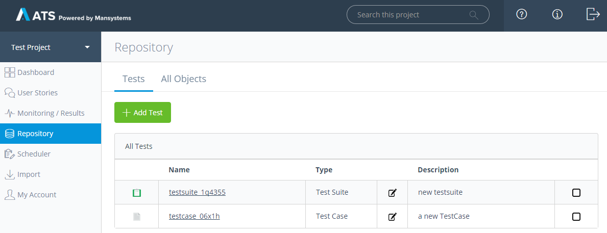
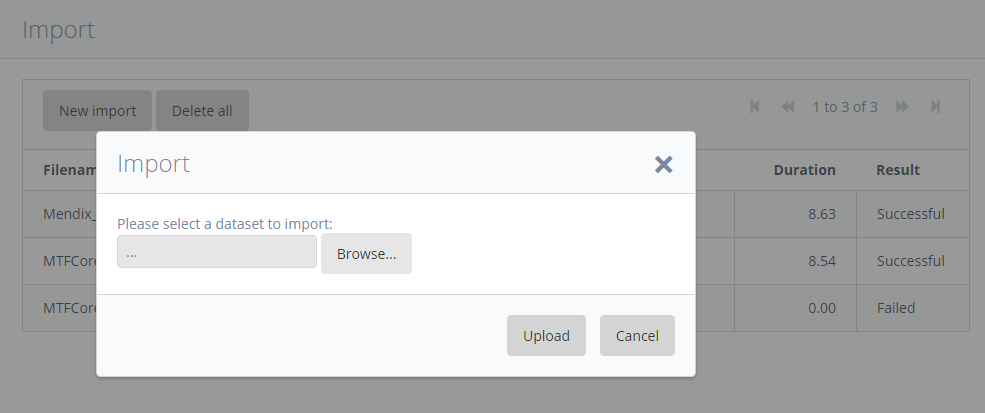
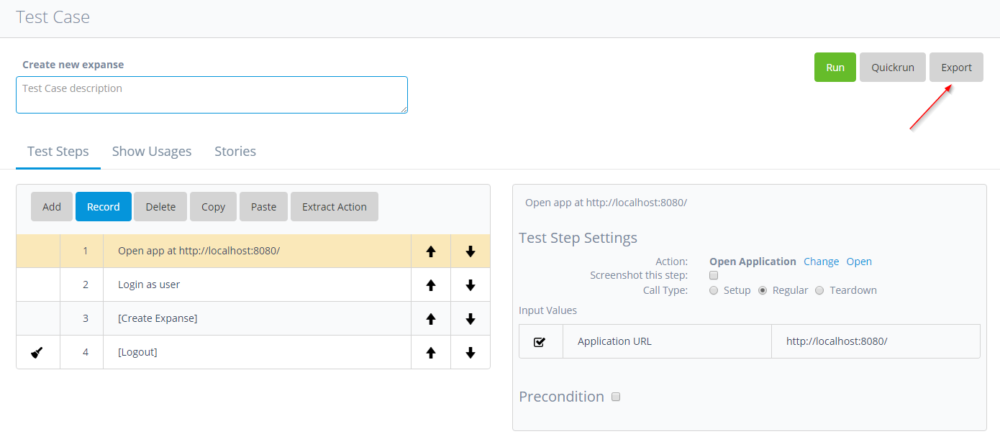
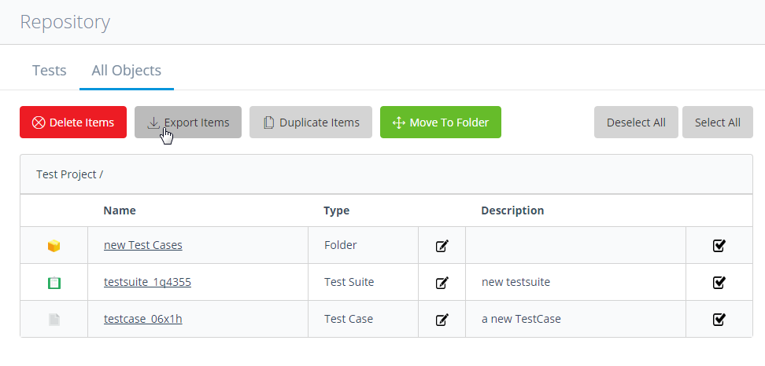
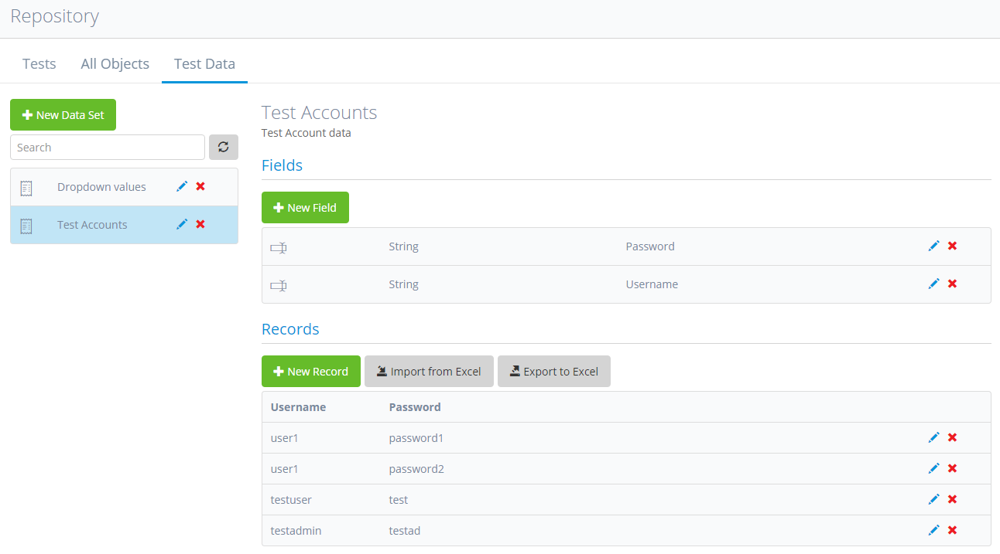

## Repository

This workspace is the heart of ATS, since it allows to create and manage folders, test suites, test cases and actions. The folder in the ATS is equivalent to a directory in your file browser. You can create folders within other folders, and in each folder, you can store test suites, test cases and actions.

## Import/Export

ATS allows to export data (folders, test suites, test cases and keywords) to an XML file, and import that data into another ATS instance. This makes it possible to move data between different environments without having to handle database dumps.

### Data Import

There are two use cases when importing data: create data and update data. Create data means that you will be importing new data for the first time into your target database. Update data means that you will be importing data that will overwrite existing data, thus updating actions, test cases, test suites or folders.

When importing data, all data conflicts will be resolved by overwriting the existing properties by the imported ones.

To import data in ATS do the following:

*   Click _Import_ in order to open the data import form.
*   On the data import form, click the _New Import_ button to open the import data dialog.

*   In the data import dialog select the .xml file containing your import and press **Upload**

The system will check the import for data inconsistencies and shows error details in a list if there are any. Click the import button in the bottom of the screen to complete the import.

### Data Export

There are different scenarios on how to export data from ATS:

*   Exporting single action
*   Exporting multiple actions
*   Exporting test cases
*   Exporting test suites
*   Exporting folders containing:
    *   Actions
    *   Actions and test cases
    *   Actions, test cases and testsuites
    *   Folders, actions, test cases and test suites

In order to start an export, you can either mark the export items listed in the current list view in the _Repository_ and then click _Export_ in the top menu, or you can export the item you are currently editing by clicking the _Export_ button in the top right.

Exporting in the repository:

## Test Data

### Creating Data Sets

In the ATS repository under the _Test Data_ tab you can create data sets by clicking the _New Data Set_ button. You can name the data set and give a description.

A data set is defined by one or more fields and records. Fields are the columns of your table, records are the lines in your table containing the field values. Fields can have the data types integer or string. After you have created a data set you can add Fields and Records to the set.

**Fields**

A column of the table for specific data, for example username

**Records**

Line in the data table containing an integer or string value of the data

### Importing/Exporting data sets

When creating/editing a data set you can choose to _Create/Update fields from file_ option to provide a template Excel file to create or update fields and records of your data set. The first row of your sheet will be considered the header and will be used to determine the field names. All additional rows will be considered records and will be used to determine the fields data type.

When updating an existing data set all existing fields and data records will be removed

You can also only import data records into you data set by clicking the 'Import from Excel' button. The first row of your Excel sheet must contain the the field names of the data set into which you want to import the records.

When importing data records all existing records in the data set will be removed

When importing data from from Excel, ATS will try to convert data that doesn't match the expected data type. In case a conversion is not possible (e.g. from a string to an integer) the resulting value will be empty. Always check your data after import to be sure all data was completely imported.

You can simply export a data set by clicking the _Export to Excel_ button.
