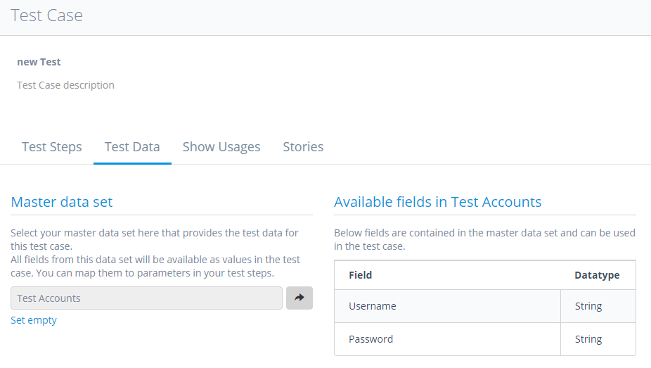
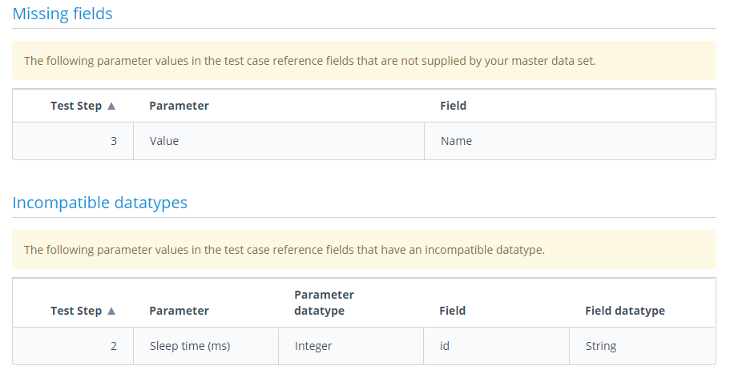
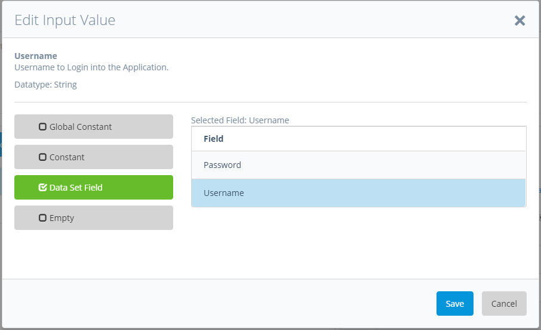

Data Driven Testing in ATS allows you to run tests using tables of data directly as test inputs. This way you can test an array of different input values without having to write additional tests. Data sets are easy to create and maintain, so you can add additional data records later on without changing your test cases.

Please see the Data Driven testing section on how to create data sets to use in your tests.

To use your data sets in test cases you need to select a _Master data set_ under the _Test Data_ tab inside a test case. You can only select one master data set at a time per test case. Your selected data set affects which fields you can use as parameters in your selected test case. You can only choose fields that are in the selected master data set.

When you run a test with a data set field set as a parameter a new test will be run for every record in the data set.

The page also gives an overview over the selected data set:

**Master data set**

The currently selected data set. Here you can change the data set

**Available field in Test Accounts**

Shows the fields available in the selected set and their data types

There are 2 error types that can occur when setting a data set:

**Missing fields**

Shows fields that are not in the selected master data set that are currently used in the test case.

**Incompatible datatypes**

Shows parameters that require a different data type than the datatype of the field.

For each error the test step and parameter are listed so they can be easily identified.

If you change the selected data set the system will remember your set parameters and will match them again if you select a data set containing the same field names.

When you have selected a master data set you can use the the contained field as input values for your test steps.

**Exporting a Test Case**

When exporting a test case that has a data set assigned to it, the name of the data set will be exported with it. When importing the test case a dataset with the same name will be automatically assigned to it. If no such data set exists it will be assigned when you create it.
