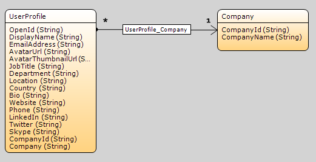

## Introduction

The Profile API is an [App Service](/refguide6/consumed-app-services) that allows your AppCloud applications to retrieve profile information of their users from the Mendix platform.



The Profile API will require the EnvironmentUUID and EnvironmentPassword parameters to authenticate and authorize requests. The values for these should come from constants from the AppCloudServices module with the same name. The Mendix Cloud Portal will automatically set these constants, you do not need to set these yourself. For this reason, the Profile API will only function for applications that use the AppCloudServices module and are deployed through the Mendix Cloud Portal.



The service is part of the [AppCloudServices module](https://appstore.home.mendix.com/link/app/934/Mendix/AppCloudServices), which is available from the App Store. It is also included in the default themes when creating a new application. Both of these options include a default implementation of the Profile API.



When importing version 1.3.0 of the AppCloudServices module over earlier versions, you need to replace existing calls to AppCloudServices.RetrieveDisplayName with calls to AppCloudServices.RetrieveUserProfile. This new microflow returns a new entity (UserProfile) that contains, besides the Display Name that was already returned, a lot of other fields, e.g. Email Address, Company Name, and Avatar URL. Because the old microflow has been removed, the modeler will generate errors where the old microflow was used. You can replace those occurrences with calls to the new microflow.

If you previously deployed your app with an older version of the AppCloudServices module, you will need to update the value of the "AppCloudServices.ProfileServiceLocation" constant in the Cloud Portal on first re-deployment. The new value should be "[https://profile.mendixcloud.com/ws/ProfileService/3/soap1](https://profile.mendixcloud.com/ws/ProfileService/3/soap1)".



## API Calls

### GetUserProfile

#### Description

Retrieves profile information for a user of the application based on the user's OpenID. Note that you can only retrieve the profile information of users who have access to your application.



Note that a request will return a [non-persistable object](/refguide6/persistability). It's up to the implementer of the Profile API to store the received profile data in the database.



#### Available in

API Version 3

#### Parameters

| Name | Parameter type | Required | Description |
| --- | --- | --- | --- |
| OpenID | String | Yes | OpenID of the user for whom the profile is requested. |
| EnvironmentUUID | String | Yes | UUID of the requesting environment. This should be the value of the AppCloudServices.EnvironmentUUID constant, which the Mendix Cloud Portal will fill in automatically. |
| EnvironmentPassword | String | Yes | Password of the requesting environment. This should be the value of the AppCloudServices.EnvironmentUUID constant, which the Mendix Cloud Portal will fill in automatically. |

#### Return type

ProfileService.UserProfile object

This call will return a UserProfile object representing the user's profile information, as well as a Company object (which the UserProfile refers to) containing basic information about the user's company.

#### UserProfile

| Attribute | Type | Description |
| --- | --- | --- |
| OpenId | String | OpenID of the user, which uniquely identifies this user within the Mendix platform |
| DisplayName | String | Name of the user |
| EmailAddress | String | Email address at which the user chose to receive communications from the Mendix platform. |
| AvatarUrl | String | Location of the user's avatar. |
| AvatarThumbnailUrl | String | Location of a smaller (48x48) version of the user's avatar |
| JobTitle | String | Job title of the user |
| Department | String | Department the user works in |
| Location | String | Location of the user |
| Country | String | Country of the user |
| Bio | String | Short biography of the user |
| Website | String | Website of the user |
| Phone | String | Phone number of the user |
| LinkedIn | String | Address of the user's LinkedIn profile |
| Twitter | String | Twitter username for the user |
| Skype | String | Skype username for the user |
| CompanyId | String | ID which uniquely identifies the company the user is a member of |
| Company | String | Name of the company which the user is a member of |
| UserProfile_Company | Reference | Reference to the object representing the user's company. (Note that the values of the CompanyId and Company attributes of the UserProfile object and the CompanyId and CompanyName attributes of the referred Company object will be identical.) |

#### Company

| Attribute | Type | Description |
| --- | --- | --- |
| CompanyId | String | ID which uniquely identifies the company represented by this object |
| CompanyName | String | Name of the company |

### GetDisplayName

#### Description

Retrieves the name of a user of the application based on the user's OpenID. Note that you can only retrieve the names of users who have access to your application.



Please download the latest version of the [AppCloudServices module](https://appstore.home.mendix.com/link/app/934/Mendix/AppCloudServices) from the App Store and use [GetUserProfile](/apidocs/profile-api) from API version 3 instead.



#### Available in

API Version 1

#### Parameters

| Name | Parameter type | Required | Description |
| --- | --- | --- | --- |
| OpenID | String | Yes | OpenID of the user for whom the name is requested. |
| EnvironmentUUID | String | Yes | UUID of the requesting environment. This should be the value of the AppCloudServices.EnvironmentUUID constant, which the Mendix Cloud Portal will fill in automatically. |
| EnvironmentPassword | String | Yes | Password of the requesting environment. This should be the value of the AppCloudServices.EnvironmentUUID constant, which the Mendix Cloud Portal will fill in automatically. |

#### Return type

String
