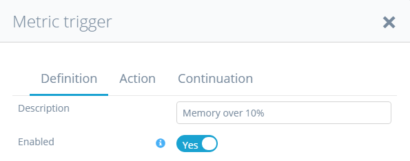
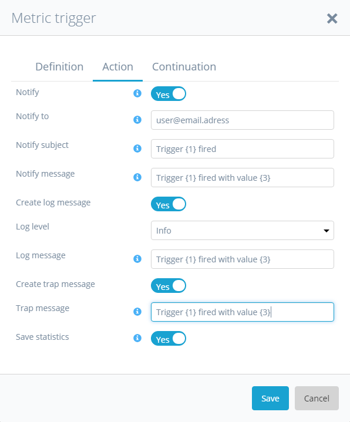
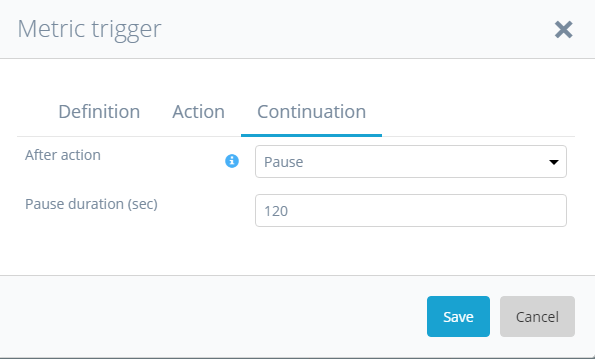

Triggers can be configured in the measurements tool, the trap tool and the statistics tool. Triggers are meant to fired on events based on a pattern and/or a threshold. This allows you to monitor memory and save statistics or perform a trap when memory usage reaches, for example, 80%. 

## Triggers Types

### Measurement Triggers

Measurement triggers are used to check measurements for a specific value. If the expression in a trigger is fulfilled, the configured action is taken.

## Trigger Configuration

### Trigger Definition Tab

The trigger definition tab contains the **Description** and **Enabled** attributes as well as specific settings for the different trigger types.

    

#### Shared Fields

* **Description** to describe the trigger. This description can be used in log and trap message actions as {1}.
* **Enabled** to enable or disable a trigger. Triggers are automatically disabled if the continuation is set to **Stop**.

#### Measurement Triggers

* **Expression** to set the business rule that fires the action. See below for details.
* **Parameter** to define another measurement to be used in the expression as a parameter.

#### Statistics Triggers

* **Microflow pattern** to determine for which microflows this trigger should check.
* **Threshold value (ms)** to set the threshold value. If a microflow takes longer the trigger will fire.

#### Message Triggers

* **Node pattern** to determine for which log node the trigger should fire.
* **Level** to determine for which log level the trigger should fire.
* **Message pattern** to define the message pattern for which the trigger fires.

### Trigger Actions Tab

Trigger actions define what happens when the trigger fires.

  

These are possible trigger actions:

* **Notify**. You can use `{1}` for the administrator as configured in the global setting [More tab](rg-one-configuration#more). You can use replacement variables like `{1}` in the subject and message. These are described in the **i**nformation icons.
* **Create log message**. You can use replacement variables like `{1}` in the message. These are described in the **i**nformation icons.
* **Create trap message**. You can use replacement variables like `{1}` in the message. These are described in the **i**nformation icons.
* **Save statistics**. The duration of this snapshot is configured in the global settings. The snapshot will have 10-20 minutes of statistics by default.

These are only visible with special permissions:

* **Run microflow** ***(Deprecated)***. You can use this to run a microflow with parameters that depend on the trigger type. This was used in the past to notify, but the notify option has been simplified.
* **Create heap dump**. You can only see this option if you have special permissions. (**USE WITH CAUTION**: creating a heap dump pauses the system for a certain period of time depending on the amount of heap space assigned to the Java process running the Mendix server. This can freeze the app for many seconds).

### Trigger Continuation Tab

The continuation tab enables configuration of what happens after the trigger has fired and the action has been executed.

You can:

*  Do **Nothing**, which means just keep on checking and executing the trigger
*  **Stop**, which means that the trigger will fire once and then disable itself
*  **Pause**, which means you can define a period in which the trigger will not fire again

This is to prevent, for example, a large amount of emails when the CPU usage is high.

## Triggered Events

If a trigger fires, a record is created in the triggered events. The events are automatically deleted after a certain amount of days, as configured in the global setting [More tab](rg-one-configuration#more). 

**Remove triggered events after (days)**. If you want to keep an event for future reference, you can keep the event using the keep-button above the triggered event grid.

If a trap is created with the trigger actions, you can open the trap.

If a statistics snapshot is created with the trigger actions you can open the statistics snapshot.

If a heap dump is created with the trigger actions, you can download the heap dump. You only get this option if you have special permissions.

You can open the measurement configuration that contains the trigger with the **Show trigger** button.
