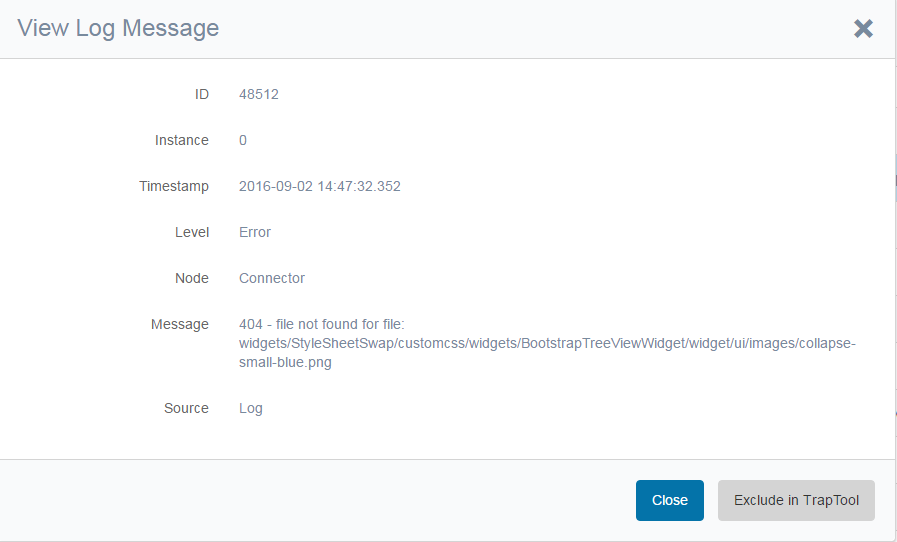
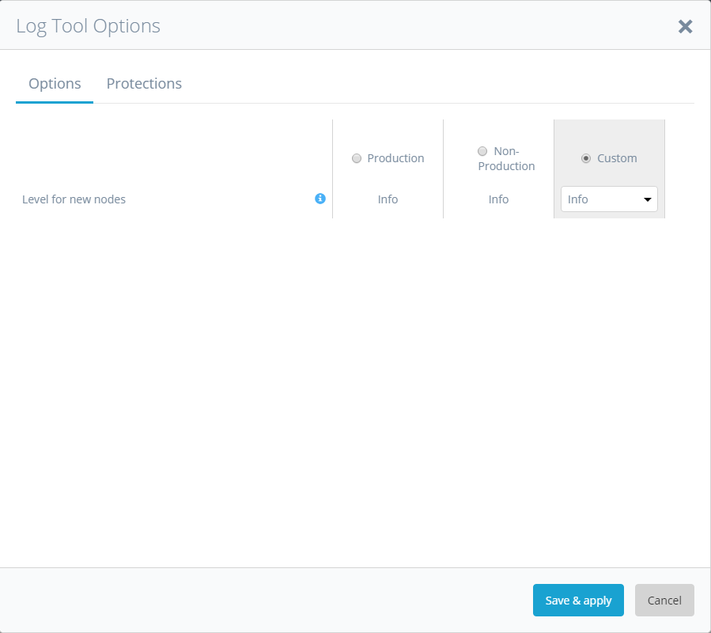
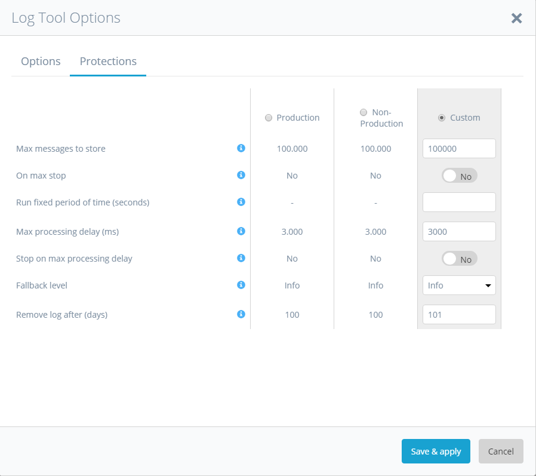
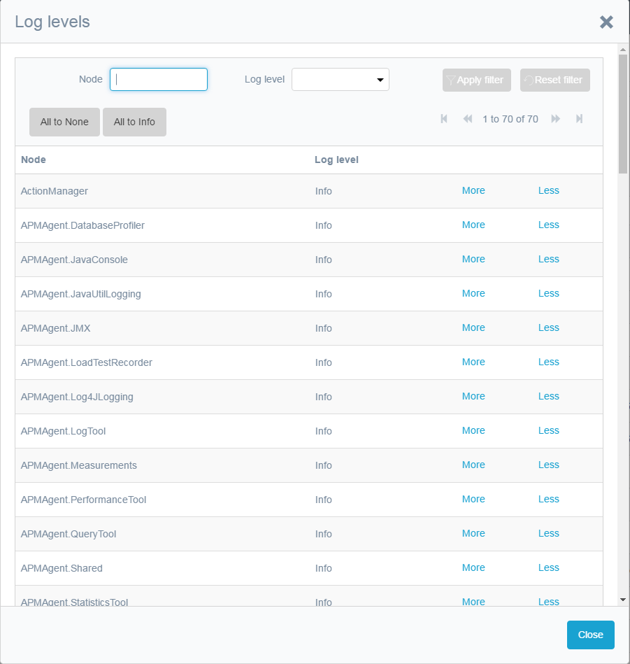

This chapter gives an overview of the log tool. The log tool is used to collect Mendix Runtime log messages and store them in the database. This gives access to log information without the requirement of looking into log files. Additionally, the log information can be browsed, searched, and sorted for analysis.

## Logs

Logging consists of a log node, a level, and the logging message itself. For the log tool to record logging for a specific log node and level, this combination needs to be configured.

### Overview

The logs tab shows the stored logs in the database.

 

You can start and stop the log tool via the "play" button in the header.

Double-clicking a log message shows its details.

 

If the message has a WARNING, ERROR, or CRITICAL level, the extra button **Exclude in TrapTool** is shown. This configures an exclusion in the trap tool and allows you to run the log tool for a period of time to collect the WARNING, ERROR, or CRITICAL messages that are occurring and make sure the trap tool does not store huge amounts of irrelevant data when started.

## Log Tool Options

This is the **Log Tool Options** dialog box:

Log nodes are created when the first log message occurs for this node in Mendix. The **Level for new nodes** option determines the initial log level in the log tool for these new log nodes.

### Log Tool Options, Protections Tab

The **Max messages to store** can limit the amount of records in the database. There are two things that can happen when the maximum is reached:

* The log tool can stop if the check box **On max stop?** is checked.
* The log tool can start removing the oldest records (comparable to a log file that rotates or is rolling over).

### Notes

* The removal of the oldest records is done by a private thread that only runs when the log tool is running.
* The log tool counts the messages it writes and counts on start up the messages in the database. When the **Max messages to store** + 10% amount is reached, the oldest 10% is deleted. This can be deleted in small batches.
* To handle a load balancing situation, only the records per server are counted and removed.

The option **Run fixed period of time (seconds)** can be used to predetermine the amount of time a log tool session runs.

You can configure the log tool to stop if a queue builds up with too many messages. This is controlled by a parameter called **Max Processing Delay (ms)** that measures the delay between the moment the log record is logged in the queue and the moment the log record is processed by the log tool. If all settings are set to level trace in a high loaded system, the processing delay might go up and the protection will most probably kick in to protect application performance from degrading.

You can configure the log tool to stop or to fall back to a different level of logging in case the processing delay becomes to long.

### Save & Apply

When the tool is running, you can save and apply the options, which means the settings will immediately take effect in the running session.

## Log Tool Levels

When it connects, the log tool reads log levels from the log tool options to determine what messages are to be logged to the database. If the log node of a message that is generated by the Mendix Runtime is not found in the options, it is added to the options with an initial **Level for new nodes**. The log levels are managed with the following 
dialog box:

Here you can change individual log nodes inline or set all to **None** or **Info**. 
On opening the level dialog, the levels are synchronized with the levels in the log tool memory, because a fallback can have changed the requested level.

Changes to the log level are immediately applied to the log tool if it is running.

**Note**: With the debug permission, a delete button is available to delete nodes. When the log tool is used in development or with new releases, certain log nodes might no longerbe needed. You can delete them from the log levels. Since records are automatically created when a message from that node arrives, it does not harm the system to delete the configuration records.*
