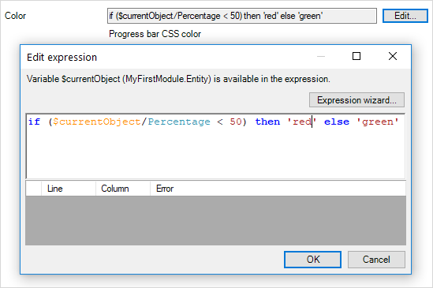
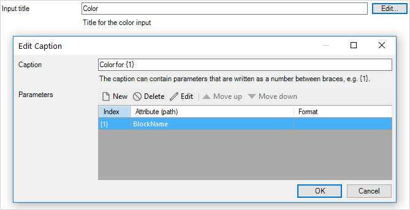
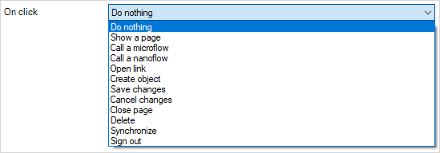
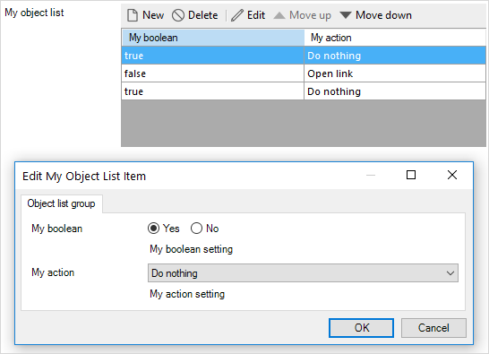
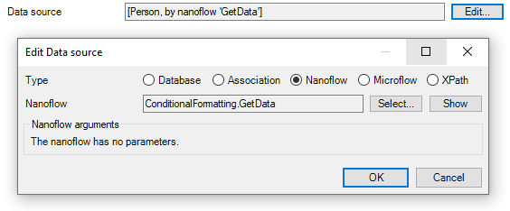

## 1 Introduction

In order to be configurable, pluggable widgets use a [widget properties definition](/apidocs-mxsdk/apidocs/pluggable-widgets#properties-definition) which describes the properties available to pluggable widgets. To see examples of pluggable widgets in action, see [How To Build Pluggable Widgets](/howto/extensibility/pluggable-widgets).

The common structure of a property definition is as follows:

```xml
<property key="propertyKey" type="propertyType">
	<caption>My Property</caption>
	<description>This is my property</description>
</property>
```

### 1.1 XML Attributes

#### 1.1.1 Key (required) {#key}

This defines the prop `key` in the client component props which are supplied to the widget client component. Each property must have a unique `key` which can contain letters of all cases, digits, or underscores. However, a `key` attribute cannot *start* with a digit.

#### 1.1.2 Type (required)

This defines a property's type. A `type` must be one of the following: 

* Static Types
	* [string](#string)
	* [boolean](#boolean)
	* [integer](#integer)
	* [decimal](#decimal)
	* [enumeration](#enumeration)
* Component Types
	* [icon](#icon)
	* [image](#image)
	* [widgets](#widgets)
* Dynamic Types
	* [expression](#expression)
	* [textTemplate](#texttemplate)
	* [action](#action)
	* [attribute](#attribute)
	* [object](#object)
	* [file](#file)
	* [datasource](#datasource)

### 1.2 XML Elements

`<caption>` (required) — This defines the property name visible for the user (not the end-user) while configuring the widget in Studio and Studio Pro.

`<description>` (required) — This is a description which explains a property's purpose.

## 2 Static Types

Static types are made to pass values configured in Studio or Studio Pro to the widget. They do not depend on any dynamic data. Static properties are passed to the widget client component as simple primitive values.

### 2.1 String{#string}

The string property type is represented as a simple text input in Studio Pro. It is passed as a `string` prop to a client component.

#### 2.1.1 XML Attributes

| Attribute      | Required | Attribute Type | Description                                                  |
| -------------- | -------- | -------------- | ------------------------------------------------------------ |
| `type`         | Yes      | String         | Must be `string`                                             |
| `key`          | Yes      | String         | See [key](#key) |
| `defaultValue` | No       | String         | Default value for the property                              |
| `multiline`    | No       | Boolean        | `true` to enable multiline input in the Studio, `false` otherwise |
| `required`     | No       | Boolean        | Whether the property must be specified by the user, `true` by default |


#### 2.1.2 Studio Pro UI

When the property is defined as follows:

```xml
<property key="myString" type="string">
	<caption>My string</caption>
	<description>My string setting</description>
</property>
```

Then the Studio Pro UI for the property appears like this:


When the property is defined as follows:

```xml
<property key="myStringMultiline" type="string" multiline="true">
	<caption>My string multiline</caption>
	<description>My string multiline setting</description>
</property>
```

Then the Studio Pro UI for the property appears like this:


### 2.2 Boolean{#boolean}

Properties of type Boolean are represented as a toggle in Studio Pro. They are passed as `boolean` props to a client component.

#### 2.2.1 XML Attributes

| Attribute      | Required | Attribute Type | Description                                                                                                                                                          |
| -------------- | -------- | -------------- | -------------------------------------------------------------------------------------------------------------------------------------------------------------------- |
| `type`         | Yes      | String         | Must be `boolean`                                                                                                                                                    |
| `key`          | Yes      | String         | See [key](#key) |
| `defaultValue` | Yes      | Boolean        | Default value for the property, `true` or `false`                                                                                                                    |

#### 2.2.2 Studio Pro UI

When the property is defined as follows:

```xml
<property key="myBoolean" type="boolean" defaultValue="false">
	<caption>My boolean</caption>
	<description>My boolean setting</description>
</property>
```

Then the Studio Pro UI for the property appears like this:


### 2.3 Integer{#integer}

Integer is represented as a number input in Studio Pro. It is passed as a `number` prop to a client component.

#### 2.3.1 XML Attributes

| Attribute      | Required | Attribute Type | Description                                                                                                                                                          |
| -------------- | -------- | -------------- | -------------------------------------------------------------------------------------------------------------------------------------------------------------------- |
| `type`         | Yes      | String         | Must be `integer`                                                                                                                                                    |
| `key`          | Yes      | String         | See [key](#key) |
| `defaultValue` | Yes      | Integer        | Default value for the property                                                                                                                                      |

#### 2.3.2 Studio Pro UI

When the property is defined as follows:

```xml
<property key="myInteger" type="integer" defaultValue="1000">
	<caption>My integer</caption>
	<description>My integer setting</description>
</property>
```

Then the Studio Pro UI for the property appears like this:


### 2.4 Decimal{#decimal}

Properties of type decimal are represented as a number input in Studio Pro. They are passed as a `Big` prop to a client component.

#### 2.4.1 XML Attributes

| Attribute      | Required | Attribute Type | Description                                                                                                                                                          |
| -------------- | -------- | -------------- | -------------------------------------------------------------------------------------------------------------------------------------------------------------------- |
| `type`         | Yes      | String         | Must be `decimal`                                                                                                                                                    |
| `key`          | Yes      | String         | See [key](#key) |
| `defaultValue` | Yes      | Integer        | Default value for the property                                                                                                                                      |

#### 2.4.2 Studio Pro UI

When the property is defined as follows:

```xml
<property key="myDecimal" type="decimal" defaultValue="50.4">
	<caption>My decimal</caption>
	<description>My decimal setting</description>
</property>
```

Then the Studio Pro UI for the property appears like this:


### 2.5 Enumeration{#enumeration}

The enumeration property type allows a user to select one out of multiple options defined in the XML. The `key` of a selected enumeration element is passed as `string` prop to a client component.

#### 2.5.1 XML Attributes

| Attribute      | Required | Attribute Type | Description                                                                                                                                                          |
| -------------- | -------- | -------------- | -------------------------------------------------------------------------------------------------------------------------------------------------------------------- |
| `type`         | Yes      | String         | Must be `enumeration`                                                                                                                                                |
| `key`          | Yes      | String         | See [key](#key) |
| `defaultValue` | Yes      | Integer        | Default value for the property                                                                                                                                      |

#### 2.5.2 XML Elements

`<enumerationValues>` (required) — One `<enumerationValues>` element must be declared with multiple `<enumerationValue>` elements inside in order to define possible enumeration values. A `key` attribute is required for every enumeration value as well as a caption. Enter enumeration values like this:

```xml
<enumerationValue key="myEnumOption">My enum option caption</enumerationValue>
```

The `key` of a selected element will be passed to the client component. `key` should not be changed since it is used to identify options used in a project.

#### 2.5.3 Studio Pro UI

When the property is defined as follows:

```xml
	<property key="myEnumeration" type="enumeration" defaultValue="red">
		<caption>My enumeration</caption>
		<description>My enumeration setting</description>
		<enumerationValues>
			<enumerationValue key="red">Red</enumerationValue>
			<enumerationValue key="green">Green</enumerationValue>
			<enumerationValue key="blue">Blue</enumerationValue>
		</enumerationValues>
	</property>
```

Then the Studio Pro UI for the property appears like this:


## 3 Component Types

### 3.1 Icon {#icon}

Properties of type icon allows a user to configure an icon similar to one used by a [button](/refguide/button-properties#icon). It is passed as `DynamicValue<IconValue>` prop to a client component. For more information, see the [IconValue](client-apis-for-pluggable-widgets#icon-value) section of *Client APIs Available to Pluggable Widgets*.

{}
This property type was introduced in Mendix 8.1.
{}

#### 3.1.1 XML Attributes

| Attribute  | Required | Attribute Type | Description                                                                                                                                                          |
| ---------- | -------- | -------------- | -------------------------------------------------------------------------------------------------------------------------------------------------------------------- |
| `type`     | Yes      | String         | Must be `icon`                                                                                                                                                       |
| `key`      | Yes      | String         | See [key](#key) |
| `required` | No       | Boolean        | Whether the property must be specified by the user, `true` by default                                                                                                |
#### 3.1.2 Studio Pro UI

When the component is defined as follows:

```xml
<property key="cardIcon" type="icon" required="false">
	<caption>Icon</caption>
	<description>Card icon</description>
</property>
```

Then the Studio Pro UI for the component appears like this:


### 3.2 Image {#image}

Image allows a user to configure a static image from an [image collection](/refguide/image-collection). It also allows a user to configure an image from an object that is a specialization of **System.Image**. It is passed as an `DynamicValue<ImageValue>` prop to a client component (for more information, see the [ImageValue](/apidocs-mxsdk/apidocs/client-apis-for-pluggable-widgets#imagevalue) section of *Client APIs Available to Pluggable Widgets*). See the [Images Reference Guide](/refguide/images) for more information about supported image formats.

{}
This property type was introduced in Mendix 8.1. Support for dynamic images was introduced in Mendix [8.4.0](/releasenotes/studio-pro/8.4).
{}

{}
Support for SVG images in native mobile apps was introduced in Mendix [8.4.0](/releasenotes/studio-pro/8.4).
{}

{}
GIF images are not supported in native mobile apps on Android devices.
{}

#### 3.2.1 XML Attributes

| Attribute  | Required | Attribute Type | Description                                                                                                                                                          |
| ---------- | -------- | -------------- | -------------------------------------------------------------------------------------------------------------------------------------------------------------------- |
| `type`     | Yes      | String         | Must be `image`                                                                                                                                                      |
| `key`      | Yes      | String         | See [key](#key) |
| `required` | No       | Boolean        | Whether the property must be specified by the user, `true` by default                                                                                                |
#### 3.2.2 Studio Pro UI

When the component is defined as follows:

```xml
<property key="bgImage" type="image" required="false">
	<caption>Background Image</caption>
	<description>Image shown blurred in a background</description>
</property>
```

Then the Studio Pro UI for the component appears like this:


### 3.3 Widgets {#widgets}

The widgets property allows a user to place multiple widgets inside a pluggable widget, similar to the content of a [container](/refguide/container) widget. It is passed as a `ReactNode` prop to a client component if a `dataSource` attribute is not specified or if an attribute is specified, but the data source is not configured by the user. Otherwise it is passed as a function that expects an `ObjectItem` and returns a `ReactNode`: `(item: ObjectItem) => ReactNode`. For more information, see the [Datasource](#datasource) section below.

{}
This property type was introduced in Mendix 8.3.
{}

{}
Support for the `dataSource` attribute was introduced in Mendix 8.7.
{}

{}
Some widgets are not yet supported inside pluggable widgets. Placing unsupported widgets inside a pluggable widget results in a consistency error in Studio and Studio Pro.
{}

#### 3.3.1 XML Attributes

| Attribute    | Required | Attribute Type | Description |
| ------------ | -------- | -------------- | ----------- |
| `type`       | Yes      | String         | Must be `widgets` |
| `key`        | Yes      | String         | See [key](#key) |
| `dataSource` | No       | Property Path  | Specifies path to a [`datasource`](#datasource) property linked to this widget's property |
| `required`   | No       | Boolean        | Whether a user must provide at least one widget, `true` by default |

#### 3.3.2 Studio Pro UI

When the component is defined without the `dataSource` attribute as follows:

```xml
<property key="content" type="widgets" required="false">
	<caption>Content</caption>
	<description>Content of a box</description>
</property>
```

then the Studio Pro UI for the component appears like this:


#### 3.3.3 Using the DataSource Attribute

When the component is defined with the `dataSource` attribute, assuming `myDataSource` is key of a [`datasource`](#datasource) property defined elsewhere for this widget:

```xml
<property key="content" type="widgets" required="false" dataSource="myDataSource">
	<caption>Content</caption>
	<description>Widgets using data source</description>
</property>
```

then the Studio Pro UI for the component appears like this:


## 4 Dynamic Types

### 4.1 Expression{#expression}

The expression property allows a user to configure an [expression](/refguide/expressions), the result of which will be passed to the client component as a `DynamicValue<T>` where `T` depends on a return type of the expression.

#### 4.1.1 XML Attributes

| Attribute      | Required | Attribute Type      | Description                                                                                                                                                          |
| -------------- | -------- | ------------------- | -------------------------------------------------------------------------------------------------------------------------------------------------------------------- |
| `type`         | Yes      | String              | Must be `expression`                                                                                                                                                 |
| `key`          | Yes      | String              | See [key](#key) |
| `defaultValue` | No       | String (Expression) | Default value for the property                                                                                                                                      |
| `required`     | No       | Boolean             | Whether the property must be specified by the user, `true` by default                                                                                                |

#### 4.1.2 XML Elements

`<returnType>` (required) — An expression property must contain a `<returnType>` element in order to define allowed return types for the expression. The Mendix platform will ensure the that configured expression returns the correct data type.

| Supported Return Types | Corresponding Types Client Components Receive |
| -------------------- | --------------------------------------------- |
| `Boolean`              | `DynamicValue<boolean>`                    |
| `DateTime`           | `DynamicValue<Date>`                         |
| `Decimal`             | `DynamicValue<BigJS>`                       |
| `Integer`              | `DynamicValue<BigJS>`                      |
| `String`               | `DynamicValue<string>`                     |

#### 4.1.3 Studio Pro UI

When the property is defined as follows:

```xml
<property key="progressBarColor" type="expression" defaultValue="'red'">
	<caption>Color</caption>
	<description>Progress bar CSS color</description>
	<returnType type="String" />
</property>
```

Then the Studio Pro UI for the property appears like this:



### 4.2 TextTemplate{#texttemplate}

The TextTemplate property allows a user to configure translatable text template similar to the [Caption](/refguide/text#caption) of a text widget. The interpolated string will be passed to the client component as `DynamicValue<string>`.

#### 4.2.1 XML Attributes

| Attribute   | Required | Attribute Type | Description                                                                                                                                                          |
| ----------- | -------- | -------------- | -------------------------------------------------------------------------------------------------------------------------------------------------------------------- |
| `type`      | Yes      | String         | Must be `textTemplate`                                                                                                                                               |
| `key`       | Yes      | String         | See [key](#key) |
| `multiline` | No       | Boolean        | `true` to enable multiline input in the Studio, `false` otherwise.                                                                                                   |
| `required`  | No       | Boolean        | Whether the property must be specified by the user, `true` by default                                                                                                |


#### 4.2.2 XML Elements

`<translations>` — Allows a user to set a default value for text templates for different languages using `<translation>` elements with a `lang` attribute representing [ISO 639](https://en.wikipedia.org/wiki/ISO_639) code of the language. Available languages are listed in the [Languages Tab](/refguide/project-settings#4-languages-tab) in Studio Pro.

#### 4.2.3 Studio Pro UI

When the property is defined as follows:

```xml
<property key="myBlockTitle" type="textTemplate">
	<caption>Input title</caption>
	<description>Title for the color input</description>
	<translations>
		<translation lang="en_US">Color</translation>
		<translation lang="nl_NL">Kleur</translation>
		<translation lang="uk_UA">Колір</translation>
	</translations>
</property>
```

Then the Studio Pro UI for the property appears like this:



### 4.3 Action{#action}

The action property type allows a user to configure an action which can do things like call nanoflows, save changes, and open pages.

If a `dataSource` attribute is not specified, or if a `dataSource` attribute is specified but the data source is not configured by the user, the client will receive an `ActionValue` representing the action or `undefined` if the **Do nothing** action was selected.

When a `dataSource` attribute is specified and configured by the user it is passed as a function that expects an `ObjectItem` and returns an `ActionValue`: `(item: ObjectItem) => ActionValue`. For more information, see the [Datasource](#datasource) section below.

{}
Support for the `dataSource` attribute was introduced in Mendix 8.9.
{}

#### 4.3.1 XML Attributes

| Attribute  | Required   | Attribute Type | Description                                                                                                                                                          |
| ------------ | -------- | -------------- | -------------------------------------------------------------------------------------------------------------------------------------------------------------------- |
| `type`       | Yes      | String         | Must be `action`                                                                                                                                                     |
| `key`        | Yes      | String         | See [key](#key) |
| `dataSource` | No       | Property Path  | Specifies path to a [`datasource`](#datasource) property linked to this action's property |

#### 4.3.2 Studio Pro UI

When the property is defined as follows:

```xml
<property key="buttonAction" type="action">
	<caption>On click</caption>
	<description>Action to be performed when button is clicked</description>
</property>
```

Then the Studio Pro UI for the property appears like this:



### 4.4 Attribute{#attribute}

The attribute property type allows a widget to work directly with entities' attributes, both reading and writing attributes.Depending on the widget's purposes, a widget should define attribute types it supports. 

If a `dataSource` attribute is not specified, or if a `dataSource` attribute is specified but the data source is not configured by the user, the client will receive an `EditableValue<T>` where `T` depends on a `<attributeType>` configured. For more information, see the [EditableValue](client-apis-for-pluggable-widgets#editable-value) section of *Client APIs Available to Pluggable Widgets*.

When a `dataSource` attribute is specified and configured by the user it is passed as a function that expects an `ObjectItem` and returns an `EditableValue<T>`: `(item: ObjectItem) => EditableValue<T>`. For more information, see the [Datasource](#datasource) section below.


{}
Support for the `dataSource` attribute was introduced in Mendix 8.12.
{}

#### 4.4.1 XML 

| Attribute    | Required | Attribute Type | Description                                                  |
| ------------ | -------- | -------------- | ------------------------------------------------------------ |
| `type`       | Yes      | String         | Must be `attribute`                                          |
| `key`        | Yes      | String         | See [key](#key) |
| `onChange`   | No       | Property Path  | The path to an Action property that will be executed by Mendix platform when value is changed by the widget |
| `required`   | No       | Boolean        | This decides if the property must be specified by the user, `true` by default |
| `dataSource` | No       | Property Path  | Specifies path to a [`datasource`](#datasource) property linked to this attribute property |

#### 4.4.2 XML Elements

`<attributeTypes>` (required) — This element encapsulates `<attributeType>` elements which declare supported attribute types available while configuring the attribute property in the Studios.

`<attributeType>` (required one or more) — this element defines the allowed attribute type in the `name` attribute.

| Supported Attribute Types | Corresponding Types Client Components Receive |
| ------------------------- | --------------------------------------------- |
| `AutoNumber`              | `EditableValue<string>`                       |
| `Binary`                  | `EditableValue<string>`                       |
| `Boolean`                 | `EditableValue<boolean>`                      |
| `DateTime`                | `EditableValue<Date>`                         |
| `Enum`                    | `EditableValue<string>`                       |
| `HashString`              | `EditableValue<string>`                       |
| `Integer`                 | `EditableValue<BigJS>`                        |
| `Long`                    | `EditableValue<BigJS>`                        |
| `String`                  | `EditableValue<string>`                       |
| `Decimal`                 | `EditableValue<BigJS>`                        |

#### 4.4.3 Studio Pro UI

When the property is defined as follows:

```xml
<property key="percentage" type="attribute" onChange="onPercentageChange">
	<caption>Percentage</caption>
	<description>Progress percentage</description>
	<attributeTypes>
		<attributeType name="Decimal"/>
		<attributeType name="Integer"/>
	</attributeTypes>
</property>
    
<property key="onPercentageChange" type="action">
	<caption>On change</caption>
	<description/>
</property>
```

Then the Studio Pro UI for the property appears like this:


### 4.5 Object{#object}

The object property type allows to create an arbitrary list of properties.

#### 4.5.1 XML Attributes

| Attribute | Required | Attribute Type | Description                                                                                                                                                          |
| ---------- | -------- | -------------- | -------------------------------------------------------------------------------------------------------------------------------------------------------------------- |
| `type`     | Yes      | String         | Must be `object`                                                                                                                                                     |
| `key`      | Yes      | String         | See [key](#key) |
| `isList`   | Yes      | Boolean        | Must be `true`                                                                                                                                                       |
| `required` | No       | Boolean        | This decides if the user is required to specify items in the list, `true` by default |

#### 4.5.2 XML Elements

`<properties>` (required) — This encapsulates the list or properties to be configured. For more information on property groups, see the [Property Groups](pluggable-widgets#property-groups) section of *Pluggable Widgets API*. Properties must be grouped by `<propertyGroup>` elements. Nested object properties are not supported.

#### 4.5.3 Studio Pro UI

When the property is defined as follows:

```xml
<property key="myObject" type="object" isList="true">
	<caption>My object list</caption>
	<description/>
	<properties>
		<propertyGroup caption="Object list group">
			<property key="myObjectBool" type="boolean" defaultValue="true">
				<caption>My boolean</caption>
				<description>My boolean setting</description>
			</property>
			<property key="myObjectAction" type="action">
				<caption>My action</caption>
				<description>My action setting</description>
			</property>
		</propertyGroup>
	</properties>
</property>
```

Then the Studio Pro UI for the property appears like this:



### 4.6 File {#file}

The file property type allows a user to configure a file from an object that is a specialization of **System.File**. It is passed as a [`DynamicValue<FileValue>`](/apidocs-mxsdk/apidocs/client-apis-for-pluggable-widgets#filevalue) prop to a client component.

#### 4.6.1 XML Attributes

| Attribute  | Required | Attribute Type | Description |
| ---------- | -------- | -------------- | ----------- |
| `type`     | Yes      | String         | Must be `file` |
| `key`      | Yes      | String         | See [key](#key)  |

#### 4.6.2 Studio Pro UI

When the property is defined as follows:

```xml

<property key="file" type="file" required="false">
	<caption>File</caption>
	<description>Sample text file</description>
</property>
```

Then the Studio Pro UI for the property appears like this:


### 4.7 Datasource {#datasource}

The datasource property allows widgets to work with object lists. The client component will receive value prop of type [`ListValue`](client-apis-for-pluggable-widgets#listvalue) and may be used with [`action`](#action), [`attribute`](#attribute) and [`widgets`](#widgets) properties. See [Data Sources](https://docs.mendix.com/refguide/data-sources#list-widgets) for available data source types.

{}
Support for the datasource property type was introduced in Mendix 8.7.
{}

{}
Only list datasources are supported, therefore specifying `isList="true"` is required.
{}

#### 4.7.1 XML Attributes

| Attribute  | Required | Attribute Type | Description |
| ---------- | -------- | -------------- | ----------- |
| `type`     | Yes      | String         | Must be `datasource` |
| `key`      | Yes      | String         | See [key](#key) |
| `isList`   | Yes      | Boolean        | Must be `true` |
| `required` | No       | Boolean        | This decides if the user is required to specify a datasource, `true` by default |

#### 4.7.2 Studio Pro UI

When the property is defined as follows:

```xml
<property key="data" type="datasource" isList="true" required="false">
	<caption>Data source</caption>
	<description />
</property>
```

Then the Studio Pro UI for the property appears like this:



## 5 System Properties {#system-properties}

System properties is a way for a pluggable widget to adopt extended widget functionality provided by Mendix platform. System properties should be defined as `<systemProperty>` elements. The only property XML attribute `<systemProperty>` requires is `key` attribute, which defines a system property's type. The following values are allowed:

* `Label`
* `Name`
* `TabIndex`
* `Visibility`
* `Editability`

### 5.1 Label {#label}

Label property allows a pluggable widget to have labeling functionality similar to a [core input widget](/refguide/text-box#label). This allows a user to set a label, a label position, and a label width. If a widget has a label configured, its client component will automatically be wrapped into a correct markup.

```xml
<systemProperty key="Label"/>
```

### 5.2 Name {#name}

Every widget have a name by default. This property can be used to control position of the widget name input. If this property is not specified, input will be placed in **Common** tab. A widget’s name is also used for locating it during [automated tests](/howto/integration/selenium-support). For that purpose in web apps, a widget name is automatically appended to a `class` prop a component receives, and in native mobile apps is passed as a separate `name` prop.

```xml
<systemProperty key="Name"/>
```

### 5.3 TabIndex {#tabindex}

The TabIndex property allows pluggable widgets to implement the **Tab index** setting similar to  a [core input widget](/refguide/common-widget-properties#tab-index). Every selectable or input-like widget should opt for this to provide a consistent developing experience and an accessible app for an end-user. A widget’s tab index, when it is not zero, is passed to a client component in a `tabIndex` prop.

```xml
<systemProperty key="TabIndex"/>
```

### 5.4 Visibility {#visibility}

Every pluggable widget can be [conditionally hidden](/refguide/common-widget-properties#visibility-properties). This property can be used to control a position of the widget visibility inputs.

{}
This property type was introduced in Mendix 8.1.
{}

```xml
<systemProperty key="Visibility"/>
```

### 5.5 Editability {#editability}

The editability property allows a pluggable widget to have an editable configuration similar to a [core input widget](/refguide/text-box#editability). When a widget is marked as read-only or conditionally editable with condition being false, all [editable values](client-apis-for-pluggable-widgets#editable-value) its client component receives will have `readOnly` flag.

{}
This property type was introduced in Mendix 8.1.
{}

```xml
<systemProperty key="Editability"/>
```

## 6 Read More

* [Pluggable Widgets API](pluggable-widgets)
* [Client APIs Available to Pluggable Widgets](client-apis-for-pluggable-widgets)
* [Build Pluggable Widgets](/howto/extensibility/pluggable-widgets)
