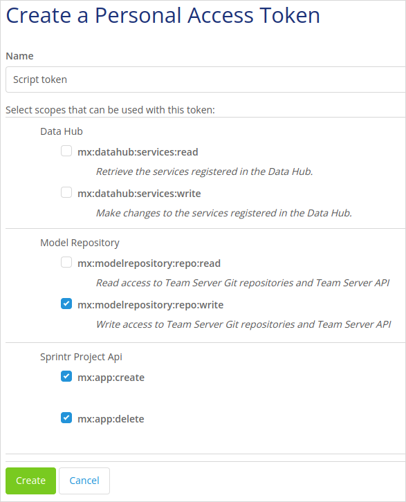

## 1 Introduction

Before running your first script, you need to set up your personal access token by creating a new token with the required scope and saving it to your computer as an environment variable.

## 2 Creating the Personal Access Token

You can manage your Mendix personal access tokens with the [Mendix Warden](https://warden.mendix.com/). Click **Add**, enter the token name, and choose at least the following scopes:

* **Model Server** – `mx:modelrepository:write`
* **Sprintr Project API** – `mx:app:create` and `mx:app:delete`
* **Team Server Git** – `mx:modelrepository:write`

## 3 Saving the Personal Access Token as an Environment Variable

We do not recommend hard-coding your credentials (meaning, your personal access token) into your script. Instead, you can save it as an environment variable with the name of a variable called `MENDIX_TOKEN`, and the Mendix Platform SDK will read it automatically.

Here are some useful links for setting the environment variable in different operating systems:

* [Create and Modify Environment Variables on Windows](https://docs.oracle.com/en/database/oracle/machine-learning/oml4r/1.5.1/oread/creating-and-modifying-environment-variables-on-windows.html#GUID-DD6F9982-60D5-48F6-8270-A27EC53807D0)
* [Setting up Environment Variables in MacOS](https://medium.com/@himanshuagarwal1395/setting-up-environment-variables-in-macos-sierra-f5978369b255)
* [How to Set Environment Variables in Linux](https://www.serverlab.ca/tutorials/linux/administration-linux/how-to-set-environment-variables-in-linux/)
