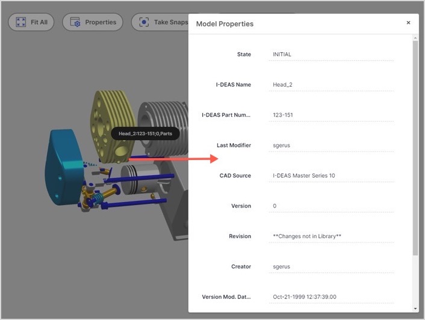

## 1 Introduction

The 3D Viewer API allows you to retrieve, create, and update 3D model entities, actions, and properties more programmatically. You can easily create your custom logic to interact and manipulate a 3D model.

## 2 API Reference

For details, see [3D Viewer API Reference](http://3dviewer-apidoc.s3-website.eu-central-1.amazonaws.com/index/v2.1/apidoc/3dviewer.html).

## 3 Use Case Example

If you want to get properties of a selected part on the 3D Viewer, perform the following steps:

1. Retrieve selected object information as a string through the [On Selection Change](3d-viewer#on-selection-change) event attribute of the 3D Viewer.
2. Use [`mx.viewer3D.getObjects()`](http://3dviewer-apidoc.s3-website.eu-central-1.amazonaws.com/index/v2.1/apidoc/3dviewer.mx.viewer3d.getobjects.html#mx-viewer3d-getobjects-function) to get the object instances.
3.  Use [`IPart.getProperties() `](http://3dviewer-apidoc.s3-website.eu-central-1.amazonaws.com/index/v2.1/apidoc/3dviewer.ipart.getproperties.html) to pass the selected object as a parameter. Then you get the properties in key-value pairs. The following is the sample code in a JavaScript action. It takes 2 parameters `selectedObject` and `propertyObject`.

	```
        /**
         * @param {string} selectedObject
         * @param {string} propertyObject
         * @returns {Promise.<MxObject[]>}
         */
        export async function GetProperties(selectedObject, propertyObject) {
          // BEGIN USER CODE
          console.info(selectedObject);
            // Get the underlying 3D objects given its selection ids.
          let instances = mx.viewer3D.getObjects(selectedObject);
          let promises = [];
          let objects = [];
          if (instances && instances.length > 0) {
            let properties = await instances[0].getProperties();
            for(let key in properties) {
              if(properties.hasOwnProperty(key)) {
                promises.push(createPropertyObject(objects, key, properties[key]));
              }
            }
          }

          return Promise.all(promises).then(()=>objects);

          function createPropertyObject(objects, key, value) {
          return new Promise(function (resolve, reject) {
              mx.data.create({
            entity: propertyObject,
            callback: function(prop) {
                prop.set("Key", key);
                prop.set("Value", value);
                  objects.push(prop);
                resolve(prop);
            },
              error: function(error) {
                  reject(error.message);
              }
                });
            });
              }

            // END USER CODE
          }
    ```

4. Call this JavaScript action in a nanoflow to get all available properties of a given part.
5. Use a page to show all the properties returned :
   

## 4 Feedback

If you have problem using the 3D Viewer API listed in [3D Viewer API Reference](http://3dviewer-apidoc.s3-website.eu-central-1.amazonaws.com/index/v2.1/apidoc/3dviewer.html) or you would like more APIs to be exposed, raise a ticket in [Mendix Support portal](https://support.mendix.com/hc/en-us). We will address them accordingly. 
