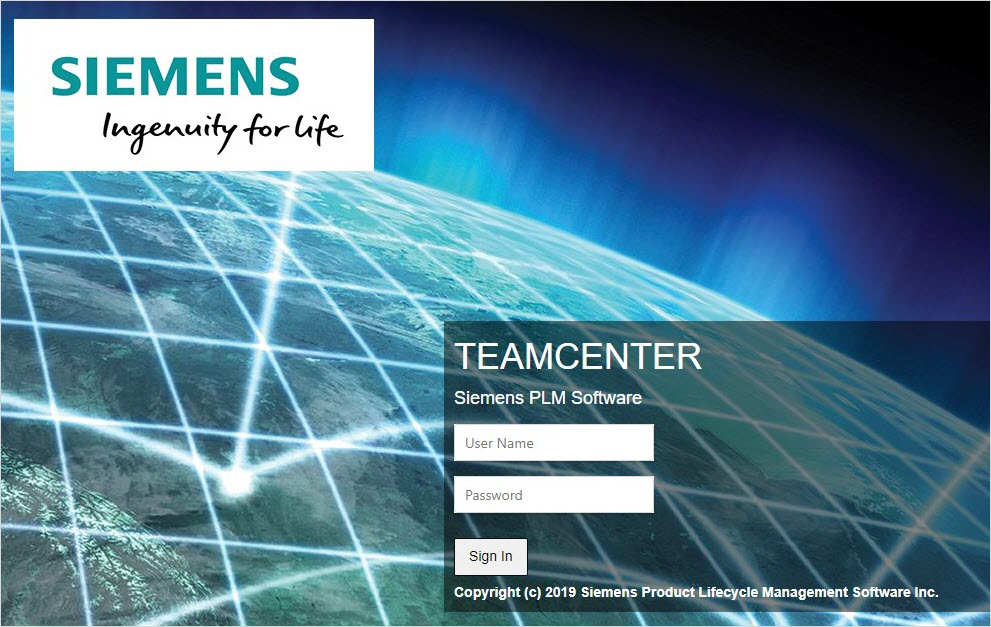
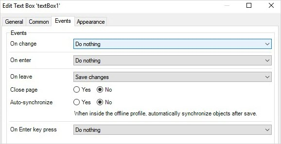
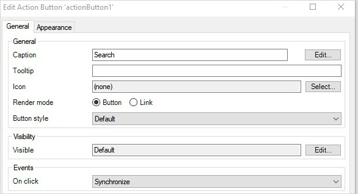
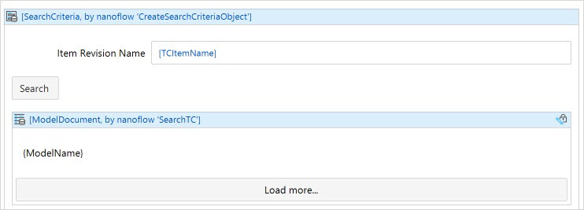
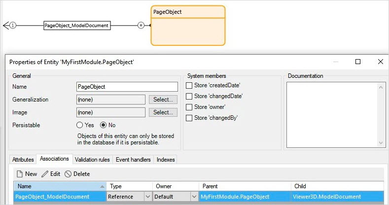
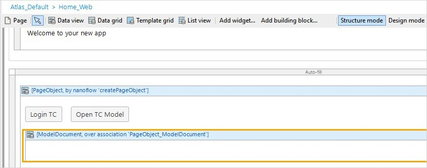
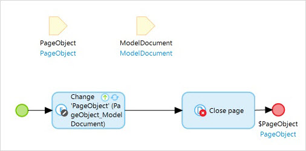
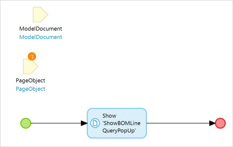
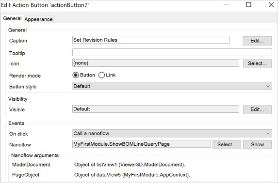
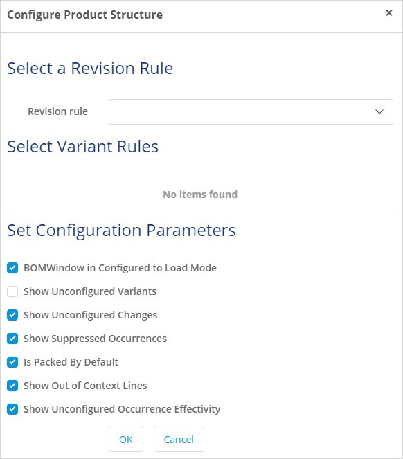

{}[**Add Marketplace link**]{}

## 1 Introduction

The [3D Viewer for Teamcenter]() module lets you connect, search, and fetch JT models from a Teamcenter instance with the help of the [Teamcenter Connector](https://appstore.home.mendix.com/link/app/111627/). This is an add-on module to the [3D Viewer](3d-viewer) app service that provides easy-to-use nanoflows and microflows that help you work with 3D models.

### 1.1 Typical Use Cases

You can use this module to search and fetch JT models that are stored in a Teamcenter instance and use [3D Viewer](3d-viewer) widgets to visualize the fetched models. Once a model is fetched, you can perform some basic operations, such as navigating the model product structure tree and PMI tree, sectioning, and many more operations enabled by the 3D Viewer out-of-the-box tools. 

{}
Using this module alone will not be enough to visualize a 3D model.
{}

### 1.2 Features

This module enables doing the following:

* Logging in to a Teamcenter instance
* Searching models from Teamcenter by setting revision rules
* Getting a model associated with item revision 
* Visualizing and inspecting  a model when used with the 3D Viewer app service

### 1.3 Dependencies

If you want to visualize models stored in a Teamcenter instance, you also need to import the following components into your app:

* [3D Viewer](https://marketplace.mendix.com/index.html) app service – this provides out-of-the-box widgets and the domain model entities needed to visualize a JT model
* [Teamcenter Connector](https://marketplace.mendix.com/link/component/111627) – this is required for the 3D Viewer app service to connect and load the model from Teamcenter

### 1.4 Limitations

To visualize a model from Teamcenter, the limitations are similar to those of 3D Viewer. For details, see the [Limitations](3d-viewer#limitations) section of *3D Viewer*.

## 2 Prerequisites

Make sure you have the following prerequisites in place:

* [Studio Pro 9.4.0](/releasenotes/studio-pro/9.4) or above installed
* A living Teamcenter instance (need the **Teamcenter Host Address** and **Teamcenter FMS URL** to configure the Teamcenter instance – for more information, see the [Reusing Teamcenter Login APIs to Get Access to Teamcenter Instance Data](#reusing) section below)
* A Teamcenter account (it is better to have both an admin user account and a non-admin user account)

## 3 Installation

To visualize a model fetched from a Teamcenter instance, you need to import the components below into your app project. Follow the instructions in [How to Use App Store Content in Studio Pro](../general/app-store-content) to import these components:

* 3D Viewer for Teamcenter
* [3D Viewer](3d-viewer) app service（v.2.0.0 or above）
* [Teamcenter connector](https://marketplace.mendix.com/link/component/111627)(v.3.3.0)

After importing, you need to map the **Administrator** and **User** [module roles](/refguide/module-security#module-role) of the installed components to the applicable [user roles](/refguide/user-roles) in your app.

## 4 Initializing on App Startup

To automatically start this module, create a **Startup** microflow, add **Viewer3D/USE_ME/VisServerAction** and **Viewer3D_TC/USE_ME/VisServerAction_TC** Java actions to the microflow, then set the return type as Boolean with a **Value** of **true**.

You need to set this microflow as the after-startup step via **Project Settings** > **Runtime** > **After startup**.

Finally, double-click the **Visualization Server** Java action and make sure **Http endpoint** is set as `@Viewer3D.HttpEndpoint`:

## 5 Usage

The **3D Viewer** app service provides a set of widgets to visualize JT models as well as a set of nanoflows and Java actions to bring in the data stored in Mendix file storage. Meanwhile, the **Teamcenter connector** module provides full-scale APIs for you to interact with a Teamcenter instance.  

The **3D Viewer for Teamcenter** module acts as an intermediate layer between the two components above. It mainly utilizes the APIs provided by the Teamcenter connector and provides nanoflows, Java actions, and microflows to get JT-format model data from the Teamcenter instance.  

To visualize and operate on the JT model from Teamcenter, use the 3D widgets that are included in the 3D Viewer app service to visualize the data obtained from the 3D Viewer for Teamcenter.

### 5.1 Reusing Teamcenter Login APIs to Get Access to Teamcenter Instance Data {#reusing}

To get data from Teamcenter, the end-user needs to be authenticated and authorized. The Teamcenter connector provides both admin login logic and user login logic in the **App Store Modules** > **TcConnector** > **Published** > **APIs** > **Login** folder. Since you are building an app to enable the end-user to fetch data from Teamcenter and visualize it in the app, you will need to build a login for the end-user so that they can enter their Teamcenter user name and password to access the Teamcenter data.

Follow these steps to build this login:

1. Add a **Login** [button](/refguide/button-widgets) to a page in your app.
2. Set the **On click** action to the **Viewer3D_TC** > **USE_ME** > **Login** > **LoginTeamcenter** microflow.
3.  Run your app locally. When you click **Login**, you will be shown the Teamcenter Admin page where you can add, edit, and manage the Teamcenter instance that you want to connect to by providing the **Teamcenter Host Address** and **Teamcenter FMS URL** and set the instance to **Active**:

	

4.  Return to the **Login**, where you can enter your Teamcenter account to log in to the Teamcenter instance that you configured and set to active:

	

{}
The above is an example Teamcenter login flow included in Viewer3D_TC module. There are other Teamcenter login APIs provided in **TcConnector** > **Published** > **APIs** > **Login**, and you can choose how to use them based on your needs.
{}

### 5.2 Getting a List of Corresponding Models from Teamcenter

The **SearchTC** nanoflow in the 3D Viewer For Teamcenter module enables setting search criteria(for example, search by Item name, Item ID or Revision ID ）and fetching a model list. This nanoflow will first check if an active Teamcenter user session is alive and then perform the search, so logging in is essential before performing the model search. A list of **ModelDocument** objects will be returned as a result of this nanoflow; therefore, the SearchTC nanoflow can be set as the data source of a list view widget. Additionally, by using **Viewer3D_TC** > **USER_ME** > **ShowBOMLineQueryPopUp**, you can apply specific revision rules to the search and get different model data returned.

Follow these steps to get the list:

1. Create an **Open TC model** button and add it to a page in your app
2. Set the **On click** action of the button to show a [pop-up page](/refguide/page-properties#pop-up).
3. Add a list view to the pop-up page and set the **Data source** to **Viewer3D_TC/USE_ME/SearchTC**.
4. Wrap the list view with a [data view](/refguide/data-view), as the **SearchTC** nanoflow requires a **SearchCriteria** object as the input parameter. So, then create a simple nanoflow named **createSearchCriteriaObject** that creates a default **SearchCriteria** object and returns it as result. Set the **Data source** of the data view to this new nanoflow.
5.  Add a [text box](/refguide/text-box) and **Search** button to allow user to type in an item name (as in, a model name) and perform a search:

	

6.  To enable showing the model list via the **Search** button click, the input parameter of the **SearchTC** nanoflow's **SearchCriteria** object needs to be updated on a button click. So, when end-user types in a model name in the text box, the model name should be saved to the **TCItemName** attribute of the **SearchCriteria** object:

	

	And when the end-user clicks the **Search** button, the change needs to be synchronized for List view widget to refresh the list. 

	

7.  Now you should have a model search page like this:   

	  

8.  Run your app locally. Then log in to Teamcenter and open the the Teamcenter model pop-up window. Type in a model name and search. You will see a list of models that contain the entered item name.

	

### 5.3 Opening a Model from the Model list

Now that you get a list of model from calling **SearchTC** nanoflow, you may want to visualize these models. **SearchTC** returns a list of **ModelDocument** objects. For the models to be visualized, using 3D widgets that are part of 3D Viewer are necessary. **ModelId** and **Model source type** are unique identifier for every JT model, with these two properties you could access and operate JT models. The **ModelDocument** object contains attributes (most importantly, **ModelId** and **Model Source Type**) that are needed to identify and visualize a JT model in the 3D widgets.
As the 3D Viewer needs **Model ID** and **Model Source Type** to visualize a model, you will need to pass the **ModelDocument** object to the 3D Viewer widget.

Since you built a model list pop-up page, one scenario is to select a list item on the pop-up page, then return the **ModelDocument** object to then home page to be visualized there. Follow these steps to enable this:

1.  Add an entity called **PageObject** and associate it with the **ModelDocument** entity that is defined in **Viewer3D/Domain Model**:

	

2. On your app's home page, wrap the main area with a data view, then create a nanowflow called *createPageObject* that creates a default **PageObject** object and returns it. Set this nanoflow as the **Data source** of the data view.
3.  On the home page, add another data view within the previous data view, and set the **Data source** of the new data view to **Context**. This way you can access the **ModelDocument** object associated with the **PageObject**:

	

4. Find the 3D widgets in the **Toolbox** and add them to the inner data view, for detailed usage of each widget, please see [3D Viewer](3d-viewer.md).Now you can set the **ModelId** and **Model Source Type** the 3D **Viewer** widget needs.

	  

5. On the open TC model pop-up page, add an outmost data view, select **Context** as its **Data source**, then select **PageObject**:

	

6. Create a nanoflow called *OpenSelectedModel* and set it as the **On click** action for the list view. This nanoflow enables updating the **ModelDocument** associated with the **PageObject** and returns an updated **PageObject**. Every time the end-user clicks a model list item, **PageObject** will be updated, and the home page that the end-user is on will be updated to the newly selected model.

	

7. Run your app locally. You will be able to view the selected model.

{}
There are other ways to visualize a model. The key idea is to pass a valid **ModelId** and **Model Source Type** to the 3D Viewer widget.
{}

### 5.4 Search with Custom BOMLine Query 

Other than searching Teamcenter server to get a list of ModelDocument objects with default BOMLine query. **Viewer_3D** also provides you with a **ShowBOMLineQueryPopUp** page that can enable you to set custom queries. 
**ShowBOMLineQueryPopUp** page requires a **ModelDocument** object as an input parameter, which allows you to set the specific revision rules you want to apply to a model and get the model data based on these revision rules. If nothing is specifically set on the pop up, **SearchTC** will execute with the default default BOMLine query.

Follow these steps to set custom revision rules:

1. Add a button called **Set Revision Rule** to **ModelDocument** list item.
2. Create a nanoflow **ShowBOMLineQueryPopUp** that simply show the **Viewer3D_TC/USE_ME/ShowBOMLineQueryPopUp**: 
   
3. Set the **ShowBOMLineQueryPopUp** nanoflow as the button's **On click** action:

	

3. Run your app locally. You will be able to set a revision rule on the selected model and fetch the model with the needed information:

	

### 5.5 Create ModelDocument from Item Revision

As **ModelDocument** entity type object is the unique identifier defined across 3D Viewer to visualize a model, apart from getting a list of **ModelDocument** returned from **SearchTC** nanoflow. **Viewer3D_TC** also contains a microflow **GetModelDocumentByTCItemRevision** for you to construct a legal ModelDocument directly from Item Revision. This adds more flexibility on getting your model in Teamcenter visualized. 
 
## 8 Read More

* [3D Viewer](3d-viewer)
* [Teamcenter Connector](https://appstore.home.mendix.com/link/app/111627/)
