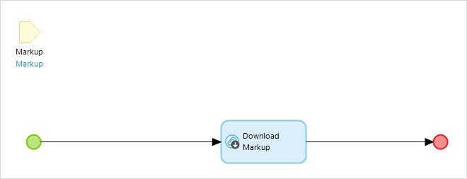
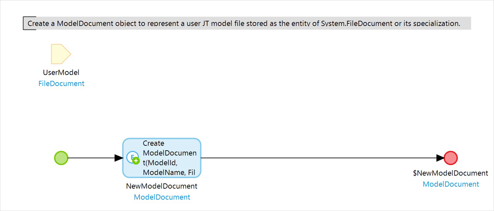
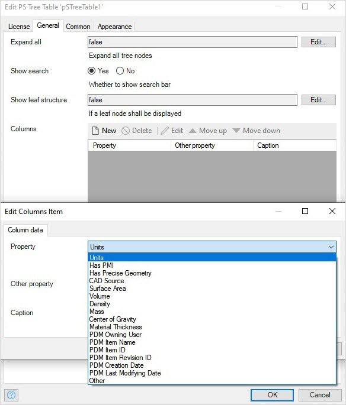
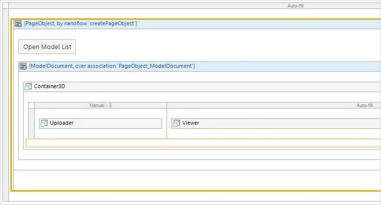
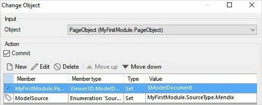
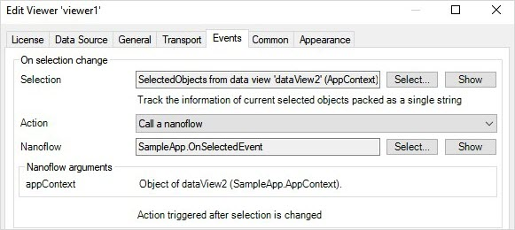
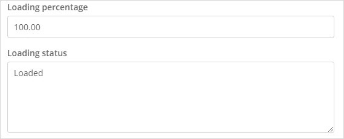

## 1 Introduction

The 3D Viewer app service lets you upload, visualize, and operate on 3D JT files in your web applications, using Mendix File Storage to store models. The app service contains out-of-the-box Java actions, JavaScript actions, domain models, nanoflows, microflows, and a set of 3D widgets that enable you to build apps to work with 3D models via the JT format. The app service includes whole functionalities and integrations that can be very helpful when you are building your own 3D applications. All you need to do is drag and drop items and configure them.

{}[Add link to component]{}

This app service does the heavy-lifting for you so you do not have to build a 3D-rendering engine from scratch.

Here is an overview of what the 3DViewer contains:

  

| Category | Name |
| ---  | --- |
| [Predefined Entity](#41-predefined-entity) | ModelDocument, Pagination, Markup, MxChildDocument, MxModelDocument |
| [Constants](#42-constants) | HttpEndpoint, LicenseToken, ModelSourceType |
| [Microflow](#43-microflow) | DeleteModelFromMendix, DownloadMarkup |
| [Nanoflow](#44-nanoflow) | CreateModelDocumentFromFileDocument, GetMarkupsFromMendix, GetModelListFromMendix |
| [Java Action](#45-java-action) | VisServerAction |
| [Widgets](#46-widgets) | Container3D, Markup builder, Measurement, PMI tree, PS tree, PS tree table, Section view, Toolbar item camera mode, Toolbar item camera orientation, Toolbar item explode slider, Toolbar item fit all, Toolbar item render mode, Toolbar item selection mode, Toolbar item snapshot, Uploader, Viewer |

In most cases, you will only need what are contained in **Viewer3D/USE_ME** folder. The content in the **Internal** folder is for internal use only and you will not need them.

### 1.1 Typical Use Cases

You can use this app service when you want to upload, store, and visualize 3D JT models in your Mendix application. You can perform some basic operations, such us navigating the model product structure tree and the Product Manufacturing Information(PMI) tree, creating section views, 2D markups and much more.

### 1.2 Features

This app service enables you to do the following:

* Upload to and load models from Mendix file storage or your own file storage (Both monolithic JT and shattered JT format are  supported)
* Display a 3D model
* Zoom, rotate, fit all, pan
* Use quick intuitive controls to navigate product structure
* Turn parts on and off
* Select and clear selection of parts
* Examine your model from preset viewing angles
* Display PMI
* Display model views
* Display part/assembly properties
* Display exploded view
* Create 3D cross-sections
* Create 2D markup on model 
* Take snapshot of a model 
* Perform 3D measurement on distance, angle, area, radius and length
  
### 1.3 Limitations

The 3D Viewer app service includes a few 3D widgets mentioned earlier. These are some limitations on how these widgets should be placed in a page in Mendix Studio Pro:

*  The **Container3D** widget acts as a context-sharing container for other 3D widgets, 3D widgets talk to each other and perform corresponding actions via this context. Therefore, every other 3D widgets (except **Uploader** widget)needs to be put inside the Container3D widget. If 3D widgets are placed outside of the Container3D widget, these widgets won't work as expected, you will get nofitied and see these errors "This widget must be put inside Container3D" when you switch to Design mode. 

	
	
	

*  One **Container3D** widget can only contain one **Viewer** widget. If multiple Viewer widgets are placed inside a Container3D widget, you will see error message in Design mode. 

	  

	 

* **Viewer** widget is used to display a 3D model, all other 3D widgets (except **Uploader** widget and **Container3D** widget) needs a **Viewer** widget present on the page to interact with.

* Currently, only JT models with version 9 and above are supported.
* Before uploading shattered JT (.zip),  make sure you are using UTF-8 encode to zip the JT files. For example, if you are using 7Zip, please make sure you input "cu" in the parameter.

## 2 Installation

Suppose you already have a **3DViewer.mpk**, and you would like to add to your app in Mendix Studio Pro, do the following:

1. Open your app in Mendix Studio Pro(any version between 8.15.1 and latest Mendix 8 versions).
2.  Right-click the project in the **Project Explorer** and select **Import module package…**.

	 

3.  Find and select the 3DViewer.mpk that you have and import it. 
4.  In the **Import Module** dialog box, **Add as a new module** is the default option when the module is being downloaded for the first time, which means that new entities will be created in your project(The name showing 'Viewer3D' instead of '3DViewer' is because the naming convention doesn't allow module name starts with digit, therefore in project explorer, Viewer3D represents 3DViewer):  
	
	  
    
	{}If you have made any edits or customization to a module that you have already downloaded, be aware of the **Replace existing module** option. This will override all of your changes with the standard App Store content, which will result in the creation of new entities and attributes, the deletion of renamed entities and attributes, and the deletion of their respective tables and columns represented in the database. Therefore, unless you understand the implications of your changes and you will not update your content in the future, making edits to the downloaded modules is not recommended.{}

5. Click **Import** on the **Import Module** dialog box, and a pop-up stating that “The app was successfully imported into the project” will appear. Click **OK**.
6. Open the **Project Explorer** to view the Viewer3D module. You can see a collection of ready to use items under the Viewer3D folder. Besides, if you go to Toolbox window, you will also notice a  collection of 3D widgets are added to Toolbox widget list, under the **Add-on widget** category. 
7. After importing, you need to map the **Administrator** and **User** module roles of the installed modules to the applicable user roles in your app.

## 3 Initializing the 3D Viewer App Service on App Startup

To use 3DViewer features, you app needs to be bound to 3DViewer service. This is achieved by executing a microflow when the app starts. The 3DViewer contains a java action called `VisServerAction` which can start the 3DViewer service for you. Call this java action from your app's After Startup microflow, this will automatically start 3DViewer when app starts (running after startup usually means you want to run a specific tool all the time.). 

If you project does not have set an After startup microflow,  follow these steps:

1.  create a **Startup** microflow, add the **Viewer3D/USE_ME/VisServerAction** Java action to the microflow, make sure the java action parameter **Http endpoint** is set to `Expression:@Viewer3D.HttpEndpoint`,  then set the return type of this microflow as **Boolean** with a **Value** of **true**. As the microflow which is set as the Afterstartup microflow needs a Boolean return value.
2.  Set this **Startup** microflow as the after-startup step via **Project Settings** > **Runtime** > [After startup](/refguide/project-settings#after-startup): 

	

If your project already has a microflow set to execute after startup, you need to extend it with adding the **Viewer3D/USE_ME/VisServerAction** Java action to the microflow, and configure the same as stated in step 1. 

## 4 3DViewer Content

### 4.1 Predefined Entity

**ModelDocument** entity is a conceptual entity that incorporates all information of a model. You can choose to inherit from this entity, set an association to the entity or copy this entity to your module.

| Attribute | Description |
| --- | --- |
| ModelId | A unique string to identify a model. |
| ModelName | Name of a model. |
| Source | Indicates where the model is from. Currently it has two values:**Mendix** and **Teamcenter**. When the source is **Mendix**, it indicates the model is from Mendix file storage, when the source is **Teamcenter**, it indicates the model is from a Teamcenter instance. |
| Author | Indicates the author of the model. |
| CreationDate | For models stored in Mendix file storage, the **CreationDate** corresponds to the time the JT model is first uploaded to the file storage. For models stored in Teamcenter, the **CreationDate** indicates the creation date of this model revision. |
| FileSize | The size of the model in Byte. |
| FileType | The 3D model format. Currently only the JT format is supported. |
| Status | Used specifically for models uploaded and stored in Mendix file storage. The **Status** has 3 values: Complete, InProgress,Error, indicating if uploading of a model to Mendix file storage is Complete, or the uploading is still in progress, or the upload fails. |
| ErrorReason  | Indicates the reason that causes a model upload error.|

The **Pagination** entity serves as an input parameter of the **GetModelListFromMendix** nanoflow. It allows you to paginate the model list returned by the nanoflow. If the values of the **Pagination** attributes are not specifically set, **GetModelListFromMendix** will return a full list of the models.

| Attribute | Intended Use |
| --- | --- |
| Count | Indicates which page number to fetch. |
| PageSize | Indicates the item size of one page. |
| OffSet | Indicates the offset from the first item of the page. |

The **Markup** entity is a **System.Image** type of entity, it denotes a Markup image.

Other two entities, **MxModelDocument** and **MxChildDocument** are internal entities, in most cases, you may not need them. 

### 4.2 Constants

The **HttpEndpoint** constant with the default value **visualization** is used to restrict the value of parameter **HttpEndpoint** used in **Viewer3D/USE_ME/VisServerAction** Java action.

The **ModelSourceType** constant with the value **Mendix** is used to signify the model source, you can use this constant to restrict the value of parameter **Data source** in Uploader widget, the parameter **Model source type** in Viewer widget, or the value of Attribute **Source** in **ModelDocument** entity.

The **LicenseToken** constant is used to provide valid 3DViewer license token for the app that uses 3DViewer to be successfully deployed to Mendix Cloud. As 3DViewer is a commercial product and subject to a subscription fee, to be able to use 3DViewer functionalities in a deployed app, you will need a valid license token and set the value of constant **LicenseToken** to that license token in the deployment environment setting.

However, if you only plan to have a try first on how 3DViewer works , that is, build and run an app that uses 3DViewer locally in studio pro or deploy to Mendix sandbox environment, you don't need to subscribe to get a license token, you do not need to set a value to **LicenseToken** constant, just leave it empty. Making is always free!

For how to get a license token, please see [Obtain 3DViewer LicenseToken to deploy your app](#8-obtain-3dviewer-licensetoken-to-deploy-your-app) for more details.

### 4.3 Microflow

The **DeleteModelFromMendix** microflow takes a **ModelDocument** object as an input parameter and deletes the corresponding model stored in the Mendix file storage.

The **DownloadMarkup** microflow takes a **Markup** object as input parameter and download the image to local.

### 4.4 Nanoflow

The **CreateModelDocumentFromFileDocument** nanoflow takes a **FileDocument** type of object as an input parameter to create a ModelDocument object to represent a user JT model file stored as the entity of System.FileDocument or its specialization. This allows you to get model from your existing file storages.

The **GetModelListFromMendix** nanoflow takes a **Pagination** object as an input parameter to fetch the model list from Mendix file storage and returns a list of **ModelDocuments** as a result. Each ModelDocument represents a model that is stored in the Mendix file storage.

The **GetMarkupsFromMendix** nanoflow takes a **ModelDocument** object as an input parameter to fetch the markup images associated with this model and returns a list of **Markup** object as a result. Each Markup represents an image that is stored in the Mendix file storage.

### 4.5 Java Action

The **VisServerAction** Java action is used to set up a visualization server infrastructure, which is critical for realizing all the functions that 3D Viewer provides. It is exposed as microflow actions. For 3DViewer to work, it is important to set the app's after-startup microflow to call the **VisServerAction** java action. Make sure parameter **Http endpoint** of this java action is set to `Expression:@Viewer3D.HttpEndpoint`. 

### 4.6 Widgets

#### 4.6.1 Core Widgets

These are the  core widgets that are required to enable visualizing a 3D JT model:

| Widget | Description |
| --- | --- |
| Container3D | A special container widget designed to put other 3D widgets in. This provides a shared context for 3D widgets to communicate with each other. |
| Uploader | Enables you to select a JT model from your local machine and upload it to the Mendix file storage. |
| Viewer | Provides a viewing window of your 3D model. |

The core widgets can be used in the following ways:

* **Container3D** – place this widget in any location of a page
* **Uploader** – place this widget in any location of a page  
	* On the **General** tab, **Model ID**, and **Data source** attributes can be used to retrieve the uploading model's **Model ID**, and **Model source type** values:

	  

* **Viewer** – place this widget inside a **Container3D** widget; for this widget to visualize a model correctly, following properties need to be set correctly:
	*  On the **Data Source** tab, you must configure correct **Model ID** and **Model source type**. Example valid **Model ID** values are:  value of attribute **ModelId**  of a ModelDocument object, value of attribute **Model ID**  set by Uploader widget property. Valid **Model Source Type** values are: `Mendix` or `Teamcenter`, you can also use the constant **Viewer3D/USER_ME/ModelSourceType**.  

	  
	
	* On the **Transport** tab,  make sure the **HttpEndpoint** is set to `@Viewer3D.HttpEndpoint` or `visualization`. 

	  
	
	* On the **Appearance** tab, make sure the widget has a fixed height (for example, set Style to `height:600px`, or make sure height of its parent is fixed), otherwise this viewer will expand indefinitely.

In addition, the Viewer widget provides customization options for changing its behavior (configuring these properties is optional)

* On the **General** tab:  
	 **Show coordinate system** determines if a coordinate system will appear at the bottom-left of the viewer  
	   **Show navigation cube** determines if a navigation cube will appear at the top-tight corner of the viewer  
	   **Show tooltip** determines if a tooltip will pop up when you click on the model part; this accepts a Boolean value of **false** or  **true**  
	   **Automatically load parts** determines if the model part will be loaded into Viewer automatically; if set to **Yes**, the model will be automatically loaded as long as the Viewer receives the **Model ID** and **Model source type** values; if set to **No**, the model will only be loaded into the Viewer when triggered from the PS Tree part toggling, in this use case, you will need to add PS tree widget so you can trigger part loading by clicking on the PS tree.  
      

* On the **Events** tab:  
     
	**On selection change** - by binding a String type attribute to the **Selection** property, you can use this attribute as an input parameter to add action to trigger when selection changes on the viewer. Please see [Set Viewer event](#73-set-viewer-event) for details.  
	    **On error**- by binding a String type attribute to the **Error** property, you can obtain the error message raised by viewer and add custom actions to trigger when error arises.  
	    **On progress change** - by binding a String type  attribute to **Progress status** property, you can obtain the current model loading status.  By binding a Decimal type attribute to **Progress percentage** property, you can obtain the current model loading percentage. You can also add custom actions triggered by this change.  
	    **On load** - by binding a Boolean type attribute to the **Loaded** property, you will be able to know if the product structure is loaded. You can also add custom actions triggered by this change.  
       
	
For details about Viewer events, please see [Set Viewer event](#73-set-viewer-event) for details.  
	
3DViewer also exposes some APIs on viewer for you to invoke and implement custom logic that suits your need. For how to use Viewer APIs and other details, please contact [Mendix Support](https://support.mendix.com/hc/en-us) and raise a ticket against 3DViewer development team.

#### 4.6.2 Panel Widgets

These are the widgets that have an operation panel that contains an interactive item for the end-user to operate on:

| Widget | Description |
| --- | --- |
| PS tree | Provides a hierarchical tree view of the items that form a model. By toggling the tree node, the end-user can control which model parts will be loaded into Viewer. |
| PS tree Table  | A configurable tree table to display product structure of a model and other model attributes of your choice. |
| PMI tree | Provides a hierarchical tree display of a model's product manufacturing information, model views, and design groups. |
| Section view | Enables creating a section cut on the model and provides a section view from various angles. |
| Markup builder | Enables creating 2D markup on a model and saving the annotated screenshot. Snapshots that contain 2D markup will be saved along with the model in Mendix file storage. |
| Measurement | Enables performing measurements on 3D models including measuring Distance, Angle, Line length, Radius, Area |

Each panel widget should be placed in a **Container3D** widget. A **Viewer** widget with the right data source should also be in the same **Container3D** widget.

The panel widgets can be used in the following ways:

* **PS Tree** – On the **General** tab, the following options are available:
	* **Expand all** determines if the model's product structure tree should be fully expanded at the initial load
	* Use **Show search** to toggle a search bar that enables the end-user to enter a part name and search for the part in the PS Tree
	* **Show leaf structure** determines if the sub-part data should be displayed in the PS Tree
	  
* **PS Tree Table** – compared to the **PS Tree** widget, this widget adds an additional configurable property **Column**, you can expand the table by adding columns and specifying the property to be displayed in this column. Example predefined properties are: Volume, Mass, Units, HasPMI, Density. If you want to display other properties other than the predefined properties in the list, you can also add other property by specifying valid property defined in the model.
  
* **PMI tree** - On the **General** tab, the property **Expand all tree nodes** determines if all tree nodes are expanded by default. When set to `yes`, you will see a PMI tree fully expanded by default on this widget load; When set to `no`, PMI tree will not fully expand by default. The property **Auto load** determines if all PMI should be automatically loaded into viewer when PMI structure tree is loaded.

* **Section view** - Place it inside of a Container3D widget, a Viewer widget should be present in the same Container3D widget so you can add section plane on the model. No specific configuration is needed. With this widget, you can add, delete and clear section planes to the model on your desired direction axis and clipping mode. For details on how Section View behaves in an app. Please see [Create 3D Section](#71-create-3d-section).

**Markup builder**
	
* On **General** tab, by setting property **Enable** to true or false, you can switch on and off the markup mode, when set to `true`, model will be locked to a 2D dimension and won't react to mouse rotate, when set to `false`, model will be unlocked and return to rotatable state; another property is **Markup color**, it allows you to set color of markup annotation. Valid values are [CSS Legal color value](https://www.w3schools.com/CSSref/css_colors_legal.asp), for example, RGB value, predefined color names, hexadecimal color values.

	

* On **Event** tab, by binding a boolean type attribute to **Save** property, you will be able to obtain save status of the markup image after user click the Save button on the markup builder's panel, and add custom actions, such as show pop up message, to it. When the attribute values changes to `true`, it means the markup image associated with model is successfully saved in Mendix file storage; when the attribute value is `false`, it means the save is not successful. By setting **Action**, you can choose to trigger an action based on the value of **Save** status. 
    
  
* **Measurement** - Place it inside of a Container3D widget, a Viewer widget should be present in the same Container3D widget so you can use measurement options provided in Measurement widget to perform measurement on the model. No specific configuration is needed. With this widget, you can measure distance, length, radius, area, angle of a part or between parts . For details on how to perform measurement on a 3D model. Please see [Perform 3D Measurement](#72-perform-3d-measurement)

#### 4.6.3 Toolbar widgets

These widgets do not require additional configuration. Simply place them within a **Container3D** widget with the accompanying **Viewer** widget.

| Widget | Description |
| --- | --- |
| Tool bar item camera mode | Provides the ability to control the appearance of surface objects displayed in the view. The option determines whether surface objects are represented on the display by facet geometry or edge geometry. |
| Tool bar item camera orientation | Enables viewing the model from different camera orientations. |
| Tool bar item explode slider | Enables creating an exploded view of your assembly. |
| Tool bar item fit all | Enables fitting all the model parts in the viewer. |
| Tool bar item render mode | Enables toggling between different model render modes. |
| Tool bar item selection mode | Provides the ability to select a model part, edge, face, and body. |
| Tool bar item snapshot | Provides the ability to take a snapshot of the current Viewer and save the snapshot to the local machine. |

## 6 Using 3D Viewer

3D Viewer mainly provides a set of widgets to visualize JT models and a set of nanoflows and Java Actions to bring in the data.

Given that you start from a blank app template in Mendix Studio Pro, you can follow the instructions below to visualize your local JT model quickly.

### 6.1 Uploading & Viewing a 3D JT Model in Your Browser

For the **Viewer** widget to visualize a JT model, two data source attributes should be set: **Model ID** and **Model source type**. To enable uploading 3D JT models and visualizing them directly on the page, a set of these attributes should be returned by the **Uploader** widget and set to that of the **Viewer** widget.

Follow these steps to configure this visualization:

1. Place a **Container3D** widget on a page.
2. Put the **Uploader** widget and **Viewer** widget into the **Container3D** widget and give them a layout.
3. Set a fixed height of the **Viewer** widget (toggle to **Design mode** to see the preview).
4. Create an entity called **UploadedModel** in your app module's domain model.
5. Wrap the **Uploader** and **Viewer** widgets inside a new Data view widget.
6. Create a nanoflow, call it *CreatedUploadedModel*, and set this as data source of the data view.
7.  Create two attributes for the **UploadedModel** entity. Set them to receive the value returned from the **Uploader**'s **Data source** and **UploadModelId**:

	

8.  Set the data source attributes of the **Viewer** widget by setting **Model ID** to **UploadedModelID** and **Model Source Type** to **Mendix**:

	

9.  Set **Automatically load parts** to **Yes**, which enables loading the model automatically upon successful upload:

	

10. Run your app project locally. You can now upload a JT file and view it directly in the browser:

	

### 6.2 Displaying Model Loading Progress with Progress Bar Widget

When the end-user is uploading or loading a model, they may want to know the uploading and loading progress.

Uploading progress in the **Uploader** widget can seen in the uploader panel :

Loading progress in the **Viewer** widget can be obtained via the **Progress status** and **Progress percentage** attributes in Event tab.

Follow these steps to display the model loading progress:

1. Create an entity called *PageObject*, add decimal type attribute called *LoadingProgress* with a default value of `= 0` (as the **Progress bar** widget expects a decimal value).
2. Create a nanoflow called *createPageObject* that returns a **PageObject** object.  
3. Wrap **Container3D** with a data view and set the **Data source** of the data view to the **createPageObject** nanoflow.
4.  Set the value of the **LoadingProgress** attribute by setting the **Progress percentage** property:

	

5.  Add the **Progress Bar** to the page and set **PageObjectLoadingProgress** as the **Progress Attribute**:

	  

6. Run your app locally. You can see the real-time model loading progress:

	

### 6.3 Utilizing More 3D Functionality

You can add more 3D widgets to the page to enable more 3D functionalities and arrange the layout of them as to your need. For example:

### 6.4 Managing Uploaded Models

In the previous use case, you can only visualize the model you upload.

Usually you will also need to manage the models that are uploaded and stored in the data storage. 3D Viewer provides the **GetModelListFromMendix** nanoflow and **DeleteModelFromMendix** microflow to help you build model data management functionality into your app.

#### 6.4.1 Building a Model List

The Mendix native [list view](/refguide/list-view) can be used to display the model list by following these steps:

1. Use the **View3D/USER_ME/GetModelListFromMendix** nanoflow or copy it to your app module. A list of **ModelDocument** objects will be returned after calling the nanoflow.
2. Add a [pop-up page](/refguide/page-properties#pop-up) to display the model list via a button click or another event of your choice.
3. Place a list view in the page and set the **GetModelListFromMendix** nanoflow as the **Data source**.
4. As **GetModelListFromMendix** requires a **Pagination** parameter input, wrap the list view with a data view. Then, create a nanoflow called *CreatePaginationObject* nanoflow and set that nanoflow as the list view's **Data source**.
5.  Fill in the list item with the information you are interested in:

	

#### 6.4.2 Opening a Model from the Model List

Once you have the model list, you may want to click to select a model from the list and view the model. As the **Viewer** widget expects **ModelId** and **Model Source Type** to visualize a model, such information of the selected model needs to be passed to the **Viewer** widget. Since each list item is a **ModelDocument** object and this object contains various pieces of information about the selected model (including **ModelId** and **Model Source Type**), you need to pass this object to the **Viewer** widget.

Follow these steps for configuration:

1.  Define the **On click** action for the list view so as to pass the selected model to the **Viewer** widget that is present in another page (so the selected model can be loaded into the viewer). An example approach is to create an entity that is associated with the **ModelDocument** entity defined in the **Viewer3D** module's domain model. Make the object a shared object between the page the **Viewer** is in and the model list page. In this example, you are creating a **PageObject** with this home page: 

	

	This is the model pop-up page:  

	

2.  Set the **On click** action of the model list item, then change the **ModelDocument** object with which the **PageObject** is associated to return the value so that home page can be refreshed on a **PageObject** change:

	

3. Run your app locally. You will get a simple model list where you can select which model to open and visualize it with the home-page viewer:

	

#### 6.4.3 Deleting a Model

There might be some models that you do not want in the database, so you can delete these too. The 3D Viewer app service provides the **DeleteModelFromMendix** microflow to achieve this.

Follow these steps to delete a model from the database:

1. Use the **Viewer3D/USE_M3/DeleteModelFromMendix** microflow directly or copy it to one of your app modules.
2.  **DeleteModelFromMendix** expects a ModelDocument (which represents a model stored in Mendix file storage) as an input parameter. After successful execution, the model will be deleted from Mendix file storage. In the previous steps a model list was built, each list item of which is a ModelDocument. For a model list item, add a **Delete** button:

	

3.  Create a nanoflow called *DeleteModel* and set **ModelDocument** as the input parameter. Then, call the **Viewer3D/USE_M3/DeleteModelFromMendix** microflow and commit the **ModelDocument**:

	

4. Set the **On click** event of the **Delete** button to the **DeleteModel** nanoflow.
5. Run your app locally. You should be able to delete a model by clicking **Delete**.

Now you are able to get a list of models, select a list item to open a model, and delete the model.

### 6.5 Handling Viewer Events

Multiple events can be picked up by the **Viewer** widget and can be used to build your customized event handling logic.

There are four main types of events that can be picked up on the **Viewer** widget, here is an example setting:

* **On Selection Change** – by selecting one attribute to set **Selection**, you can get information on the selected part. For this you might need to work with Viewer APIs, if you have further inquiries on how to use Viewer APIs, please contact [Mendix Support](https://support.mendix.com/hc/en-us) and raise a ticket against 3DViewer development team.
* **OnError** – by selecting one attribute to set the **On error** event, you can pick up an error exposed by the **Viewer**
* **On Progress Change** – by selecting one attribute for the **setProgress** value, you can get the current loading status and the loading percentage of the model, product structure tree, and PMI tree
* **On load Change** – by selecting one attribute for the **loaded** value, you can get the current loading status of product structure tree.

## 7 Others

### 7.1 Create 3D Section

When a model is loaded in the viewer, the Section View widget enables you to inspect the interior structure of a model by adding standard section planes, delete a section plane, clear all section planes, position plane, clip away parts.

Here is a list of UI operations within the Section View widget.

  
**Action**:

Add - Add a section plane. First select an axis along which you would like to section the model, then click Add, you will see a section plane of the desired axis is added to the scene, the default position of the newly added section plane is in the middle of the bounding box of the direction selected.

Delete - Delete a selected section plane. Click on the edge of the section plane to select it, when selected, the section plane edges are highlighted in yellow color, then click Delete, this section plane will be deleted.

Clear -  Clear all the section planes added to the scene.

**Direction**:

X Direction - Sets X axis of the default coordinate system as the reference.  
Y Direction - Sets Y axis of the default coordinate system as the reference.  
Z Direction - Sets Z axis of the default coordinate system as the reference.  
For example, if you have select Y Direction, then the cross section is created on the ZX plane.

**Clipping**:

When a section plane is selected (highlighted in yellow color), you can choose which part of the model you would like to clip away by clicking on 4 clipping options:  
Off - Don't clip.  
Both - Clip both sides, shows the 2D intersecting curve on the section plane.  
Near - Clip away the positive side (toward direction).  
Far - Clip away the negative side (away from direction).  

**Position**:

You can slide the position sliders to move the position of the section plane along its axis. You can also type in an exact position to place the section plane at an exact position.

You can add multiple section planes to cut the model in different directions. After the section, you can save a snapshot of a section view. You can also add markup annotations on the section view and save them for later review.

### 7.2 Perform 3D Measurement

When a model is loaded into the viewer, Measurement widget provides a set of tools to measure different geometrical entities.  

**Measurement Mode**  
Distance : Measure the distance between two part features.
Length: Measure length of a line.  
Radius: Measure the radius of a circular edge or surface.  
Angle: Measure the angle between two edges or surfaces.  
Area: Measure the area of a surface.  
**Dimension Controls**  
Remove: Select one measurement result, click Remove, the selected measurement result will be removed from the scene.  
Clear: Clear all measurement results in the scene.

### 7.3 Set Viewer event

As previouly introduced in Viewer widget introduction, viewer catches model part selection event, error event, model loading progress event and isloaded event for you to handle these event tailored to your need. 

### 7.3.1 On selection change

**Selection**: Takes a String type attribute. You can define an attribute and bind that attribute to Selection. In an running app, when user select on a model part, the selection event will be triggered, and the selected part info will be populated to this Selection attribute. You can easily get this selected object information (psid and viewer)and use it in the actions.  

**Action**: Like other Mendix event, you can select from a list of actions upon model part selection. One possible use case is utilize get APIs exposed by Viewer, for example, get Boundingbox by psid, set material by psid, in a javascriptaction, include it in a nanoflow, and set the Action to call this nanoflow.  

### 7.3.2 On error

**Selection**: Takes a String type attribute. You can define an attribute and bind that attribute to Selection. In an running app, when user select on a model part, the selection event will be triggered, and the selected part info will be populated to this Selection attribute. You can easily get this selected object information (psid and viewer)and use it in the actions.  

**Action**: Like other Mendix event, you can select from a list of actions upon model part selection. One possible use case is utilize get APIs exposed by Viewer, for example, get Boundingbox by psid, set material by psid, in a javascriptaction, include it in a nanoflow, and set the Action to call this nanoflow.  
3dviewer-onerror-sample

### 7.3.3 On progress change

3dviewer-onprogress-sample

### 7.3.4 On load

viewer-onload-sample

## 8 Obtain 3DViewer LicenseToken to deploy your app

3DViewer is a commercial Mendix product that's subject to purchase and subscription fee. To deploy your app that uses 3DViewer successfully to the cloud, you will need provide a valid `LicenseToken` as environment variable in deployment setting, otherwise 3DViewer widget features may not work in your app.

### 8.1 Decide if you need to request a LicenseToken

If you use 3DViewer in your app, and you just need to run your app locally, for testing and trial purpose, no plan for deploy the app, you will not need to request a `LicenseToken`.

If you plan to use 3DViewer in your app, and decide to deploy your app to the cloud, then you will need to request a `LicenseToken`. 

### 8.2 Do I have to pay to get a LicenseToken

Yes, you are subject to pay for subscription fee.

### 8.3 How to request a LicenseToken

For the time being, to request free-trial and offical subscription `LicenseToken`, please provide **your company legal name**, **your email address**, **your full name**, and send these information to DIS_MXAWS_3DViewer_Support@mendix.com. You may be asked to provide more information. In the end you will receive a `LicenseToken` with an agreed expiration date.

### 8.4 How to configure LisenseToken for your app deployment

#### 8.4.1 Configure LicenseToken in Mendix Studio Pro

In Mendix Studio Pro, go to Pojrect Settings, in Configurations Tab, click to Edit, under Constants tab, create a new Constant with the predefined constant `Viewer3D.LicenseToken`, fill the Value with your obtained LicenseToken. Click OK to confirm the settings.

Click Run to deploy your app to the cloud.

#### 8.4.2 Configure LicenseToken in Mendix Developer Portal

You can also add or update LicenseToken via Mendix Developer Portal.

## 9 Loading & Visualizing a Model from Teamcenter

JT models from other data sources can also be visualized. Specifically, if you would like to load and visualize models from Teamcenter, you can use a combination of this 3D Viewer app service with the [3D Viewer for Teamcenter](3d-viewer-for-teamcenter) module to achieve this.

## 10 Read More

* [3D Viewer for Teamcenter](3d-viewer-for-teamcenter)
