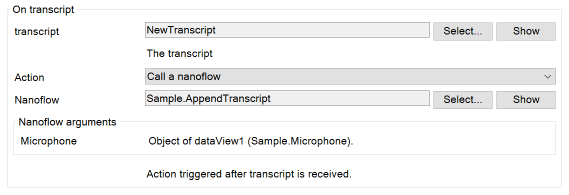
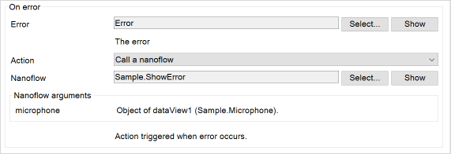
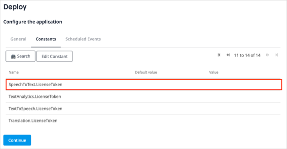

## 1 Introduction

The [Cogniso Speech To Text](https://marketplace.mendix.com/link/component/118590) app service enables you to build an app to convert speech to text with state-of-the-art speech recognition. With this app service, your app can easily convert speech into text and trigger actions that you have specified. All you need to do is drag and drop items and configure them.

Here is an overview of what the app service contains:

* [Predefined entities](#predefined-entities)
	* MediaDocument 
* [Constants](#constants)
	* LicenseToken
	* TokenEndpoint
* [Microflows](#microflows) 
	* BatchTranscription
	* StartService
* [Widgets](#widgets)
	* Microphone

In most cases, you will only need what is contained in the **SpeechToText** > **USE_ME** folder. The content in the **SpeechToText** > **Internal** folder is for internal use only and you will not need it.

### 1.1 Typical Use Cases

You can use this app service to convert voice into text and trigger custom actions in your mendix apps. You can also customize these actions and set voice feedback messages that your app sends to users. You can offer users different language options in your mendix app.

### 1.2 Features

This app service enables doing the following:

* Convert speech to text
* Trigger actions and give users voice feedback messages upon speech conversion
* Support the batch mode to implement speech conversion as a back-end service
* Support different language options

### 1.3 Prerequisites

This app service can only be used with Studio Pro 9 versions starting with [9.4](/releasenotes/studio-pro/9.4).

## 2 Installation

1. Go to the [Cogniso Speech to Text](https://marketplace.mendix.com/link/component/118590) component page in the Marketplace and download the *CognisoSpeechToText.mpk* file.
2.  To add the Cogniso Speech to Text app service to your app in Mendix Studio Pro, follow these steps:
    1. In the **App Explorer**, right-click the app.
    2.  Click **Import module package** and then select *CognisoSpeechToText.mpk*. 

        

        In the **Import Module** dialog box, **Add as a new module** is the default option when the module is being downloaded for the first time, which means that new entities will be created in your app.

        {}If you have made any edits or customization to a module that you have already downloaded, be aware of the **Replace existing module** option. This will override all of your changes with the standard Marketplace content, which will result in the creation of new entities and attributes, the deletion of renamed entities and attributes, and the deletion of their respective tables and columns represented in the database. Therefore, unless you understand the implications of your changes and you will not update your content in the future, making edits to the downloaded modules is not recommended.{}

    3. In the **Import Module** dialog box, click **Import**. 
    4. Wait until a pop-up box states that the module was successfully imported. Click **OK**.
    5. Open the **App Explorer**  to view the **CognisoSpeechToText** module. You can also find the app service in the **Cognitive AI widgets** category in the **Toolbox**.
3. Map the **Administrator** and **User** module roles of the installed modules to the applicable user roles in your app.

You have successfully added the Cogniso Speech To Text resources to your app.

## 3 Initializing Cogniso Speech To Text When App Starts

It can be useful to run the Cogniso Speech to Text service automatically when your app starts. The app service contains a Java action –  the **StartService** microflow, which can start the Cogniso Speech To Text service for you. You can use the [After startup](/refguide/project-settings#after-startup) setting in your app to call the **StartService** microflow.

1.  If your app does not have an after-startup microflow, perform the following steps:
   1. Create a microphone in your module.
   2. Add the **StartService** microflow from the **SpeechToText** > **USE_ME** > **StartService** folder to the new microflow that you created.
   3.  Set the return type of the microflow to **Boolean** with **true** as the **Return value**.

       

2. If you app has an after-startup microflow, perform the following:
   1. Add the **StartService** microflow from the **SpeechToText** > **USE_ME** > **StartService** folder to the existing after-startup microflow.
   2. Set the return type of the new microflow to **Boolean** with **true** as the **Return value**.
3. In the App Explorer, go to **Settings**. The [App Settings](/refguide/project-settings) dialog box opens.
4. Go to the **Runtime** tab. 
5. Set **After startup** to the microflow that calls the **StartService** microflow.

## 4 Configuration

### 4.1 Predefined Entities {#predefined-entities}

The **MediaDocument** entity is a conceptual entity that inherits from the **System.FileDocument** entity and incorporates all the information of media document. You can choose to inherit from this entity, set an association to the entity, or copy this entity to your module.

| Attribute        | Data Type | Description|
| ---------------- | ---- | -----------|
| `Transcript`   | String | The base64-encoded audio data string.     |
| `LanguageCode` | String | The language code of this media document. |

### 4.2 Constants {#constants}

#### 4.2.1 Lincese Token

The **LicenseToken** constant offers a valid CognisoSpeechToText license token to the app that uses CognisoSpeechToText to be successfully deployed to [Mendix Licensed Cloud Node](/developerportal/deploy/mendix-cloud-deploy) or your own environment. As CognisoSpeechToText is a commercial product, to use the CognisoSpeechToText functionality in a deployed app, you need a long term valid license token, and you need to set the value of the **LicenseToken** constant to that license token in the deployment environment setting.

However, if you only plan to try how CognisoSpeechToText works, that is to say, you will only build and run an app that uses CognisoSpeechToText locally in Studio Pro or deploy to a Mendix Free App environment, then you need to subscribe a trial version, and set the value of the **LicenseToken** constant to that license token in the project environment setting.

For details on how to get a license token, see the [Obtaining a LicenseToken for Your App](#obtain) section below.

#### 4.2.2 TokenEndpoint

The **TokenEndpoint** constant provides a valid endpoint of security token service for the back-end authentication of the cognitive speech-to-text service. The constant comes with a default value which points to the production environment of the deployed security token service. The security token service issues security tokens that authenticate user's identity. 

### 4.3 Microflows{#microflows}

#### 4.3.1 StartService

The **StartService** microflow is a Java action which starts the Cogniso Speech To Text service. It is used to set up a cognitive speech-to-text back-end server infrastructure, which is critical for realizing all the functions that Cogniso Speech To Text provides.

#### 4.3.2 BatchTranscript {#batchtranscript}

The **BatchTranscription** microflow takes a **MediaDocument** object as an input parameter and converts the based64-encoded audio string into text.

### 4.4 Widgets {#widgets}

#### 4.4.1 Microphone {#microphone}

The only core widget required is the **Microphone** widget. You can make the following settings for the **Microphone** widget:

*   **General** tab
  * **Enable language selection** – when set to **Yes**, your users can select different languages in your app
    * **language**  – sets the default language (if empty, the default language is US-English)
* **Events** tab
  * **On transcript** – by binding a string attribute to the **transcript** property, you can use this attribute as a voice input parameter sent to the back-end service and set a custom action that is executed when the transcript is received
     * **transcript**  – sets a string attribute as the voice input parameter
     * **Action** – sets which action is executed when the transcript is received (if empty, no action is executed)
  * **On error** – by binding a string attribute to the **Error** property, you can obtain the error message raised by the back-end service and set a custom action that is executed when an error occurs
     * **Error** – sets a string attribute as the error message
     * **Action** – sets which action is executed when an error occurs
*   **Voice to Action** tab
  *  **Enable action** –  when set to **Yes**, the following custom settings for actions are enabled:
     * **Actions** – a list of actions to execute when a transcript matches an utterance
         * **Utterance** – a string template following natural language syntax or a valid JavaScript regular expression.
         * **Action** – the action that is executed when the received transcript matches an utterance
         * **Feedback** – the voice feedback provided to users when an action is triggered
  *  **Arguments** – the captured arguments in a transcript as a comma-separated list that are passed to **Actions**
  *  **Fallback message** – the message to notify users when no action is matched

## 5 Using Cogniso Speech To Text

You can use Cogniso Speech To Text to convert voice to text and then trigger a customizable action.

When you start from a blank app template in Mendix Studio Pro, follow the steps below to set up custom actions quickly.

### 5.1 Converting Speech into Text in Your Browser

To let the [Microphone](#microphone) widget convert speech to text and trigger a custom action, set these data source attributes: **transcript**, **Actions** and **Arguments**. 

Below are the steps to build an example web app which can convert speech to text and triggers actions.

1.  In your app module's domain model, create an entity and name it *Microphone*, with the following attributes:
   * `NewTranscript` (String)
   * `AllTranscript` (String)
   * `Arguments` (String)
   * `Error` (String)
2.  Create a nanoflow as follows:
   1. Name the nanoflow *CreateMicrophoneObject*.
   2. Add a create object activity to the nanoflow.
   3. Double-click the create object activity to open the **Create Object** dialog box. 
   4. **Select** the **Microphone** entity as the **Entity** and click **OK**. 
   5.  Right-click the create object activity and select **Set $NewMicriphone as return value** in the pop-up menu.
   
       
   
3. From the **Toolbox**, add a **Data view** widget to your page.
4. Inside the **Data view** widget, add a [Microphone](#microphone) widget.
5.  Set the **CreateMicrophoneObject** nanoflow as the data source of the Data View widget as follows:
   1. Double-click the **Data view** widget to open the **Edit Data View** dialog box.
   2. For **Data Source**, select **Nanoflow** as the **Type**.
   3. **Select** the **CreateMicrophoneObject** nanoflow for **Nanoflow**.
   3. Click **OK** to save the settings.
6.  Change the settings of the **Microphone** widget as follows:
    1. Double-click the **Microphone** widget to open the **Edit Microphone** dialog box.
    2. Go to the **Events** tab.
    3. For **transcript**, **Select** the **NewTranscript** attribute. In this way, the app will pick up the result of speech conversion. For more information, see the [On Transcript](#on-transcript) section below.
    4. Go to the **Voice to Action** tab.
    5. For **Arguments**, **Select** the **Arguments** attribute.
    6. For **Actions**, click **New** to open the **Edit Actions Item** dialog box and set up new actions, for example:
    
       
    
       For more information, see the [Converting Voice to Actions](#actions) section below.

7. Run your app locally. Your app should be able to convert voice to text and trigger the related actions that you set up.

### 5.2 Handling Microphone Events

Multiple events can be picked up by the [Microphone](#microphone) widget and can be used to build your customized event handling logic.

There are two main types of events that can be picked up by the **Microphone** widget, which are described in the sections below.

#### 5.2.1 On Transcript {#on-transcript}

By binding an attribute to the **transcript** event, the app can pick up the result of speech conversion.

**transcript** takes a string attribute. You can define an attribute and bind this attribute to **transcript**. This attribute stores the result of text converted from voice, which matches an utterance to trigger an action. You can select an **Action** from a list of actions.

 

For example, you can set up the **Action** to make the app show all the voice-to-text conversion history.

#### 5.2.2 On Error {#on-error}

By binding an attribute to the **Error** event, the app can pick up an error raised by the back-end service.

**Error** takes a string attribute. You can define an attribute and bind this attribute to **Error**. In a running app, when there is a problem with converting voice into text, the error event is triggered, and the error information is populated to this **Error** attribute. The app can obtain this error message and trigger a custom action. You can select an **Action** from a list of actions.

 

For example, you can set up the **Action** to make the app show a pop-up window to show error details to users.

## 5.2 Converting Voice to Actions {#actions}

This app service allows you to set up rules to convert voice to actions. For each action, you can set up an **Utterance**, an **Action** and a **Voice Feedback**. If the transcript received by the **Microphone** widget matches an utterance that you have specified, the app will run the action and give users the voice feedback.

You can use **New**, **Delete**, and **Edit** to manage all the **Actions**.

#### 5.2.1 Utterance

**Utterance** can be a string template following natural language syntax or a valid JavaScript regular expression. It is self-defined rules used for matching the transcripts on speech conversion. Some internal trie filters are implemented to extract the key point of short sentences. 

For instance, you can set **Utterance** as `{rotate|move} the model {0:deg} degree around {1:x|y|z} direction`. Then if you say `rotate model 35 degree around x direction`, the **Microphone** widget will match the transcript to this utterance and trigger an action that you set.

#### 5.2.2 Actions

You can select an **Action** from a list of actions. This action is triggered when the received transcript matches an utterance.

#### 5.2.3 Voice Feedback

**Voice feedback** can be a string template following natural language syntax, which is provided to users after an action is triggered.

For instance, you can set **Voice feedback** as `model is rotated {0} degree around {1} direction`, with `{0}` and `{1}` being the parameters passed through **Arguments** in the **Microphone** widget.

### 5.3 Using the Batch Mode

When you need to implement the speech conversion as a back-end service rather than in the user interface operation, batch transcription is your best option to convert any mendix **mediaDocument** object into written text. In this case, use the [BatchTranscript microflow](#batchtranscript).

## 6 Obtaining a LicenseToken to Deploy Your App {#obtain}

Cogniso Speech To Text is a premium Mendix product that is subject to a purchase and subscription fee. To successfully use this product in an app, you need to provide a valid **LicenseToken** as an environment variable in the deployment setting; otherwise, the Cognitive AI service features may not work in your app.

### 6.1 Obtaining a LicenseToken with Trial version

When you need to run your app with Cogniso Speech To Text locally or deploy as a Mendix Free App for testing and trial purposes, you need a trial version of LicenseToken.

### 6.2  Obtaining a LicenseToken

To receive information on how to get the license token for [Cogniso Speech To Text](https://marketplace.mendix.com/link/component/118590) trial version, contact [Mendix Support](https://support.mendix.com/hc/en-us) and raise a ticket for Cognitive AI development team.

### 6.3 Configuring a LicenseToken for App Deployment

#### 6.3.1 Configuring the LicenseToken in Studio Pro

1. In the App Explorer, go to **Settings** to open the [App Settings](/refguide/project-settings) dialog box.
2. On the **Configurations** tab, click **Edit** to open the **Edit Configuration** dialog box.
3. On the **Constants** tab, create a new constant with the predefined constant **SpeechToText.LicenseToken**.
4. Fill in the **Value** with your obtained LicenseToken.
5.  Click **OK** to save the settings.

    

6. When you finish building the app, click **Run** to deploy your app to the cloud.

#### 6.3.2 Configuring the LicenseToken in Developer Portal

Alternatively, you can add or update LicenseToken as a constant in the [Developer Portal](/developerportal/deploy/environments-details).

Before you deploy your app, configure the app **Constants** in the deployment package.

If you have already deployed your app, change the existing **LicenseToken** constant value on the **Model Options** tab and restart the app:

