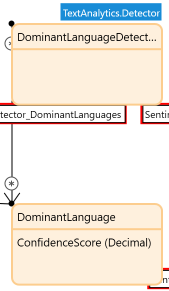
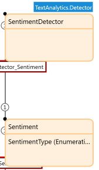
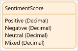
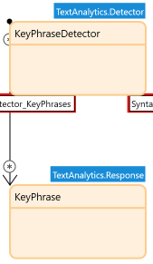
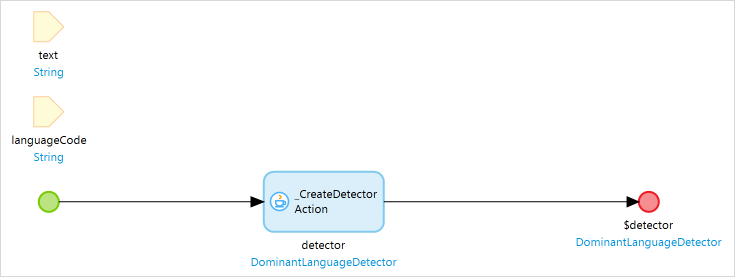
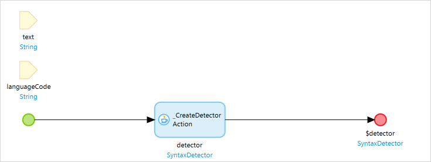
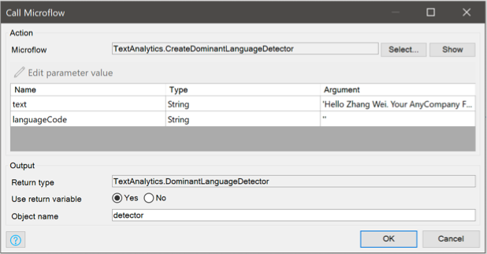
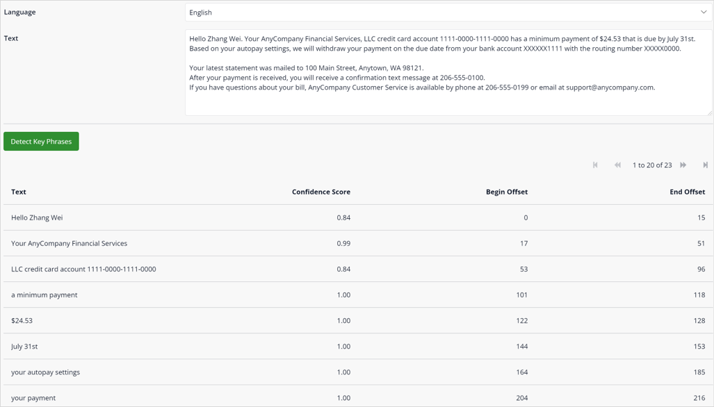
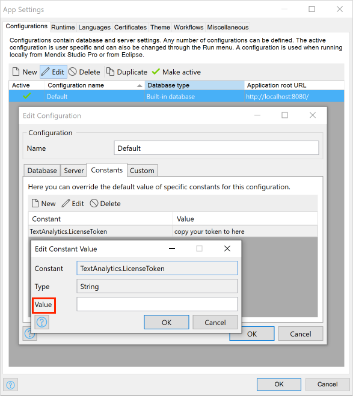
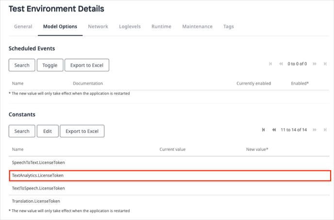

## 1 Introduction

The [Cogniso Text Analytics](https://marketplace.mendix.com/link/component/118593) app service enables you to easily convert voice and audio into written text in your web applications. Powered by machine learning, this app service can find insights and relationships in text, identify the language of the text, extract key phrases, places, people, brands, or events; understand how positive or negative the text is, analyze text using tokenization and parts of speech, and automatically organize a collection of text files by topic. 

With this app service, you do not have to build a text analytics application from scratch. All you need to do is drag and drop items and configure them.

Here is an overview of what the CognisoTextAnalytics contains:

* [Predefined entities](#predefined-entities)
	* Detector
	* Language
	* Response
	* DominantLanguageDetector
	* DominantLanguage
	* SentimentDetector
	* Sentiment
	* SentimentScore
	* EntityDetector
	* Entity
	* PiiEntityDetector
	* PiiEntity
	* KeyPhraseDetector
	* KeyPhrase
	* SyntaxDetector
	* SyntaxToken
* [Constants](#constants)
	* LicenseToken
	* TokenEndpoint
* [Enumeration](#enumeration)
	* EntityType
	* PartOfSpeechTag
	* PiiEntityType
	* SentimentType
* [Microflow](#microflow) 
  * BatchTranscription
  * StartService
* [Nanoflow](#nanoflow)
* [Java action](#java-action)
* [Widgets](#widgets)

In most cases, you will only need what is contained in the **TextAnalytics** > **USE_ME** folder. The content in the **TextAnalytics** > **Internal** folder is for internal use only and you will not need it.

### 1.1 Typical Use Cases

You can use this app service on Mendix cloud to easily identify the language of the text, extract key phrases, places, people, brands, or events, understand how positive or negative the text is, analyze text using tokenization and parts of speech, and automatically organize a collection of text files by topics in your Mendix applications.

### 1.2 Features

This app service enables doing the following:

* Key phrase detection based on text
* Sentiment detection based on text
* Language detection based on text
* Entity detection based on text, such as organizations, locations, dates, and persons
* Syntax detection based on text
* Personally Identifiable Information (PII) detection based on text

### 1.3 Prerequisites

This app service can only be used with Studio Pro 9 versions starting with [9.4.0](/releasenotes/studio-pro/9.4).

## 2 Installation

1. Go to the [Cogniso Text Analytics](https://marketplace.mendix.com/link/component/118593) component page in the Marketplace and download the *CognisoTextAnalytics.mpk* file.

2. To add the Cogniso Speech to Text app service to your app in Mendix Studio Pro, follow these steps:

   1. In the **App Explorer**, right-click the app.

   2. Click **Import module package** and then select *CognisoTextAnalytics.mpk*. 

   3. In the **Import Module** dialog box, **Add as a new module** is the default option when the module is being downloaded for the first time, which means that new entities will be created in your project.

      

      {}If you have made any edits or customization to a module that you have already downloaded, be aware of the **Replace existing module** option. This will override all of your changes with the standard App Store content, which will result in the creation of new entities and attributes, the deletion of renamed entities and attributes, and the deletion of their respective tables and columns represented in the database. Therefore, unless you understand the implications of your changes and you will not update your content in the future, making edits to the downloaded modules is not recommended.{}

   4. In the **Import Module** dialog box, click **Import**. 

   5. Wait until a pop-up box states that the module was successfully imported. Click **OK**.

   6. Open the **App Explorer**  to view the **CognisoTextAnalytics** module. You can also find the app service in the **Cognitive AI widgets** category in the **Toolbox**.

3. After importing, you need to map the **Administrator** and **User** module roles of the installed modules to the applicable user roles in your app.

You have successfully added the Cogniso Speech To Text resources to your app.

## 3 Configuration

### 3.1 Predefined Entities {#predefined-entities}

The **DominantLanguage** entity is an entity referenced from **DominantLanguageDetector** and **Language** that incorporates all the information of supported dominant language object to help you get confident score of dominant language from given text.

| Attribute | Data Type |Description |
| --- | --- |--|
| `ConfidenceScore` | Decimal |The confident score of dominant language. |

The **Language** entity is a conceptual entity that incorporates all the information of supported language object. You can choose to inherit from this entity, set an association to the entity, or copy this entity to your module.

| Attribute | Data Type |Description |
| --- | --- |--|
| `Name` | String | The name of the language. |
| `Code` | String |The code of the language. |

The **Detector** entity is a conceptual entity that incorporates all the information of supported detector object. You can choose to inherit from this entity, set an association to the entity, or copy this entity to your module.

| Attribute | Data Type |Description |
| --- | --- |--|
| `InputText` | String |The input text of target detector. |

The **Sentiment** entity is an entity referenced from **SentimentDetector** and **SentimentScore** that incorporates all the information of supported sentiment object to help you perform sentiment analysis from given text.

| Attribute | Data Type |Description |
| --- | --- |--|
| `SentimentType` | Enumeration | The customized sentiment type enumeration. |

The **SentimentScore** entity is an conceptual entity that incorporates all the information of supported level of confidence of sentiment score detector object.

| Attribute | Data Type |Description |
| --- | --- |--|
| `Positive` | Decimal |The level of confidence that The detector has in the accuracy of its detection of the POSITIVE sentiment. |
| `Negative` | Decimal | The level of confidence that The detector has in the accuracy of its detection of the NEGATIVE sentiment. |
| `Neutral` | Decimal |The level of confidence that The detector has in the accuracy of its detection of the NEUTRAL sentiment. |
| `Mixed` | Decimal |The level of confidence that the detector has in the accuracy of its detection of the MIXED sentiment. |

The **Entity** entity is a conceptual entity that inherit from **TextAnalytics.Response** entity and referenced from **EntityDetector** that incorporates all the information of supported entity object to help you perform entity detection from given text.

| Attribute | Data Type |Description |
| --- | --- |--|
| `EntityType` | Enumeration |The customized entity type. |

The **PiiEntity** entity is a conceptual entity that inherit from **TextAnalytics.Response** entity and referenced from **PiiEntityDetector** that incorporates all the information of supported PII entity object to help you perform PII entity detection from given text.

| Attribute | Data Type |Description |
| --- | --- |--|
| `PiiEntityType` | Enumeration | The customized PII entity type. |

The **KeyPhrase** entity is a conceptual entity that inherit from **TextAnalytics.Response** entity and referenced from **KeyPhraseDetector** that incorporates all the information of supported key phrase object to help you perform key phrase detection from given text.

The **SyntaxToken** entity is a conceptual entity that inherit from **TextAnalytics.Response** entity and referenced from **SyntaxDetector** that incorporates all the information of supported syntax token object to help you perform syntax token extraction from given text.

| Attribute | Data Type |Description |
| --- | --- |--|
| `Index` | |The index of the token |
| `PartOfSpeech` | |The part of speech tag enumeration for the token. |

The **Response** entity is an conceptual entity that incorporates all the information of supported response data object. You can choose to inherit from this entity, set an association to the entity, or copy this entity to your module.

| Attribute | Data Type |Description |
| --- | --- |--|
| `Text` | String | The word that was recognized in the source text. |
| `BeginOffset` | Integer |The zero-based offset from the beginning of the source text to the first character in the word. |
| `EndOffset` | Integer |The zero-based offset from the beginning of the source text to the last character in the word. |
| `ConfidenceScore` | Decimal |The level of confidence that TextAnalytics module has in the accuracy of the detection. |

### 3.2 Constants {#constants}

The **LicenseToken** constant is used to provide a valid CognisoTextAnalytics license token for the app that uses CognisoTextAnalytics to be successfully deployed to [Mendix Licensed Cloud Node](/developerportal/deploy/mendix-cloud-deploy) or your own environment. As CognisoTextAnalytics is a commercial product and subject to a subscription fee, to be able to use the CognisoTextAnalytics functionalities in a deployed app, you will need a valid license token, and you need to set the value of the **LicenseToken** constant to that license token in the deployment environment setting.

However, if you only plan to try how CognisoTextAnalytics works  (meaning, build and run an app that uses CognisoTextAnalytics locally in Studio Pro or deploy to a Mendix Free App environment), you do not need to subscribe to get a license token. Therefore, you do not need to set a value for the **LicenseToken** constant, just leave it empty.

For details on how to get a license token, see the [Obtaining a LicenseToken to Deploy Your App](#obtain) section below.

The **TokenEndpoint** constant is used to provide a valid endpoint of security token service for cognitive speech to text service backend authentication. The constant comes with default value which point to the production environment of deployed security token service. The security token service issue security tokens that authenticate user's identity. 

### 3.3 Microflow {#microflow}

The **CreateDominantLanguageDetector** microflow takes **text** (String) and **languageCode** (String) as input parameters to create DominantLanguageDetector as a return object from back-end service.

The **CreateEntityDetector** microflow takes **text** (String) and **languageCode** (String) as input parameters to create CreateEntityDetector as a return object from backend service.

The **CreateKeyPhraseDetector** microflow takes  **text** (String) and **languageCode** (String) as input parameters to create CreateKeyPhraseDetector as return object from backend service.

The **CreatePiiEntityDetector** microflow takes **text** (String) and **languageCode** (String) as input parameters to create CreatePiiEntityDetector as a return object from backend service.

The **CreateSentimentDetector** microflow takes **text** (String) and **languageCode** (String) as input parameters to create CreateSentimentDetector as return object from backend service.

The **CreateSyntaxDetector** microflow takes **text** (String) and **languageCode** (String) as input parameters to create CreateSyntaxDetector as return object from backend service.

### 3.4 Nanoflow {#nanoflow}

The **DetectDominantLanguage** nanoflow takes the **languageDetector** object as an input parameter to get a list of dominant languages.

The **DetectEntities** nanoflow takes the **entityDetector** object as an input parameter to get a list of entities.

The **DetectKeyPhrases** nanoflow takes the **keyPhrasesDetector** object as an input parameter to get a list of key phrases.

The **DetectPiiEntities** nanoflow takes the **piiEntitiesDetector** object as an input parameter to get a list of PII entities.

The **DetectSentiment** nanoflow takes the **sentimentDetector** object as an input parameter to get a sentiment object.

The **DetectSyntax** nanoflow takes the **syntaxDetector** object as an input parameter to get a list of syntax tokens.

### 3.5 Enumeration {#enumeration}

The **SentimentType** is an enumeration that incorporates all the information of supported sentiment type.

| Caption | Name |
| --- | --- |
| Positive | Positive |
| Negative | Negative |
| Neutral | Neutral |
| Mixed | Mixed |

The **EntityType** is an enumeration that incorporates all the information of supported entity type.

| Caption | Name |
| --- | --- |
| Person | Positive |
| Location | Negative |
| Organization | Neutral |
| Commerical Item | Mixed |
| Event | Positive |
| Date | Negative |
| Quantity | Neutral |
| Title | Mixed |
| Other | Mixed |

The **PartOfSpeechTag** is an enumeration that incorporates all the supported part of speech tags.

| Caption | Name |
| --- | --- |
| Adjective | Adjective |
| Adposition | Adposition |
| Adverb | Adverb |
| Auxiliary | Auxiliary |
| Conjunction | Conjunction |
| Determiner | Determiner |
| Interjection | Interjection |
| Noun | Noun |
| Numeral | Numeral |
| Particle | Particle |
| Pronoun | Pronoun |
| Proper Noun | Proper_Noun |
| Punctuation | Punctuation |
| Subordinating Conjunction | Subordinating_Conjunction |
| Symbol | Symbol |
| Verb | Verb |
| Other | Other |

The **PiiEntityType** is an enumeration that incorporates all the information of supported Personally Identifiable Information (PII) types.

| Caption | Name |
| --- | --- |
| Bank Account Number | Bank_Account_Number |
| Bank Routing | Bank_Routing |
| Credit Debit Number | Credit_Debit_Number |
| Credit Debit CVV | Credit_Debit_CVV |
| Credit Debit Expiry | Credit_Debit_Expiry |
| Pin | Pin |
| Email | Email |
| Address | Address |
| Name | Name |
| Phone | Phone |
| SSN | SSN |
| Date Time | Date_Time |
| Passport Number | Passport_Number |
| Driver ID | Driver_Id |
| URL | URL |
| Age | Age |
| User Name | User_Name |
| Password | Password |
| IP Address | IP_Address |
| MAC Address | MAC_Address |
| All | All |

## 4 Using Cogniso Text Analytics

Cogniso Text Analytics provides actions that enables you to easily identify the language of the text, extract key phrases, understand how positive or negative the text is, and analyze text using tokenization and parts of speech.

When you start from a blank app template in Mendix Studio Pro, you can follow the steps below to setup customizable text analytic actions quickly.

### 4.1 Performing Language Detection in Your Browser

Use the **CreateDominantLanguageDetector** microflow and **DetectDominantLanguage** nanoflow to perform language detection. Follow these steps to configure the language detectection:
1. Create a nanoflow as follows:
   1. Name the nanoflow *CreateDominantLanguageDetector*.
   2. Add the **CreateDominantLanguageDetector** microflow from the **TextToSpeech** > **USE_ME** folder to the nanoflow.
   3. Double-click the **CreateDominantLanguageDetector** microflow in the nanoflow, change the settings as shown in the screenshot below, and click **OK**.

      

   4. Right-click the create object activity and select **Set $detector as return value** in the pop-up menu.

      

2. From the **Toolbox**, add a Data View widget to your page.
3. Double-click the Data Viewer widget and for **Data source**, set **Nanoflow** as the **CreateDominantLanguageDetector** nanoflow, and click **OK**.
4. Add a Text Area widget and change the following settings:
   1. Double-click the Text Area widget to open the **Edit Text Area** dialog box.
   2. For **Data source**, Select the **InputText** attribute from the data view.
   3. For **Label caption**, enter *Text*.
5. Add a Button widget and change the following settings:
   1. Name the button *Detect Dominant Language*.
   2. Double-click the button to open the **Action Button** dialog box.
   3. In the **Event** section, set **On click** to **Call a nanoflow** and set **Nanoflow** to **DetectDominantLanguage** .
6. Place a templateGrid, set *Association* as data source type, set *DominantLanguage* as entity path.
7.  Run your app locally. You can now perform language detection directly in the browser:

    

### 4.2 Performing sentiment detection in Your Browser

From the **CreateSentimentDetector** microflow and **DetectSentiment** nanoflow to perform sentiment detection.

Follow these steps to configure this sentiment detect action:
1. Place a new data view on the page.
2. Create a nanoflow, call it *CreateSentimentDetector*, and set this as the data source of the data view.
3. Place a textArea and set inputText of data view object as the data source.
3. Place a reference selector and set name of language entity from association as the data source.
4. Place a button, call it *Detect Sentiment*, and set nanoflow **DetectSentiment** as the action of events.
5. Place a data view, and set *Sentiment* from association as the data source
5. Place another data view inside of previous one, and set *SentimentScore* from association as the data source
6. Run your app locally. You can now perform sentiment detection directly in the browser:

### 4.3 Performing key phrase detection in Your Browser

From the **CreateKeyPhraseDetector** microflow and **DetectKeyPhrases** nanoflow to perform key phrase detection.

Follow these steps to configure this key phrase detect action:
1. Place a new data view on the page.
2. Create a nanoflow, call it *CreateKeyPhraseDetector*, and set this as the data source of the data view.
3. Place a textArea and set inputText of data view object as the data source.
4. Place a button, call it *Detect Key Phrases*, and set nanoflow **DetectKeyPhrases** as the action of events.
5. Place a grid, set *Association* as data source type, set *KeyPhrase* as entity path
6. Run your app locally. You can now perform key phrase detection directly in the browser:

### 4.4 Performing entity detection in Your Browser

From the **CreateEntityDetector** microflow and **DetectEntities** nanoflow to perform entity detection.

Follow these steps to configure this entity detect action:
1. Place a new data view on the page.
2. Create a nanoflow, call it *CreateEntityDetector*, and set this as the data source of the data view.
3. Place a textArea and set inputText of data view object as the data source.
4. Place a button, call it *Detect Entities*, and set nanoflow **DetectEntities** as the action of events.
5. Place a grid, set *Association* as data source type, set *Entity* as entity path
6. Run your app locally. You can now perform entity detection directly in the browser:

### 4.5 Performing PII entity detection in Your Browser

From the **CreatePiiEntityDetector** microflow and **DetectPiiEntities** nanoflow to perform PII entity detection.

Follow these steps to configure this PII entity detect action:
1. Place a new data view on the page.
2. Create a nanoflow, call it *CreatePiiEntityDetector*, and set this as the data source of the data view.
3. Place a textArea and set inputText of data view object as the data source.
4. Place a button, call it *Detect PII Entities*, and set nanoflow **DetectPiiEntities** as the action of events.
5. Place a grid, set *Association* as data source type, set *Entity* as entity path
6. Run your app locally. You can now perform PII entity detection directly in the browser:

### 4.6 Performing syntax detection in Your Browser

From the **CreateSyntaxDetector** microflow and **DetectSyntax** nanoflow to perform syntax detection.

Follow these steps to configure this syntax detect action:
1. Place a new data view on the page.
2. Create a nanoflow, call it *CreateSyntaxDetector*, and set this as the data source of the data view.
3. Place a textArea and set inputText of data view object as the data source.
4. Place a button, call it *Detect Syntax*, and set nanoflow **DetectSyntax** as the action of events.
5. Place a grid, set *Association* as data source type, set *SyntaxToken* as entity path
6. Run your app locally. You can now perform syntax detection directly in the browser:

## 5 Obtaining a LicenseToken to Deploy Your App {#obtain}

Cogniso Text Analytics is a premium Mendix product that is subject to a purchase and subscription fee. To successfully use this product in an app, you need to provide a valid **LicenseToken** as an environment variable in the deployment setting; otherwise, the Cognitive AI service features may not work in your app.

### 5.1 Obtaining a LicenseToken with trial version

When you just need to run your app with Cogniso Text Analytics locally or deploy as a Mendix Free App for testing and trial purposes, you will need a trial version of LicenseToken.

To receive information on how to get the license token for [Cogniso Text Analytics](https://marketplace.mendix.com/link/component/118593) trial version, contact [Mendix Support](https://support.mendix.com/hc/en-us) and raise a ticket for Cognitive AI development team.

### 5.2  Subscribing to Get a LicenseToken

To receive information on how to get the license token for [Cogniso Text Analytics](https://marketplace.mendix.com/link/component/118593) trial version, contact [Mendix Support](https://support.mendix.com/hc/en-us) and raise a ticket for Cognitive AI development team.

### 5.2 Configuring a LicenseToken for App Deployment

#### 5.2.1 Configuring the LicenseToken in Studio Pro

1. In the App Explorer, go to **Settings** to open the [App Settings](/refguide/project-settings) dialog box.
2. On the **Configurations** tab, click **Edit** to open the **Edit Configuration** dialog box.
3. On the **Constants** tab, create a new constant with the predefined constant **TextAnalytics.LicenseToken**.
4. Fill in the **Value** with your obtained LicenseToken.
5.  Click **OK** to confirm the settings.

    

6. When you finish building the app, click **Run** to deploy your app to the cloud.

#### 5.2.2 Configuring the LicenseToken in Developer Portal

Alternatively, you can add or update LicenseToken as a constant in the [Developer Portal](/developerportal/deploy/environments-details).

Before you deploy your app, configure the app **Constants** in the deployment package

If you have already deployed your app, change the existing **LicenseToken** constant value on the **Model Options** tab and restart the app:

