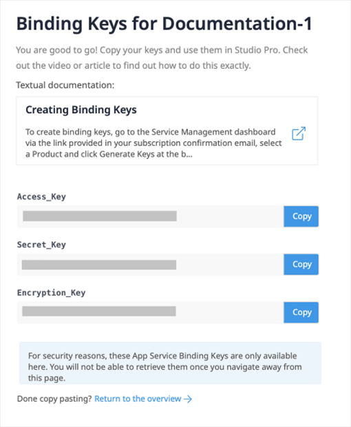
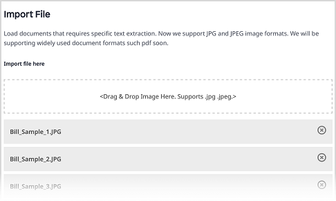
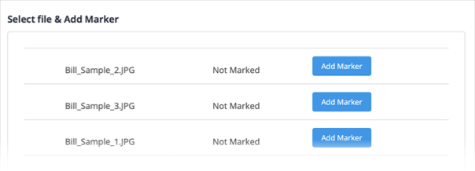
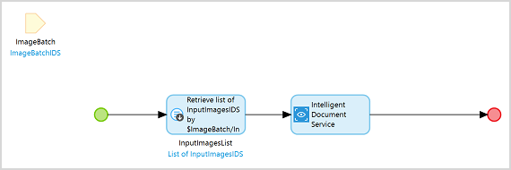

## 1 Introduction

The [Intelligent Document Service](https://marketplace.mendix.com/link/component/118388) app service uses AI and OCR
technologies powered by **ABBYY&reg;** to extract text and key value pairs from documents.

To use it, you need to include the **Intelligent Document Service** activity in your microflow. This activity expects a
trained model input, which you create using the Document Model Training app. For more information, see the
section [Training a Model](#document-model-training).

### 1.1 Features

* Extract data from images in bulk and map data to entities
* Train a model using sample images by marking specific areas in images
* The app service works with [Mendix SSO](/appstore/modules/mendix-sso)

### 1.2 Limitation

* Only images in JPG and JPEG formats are supported

### 1.3 Prerequisites

This app service best works with Studio Pro 8 starting with [8.18.5](/releasenotes/studio-pro/8.18#8185) and 9 versions
starting with [9.2](/releasenotes/studio-pro/9.2).

## 2 Installation

* Go to [Marketplace](https://marketplace.mendix.com/link/component/118388) and download _mpk_ file for **Intelligent
  Document Service**

* To add the Intelligent Document Service to your app in Mendix Studio Pro, follow these steps:

  * In the **App Explorer / Project Explorer**, right-click the app, click **Import module package**, and then select
    *IntelligentDocService.mpk*

    

    In the **Import Module** dialog box, **Add as a new module** is the default option when the module is being downloaded for the first time, which means that new entities will be created in your app.

    {}If you have made any edits or customization to a module that you have already downloaded, be aware of the **Replace existing module** option. This will override all of your changes with the standard App Store content, which will result in the creation of new entities and attributes, the deletion of renamed entities and attributes, and the deletion of their respective tables and columns represented in the database. Therefore, unless you understand the implications of your changes and you will not update your content in the future, making edits to the downloaded modules is not recommended.{}

  * In the **Import Module** dialog box, click **Import**.

  * Wait until a pop-up window states that the module was successfully imported. Click **OK**.

  * Open the **App Explorer / Project Explorer** to view the **IntelligentDocService** module.

Once imported, the app service is visible in the **App Explorer / Project Explorer** and in the **Document Data Capture Service** category in the **Toolbox**.

## 3 Configuration

Intelligent Document Service is a premium Mendix product that is subject to a purchase and subscription fee. To successfully deploy an app that uses Intelligent Document Service, you need to get a valid combination of certain keys and configure them as constants in the module.

### 3.1  Subscribing to Get Keys

* On the [Intelligent Document Service](https://marketplace.mendix.com/link/component/118388) page, click **Subscribe** to order a subscription.

* Fill in the [Technical Contact](/developerportal/collaborate/app-roles#technical-contact) information (**First Name**, **Last Name**, **Email Address**), billing account information, and other required information, and then place the order. The Technical Contact receives an order confirmation email.

* Click the link in the order confirmation email to go to the Marketplace [Subscriptions](/appstore/general/app-store-overview#subscriptions) page and log in there. The **Subscriptions** page gives an overview of all the subscriptions of your organization.

* Click **Intelligent Document Service** to open the subscription details page.

* Click **Create Binding Keys**.

* Enter a meaningful name for the binding keys. Make sure that the name includes the name of the app which uses Intelligent Document Service.

* Click **Create Keys** to generate the **Access_Key**, **Secret_Key** and **Encryption_Key**.

The system generates **Access_Key**, **Secret_Key** and **Encryption_Key**.

{}Once you close this page, you will not be able to retrieve the keys again.{}

* **Copy** the **Access_Key**, **Secret_Key** and **Encryption_Key**. You will use them later for app deployment.

### 3.2 Configuring Keys for Application Deployment

* In the **App Explorer / Project Explorer**, go to **IntelligentDocService** > **Configurations**. You can see **Access_Key**, **Secret_Key** and **Encryption_Key** are defined as constants.

  

* Double-click on each constant and and enter the respective keys.

* Click **OK** to save the settings.

## 4. Usage

To make most out of **Intelligent Document Service**, firstly create trained model using Document Model Training app. [Train a model](#document-model-training)  using sample images by marking specific areas in images.
Next include the Intelligent Document Service activity in your microflow, which will accept a trained model input, images to extract and [extract the data](#extraction-activity) from images in bulk and [map the data](#mapping-file) to entities.

### 4.1 Training a Document Model {#document-model-training}

* Open the **Document Model Training** application. Get the URL from the [Service Dashboard](https://marketplace.mendix.com/link/component/118388) page.

* Login in to the app using your **Mendix Account**.

* Click **Environment** to show the **Existing Models** list.

  

  {} Model status should be **COMPLETED** to use its **Model Id**. {}

* To create and train a new model, click **Create New Model** on the page.
  The **Create New Model** dialog window opens.

  

* Enter a unique **Model Name**, select a **Language**, and then click **Create Model**.

  Wait until **Import File** page opens.

* Drag sample images in JPG or JPEG format into the box where it says **Drag & Drop Image Here**.

  

* Click **Next**. The **Add Marker and IDs** page opens. The status of the images you imported is **Not Marked**.

  

* To mark an image, perform the following steps:

  

  1. Click **Add Markers**. The **Mark Document** dialog window opens.
  2. On the left side, select an area in the image where text is expected.
  3. On the right side, enter a **Marker ID** that is used for the area that you select.
  4. Select the **Marker Type**. It can be **Text** or **Checkmark**.
  5. Click **Add Marker** to add the marker to the list of **Markers**.
  6. To delete a marker from the **Markers** list, select the marker and click the delete icon on top of the list.
  7. When you make all the markers for this image, click on **Done** to close the **Mark Document** dialog window. The status of the images
     becomes **Marked**.

  
  8. Repeat the step above until you mark all the images. and Click **Publish**. The new model appears in the **Existing Models** list with the status **IN PROGRESS**.

Once the **Status** of the model becomes **COMPLETED**, the model is ready to
use.

### 4.2 Getting a JSON Mapping File {#mapping-file}

* Open the **Document Model Training** app.

* Login in to the app using your **Mendix Account**.

* Click **Environment** to show the **Existing Models** list.

* Select a model that has the status **COMPLETED**.

* Click **JSON Mapping File**. The **Generate JSON Mapping File** dialog window opens.

* Drag sample images into the box where it says **Drag & Drop Image Here**.

* Click **Download** to get the JSON file.

* Use this JSON file to create [JSON Mapping](/refguide8/mapping-documents) which will be used in [Intelligent Document Activity](#extraction-activity)

  * From **App Explorer / Project Explorer**, Create **[JSON structure](/refguide8/json-structures)**. Use JSON file and convert schema structure to be used by Import Mapping.
    

  * From **App Explorer / Project Explorer**, Create [Import Mapping](/refguide8/mapping-documents#2-import-mappings). Map created above with JSON structure with entity.
    

* Copy the **Model Id** and use it in the  [Intelligent Document Activity](#extraction-activity).

### 4.3 Extracting the data using Trained Document Model {#extraction-activity}

* Drag and drop **Intelligent Document Service** activity to your microflow from the **Document Data Capture Service** category in the **Toolbox**.

  

* Images to be extracted should be passed as a list. As shown in above image, create list of image inherits from `System.Image`.

* Double-click the **Intelligent Document Service** activity to open the dialog window.

  

* Click **Edit** to enter the **Model Id** of your model.

  {} After the training of a model is **COMPLETED** in the Document Model Training app, you can use its **Model Id**. For more information, see the section [Training a Document Model](#document-model-training). {}

* Click **Edit** to Select an **Image List** which is list of images inherits from `System.Image`.

* In the **Mapping** field, **Select** a **[JSON Mapping](/refguide8/mapping-documents)** file to define how extracted data is mapped.

  {} For details on how to get the JSON mapping file and create Imoprt Mapping, see [Getting a JSON Mapping File](#mapping-file). {}

* Click **OK** to save the changes and close the dialog window.

### 4.4 Checking Statistics Using the Service Dashboard

The **Usage** dashboard shows the real-time statistics about the usage of an app service.
Log into the Marketplace. Go to **My Marketplace** to find Service Dashboard. More info at  [Subscriptions](/appstore/general/app-store-overview#subscriptions)
