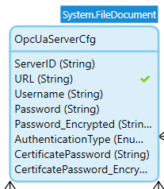

{}[Check answers to all information with multiple question marks ??????????]{}

## 1 Introduction

The [OPC UA Client connector](https://appstore.home.mendix.com/link/app/114874/) connector allows you to connect your Mendix application to [OPC](https://opcfoundation.org/) enabled servers using the functionality of [OPC UA](https://opcfoundation.org/about/opc-technologies/opc-ua/). The connector allows you to read from, write to, and subscribe to OPC UA servers.

OPC is the platform-independent, multi-vendor interoperability standard for the secure and reliable exchange of data in the industrial automation space and in other industries. The OPC Unified Architecture (OPC UA) is an architecture that integrates all the OPC specifications into one extensible framework.

This module uses the [Eclipse Milo library](https://github.com/eclipse/milo) an open-source implementation of OPC UA, and has been tested with the [Prosys OPC UA server](https://www.prosysopc.com/).

There is a sample module, [OPC UA Client example implementation](https://appstore.home.mendix.com/link/app/114876/), which gives an example of how the connector can be used.

### 1.1 Features

#### 1.1.1 Actions

The OPC UA Client connector supports the following actions

* Browse: – browse a list of nodes
* Read: – reads the value of a node
* Subscribe: – to receive data from a node
* Unsubscribe: – stop receiving updates from a node
* Write: – write data to a node

#### 1.1.2 Security 

The OPC UA Client connector supports all three security options offered by OPC UA:

* None
* Credentials
* Client certificates

#### 1.1.3 Dependencies

The OPC UA Client connector has the following dependencies

* Mendix 8.8.1 or higher
* An OPC UA server – we assume that you are familiar with OPC UA and your OPC UA server(s), these instructions do not include information on how to set up your servers.

## 2 Installation

Import the [OPC UA Client connector](https://appstore.home.mendix.com/link/app/114874/) module into your app. Instructions for doing this are in [How to Use App Store Content in Studio Pro](/appstore/general/app-store-content).

You will see the new module in the **App Store modules** section of the **Project Explorer**.

{}

{}

When you edit a microflow, you will also see five additional actions in the **Toolbox**.

{}

{}

This is all you need to do to use the connector. However, there is also a sample module, [OPC UA Client example implementation](https://appstore.home.mendix.com/link/app/114876/), which gives an example of how the connector can be used. If you want to look at the sample implementation described in [OPC UA Client example implementation](#example-implementation) you will need to import this into your app in addition to the OPC UA Client connector.

## 3 OPC UA Client connector

### 3.1 Client State

The module/app is designed for usage with multiple servers if necessary. The state for each OPC UA server is kept by the client in an object of entity type **OpcUaServerCfg**. This  needs to be populated before the actions of the OPC UA client connector can be used. 

{}

{}

For each OPC UA server, the following information will need to be stored in a OpcUaServerCfg object.

* ServerID (String) – ?????????? (differentiate different servers with same URL?)
* URL (String) – the URL of the OPC UA server
* Username (String) – the username used if the authentication type is `CREDENTIALS`
* Password (String) – the password for the username used if the authentication type is `CREDENTIALS`
* AuthenticationType (Enumeration) – the type of authentication required for this server: `NONE`, `CREDENTIALS`, or `CERTIFICATE`
* CertificatePassword (String) – the certificate password required when using the `CERTIFICATE` type of authentication
* CertifcatePasswordEncrypted (String) – ???????????????
* Result (String) – the latest result from an action which makes a call to the OPC UA server
* ValueToWrite (String) – the value to write to the OPC UA server when using the **Write** action
* Namespacelndex (Integer) – the index an OPC UA server uses for a namespace URI
* Identifier (String) – the identifier for a node in the address space of an OPC UA server — the OPC UA client connector only supports identifiers with *IdentifierType* of `String`
* EnableTestMode (Boolean) – ?????????????

You can see an example of how this can be set up in the [OPC UA Client example implementation](#example-implementation) section.

### 3.2 Actions

Once you have set up the server configuration, you can perform the following actions in your microflows.

#### 3.2.1 **Browse** a List of Nodes

#### 3.2.2 **Read** the Value of a Node

#### 3.2.3 **Subscribe** to Updates of Data from a Node

#### 3.2.4 **Unsubscribe** from Updates of Data from a Node

#### 3.2.5 **Write** Data to a Node

## 4 OPC UA Client example implementation{#example-implementation}

Use the OpcUaClient_ExampleImplementation module (link) for a fast start.

This module provides a quick start scenario for starting development with the OpcUaClientMx module. This module is tested with the Prosys OPC UA simulation server. Please keep in mind that the Node data structure may vary between different servers. Adjust your imports accordingly.

 
Dependencies [optional]

    Mx 8.8.1 or higher
    Atlas
    OpcUaClientMx module.
    Any OpcUa server

Configuration

Connect the OpcUaServer_View page to the ‘View server’ button in the OpcUaServerCfg_Overview page
