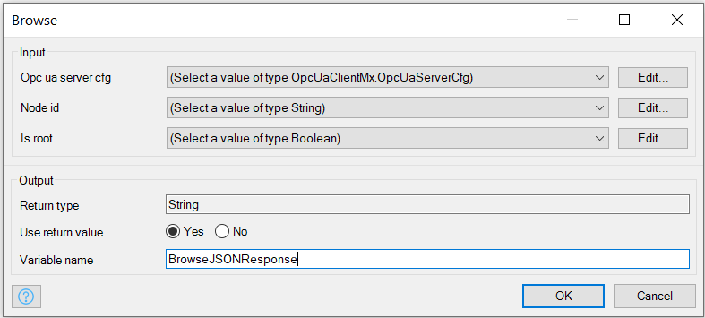
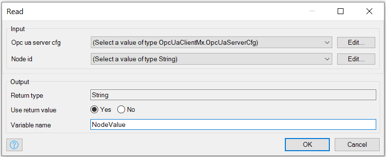
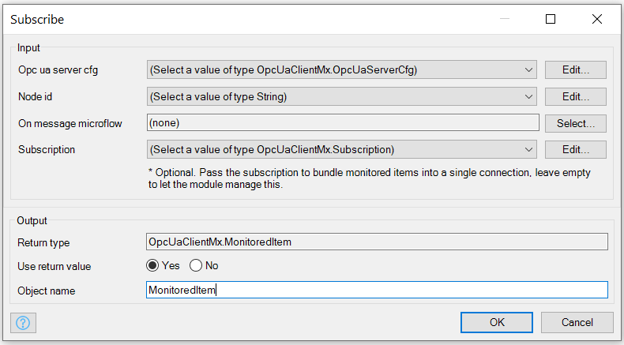
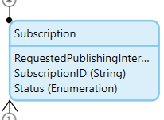
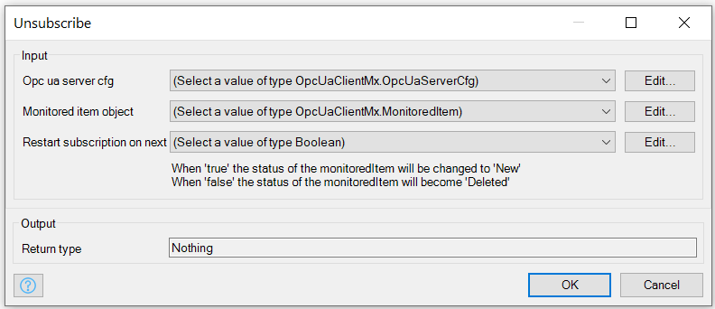
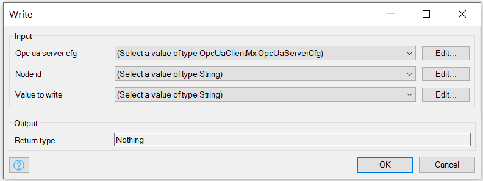

{}[Check answers to all information with multiple question marks ??????????]{}

## 1 Introduction

The [OPC UA Client connector](https://appstore.home.mendix.com/link/app/114874/) connector allows you to connect your Mendix application to [OPC](https://opcfoundation.org/) enabled servers using the functionality of [OPC UA](https://opcfoundation.org/about/opc-technologies/opc-ua/). The connector allows you to read from, write to, and subscribe to OPC UA servers.

OPC is the platform-independent, multi-vendor interoperability standard for the secure and reliable exchange of data in the industrial automation space and in other industries. The OPC Unified Architecture (OPC UA) is an architecture that integrates all the OPC specifications into one extensible framework.

This module uses the [Eclipse Milo library](https://github.com/eclipse/milo) an open-source implementation of OPC UA, and has been tested with the [Prosys OPC UA server](https://www.prosysopc.com/).

There is a sample module, [OPC UA Client example implementation](https://appstore.home.mendix.com/link/app/114876/), which gives an example of how the connector can be used.

### 1.1 Features

#### 1.1.1 Actions

The OPC UA Client connector supports the following actions

* Browse: – browse a list of nodes
* Read: – reads the value of a node
* Subscribe: – to receive data from a node
* Unsubscribe: – stop receiving updates from a node
* Write: – write data to a node

#### 1.1.2 Security 

The OPC UA Client connector supports all three security options offered by OPC UA:

* None
* Credentials
* Client certificates

#### 1.1.3 Dependencies

The OPC UA Client connector has the following dependencies

* Mendix 8.8.1 or higher
* An OPC UA server – we assume that you are familiar with OPC UA and your OPC UA server(s), these instructions do not include information on how to set up your servers.

## 2 Installation

Import the [OPC UA Client connector](https://appstore.home.mendix.com/link/app/114874/) module into your app. Instructions for doing this are in [How to Use App Store Content in Studio Pro](/appstore/general/app-store-content).

You will see the new module in the **App Store modules** section of the **Project Explorer**.

{}

{}

When you edit a microflow, you will also see five additional actions in the **Toolbox**.

{}

{}

This is all you need to do to use the connector. However, there is also a sample module, [OPC UA Client example implementation](https://appstore.home.mendix.com/link/app/114876/), which gives an example of how the connector can be used. If you want to look at the sample implementation described in [OPC UA Client example implementation](#example-implementation) you will need to import this into your app in addition to the OPC UA Client connector.

## 3 OPC UA Client connector

### 3.1 Client State

The module/app is designed for usage with multiple servers if necessary. The state for each OPC UA server is kept by the client in an object of entity type **OpcUaServerCfg**. This  needs to be populated before the actions of the OPC UA client connector can be used. 

{}

{}

For each OPC UA server, the following information will need to be stored in a OpcUaServerCfg object.

* ServerID (String) – a name you give to the server so that you can identify it easily
* URL (String) – the URL of the OPC UA server
* Username (String) – the username used if the authentication type is `CREDENTIALS`
* Password (String) – the password for the username used if the authentication type is `CREDENTIALS`
* AuthenticationType (Enumeration) – the type of authentication required for this server: `NONE`, `CREDENTIALS`, or `CERTIFICATE`
* CertificatePassword (String) – the certificate password required when using the `CERTIFICATE` type of authentication
* CertifcatePasswordEncrypted (String) – ???????????????
* Result (String) – the latest result from an action which makes a call to the OPC UA server
* ValueToWrite (String) – the value to write to the OPC UA server when using the **Write** action
* NamespaceIndex (Integer) – the index an OPC UA server uses for a namespace URI
* Identifier (String) – the identifier for a node in the address space of an OPC UA server — the OPC UA client connector only supports identifiers with *IdentifierType* of `String`
* EnableTestMode (Boolean) – ?????????????

You can see an example of how this can be set up in the [OPC UA Client example implementation](#example-implementation) section.

### 3.2 Actions

Once you have set up the server configuration, you can perform the following actions in your microflows.

#### 3.2.1 **Browse** a List of Nodes

The **Browse** action allows you to browse the nodes within 

* Opc ua server cfg – an object of entity type OpcUaServerCfg containing the configuration of the server to which the request is made
* Namespace index – the index an OPC UA server uses for a namespace URI
* Identifier – the identifier for a node in the address space of an OPC UA server 
* Is root – ?????????
* Use return value – `Yes` creates a variable containing the list of nodes, `No` does not return a variable
* Variable name – the name assigned to the variable containing the return value

#### 3.2.2 **Read** the Value of a Node

* Opc ua server cfg – an object of entity type OpcUaServerCfg containing the configuration of the server to which the request is made
* Namespace index – the index an OPC UA server uses for a namespace URI
* Identifier – the identifier for a node in the address space of an OPC UA server 
* Use return value – `Yes` creates a string variable containing the value read from the node, `No` does not return a variable
* Variable name – the name assigned to the variable containing the return value

{}
All values are read as strings, you will need to convert them if you need a numeric value.
{}

#### 3.2.3 **Subscribe** to Updates of Data from a Node

You can subscribe to receive a notification every time the value of a node changes. This creates an object of type **Subscription** which is associated with the OPC UA service and contains details of the subscription and the item which is being monitored. You should assign a microflow to process the data each time a notification is received. The frequency of the notifications is controlled by the UPC UA server.

* Opc ua server cfg – an object of entity type OpcUaServerCfg containing the configuration of the server to which the request is made
* Namespace index – the index an OPC UA server uses for a namespace URI
* Identifier – the identifier for a node in the address space of an OPC UA server 
* On message microflow – defines a microflow to be run every time a message is received from the subscribed service
* Use return value – `Yes` returns an object of type **Subscription** which defines the new subscription and can be used in the microflow, `No` does not return an object
* Variable name – the name assigned to the variable containing the return value

{}
If you redeploy your app, the subscriptions will no longer receive data from the server and will need to be set up again. ??????????
{}

##### 3.2.3.1 Subscriptions

Information about nodes which are subscribed to is stored in the **Subscription** entity associated with the **OpcUaServerCfg** server configuration entity.

{}

{}

An object is created for each subscription and contains the following information:

SubscriptionID (String) 
Identifier (String) 
NamespaceIndex (String) 
MonitoredItemID (String) 
Active (Boolean) 
OpcUaNodeID (String) 

#### 3.2.4 **Unsubscribe** from Updates of Data from a Node

If you have subscribed to  item change notifications but no longer want to receive the notifications, you need to unsubscribe from them.

* Opc ua server cfg – an object of entity type OpcUaServerCfg containing the configuration of the server to which the request is made
* Subscription ID – the ID of the subscription from which you want to unsubscribe — this is held as the **SubscriptionID** in the **Subscription** entity
* Monitored item ID – the ID of the item which is being monitored by the subscription — this is held as the **MonitoredItemID** in the **Subscription** entity
* Use return value – `Yes` ????? what is the return value, `No` does not return a variable
* Variable name – the name assigned to the variable containing the return value

#### 3.2.5 **Write** Data to a Node

* Opc ua server cfg – an object of entity type OpcUaServerCfg containing the configuration of the server to which the request is made
* Namespace index – the index an OPC UA server uses for a namespace URI
* Identifier – the identifier for a node in the address space of an OPC UA server 
* Value to write – the new value which you want to set for this node
* Use return value – `Yes` creates a variable containing the list of nodes, `No` does not return a variable
* Variable name – the name assigned to the variable containing the return value

### 3.3 Pages

The OPC UA Client connector comes with a number of pages which you can use to manage and test the connection to your server(s).

#### 3.3.1 OpcUaServer_Overview

This page shows a summary of all the servers you have set up in your app and allows you to edit existing servers and set up a new one. For each server you will see the name you have given it, the URL where the server can be reached, and the authentication type.

To use this page, just include it in the navigation for your app, or add an **Open Page** button to an existing page of your app.

From this page, you can perform the following actions:

* Search – search for a particular server in the list of servers
* New server – add a new OPC UA server using the **OpcUaServer_NewEdit** page
* Edit server - change the details of the selected server using the **OpcUaServer_NewEdit** page
* View server – this button is there for adding further functionality — in the default module it calls a microflow which displays a message
* Delete – delete all the information about the selected server — you will be asked for confirmation

#### 3.3.2 OpcUaServer_NewEdit

## 4 OPC UA Client Example Implementation{#example-implementation}

The OPC UA Client example implementation is a sample app based on the [Prosys OPC UA server](https://www.prosysopc.com/). It implements the following functionality:

* Configure one or more OPC UA server connections
* View the nodes on the server
* ?????? 
* Add a subscription to a node
* Remove a subscription

You can use or adapt the OpcUaClient_ExampleImplementation module (link) for a fast start. Bear in mind that the node data structure from your server may be different and adjust your imports accordingly.

{}
If you are adapting the example implementation, it is recommended that you make a copy of the module and add it to your app so that you don't accidentally update the App Store module and overwrite your changes.
{}

### 4.1 Dependencies

* Mx 8.8.1 or higher
* Atlas UI (use, for example, the blank starter app as a basis)
* The OpcUaClientMx module
* Any OPC UA server

### 4.2 Initial Configuration

1. Add the **OpcUaServer_Overview** page in the **OpcUaClientMx** module to the navigation of the app, either through the **Navigation** settings, or by adding an **Open Page** button to a page which is already in the navigation (for example the home page).

2. Connect the **OpcUaServer_View** page in the **OpcUaClient_ExampleImplementation** to the **View server** button on the **OpcUaServer_Overview** page in the **OpcUaClientMx** module.

### 4.3 Pages

The **OpcUaServer_View** page adds functionality to the **View server** button on the server overview page. 
