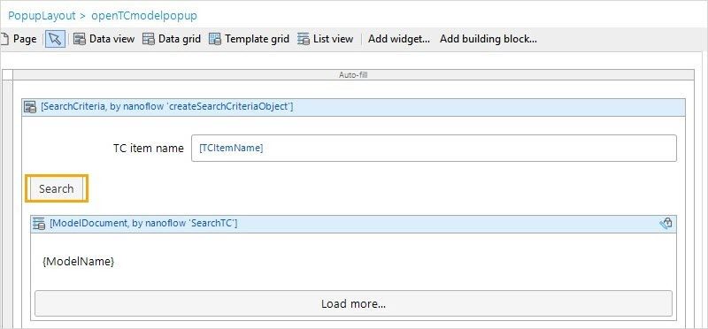
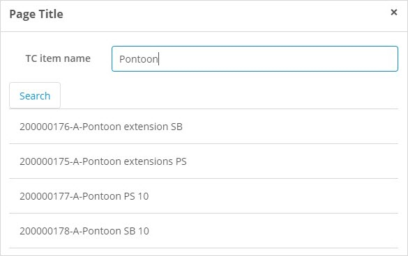
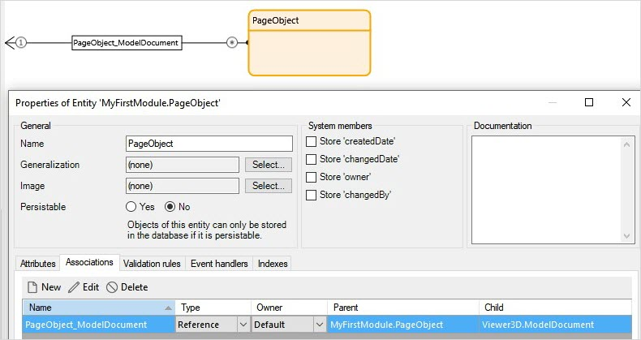
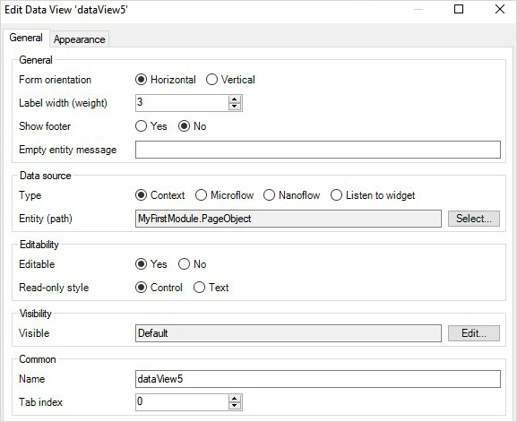
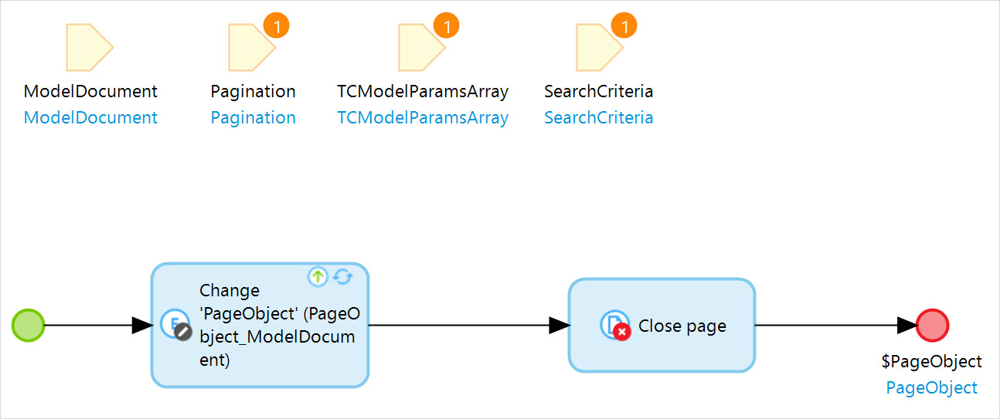
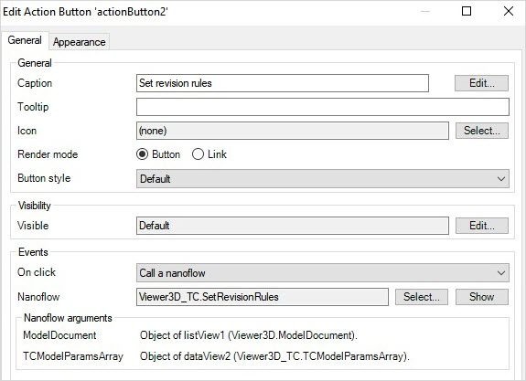

## 1 Introduction

The [3D Viewer For Teamcenter(link currently N/A)](https://appstore.home.mendix.com/link/app114764/) module lets you connect to Teamcenter instance, visualize and operate on 3D JT models. It provides nanoflows, micro-flows that enable you to find and fetch JT model from Teamcenter.

### 1.1 Typical Use Cases

You can use this module to search and fetch JT models that are stored in Teamcenter instance and use 3D Viewer widgets included in [**3D Viewer** (link not available yet)](http:xx) module to visualize the fetched models. Once the model is fetched, you can perform some basic operations such us navigating model product structure tree, PMI Tree, sectioning and much more, which is enabled by **3D Viewer** out-of-the-box tools. Using this **3D Viewer For Teamcenter** module alone won't be enough to visualize the 3D model.

### 1.2 Features

The module enables you to do the following:

- Log in Teamcenter instance
- Search  models from Teamcenter
- Get model by setting Revision Rules
- Visualize and perform operations on model when used with **3D Viewer** module

### 1.3 Dependencies

If you want to visualize models stored in Teamcenter, you will also need to import **Teamcenter Connector** module and **3D Viewer** module:

- [Teamcenter Connector](https://appstore.home.mendix.com/link/app111627/) module v2.1.0  is required for 3DViewer module to connect and load model from Teamcenter.
- [3DViewer module(link currently not available yet)](https://dxxxxx) provides out-of-box widgets and domain model entities needed to visualize a JT model.

### 1.4 Limitations

To visualize model from Teamcenter, limitation is similar to that of **3DViewer**, please refer to [3D Viewer limitations](3d-viewer.md#limitations)

## 2 Prerequisites

Before starting this how-to, make sure you have completed the following prerequisites:

- Have Mendix Studio Pro v8.13.1 or above installed
- A living Teamcenter instance (need `Teamcenter host address`, `Teamcenter FMS url` to configure the Teamcenter instance)
- Teamcenter account, it's better to have both admin user account and non-admin user account.

## 3 Installation

To visualize a model fetched from Teamcenter instance, some modules below are needed. Follow the instructions in [How to Use App Store Content in Studio Pro](https://docs.mendix.com/appstore/general/app-store-content) to import modules into your app.

1. Download and import the [3D Viewer(link N/A yet)](http:xx) module into your app project.
2. Download and import [Teamcenter Connector](https://appstore.home.mendix.com/link/app111627/) module v2.1.0 into your app project
3. Download [3D Viewer For Teamcenter(link currently N/A)](https://appstore.home.mendix.com/link/app114764/) module and import into your app project
4. Map **Administrator** and **User** module role of installed modules to the applicable user roles in your app.

## 4 Configuration

### 4.1 Initializing on App Startup

To automatically start this  module, create a **Startup** microflow, add **Viewer3D/USE_ME/VisServerAction** and **Viewer3D_TC/USE_ME/VisServerAction_TC** java action to the microflow, set return type as Boolean ,value as true. This **Startup** microflow needs to be set as the After Startup microflow (via **Project** >**Settings** > **Server** > **After startup**).

Double click **Visualization Server** java action, make sure **Http endpoint** is set as `@Viewer3D.HttpEndpoint`.

## 6 Using 3D Viewer For Teamcenter

**3DViewer** module provides a set of widgets to visualize JT models and a set of nanoflows, java actions to bring in the data stored in Mendix File Storage. 
**Teamcenter Connector** module provides a full-scale apis for you to interact with Teamcenter instance.  
While **3D Viewer For Teamcenter** acts as intermediate layer in between above 2 modules.  it mainly utilize apis provided by **Teamcenter Connector** and provides nanoflows, java actions, microflows to get JT format model data from Teamcenter instance.  
In conclusion,to visualize and operate on the JT model from 
Teamcenter, use 3D widgets that are included in **3DViewer** module to visualize the data obtained from  **3D Viewer For Teamcenter** is the approach.  

### 6.1 Reuse Teamcenter Login APIs to get access to Teamcenter instance data

To get data from Teamcenter, user needs to be authenticated and authorized. **Teamcenter connector** module provides both Admin Login logic and User login logic for app makers, you can find them in `TcConnector/Published/APIs/Login` folder in the App Store Modules section. Since we are building app to enable user to fetch data from Teamcenter and visualize it in the app. We will need to build a login for user, so that user can enter their Teamcenter username and password to access Teamcenter data.

Follow these steps:

1. Add a **Login** button to a page.
2. Set the **OnClick** action to microflow  `TcConnector/Published/APIs/Login/ExexuteAdminLogin`
3. Run locally, when you click **Login**, you will be shown Teamcenter Admin page where you can add/edit/manage Teamcenter instance that you want to connect to by providing `Teamcenter host address`, `Teamcenter FMS URL` and set it `Active`.

4. Return to `Login`, you will be able to enter your Teamcenter Account to login Teamcenter instance that you configured and set alive.

This is an example Teamcenter Login flow.There are other Teamcenter Login APIs provided in **TcConnector/Published/APIs/Login**, you can choose how to use them based on your need.

### 6.2 Search and get a list of corresponding model from Teamcenter

**SearchTC** nanoflow in **3D Viewer For Teamcenter** module enables you to set search criteria and fetch model list. **SearchTC** nanoflow will first check if an active Teamcenter user session is alive, and then perform the search, so Login is essential before performing the model search. A list of `ModelDocument` objects will be returned as a result of **SearchTC** nanoflow, therefore the **SearchTC** nanoflow can be set as data source of a **ListView** widget. Additionally, by using **3dViewer_TC/USER_ME/SetRevisionRule**, you can apply specific Revision Rules to the search, and get different model data returned.

Follow these steps:

1. Create an **Open TC model** button and add to page.
2. Set **On Click** action of the button to show a pop up page.
3. Add a **ListView** widget to the pop up page, set the Data Source as **Viewer3D_TC/USE_ME/SearchTC**.
4. Wrap **ListView** with a **Data View** widget, as **SearchTC** nanoflow requires a **SearchCriteria** object as input parameter. Create a simple nanoflow **cerateSearchCriteria** which create a default **SearchCriteria** object and returns it as result. Set the Data Source of **Data View** to **cerateSearchCriteria** nanoflow.
5. Add search text box and search button to allow user to type in item name(model name) and perform search.

6. To achieve showing model list on **Search** button click, input parameter of **SearchTC** nanoflow **SearchCriteria** object needs to be updated on button click, so when user type in model name in text box, the model name should be saved to `TCItemName` attribute of **SearchCriteria** object.

and when user click on **Search** button, the change needs to be synchronized for List view widget to refresh the list. 

7. In the console, there's error saying that `Pagination` and `TCModelParamArray` parameters are missing for **SearchTC** nanoflow input, you need to fix this. `Pagination` is an entity defined in **Viewer3D/Domain Model**, by setting values of its attribute, you can get a paginated model list. Now let's just use the default setting, which is all in one page.  
 `TCModelParamArray` is an entity defined in **Viewer3D_TC/Domain Model**, it defines a set of attributes where you can set revision rule  and return different model data based on these revision rules. Now let's just use its default revision rule.  
Since we are missing these two input parameters for **SearchTC** nanoflow, we can wrap it with two **DataView** widgets, with **Data View** have nanoflow that returns `Pagination` object and `TCModelParamArray` object set as data source, respectively.
  
Run locally, Login TC and then Open TC Model pop up, try to type in a item name (model name) and search, you will see a list of model that contain the entered item name.

### 6.3 Open Model from Model list

Now that you are able to get a list of model, you may want to visualize these models, for models to be visualized, it needs 3D widgets that are part of 3D Viewer module.  `ModelDocument` object contains attributes (most importantly, `ModelId` and `Model Source Type`) that are needed to identify and visualize a model in 3D widgets.
As Viewer Widget needs `Model ID` and `Model Source Type` to visualize a model, you will need to pass `ModelDocument` object to the Viewer Widget.

Since you've built a model list pop up, one scenario is to click to select a list item on pop up page, return the **ModelDocument** object to home page to be visualized there.

Follow these steps:

1. Add an entity `PageObject`, associate it with `ModelDocument` entity that is defined in **Viewer3D/Domain Model**.

2. On home page, wrap main area with a **Data view** widget, create a **createPageObject** nanoflow which creates a default `PageObject` object and returns it. Set this nanoflow as data source of the Data View widget.
3. On home page, add another **Data View** widget within previous **Data View** widget, set the data source type of the new Data View widget to `context`, this way you can access to the `ModelDocument` object associated with `PageObject`.

4. Find 3D widgets in toolbox, add to the inner **Data View** widget. Now you can access and set the `ModelId` and `Model Source Type` the Viewer widget needs.
  
5. On Open TC model popup page, add an outmost **Data view** widget, select `context` as its data source type, and select `PageObject`.

6. Create a **OpenSelectedModel** nanoflow and set it as On Click action of List View.  This nanoflow enables update `ModelDocument` associated with `PageObject` and returns updated `PageObject`. Every time user click on a model list item, `PageObject` will be updated, homepage where viewer is in will be updated to newly selected model.

Run locally, you will be able to view the selected model.

There are other ways to visualize a model. Key idea is to pass valid `ModelId` and `Model Source Type` to the **Viewer** widget.

### 6.4  Set custom Revision Rules

**SearchTC** requires a **TCModelParamsArray** object as input parameter, it allows you to set specific revision rules you want to apply to a model and get the model data based on revision rules. If **TCModelParamsArray** is not specifically set, **SearchTC** will execute with default revision rules.

Follow these steps:

1. Add a **Set revision rule** button to list item 
2. Set nanoflow **Viewer3D_TC/USE_ME/SetRevisionRules** as button's On Click action 

Run locally, you will be able to set  revision rule on the selected model and fetch model with needed information.

