## 1 Introduction

The 3D Viewer app service lets you upload, visualize, and operate on 3D JT files in your web applications. The app service contains Java actions, JavaScript actions, domain models, nanoflows, microflows, and a set of 3D widgets that enable you build apps to work with 3D models via the JT format. The app service includes whole functionalities and integrations that can be very helpful when you are building your own 3D applications. All you need to do is drag and drop items and configure them. 

This app service does the heavy-lifting for you so you do not have to build a 3D-rendering engine from scratch.

{}[Add link to component]{}

### 1.1 Typical Use Cases

You can use this app service when you want to upload, store, and visualize 3D JT models in your application. You can perform some basic operations, such us navigating the model product structure tree, the **Product Manufacturing Information** (PMI) tree, and sectioning.

{}[Add cross-reference to PMI section?]{}

### 1.2 Features

This app service enables you to do the following:

* Display 3D model (currently support JT format)
* Quick intuitive controls to navigate a product structure
* Zoom, rotate, fit all, pan
* Ability to turn parts on and off
* Display PMI
* Ability to select and deselect parts
* Display Model Views
* Loading models from Mendix File Storage
* Display part/assembly properties
* Create 3D cross sections
* Examine your model from preset viewing angles
  
### 1.3 Limitations

3D Viewer module includes a few 3D widgets, there are some limitations on how these widgets should be placed:

1. **Container3D** widget acts as a context sharing container for other 3D widgets, therefore every other 3D widgets need to be put inside **Container3D** widget. If 3D widgets are placed outside of **Container3D** widget, developer will see error on **Design Mode**.
2. One **Container3D** widget can only contain one **Viewer** widget. If multiple **Viewer** widgets are placed inside a **Container3D** widget, developer will see error message on **Design Mode**.  

Currently only JT models with version starting from 9 are supported.

## 2 Installation

If your app does not have the **3DViewer** module, it is available from the Mendix App Store [link not available yet](httpt://???).Follow the instructions in [How to Use App Store Content inStudio Pro](https://docs.mendix.com/appstore/generalapp-store-content) to import it into your app.

1. Import the **3DViewer** module into your app project.
2. Map `Administrator` and `User` module role of installed modules to the applicable user roles in your app.

## 4 Configuration

### 4.1 Initializing the 3D Viewer App Service on App Startup

To automatically start this  module, create a **Startup** microflow, add the **Viewer3D/USE_ME/VisServerAction** java action to the microflow, set return type as `Boolean` ,value as `true`.

**Startup** microflow needs to be set as the After Startup step (via **Project** > **Settings** > **Server** > **Afterstartup**).

More details on **After Startup** can be found [here](.project-settings.md#after-startup).

## 5 3D Widgets

These are 3D widgets bundled in this module

| Widget | Description |                                                                                                                                                                                      
| --- | --- |
| Container3D | A special container widget that provides a shared context for other 3D Viewer widgets. |                                                                                                            
| PMI Tree | Provides hierarchical tree display of a model's product manufacturing information, model views and design groups. |                                                                                 
| PS Tree | Provides hierarchical classification of the items which form a product. |                                                                                                                           
| PS Tree Table | A configurable tree table to display model attributes of your choice. |                                                                                                                             
| Sectioning | Allows user to create section cut on the model. |                                                                                                                                                    
| Tool bar item camera mode | Provides ability to control the appearance of surface objects displayed in the view, The option determine whether surface objects are represented on the display by facet geometry, edge geometry. |
| Tool bar item camera orientation | Allows you to view model from different camera orientation. |                                                                                                                                        
| Tool bar item explode slider | The explode slider allows you to create an exploded view of your assembly. |                                                                                                                         
| Tool bar item fit all | Allows user to fit all the model parts in the viewer. |                                                                                                                                           
| Tool bar item render mode | Allows user to toggle between different model render mode. |                                                                                                                                         
| Tool bar item selection mode | Provides capability to select on model part, edge, face,body. |                                                                                                                                     
| Uploader | Enables user to upload their own model to be viewed in browser or the app. |                                                                                                                       
| Viewer | Provides viewing window of your 3D Model when you open a model, zoom, rotate, pan.|                                                                                                                 

## 6 Using 3D Viewer  

3DViewer mainly provides a set of widgets to visualize JT models and a set of nanoflows, java actions to bring in the data.
Given that you start from a blank app template in Mendix Studio Pro, you can follow the instructions below to visualize your local JT model quickly.

### 6.1.1 Uploading & Viewing a 3D JT Model in Your Browser

For **Viewer** widget to visualize a JT model, two data source attributes should be set: `Model ID` and `Model Souce Type`. To enable upload 3D JT model and visualize directly on the page, a set of `ModelID` and `Model source type` should be returned by **Uploader** widget and set to that of **Viewer** widget.  

Follow these steps:

1. Place a **Container3D** widget on a page.
2. Put **Uploader** widget and **Viewer** widget into **Container3D** widget, give them a layout.
3. Set a fixed height of **Viewer** widget. Toggle to Design Mode to see the preview.
4. Create an entity called **UploadedModel** in app module Domain Model.
5. Wrap **Uploader** widget and **Viewer** widget inside a new **DataView** widget.
6. Create a nanoflow **CreatedUploadedModel** and set this as data source of **DataView** widget.
7. Create two attributes for **UploadedModel** entity. Set them to receive value returned from **Uploader**'s `Data source` and `UploadModelId`  respectively.
 
8. Set Data Source attributes of **Viewer** widget: set `Model ID` to `UploadedModelID`and `Model Source Type` to `Mendix`.

9. Set the `Automatically load parts` to `Yes`, which allows to load the model automatically upon successful upload.
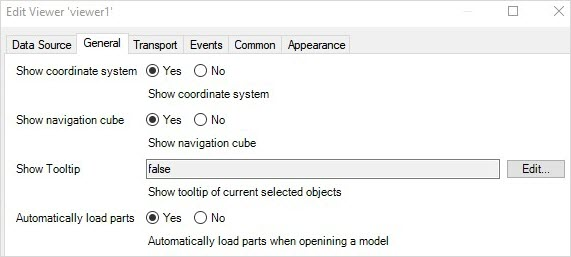
Run Locally, you can now upload JT file and view directly in the browser.
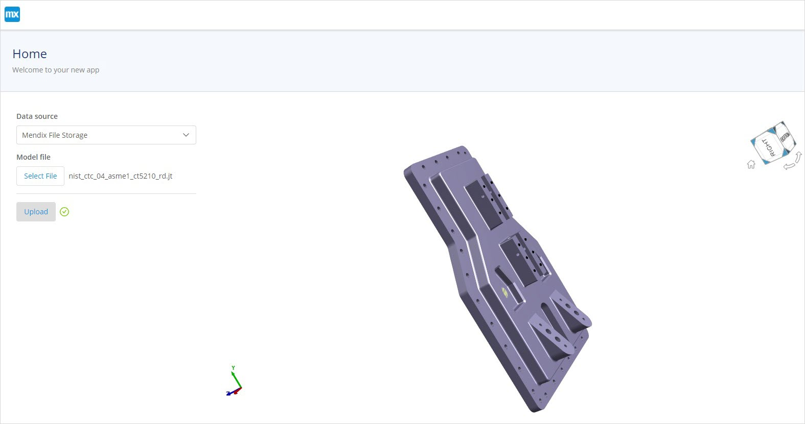

### 6.1.2 Displaying Model Loading Progress with Progress Bar widget

While you are uploading or loading a model, user may want to know the uploading and loading progress information.  
To get uploading progress: in **Uploader** widget property,uploading progress can be obtained via `Progress percentage`:
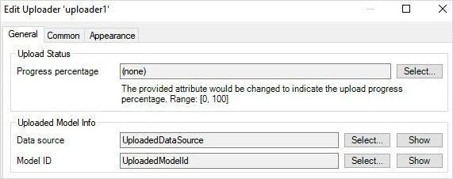  
To get loading progress: in **Viewer**  widget property, loading progress can be obtained via attributes `Progress status` and `Progress percentage`.  

Follow these steps to display model loading progress:

1. Create an entity **PageObject**, add a `Decimal` type attribute `LoadingProgress` with default value = 0, as **Progress bar** widget expects a decimal value.
2. Create a nanoflow called `createPageObject`, return `PageObject` object.  
3. Wrap **Container3D** with a **Data view** widget, set the Data Source of the Data view widget to `createPageObject` nanoflow.  
4. Set the value of attribute `LoadingProgress` by setting the `Progress percentage` in **Viewer** widget property.
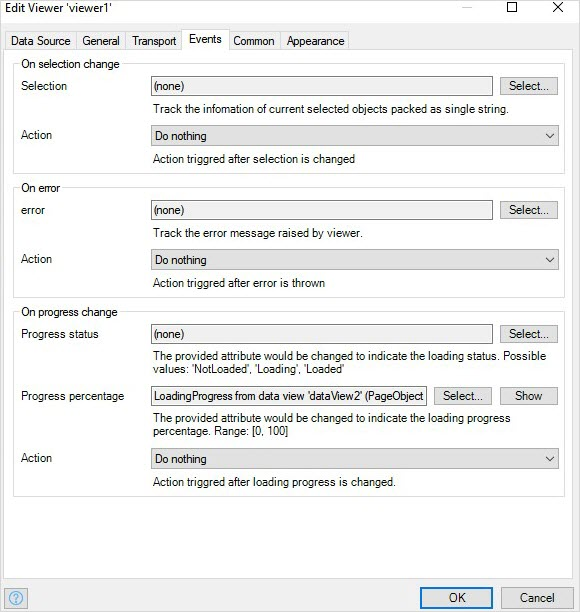
5. Add **Progress Bar** to the page, set  `PageObjectLoadingProgress` as the `Progress Attribute`.
  
Run locally, you will be able to see real-time model loading progress.
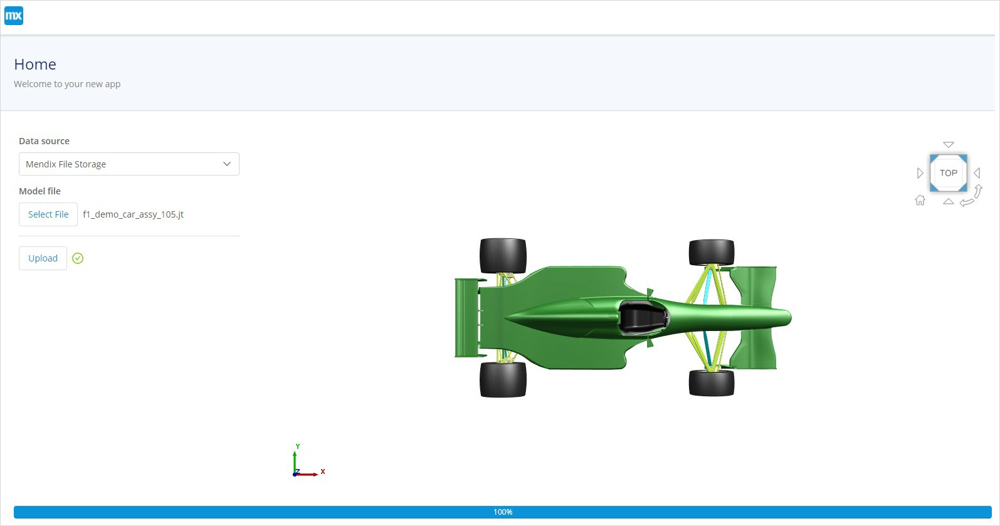

To display upload loading progress, the approach is similar.

#### 6.1.3 Utilizing More 3D Functionality

Add more 3D widgets to the page to enable more 3D functionalities, you can arrange the layout of them as to your need. For example:  
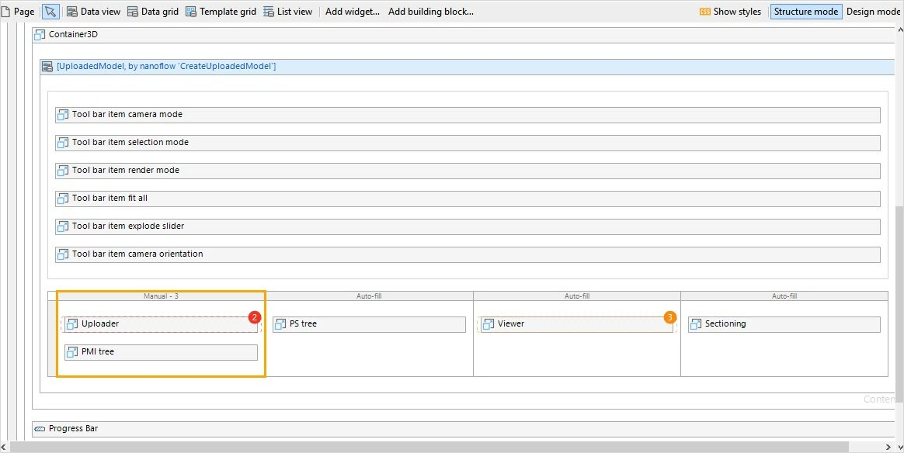
In design mode,  

### 6.2 Managing Uploaded Models

In previous use case, you can only visualize the model you upload.
Usually you will also need to manage the models that are uploaded and stored in the data storage. 3DViewer provides **GetModelList** and **DeleteModel** nanoflows to help you build model data management functionality into your app.

### 6.2.1 Building a Model List

Mendix native **ListView** widget can be used to display the model list.

Follow these steps:

1. Use **View3D/USER_ME/GetModelListFromMendix**  nanoflow or copy it to your app module. A list of `ModelDocument` objects will be returned after calling the nanoflow.
2. Add a popup page to display model list on button click or other event of your choice.
3. Place a **ListView** widget in Popup page, set nanoflow **GetModelListFromMendix** as Data Source.
4. As **GetModelListFromMendix** requires a `Pagination` parameter input, wrap the **ListView** widget with a **DataView** widget, create a **CreatePaginationObject** nanoflow, set **CreatePaginationObject** nanoflow as List view's  data source.
5. Fill in the list item with the information you are interested in.

### 6.2.2 Opening a Model from the Model List

Once you have the model list, you may want to click to select a model from the list and view the model. As **Viewer** widget expects `ModelId` and `Model Source Type`  to visualize a model, such information of selected model need to be passed to the **Viewer** widget. Since each list item is a `ModelDocument` object and this object contains various information of the selected model, including `ModelId` and `Model Source Type`, we need to pass this object to **Viewer** widget.

Follow these steps:

1. Define `On click` action of List View so as to pass selected model to viewer widget that is present in another page, thus selected model can be loaded into the viewer. An example approach is to create an entity that is associated with `ModelDocument` entity defined in Viewer3D module Domain Model. Make the object a shared object between the page viewer is in and the model list page. I n this example, create a `PageObject`:  
Home page:  
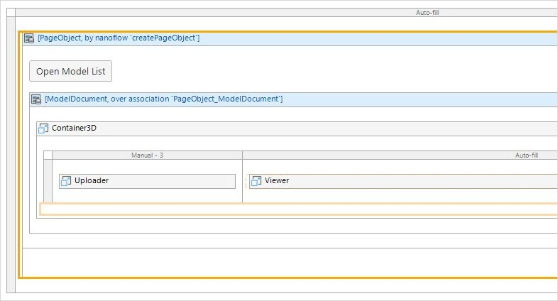
Open Model Popup page:  

2. Set OnClick action of model list item, change the `ModelDocument` object `PageObject` is associated with, return the value so that Home page can be refreshed on PageObject change.
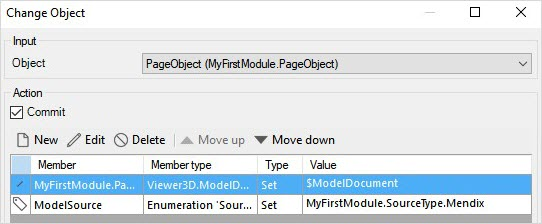

Run locally, you will get a simple model list, where you can select which model to open and visualize it at home page viewer:
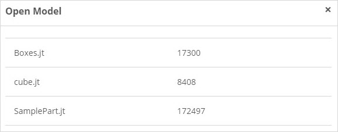

### 6.2.3 Deleting a Model

There might be some models that you don't want in the database. You can delete them too. 3DViewer module provides **DeleteModelFromMendix** microflow to achieve this.

Follow these steps to delete model from database:

1. Use  **Viewer3D/USE_M3/DeleteModelFromMendix** microflow directly or copy it to your app module.
2. For model list item, add a **Delete** button
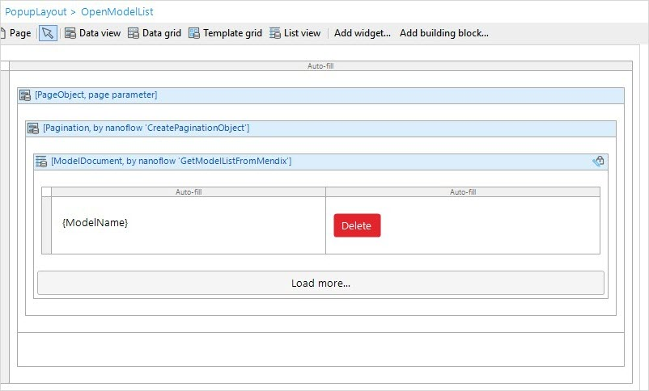
1. Create a nanoflow **DeleteModel**, set `ModelDocument` as input parameter, call **Viewer3D/USE_M3/DeleteModelFromMendix** microflow and commit the `ModelDocument`.

4. Set `On click` event of **Delete** button to **DeleteModel** nanoflow.

Now you are able to get a list of model, select on list item to open a model and delete model.

### 6.3 Handling Viewer Events

Multiple events can be picked up by **Viewer** widget and can used to build your customized event handling logic.
Mainly 3 types of events can be picked on **Viewer** Widget:
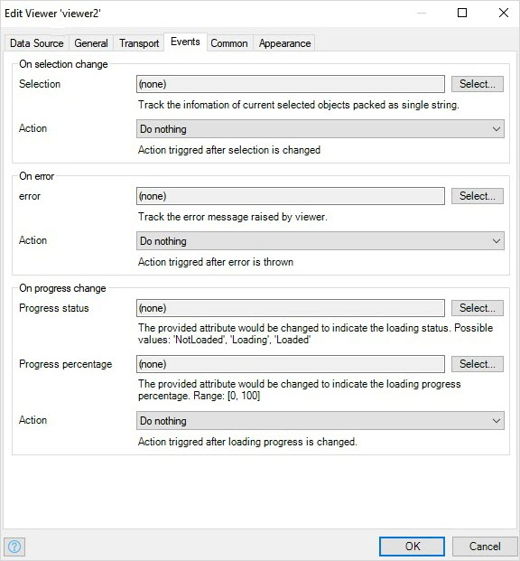
**On Selection Change**:By selecting one attribute to set SelectionSet, you can get information of selected part.  
**OnError**: By selecting one attribute to set OnError event, you can pick up error exposed by Viewer.  
**On Progress Change**: By selecting one attribute to setProgress value to, you can get the current loading status and loading percentage of model, product structure tree, PMI tree.

## 7 Loading & Visualizing a Model from Teamcenter

JT models from other data sources can also be visualized. Specifically, if you would like to load and visualize models from Teamcenter, you can use a combination of this **3DViewer** module and another module [**3DViewer for Teamcenter**](./3d-viewer-for-teamcenter.md) to achieve this.
