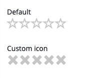

## 1 Introduction

The [Rating](https://marketplace.mendix.com/link/component/54611) widget enables rating from 0 to a defined maximum amount using an attribute.



## 2 Usage

To use this widget, place it in a [data container](/refguide/data-sources) that has an Integer, Long or Decimal attribute.

The widget offers the following for configuration:

* An Integer, Long, or Decimal attribute to store the rating on user-interaction
* An action (such as microflow or nanoflow) to trigger when the value of rating changes
* An empty icon, to be shown when the value is not yet selected
* A selected icon, to be shown when the value is selected
* An amount to define the maximum amount of icons to be rendered
* Animation, to define whether the widget should animate when clicking on the desired icon  
* A **Size** design property with two options (`Small` and `Large`) influencing icon size
* [Common properties](/refguide/common-widget-properties)

This widget is compatible with [Atlas Core](https://marketplace.mendix.com/link/component/117187).

## 3 For Widgets Version 2.0.0 and Below

### 3.1 Features

* Rate an object with stars
* Display average rating
* Display rating in whole and half stars
* Execute a microflow when the rate is changed
* Configurable star colors
* Flexible number of stars
* Support for mobile touch events

### 3.2 Customizing the Rating Icon

In order to overwrite the default star icon, add these classes to your project theme and replace the content with your preferred glyphicon:

```
 .rating-flag [class*="widget-star-rating-full"]:before {
  content: "\e034"; /* flag icon */ 
 }
.rating-flag .widget-star-rating-empty:before {
  content: "\e034"; /* flag icon */
 }
```
The `rating-flag` class should be added to the widget configuration on the **Common** tab.

## 4 Developing This Marketplace Component

To contribute to the development of this widget, follow these steps:

1. Install the following:
	* [Git](https://git-scm.com/book/en/v2/Getting-Started-Installing-Git)
	* [npm](https://www.npmjs.com/)
	* [webpack-cli](https://www.npmjs.com/package/webpack-cli)
	* [grunt-cli](https://github.com/gruntjs/grunt-cli)
	* [karma-cli](https://www.npmjs.com/package/karma-cli)
2. Fork and clone the [mendixlabs/star-rating]( https://github.com/mendixlabs/star-rating) repository. The code is in Typescript.
3. Set up the development environment by running `npm install`.
4. Create a folder named *dist* in the project root.
5. Create a Mendix test project in the *dist* folder and rename its root folder to *dist/MxTestProject*, or get the test project from [mendixlabs/star-rating](https://github.com/mendixlabs/star-rating/releases/latest). Changes to the widget code will be automatically pushed to this test project.
6. To automatically compile, bundle, and push code changes to the running test project, run `grunt`.
7. To run the project unit tests with code coverage (results can be found at `dist/testresults/coverage/index.html`), run: `npm test`.
8. Run the unit test continuously during development via `karma start`.

We are actively maintaining this widget. Please report any issues or suggestions for improvement at [mendixlabs/star-rating](https://github.com/mendixlabs/star-rating/issues).
