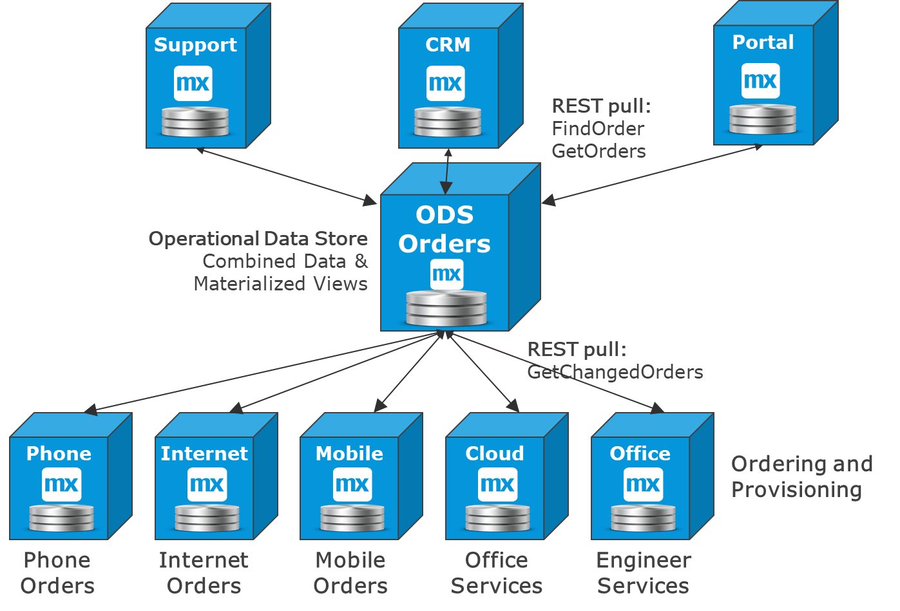
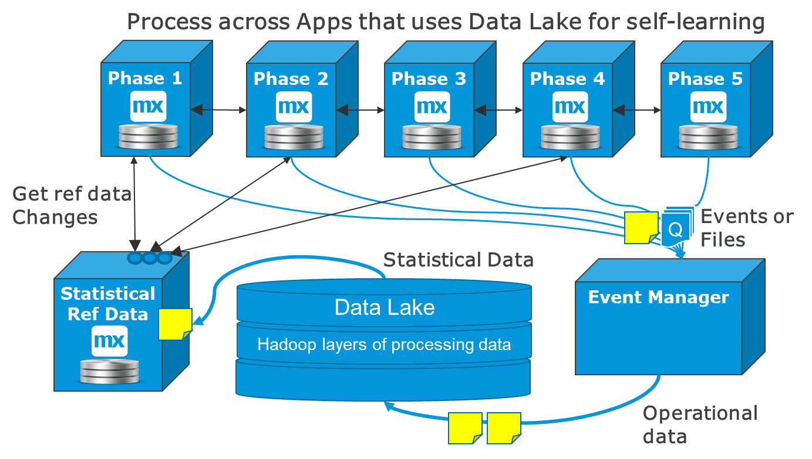

## 1 Introduction

The central data pattern is the integration pattern that stores data in motion. It is called an integration pattern because its purpose is integration from one place to another.

The central data pattern reflects the ability to do the following:

* Combine data from many sources and provide it on in various formats
* Compare new incoming data with the data that was shared before

This diagram displays some typical ways to use the data:

* Viewing combined data using real-time services
* Polling for combined updates (rather than polling many systems)
* Receiving files or batches (for example, of the day’s updates)
* Processing the data and streaming a new combination of data on to the next queue or Kafka
* Business intelligence and statistics that can be used for machine learning and AI
* Reporting of all kinds (for example, financial, business, and operational)

For many scenarios, it is better to specialize a system to handle subscriptions and combine data from different sources with different formats than to build it.

A typical use-case is if a company has 10 business lines with all different ordering systems, but only one single support desk that needs to see them all. A small local app could be used that collects orders or tickets from a number of systems and enables easily searching them. A full data warehouse (DWH) could also be used for enterprise reporting.

## 2 Typical Central Data Patterns

These are a few of the main ways the central data pattern is used:

* **Operational data store (ODS)** – This combines the same type of data from different processes and is used in operational processes
  * For details, see the [Operational Data Stores (ODS)](#ods) section below
* **DWH** – This is used for combining all types of data from the company and providing data for statistics, reporting, and business intelligence (BI)
  * For details, see the [Operational & Data Warehouse Data](#owd) section below
* **Data lakes** – These have been popular recently as a Hadoop-style DWH good for statistics, reporting, and BI
  * Data Lakes should not provide operational data, since the time stamp of combined data may be different
  * For details, see the [Operational & Data Warehouse Data](#owd) section below
* **BI solutions** – These extract data from a DWH or data lake, for example
  * This is often statistical data for management overviews, machine learning, or AI, or it is used to fine-tune processes in smart Mendix apps
  * For more information, see the [Integration to DWH & BI](batch-file-integration#int) section of *Batch-File Integration*
* **Extract-transform-load (ETL) solutions** – These are usually used for integration towards DWH solutions
  * They are beneficial for massive data volumes and can compare new data with previous loads 
  * For more information, see the [Integration to DWH & BI](batch-file-integration#int) section of *Batch-File Integration*

## 3 Operational Data Stores (ODS)  {#ods}

START: If the integration layer in the middle stores and combines business data before re-distributing it to other parties, it is a “central data” integration pattern, often referred to as Operational Data Store (ODS).

Mendix Apps are often used for ODS solutions, since it is easy to integrate to several disparate systems, easy to store the data and easy to manage any errors in the integration by creating human workflow for it.

In the figure below there are many business lines with different Ordering systems, but there is also three different systems that need to search between the entire set of orders and give overviews of current orders across business lines. The decision was made to specialize a Microservice in the tasks of:

1.  Collect all relevant orders 
2.  Provide good views and searches on the total set of orders.

ODS solutions are supposed to combine data, but if they try to do too many things they become slow to change and manage. It is wise to have a limited area of scope for an ODS.

Rather create another ODS when it gets difficult to provide flexibility for more than one purpose. E.g. an Orders ODS can send on overview ordering information to the Customer ODS, which means they both can evolve autonomously. 

## 4 Operational & Data Warehouse Data {#owd}

It’s good to keep operational data flows separate from the statistical, BI and DWH data, unless using statistics or historical data as *reference data* in operational flows. The only patterns that should *provide* operational data is the ODS, and in some cases ETL solutions used operationally.

Data Lakes were recently popular as an enterprise wide Hadoop style DWH solution that attempts to double as an enterprise wide ODS. But it’s an almost impossible undertaking to make this work nicely. Snap-shot type data used for statistics makes a slow and un-reliable source for operational information.

A DWH per definition does not store operational data. Time-stamp differences in the incoming data and the methods used to merge it means that it cannot be used as a reliable source. On the other side of the DWH we get statistical data, metrics, reports or potentially snapshots of previous moments in time. This information can be used *in* operational processes to fine tune them.

E.g. for home-delivery we can keep track if someone responds at the door over time and decide to change delivery pattern based on this information. The fact that someone rarely is home is statistical data from DWH solutions, that changes rarely, but is used as reference data for routing delivery services. This pattern will evolve more with IoT and combined with AI becomes machine learning patterns.

The figure shows a number of Apps in a process that share business events and to an Event manager, that knows the status of each process. The Event manager shares all data with a Data lake (or DWH) that processes the data into various data collections. One of those collections is sent to a Mendix App that manages that reference data and provides it back to three of the Apps that “learn” from the past results.

## 5 Small ODS and Large DWH
-----------------------

The other reason to keep operational data separate from DWH solutions is that Operational processes change often, and different business units need flexibility and autonomy from each other. Even if it seems like 2 use-cases need the same data, they may have *very* different needs when it comes to data-model and functionality.

If different use-cases become difficult to combine easily, it can be better to have different ODS microservices covering each a reasonable scope, retaining flexibility and maintainability. ODS solutions are better as Microservices than as behemoths.

Data Lakes and DWH solutions on the other hand are large, enterprise wide, generic, incredibly complex and quite far from the people that work in the business. This is a set of attributes that make them very in-efficient to use for operational processes. The data flows slowly through. It is often enough to have an update every month in a report. All business units share the DWH, so inherently changing things will take time. A DWH is in a way a *necessary* Monolith.

## 6 Mendix for ODS

ODS solutions are similar to a legacy adapter or Integration App \<link\>, in that they can collect and store data from one or more systems and provide them in an easier to use format or combined with data from other places.

Mendix is a very good choice for ODS solutions, having strong integration capability, UX for managing data or errors should need be, and very easy to create and maintain REST services for providing the data. For DWH we have no customer that tried to use Mendix. That is for other technologies to handle.
