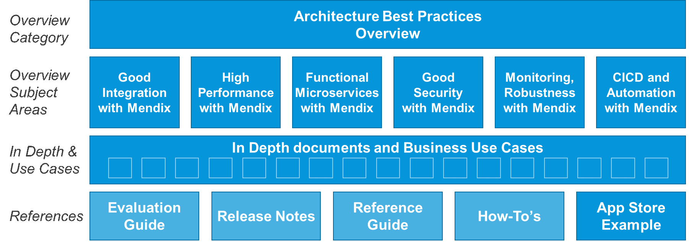

## 1 Introduction to Mendix Architecture Best Practices

Mendix is optimized for the easiest and fastest way to develop and maintain apps that fulfill a business function. As the scope of your apps grows larger, architecture becomes more important. At that point, you should leverage best practices in this area.

The Mendix architecture best practices complements the following sections in the Mendix 

* Evaluation Guide:
* Data Management
* Integration
* Deployment
* DevOps
* Architecture
* Security

Mendix best practices around architecture will be valuable for architects, designers, business developers, and more technical developers that work on Mendix app projects. The best practices address common areas where the quality of Mendix solutions can improve by using this information or using the examples in the App Store.

{}[**ADD LINK TO APP STORE WHEN AVAILABLE ABOVE; UPDATE DIAGRAM BELOW**]{}

## 2 Architecture Best Practice Areas

These are the architecture subject areas that will be covered:

* [Integration](integration/integration-overview)
* [High Performance](performance/performance-overview)
* Microservices
* Security
* CI/CD and Test Automation
* Monitoring and Robustness

## 3 Best Practices Structure

This diagram presents an overview of the structure of the Architecture Best Practices documentation:

{}[**UPDATE DIAGRAM**]{}

For each subject area there is an overview document, and below that, there are a number of in-depth descriptions and business use cases. Some of these documents link to a module in the App Store that demonstrates example modelling reflecting the theory.

{}[**ADD LINK TO APP STORE WHEN AVAILABLE ABOVE**]{}
