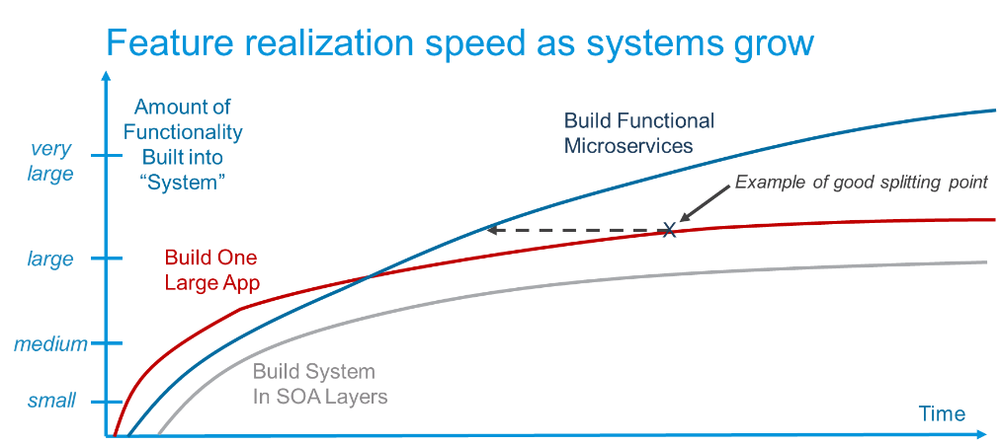

As the business function grows very large, we can consider splitting it in
several systems or we create a Tribe of DevOps teams that cooperate to own this
large cluster, which can replace 1-n Core systems in a regular architecture.

Typical Microservices seen in these clusters are:

-   Internal dashboard or landing page where internal end-users get overviews
    and simple reports and links to the other functionality. Some data from
    processes are copied up to the Dashboard to allow good overviews, while when
    working on a specific process, it is done in one of the sub-Apps.

-   Customer Portal can be separated as a case of keeping external users and
    security separated. We want external users to see s sub-set of the data and
    processes, which we rather copy over to the Portal to know exactly what can
    be accessed. Widgets can be shared via App Store if relevant.

-   Mobile portal or for mobiles and devices. They often have larger amount of
    users and/or events, but much smaller functionality. With very different
    operational features it’s a candidate for a separate specialized App.

-   Product definitions and other relatively static master data management is
    often good to do in a separate App. It’s a different phase of the process
    often different user-group and often only needs to be synched daily or
    monthly.

-   Historical data can be separated with views created from the Dashboard,
    since this makes the operational data-bases smaller, always good for
    performance. Quite often there is a different process that uses historical
    data.

-   An Operational Data Store (ODS) is rarely needed. It’s an option to consider
    when we need to keep data from different processes together to join data in
    views and reports. Only if the dashboard is not suited for this, would an
    ODS be considered.

Good Integration 
-----------------

Mendix cannot make good integration easy, but we can make it easier.

It takes the right thinking to find the right apps and integrate them well with
minimal contracts in order to create smart and minimal dependencies. When
dependencies are defined, it is easy in Mendix to implement and maintain them
using REST, OData, SOAP, or file contracts sent via FTP(S).

This is why when you build larger systems, you need experienced people, best
practices and a careful approach, maybe considering a “factory” or, as Spotify
calls it, a tribe of teams that own one functional area.

Approach to Size & Changes
--------------------------

As the size of what you build increases, the approach needs to change. More care
needs to be taken with the following actions:

-   Architecting and designing before building

-   Involving a more experienced Lead Developer

-   Involving more technical Developers

-   Conducting more peer reviews

-   Conducting more testing, automated testing, and tuning

-   Performing more refactoring (e.g. 1–2 times per year)

-   Implementing more monitoring

Speed does slow down with size, in whichever direction you turn. However, you
can minimize that consequence by implementing a solid microservices architecture
with a good team and professional approach.

Positioning for Core Systems
----------------------------

As seen above Microservices architecture makes it possible to build any size
“system” using smaller deployable parts. For core systems, legacy migration and
shared large systems, the Biz-DevOps strategy can become less relevant as
efficiency, economies of scale, thoroughness and stability may dominate.

Positioning for core systems should be based on technology **and** approach. As
in [Gartner Pace-Layered Application
Strategy](https://www.gartner.com/binaries/content/assets/events/keywords/applications/apn30/pace-layered-applications-research-report.pdf).
You should optimize for what each system requires.

Sometimes speed is important, sometimes size. Sometimes stability and
performance are even more important. The project should adapt the approach
accordingly. With a mature and careful approach, Mendix can be used for almost
any challenging business problem.

In these situations there is often a Factory Model adopted, that combines a set
of DevOps Tribes, each owning an area of functionality, while there is also an
automation team and a CoE for re-use, governance, specialists and control.

The Rate of Feature Realization
-------------------------------

The diagram below shows how in any technology, the speed of feature realization
will slow down as the system grows over time:

-   Both Monoliths and Microservices are better that traditional SOA layers,
    where dependencies between components realizing the same business feature
    are maximized rather than minimized.

-   Monolith development will be faster to start with, since we only have one
    single component, and we do not need integration

-   But relatively soon, as scope grows, there will be benefits in separating
    the concerns from each-other

If it is not very clear from the beginning which Apps should be created, it is
generally advised to start coarse grained and split later
