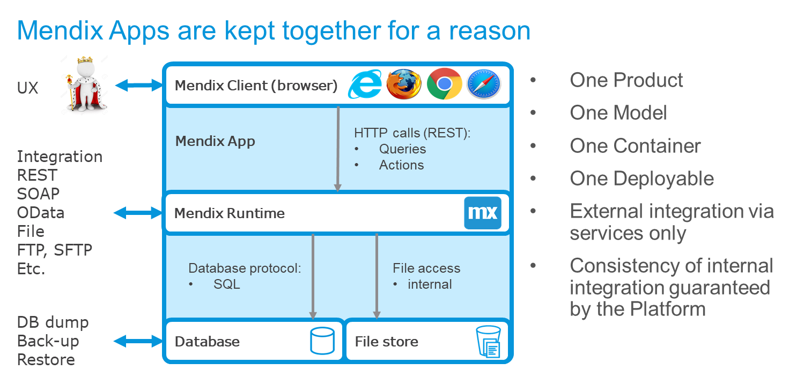
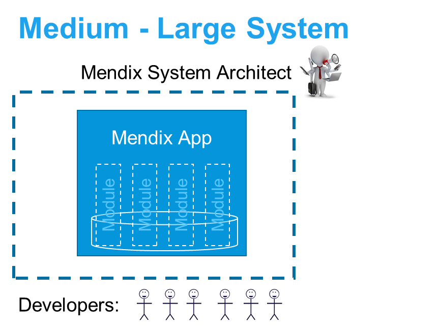

## 1 Introduction

Mendix promotes keeping together what belongs functionally together. By having all parts needed for a business function in one project = one model = deployable, we guarantee integrity between data, UI, and logic starting from the developer through testing cycles and until it runs as an app in production. 

Other apps or components can only access data and functions via well-defined
APIs using explicit contracts.

The APIs are very easy to set up via REST, SOAP, OData, files, or any other mechanism. Access to data, files and functions is controlled via Mendix Runtime. That way only the right caller can do pre-defined operations provided by the App. Thereby dependencies are defined and kept under control.

In the figure above the three parts of a Mendix App is shown. The browser and external services talks exclusively with the Mendix run-time, which is the only component that works directly on data in the database. Back-up and restore is easy, and effects only this App.

This is why Mendix works well for creating all types of Microservices: Fowler’s business oriented services that are like Apps or applications, the API oriented ones that do not have a UX, and the .NET style services that share a database, see *Three Microservices Patterns* \<link\>.

## 2 What Happens When the Scope Grows?

When the scope grows, the first thing to do in Mendix is to structure the app in separate modules within the same App. Ideally modules should be as independent as possible. They may copy parts of the same data to have a specific view on the same information, while maintaining more autonomy this way.

The increased speed of development in a low-code platform like Mendix means that apps and microservices can be functionally quite large and significant before the rule of having fewer than eight developers on a team comes into play. An advanced ordering app or support app can easily be contained in one single Mendix app.

This allows you to choose the size of an app based on functional considerations, instead of having to break it down based on the microservice size consideration. These are some other reasons for having separate apps and microservices: 

-   To separate business functions from each other
-   To allow for the autonomy of evolution for different stakeholder
    organizations
-   To have different release cycles
-   To fulfil different operational requirements
-   For scalability
-   To separate complicated integration and batch processes
-   Different security requirements, e.g. customer portals

## 3 When the Scope Grows Even More?

When the scope increases further and it is still one business function, we can split things up and create a system of apps working together as a microservices cluster. The microservices cluster is treated from the outside as one single *system*, but it is built, tested, and deployed as a set of independent functional components by \~1-8 DevOps teams.

There are several ways to do this, and it will depend on the situation that fits the purpose of this business requirement. If the situation is complex, it is recommended to have an architecture workshop with several stakeholders, including the business, because considerations are not only technical. These are the most common patterns:

-   **Process oriented cluster** – Several user groups cooperate over several phases in one process. Often, there is a landing page or dashboard app with separate microservices below, each implementing a phase in the business process. The other services are accessed via deep links so that the user does not notice they are working in more than one app. It is also the pattern for larger functionally-oriented customer portals.
-   **Main app & peeled-off pieces** – This is a common pattern when data-integrity is important across a larger data scope and where there is a true core functionality that is hard to break up. Certain parts are broken off, like batch-processing, calculations, and configuration logic. Anything with a small and stable interface with the main app is a candidate for a sseparate microservice.
-   **Separate individual systems** – In this pattern, the initial idea of the app contained more than one business function. To quickly get to an MVP and demo for the stakeholders, the modules were built well within one single app. Not being sure of the best approach for breaking up the modules, the team postponed the decision until later. This app will thus become two separate systems altogether, and each app will be handled by a small and    independent team of developers again.s
-   **Marketing-oriented customer portal style** – When there is marketing and searchable information in the main pages of a customer portal there is a microservices pattern found quite frequently on the web. Mendix is an excellent choice for building the microservices below the common portal landing page, see *Customer Portals* section below.

## 4 Customer Portals

Another way to build microservices involves customer portals. These portals often have one single landing page or dashboard with a few microservices below that provide functions or services via REST services or deep links.

If you are building a functionally-oriented customer portal, Mendix is ideal for building all the portal parts. Small portals are often only built on one single Mendix app. For larger portals, it is recommended to use a landing page or dashboard app in front, and then deep-link into sub-apps to do more significant work for the logged-in areas of the portal.

## 5 Marketing Portals

The main purpose of marketing-oriented portals is to provide a window into an enterprise or department. There is a lot of information, links, and pictures that can be accessed without having to log in. The information is search-optimized, and different pictures are displayed depending on where the user is hovering and clicking. In these cases, Mendix is preferred for the functional parts of the portal.

See also *Website Integration* and *CMS integration.*

## 6 Summary

Mendix is good for building quite large microservices, because it is a good Low-Code platform, speed of feature development is almost 10 time higher. I.e. one needs fewer developers, and we rarely have to break something up due to size.

Most Mendix Microservices are separated from others for functional reasons, team reasons, scalability or something else.

So the first thing to do when scope grows in a Mendix App is to split the functionality in well defined Modules that separate parts of the scope from each other and makes it easier for several developers to cooperate.

When scope is even larger, we recommend a couple of architecture workshops where managers, business and operations are also involved, to determine what is a good way to split things up. It is often different from case to case.

Finally Mendix Apps make really good functional parts of web-sites and customer portals and integrates well with CMS and CDM systems, see “UX Integration” \<link\>.

When scope and volume and criticality increases even more, we recommend changing the approach towards a factory model with DevOps Tribes, and using more technical resources etcetera, see “Large Microservice Systems” \<link\>.
