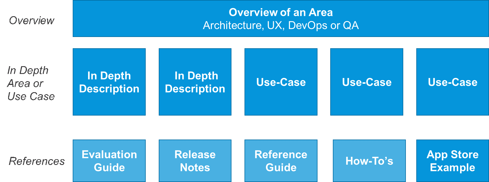

**NEEDS STAGE 4 & STAGE 5 REVIEW.**

## 1 Introduction 

Mendix is optimized for the easiest and fastest way to develop and maintain apps that fulfil a business function.

The [Mendix Evaluation Guide](https://www.mendix.com/evaluation-guide/) provides a great overview of all the possibilities and features in the Mendix Platform, and the [Mendix Reference Guide](/refguide/) explains the product in detail.

With the **Best Practices** documentation, we wan  to share information on how to approach typical challenges and solve specific use cases. This documentation is written by experts in the field, and sometimes it refers to real product examples available in the [Mendix App Store](https://appstore.home.mendix.com).

While there are many ways to solve problems, we do not suggest that these are the only ways. We want to present ideas on how to realize solutions that are stable and easy to maintain in areas such as [architecture](architecture/bp-architecture-overview), UX & design thinking, DevOps & Agile, and quality assurance.

This documentation will be expanded on an ongoing basis, starting with the architecture topics of [Integration](architecture/integration/integration-overview) and [Performance](architecture/integration/performance-overview)

### About Best Practices

Best Practices will eventually be valuable for all the people that participate in the Application Life-Cycle, from scoping and estimation to maintenance in production.

{}[**UPDATE DIAGRAM**]{}

#### Areas of Best Practices

The areas of Best Practices planned are

- Architecture
  - Integration
  - Performance
  - Microservices
  - Security
  - CI/CD and Test Automation
  - Monitoring and Robustness
- UX &amp; Design thinking
- DevOps and Agile
- Quality Assurance

#### Structure of Best Practices

There will be an Overview Document that covers the breadth of the area discussed, followed by a number of specific areas or use-cases covered more in detail, while referring to other more detailed information in the Reference Guide or the How-To section, and sometimes referring to example implementations in the App Store.

{}[**UPDATE DIAGRAM**]{}

## Overview

### How are the Best Practices Created?

Mendix organizes subject matter experts from different parts of the organization in Guilds. The guild members meet frequently to shares problems and ideas, research different areas, and write guidelines and best practices around the subject area.

At this point there is an Architecture Guild and a UX Guild, and there is a plan for a DevOps Guild and a Quality Assurance Guild.

It is the members of these guilds that will own the content of the Best Practices. They will also own the reserved Best Practices folder in the App Store, where examples of good ways to implement certain solutions can be placed for certain use cases.

### Best Practices or Good Practices

The name for this section could have been &quot;_Good Practices_&quot; because there is no guarantee that there is not an even better way to solve the specific use case.  It is simply a good way suggested by an experienced Mendix employee in that area, and reviewed by someone else in the Guild. (Support + Current knowledge + package)

### How Does it Help me?

For someone that is relatively new to an area, the Overview document should quickly bring that person up to speed about the breath of considerations he/she should be aware of around the subject. The Overview will also help experienced people verify that he considered all aspects of the context and give ideas on how to plan the work around that area.

The In-Depth description and Use Cases are intended for semi-experienced people that already have worked in that area, to compare notes with how a Mendix expert considers the specific use case.

If it is a Use Case it is intended to be a Business oriented use-case, that can be solved in many ways. The document will quickly list different ways to solve this case, and then suggest in detail a good way to implement it, and often combine this with an example in the App Store.

Some Use Case documents will refer to Examples in the App Store. They are not finished products, but small reference implementations solving one single business problem. The user can just view them as examples to pick up ideas, or copy parts of them as a starting point, to get robust solutions, with good error handling.

### The Mendix Community and Knowledge Sharing

There is a great Community around Mendix that constantly share ideas, best practices and solutions via e.g. Buzz, Meet-Up, Partner presentations, and the Forum.

Partners, Customers and other developers are also sharing a large amount of very valuable Mendix modules and components via the App Store.

This sharing culture is at the heart of what Mendix believes in: Help each other delivery the best possible value to customers.

The Best Practices section of the Mendix web-site and App Store is an addition to all this activity, where the source of the information and implementations will come via Mendix experts in the respective Guilds.

### Can I participate in creating Best Practices?

As part of the Guild culture we stimulate creative discussions the lead the team and people around it forward.

As the Best Practices are published, we hope we will get some feedback and ideas related to the material. That will be funnelled via the Community team. If the case is strong, and time allows, there will be updates and improvements done by the owner of that Topic.

We will reserve the App Store _Best Practices_ category for examples created internally, which also means that you know it comes from Mendix and is kept up to date.

### What's Next?

Creating good documents and examples takes time, and the information will be filled up gradually over time.

We hope that it will provide a good complement to the existing documentation, and we will try to avoid overlap, by simply referring to existing documents where possible.