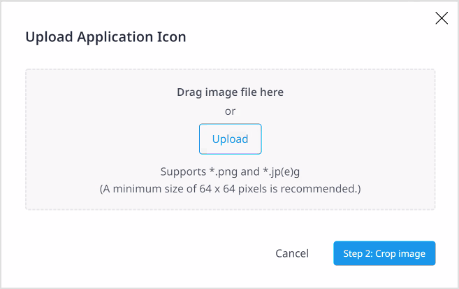
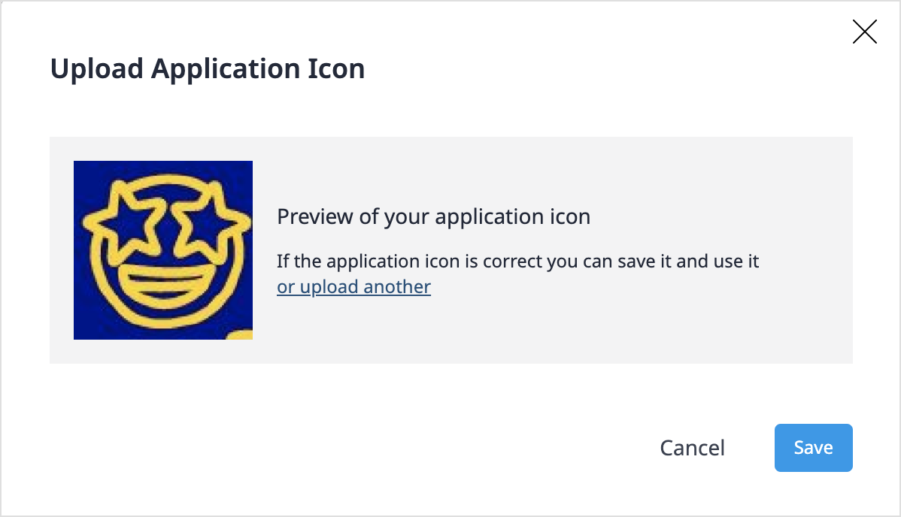
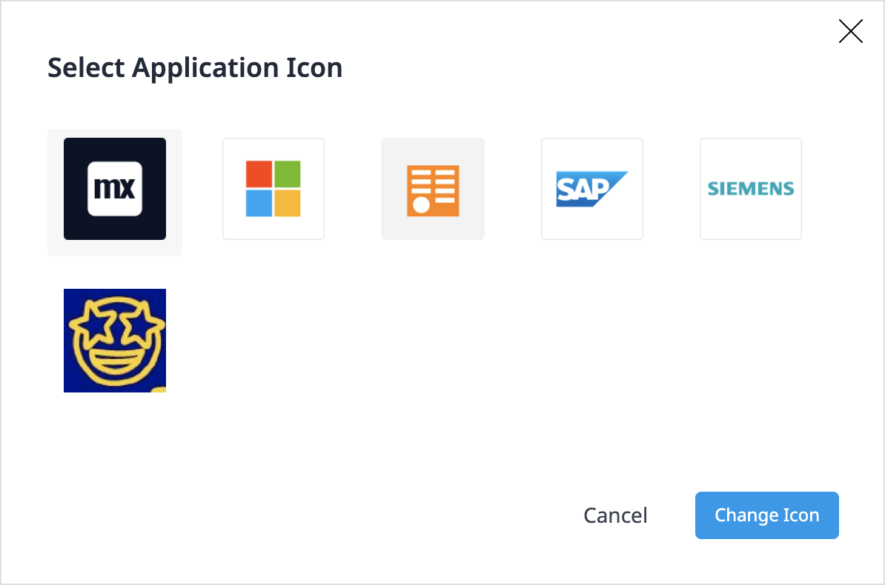

## 1 Introduction

You can curate registered assets to enrich the metadata in the Data Hub and provide further information about the data sources, datasets and exposed attributes. You can add custom icons for the app and specify Catalog descriptions and tags to supplement the registered metadata and further categorize the asset and the data they connect to. Curate functions in Data Hub include setting the [Discoverability](#discoverability) of registered assets, assigning a [Validated](#validated) tag and specifying the [Business and Technical](#customowner) owners. 

Users who can curate assets in Data Hub Catalog are as follows: 

* Owners of a registered service – can curate their own services and find those that are set to non-**Discoverable**
* [Data Hub Curators](../index#curator) and [Data Hub Admins](../index#admin) – can curate and find all registered assets, discoverable and non-discoverable

Owners and Curators can also get an overview of the registered assets they own and curate from the [Curate](#curatelist) tab of Data Hub.

{}
Information that is added or changed during curation is stored in the Data Hub Catalog for that item. It will not be added to the OData service contract or metadata files or affect any of the values in the metadata files associated with the service or the data associated with the exposed datasets. 
{}

## 2 The Curate List {#curatelist}

Owners and curators of registered assets can click **Curate** from the **Data Hub** screen to see the **Curation List** screen which provides an overview of all the registered assets that you can curate as an owner under the **My Assets** tab. Curators will also see the **Company Assets** tab that lists all the registered assets:

In both cases, the list includes registered data sources and also individual datasets that are exposed for the data source.

You can search for specific assets by entering a search string in the search bar or **Filter By:** **Environment** or **Validated** assets.

The list can be also be sorted by any of the columns by clicking on the column header.

Click **View** to display the asset details. You can then perform curate actions to add Catalog specific information to the asset metadata.

## 3 The Curate Bar

Curation is performed from the [asset details screen](search#search-details). If you are an owner of an asset or are a curator, you will see the **Curation Bar** for the selected item. The following shows the curation bar for a selected service: 

{}
Owners of registered assets and can only curate their services.
{}

On the **Curation bar**, the following details are displayed:
* Information about the role of the current user: **Owner** or **Curator**
* When a data source is selected in the **Search Results**: 
	* **Edit Metadata** – edit the description of the data source and datasets, add tags or specify business and technical owners and add change the application icon
	* **Discoverable/Validated** – set the service as **Discoverable** and **Validate** from the drop-down menu. 
		* **Discoverable** defines whether the service can be found (and consumed) by users of the Data Hub; if a service is set to **Non-discoverable**, only the owners of the service (**Business** and **Technical**) can find the registered data source. 
		* **Validate** indicates that the data source and dataset have been validated.
* When a dataset is selected in the **Search Results**
	* **Edit Dataset Details** – to edit the dataset and attribute descriptions 

## 5 Edit the Metadata of a Data Source

Curate functions for a selected data source enable you to change the (source) **Application Details** or **Data Source Details** that are displayed in the Catalog.

### 5.1 Curating Application Details {#curate-application}

You can change the owners of the app and add a custom icon for the application from the curate Application Details screen:

1. In the **Curation Bar** click **Edit Metadata** > **Application Details**:

   

2. The **Application Metadata** screen is displayed:

   

#### 5.1.1 Changing the Technical and Business Owners of an App {#customowner}

By default, the **Technical Owner** for a registered asset is the user who registered the data source when registration is done through the deployment pipeline in Studio Pro or specified during manual registration or using the Data Hub API. These owners can be changed by curating the application details. The **Technical** and **Business Owners** are displayed as a link in the asset **Metadata** pane so that users can contact them. 

{}
If you as a **Technical Owner** curate the asset and change the name, then you will no longer have curation rights to the asset once you save the changes. If the **Discoverability** is turned off for the asset, then you will also not be able to find the asset in the Catalog.
{}

{}
**Business** and **Technical Owners** have curation rights for the registered data source in the Data Hub Catalog if they are registered users on the Mendix Platform. If a custom owner is *created* with the process described in this section, the link to contact them will be displayed for the asset but this does not mean that they are able to curate it. 
 {}

{}
Curators and the Data Hub Admin can manage custom owners as part of **Administration** functions. For further details see the [Managing Custom Owners ](../general/data-hub-admin-functions#customowners) section of *Data Hub Administration*. 
 {}

To change the **Business Owner ** or **Technical Owner**, follow these steps from the **Application Metadata** screen:

1. Click in the name field of the **Business** or **Technical** owner. You can start typing or select from the drop-down list of names. Mendix platform users will be displayed with their avatar and custom owners will be shown with an avatar that displays their initials as shown in the following example:

    

4. If you type a name that is not in the list, you will be asked if you want to **Create** it. Click on the prompt and the **Enter New Custom Owner Details** in the pop-up that is displayed:

	 {}{}

5. Enter the **Name** and **Email** of the owner and click **Save**. 

	{}If you create or select a custom owner for an application, this will only display a link to the email provided in the  **Metadata** pane. This will not give them curate or access rights to the asset; only Mendix users can curate assets they own. {}

6. Click **Save** to return to the **Application Metadata** screen. Click **Save Changes** to return to the asset details screen where the changes will be displayed in **Metadata** pane.

#### 5.1.2 Changing the Application Icon {#application-icon}

You can change the icon that is displayed for the app and the data source by uploading your own custom application icon or selecting one from Data Hub the icon library. The selected icon will be displayed for all endpoints of the application and data source such as the Catalog search results and also in the Mendix Studio Pro [Data Hub pane](/refguide/data-hub-pane) and Studio **Data Source** pane. 

Currently, by default, the application icon is determined by the application type when the data source is registered. For example, for Mendix apps the Mendix Icon is displayed which identifies the technology of the source app. 

**Upload Custom Icon Image File**

When you want to upload a custom icon or image, the following apply:

* The accepted file types are ***.png***, ***.jpg***, and ***.jpeg***

* The maximum accepted file size is 50 KB
	
	{} You will be able to upload a large file, and crop it to reduce the file size during the operation.  {}
	
* The *minimum* recommended size of the image is 64 pixels x 64 pixels. You can crop larger images and select the area you want to display during the upload operation. 
	
	{}If smaller images are selected, they will be expanded to meet the 64 x 64 size which may result in degradation of image quality. Ensure that your original file meets the recommendations for an optimal display.{}
	
* Custom icons that are uploaded will be saved to the **Icon Library** and can be used for other apps.

To **upload a different icon** for the app follow these steps:

1. In the **Application Metadata** screen of the selected data source, click **Upload a different icon** to display the **Upload Application Icon** pop up:

   {}{}

2. Drag the image file into the upload area or click **Upload** to browse and select a file from your file system. Click **Step 2: Crop image** to proceed.

3. Move the wire-frame to select an area of the loaded image and change the size of the wire-frame to crop the image to the area that you want to use. When you are satisfied, click **Apply Changes**:

	{}{}

	{}For high-resolution images, if the selected are exceeds the size limit there will be a warning. Select a smaller area of the image to reduce the file size.{}

4. A preview of the application icon is shown. Click **Save** to upload the selected icon.
	
	{}{}
		
	
5. The **Application Metadata** screen will now show the selected icon for the application:

  

6. Click **Save Changes** to return to the data source details page. The custom icon will be stored in the **Icon Library**.

**Select Icon from Library**

An alternative to uploading an icon is to use an existing icon by clicking **select one from your library**. The icons for your Data Hub will be shown and you can select one and click **Change Icon**.

{}{}

### 5.2 Data Source Description{#service-details}

If a description was included in the OData metadata contract, this will be displayed in the asset details screen for the selected data source. You can curate a data source to add a catalog description to include further details on, for example, the data usage and relevancy. 

As search in the Data Hub also includes searching the contents of the description fields of registered data sources, datasets, and attributes, adding relevant descriptions can help in the right users finding these shared assets.

You can also specify if the OData service **Contract Description** or the **Catalog Description** is displayed in the Data Hub Catalog. 

{}If there is a **Catalog Description** for a service, both descriptions will be registered for the service in the Catalog and during curation either the catalog or the contract description can be selected to be displayed. {}

To edit the asset metadata, follow these steps: 

1. In the **Curation Bar**, click **Edit Metadata** > **Service Details** to display the **Service Metadata** box:

	

2. The description from the OData service metadata is displayed in the **Contract Description**. This cannot be changed, as it is part of the OData service definition. You can provide an alternative description by toggling **Use the catalog description** to display the **Catalog Description** box: 

	

3. Add a catalog description. This will be stored with the service details in the Catalog. 

	{}If a **Catalog Description** has been given for a service, both descriptions will be registered with the service in the Catalog. If you have selected to display the **Contract Description**, the **Catalog Description** will be retained providing the option for curators to display this as desired.
	{}

5. Click **Save Changes** to save the changes that you have made to the **Edit Service Metadata** screen and return to the **Service Details** screen, which will now display the selected description.

	{}If you leave an **Edit Metadata** session without saving your change, you will loose all the changes from that session. {}

### 5.3 Adding or Editing Tags to a Service {#tags}

Add tags to categorize a registered service and provide additional means for finding the service. Tags that are specified for a service also apply to the datasets and attributes that are exposed in the service. Specify tags for the selected service by following these steps:

1. In the **Search Details** screen of a selected service, click **Edit Metadata** > **Service Details** in the **Curation Bar** to display the **Service Metadata** box.

2. To add tags, click the empty **Tag** input area:

	

3. To add or edit the tags, enter a tag string and press **Enter** or select one from the list of existing tags that are used in the Data Hub Catalog and displayed when you start typing in the **Tag** field. Tags can be made up of alphanumeric and underscore characters. To separate multiple tags, use spaces.

	{}Tags can only contain lower-case letters, numbers, and underscores. They must have a minimum of 2 characters. 
	{}
	
	{}If you use capital letters when typing the tag string, they will be converted to lower-case.
	{}

4. You can enter multiple tags separated by spaces. You can remove tags by clicking the **x**:

	

5. When you are finished specifying the tags, click **Save Changes** to register the changes and the tags will be shown in the **Service Metadata** pane.

	{} If you leave an **Edit Metadata** session without saving your change, you will loose all the changes from that session. {}

## 5 Discoverable and Validate {#discoverability}

### 5.1 Discoverable

By default, when an asset is registered in the Data Hub catalog, it is set to **Discoverable**, which means that all users can find, consume, and see details of it. 

When the **Discoverable** setting is turned off, it will only be visible to the owners of the service and curators and not be visible to other users of the Data Hub. This means that it cannot be found, either in the Data Hub Catalog or by users of the Data Hub integrations in Studio Pro and Studio.

{}
When a data source is set to non-**Discoverable**, neither the data source nor the datasets that are exposed in the service can be found by other users (except for curators who can see all assets). However, there may be instances of the same datasets, from the same apps, being available through other services that are also published in the Data Hub Catalog.
{}

To change the discoverability of a service, follow these steps:

1. In the Data Hub Catalog, select the service to display the **Search Details**.

2. If you have curation rights, the **Curation Bar** will be displayed. Click **Discoverability** to display the **Discoverable** toggle:

   

3. Click the **Discoverable** toggle to turn it on or off. A message will be displayed to indicate the discoverability of the asset.

    

### 5.2 Validated {#validated}

The **Validated** value can be assigned to a data source. When it is turned on, by clicking the **Validated** toggle, this will be indicated in the asset details screen and also in the search results pane for the service. 

## 6 Curating Datasets and Attributes {#curate-datasets}

Datasets and their exposed attributes can be curated to add **Catalog descriptions**. Catalog descriptions are stored in the Data Hub Catalog and you can specify which description is displayed: the service contract  or the Catalog.

To change dataset and attribute descriptions, follow these steps:

1. In the **Search Details** screen for the selected dataset, click **Edit Dataset Details** on the **Curate** bar to display the **Dataset Metadata** box:

÷	

2. The service metadata contract description is displayed. To edit and use a **Catalog Description**, click the toggle and enter a description. 
3. When there are a large number of attributes for a dataset, you can use the search area to find specific attributes.
4. Click **Save Changes**. 

	{}If a **Catalog Description** has been specified for a dataset or attribute, this will be retained even if the toggle is set to display the **Contract Description**. 
	{}
