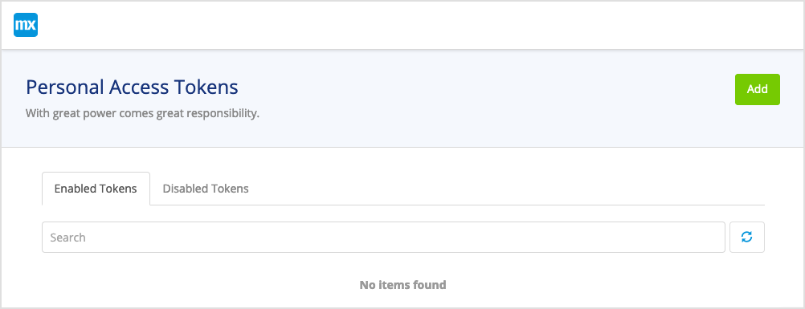

## 1 Introduction

The Data Hub APIs can be used to connect your applications to your organization's Data Hub. In this way you can add, discover and explore data sources and ensure that the data is available to developers.

{}
To use the Mendix Data Hub a license is required.
{}

The Data Hub API specification is available as an Open API (formerly Swagger) spec at : https://platformcore.pages.rnd.mendix.com/datahub-spec/datahub.html#/.  ??post the final API link here??

Before you can access the API,  authorization is required. Mendix users must generate a Personal Access Token (PAT) as described in [Generating your Personal Access Token](#generatepat).

## 2 Generating your Personal Access Token {#generatepat}

For every request that is made to the Data Hub AP ??is it for every request or..??I, you must include a personal access token which will be exchanged with the relevant API key. The following procedure describes how to generate your Personal Access Token using the Mendix **Warden** app. 

To use the **Warden** app, you must be a Mendix Platform User with a registered account.

1. You can access the **Warden** app ??currently on the test env:?? at:  https://warden-test.mendix.com/index.html. 

2. When you are prompted, enter your login and password. This will take you to the Warden Home page:

   

3. To create a new personal access token, click **Add** to see the **Create a Personal Access Token** screen. 

4. Specify a name for the token.

5. For **Maximum idle time(Days)** select **180** to indicate the length of time that the token is valid for.

6. For the **Select scopes this token grants access to:** **Catalog**, check both **read** and **write** services to the Data Hub by checking both options:

   

7. Click **Create**. The token will be generated and displayed in a pop-up window:

   

8. Copy  the **Token secret** to your clipboard by clicking the book icon below the secret. Make sure that you keep this token in a safe place in case you have to set-up the link to the API again.

9. You will have to include ths token in the Authorization header for your requests to the Data Hub API.

