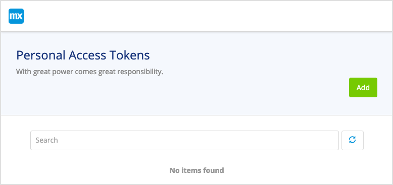
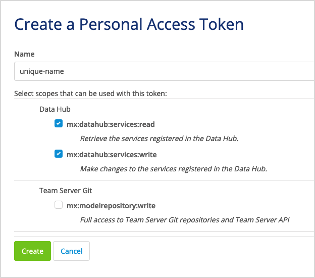
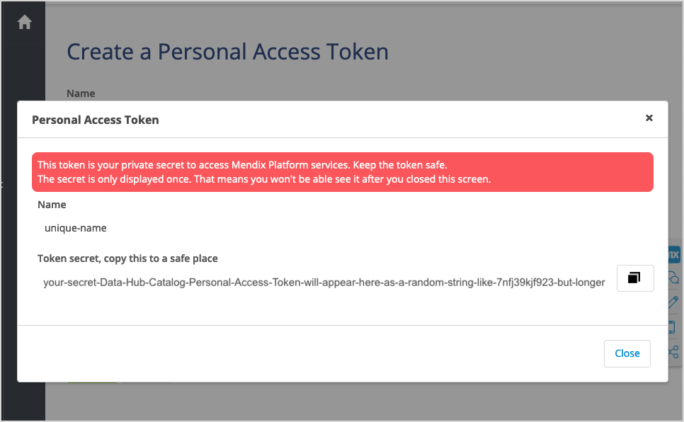

## 1 Introduction

There are three ways to register exposed OData services in the Data Hub Catalog.

**This how-to will teach you how to register a service:**

* Through the Mendix Cloud
* Through the Data Hub Catalog Registration API
* Through the Data Hub Catalog UI form


## 2 Prerequisites

Before starting this how-to, make sure you have completed the following prerequisites:

* Install Studio Pro version [8.14.0 or above](https://marketplace.mendix.com/link/studiopro/)
* You have a Mendix account
* You have an exposed OData service that you're ready to register, or follow sections 3 and 4 in [this how-to](https://docs.mendix.com/data-hub/share-data/) to create one.


## 3 Registering a service through the Mendix Cloud

If you've got:

1. an exposed OData service, that's
2. deployed to the Mendix Cloud,

then congratulations! Your service is already registered in the Data Hub Catalog. This is the power of the Mendix Data Hub.

## 4 Registering a service without the Mendix Cloud

If you aren't using the Mendix Cloud to deploy your Mendix application, there are two other ways to register an exposed OData service in the Data Hub Catalog:

* Through the Data Hub Catalog Registration API
* Through the Data Hub Catalog UI form

The Data Hub Catalog collects metadata about the application and environment where your application is deployed, so you can distinguish similar-looking services from one another. You'll need to provide details about both the application and environment where the service is deployed in order to register your service.

### 4.1 Registering a service through the Data Hub Catalog Registration API

Calling the Data Hub Catalog Registration APIs will allow you to register one (or several at a time) exposed OData service(s). 

First, we'll:

1. create an authentication token to get access to the Data Hub Catalog APIs

The Data Hub Catalog Registration API requires authentication through a Personal Access Token. For every API request you make to a Data Hub Catalog API, include the following key-value pair with your headers:

`Authorization: MxToken <your_Personal_Access_Token>`

To create a Personal Access Token, see [Creating a Data Hub Catalog Registration API token](#create-token).

Once you have a Personal Access Token, we'll follow this series of REST calls to register the details of our exposed OData service:

2. [register the application and retrieve an application UUID](#register-application)
3. use the application UUID to [register the environment, and retrieve the environment UUID](#register-environment)
4. use the application UUID and the environment UUID to [register one service](#register-one-service); or 
5. use the application UUID and the environment UUID to [register multiple services](#register-multiple-services).

The [Data Hub Registration API specification](https://datahub-spec.s3.eu-central-1.amazonaws.com/registration.html) describes all the optional fields, required formats, other operations on these same paths. You'll only the required fields and one operation per path in this how-to. 

#### 4.1.1 Creating a Data Hub Catalog Registration API token {#create-token}

You can create a Personal Access Token in the Mendix **Warden** application: 

1. To access the **Warden** app go to [https://warden.mendix.com/](https://warden.mendix.com/) and log in to land on the Warden homepage.

    

2. To create a new personal access token, click **Add**. The **Create a Personal Access Token** screen is displayed.

3. Enter a unique **Name** for the token. This name will help you identify it on the Warden home screen.

4. In the **Select scopes that can be used with this token:**, find the Data Hub section and check both the **mx:datahub:services:read** and **mx:datahub:services:write** boxes.
	
	
    
5. Click **Create**. The token will be generated and displayed in a pop-up window:

    

6. Copy the **Token secret** and keep it token in a secure place. You will not get another chance to view this token once you **Close** this dialog box.

7. Click **Close** to return to the **Warden** home screen where all your Personal Access Tokens are listed. If needed, you can delete your token from this list using the red trash can button.


#### 4.1.2 Registering an application through the Data Hub Catalog Registration API {#register-application}

To register an application, you'll need:

- a Personal Access Token
- an application `Name`

For more details on what can and cannot be provided in these fields, see the [API specification](https://datahub-spec.s3.eu-central-1.amazonaws.com/registration.html#/Register/post_applications).

Here's an example of a request:

```curl
curl --location --request POST 'https://hub.mendix.com/rest/registration/v3/applications' \
--header 'Content-Type: application/json' \
--header 'Authorization: MxToken <your_Personal_Access_Token>' \
--data-raw '{"Name": "My-Application"}'
```
A successful `POST` call will result in a `201` status code and a JSON response body that includes the details you provided about the application, the location of an application icon, and a unique ID:


```json
{
  "Name": "My-Application",
  "UUID": "1681ca4d-c119-4da9-97d0-f37221d50294",
  "Icon": "https://cdn.mendix.com/image.png"
}
```

Use the application UUID to register your environment.

#### 4.1.3 Registering an environment through the Data Hub Catalog Registration API {#register-environment}

To register an environment, you'll need:

- a Personal Access Token
- an `application_UUID`
- an environment `Name`
- an environment `Location`
- an environment `Type`

For more details on what can and cannot be provided in these fields, see the [API specification](https://datahub-spec.s3.eu-central-1.amazonaws.com/registration.html#/Register/post_applications__AppUUID__environments). 

Here's an example of a request:

```curl
curl --location --request POST 'https://hub.mendix.com/rest/registration/v3/applications/{application_UUID}/environments' \
--header 'Content-Type: application/json' \
--header 'Authorization: MxToken <your_Personal_Access_Token>' \
--data-raw '{"Name": "My-Environment", "Location": "https://my-deployed-application-url.com", "Type": "Production"}'
```

A successful `POST` call will result in a `201` status code and a JSON response body that includes the details you provided about the environment, along with a unique ID:

```json
{
​    "Name": "My-Environment",
​    "Location": "https://my-deployed-application-url.com",
​    "Type": "Production",
​    "UUID": "c82b21d7-465e-479a-86e1-e49830451809",
​    "Application": {
​        "Name": "My-Application",
​        "UUID": "1681ca4d-c119-4da9-97d0-f37221d50294"
​    }
}
```

Use the application UUID and the environment UUID to register one or more services.


#### 4.1.4 Registering one service through the Data Hub Catalog Registration API {#register-one-service}


#### 4.1.5 Registering more than one service through the Data Hub Catalog Registration API {#register-multiple-services}


### 4.2 Registering a service through the Data Hub Catalog UI form
