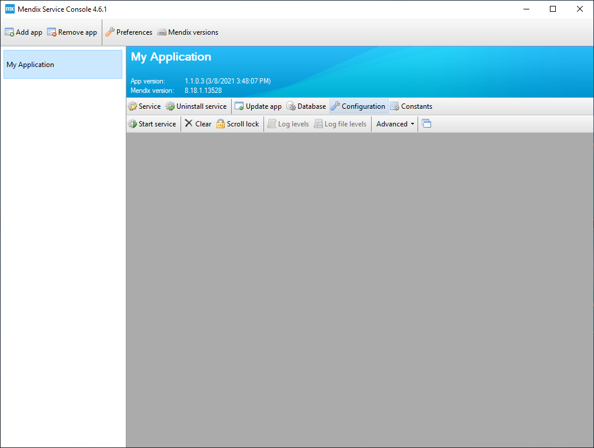
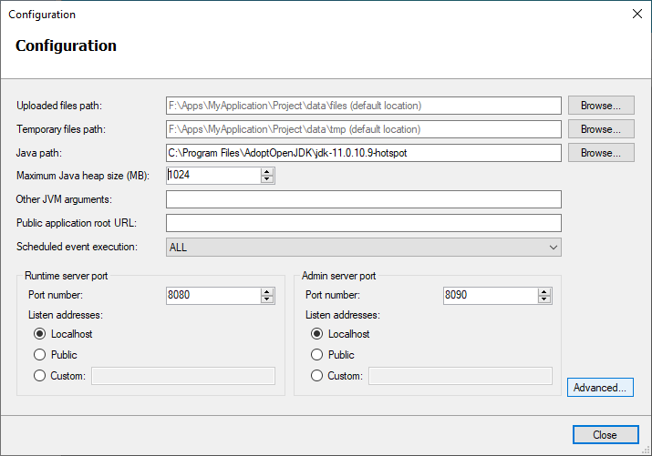
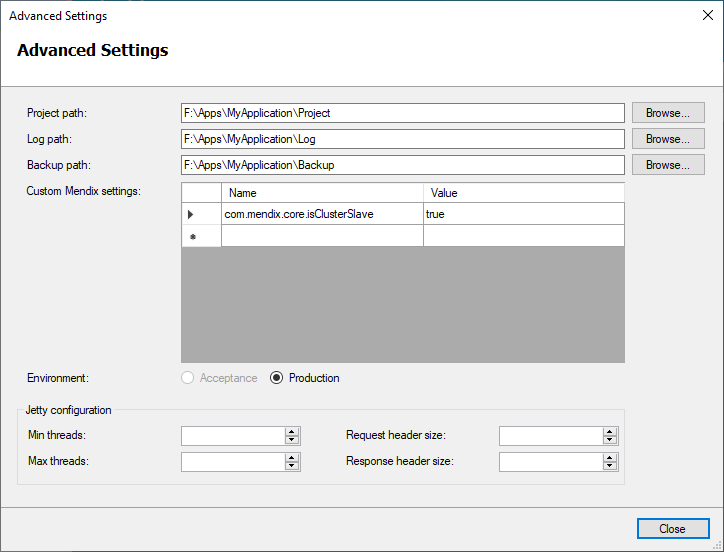
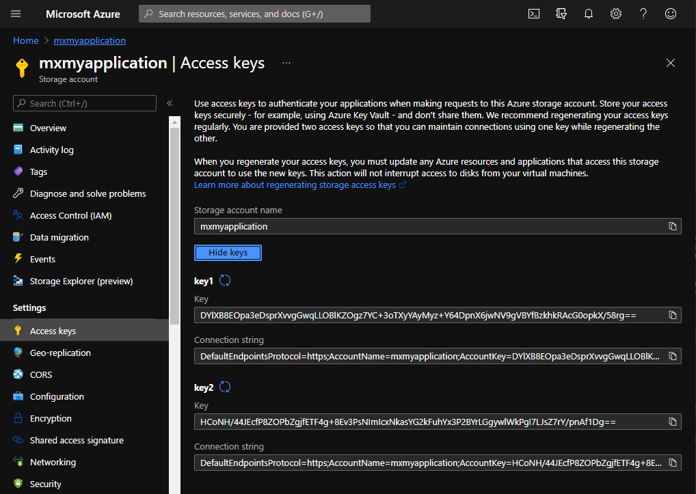
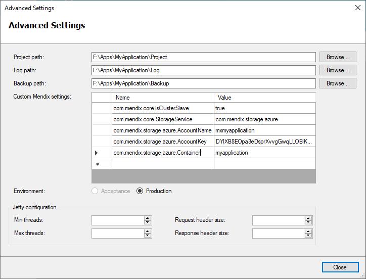

## 1 Introduction

This document describes the installation and configuration of the Mendix software on multiple systems running Microsoft Windows on the Microsoft Azure cloud platform. It covers:

* Setting up an Azure Load Balancer

* Deploying a Mendix app with master and slave nodes

* Configuring Azure Blob Storage as shared storage

## 2 Prerequisites {#Prerequisites}

* An active Azure subscription

* Two or more servers configured as described in the [Deploy Mendix on Microsoft Windows](/deploy/deploy-mendix-on-microsoft-windows) guide. Make sure these servers have an extra data disk added to store the Mendix application files!

* An Azure admin account with sufficient permissions to create or modify:

  * Load balancers

  * Virtual machines

  * Storage accounts

## 3 Configure cluster slave nodes

In a clustered environment there are some tasks (for example, cleaning up expired user sessions from the database) that can only be handled by one of the cluster members. By default, each Mendix app server will execute these tasks, which can lead to issues. Disable executing these tasks on all servers **except one** by adding the Custom Mendix setting _com.mendix.core.isClusterSlave_ to _true_. So if you have a two server cluster, add this on one server and if you have five servers in your cluster, add it on four of them.

1. Select your app and click **Configuration**.

   

2. In the Configuration screen, click **Advanced...**.

   

3. In the Advanced screen add a line to Custom Mendix Settings with Name _com.mendix.core.isClusterSlave_ and value _true_.

   

4. Click **Close** on both screens to return to the Service Console.

## 4 Configuring the Azure Load Balancer

The exact configuration details of the load balancer will depend on your network environment and availability demands. The Mendix Runtime does not require sticky sessions. Make sure you have configured health probes for HTTP (port 80) and HTTPS (port 443), a back-end pool containing all your Mendix application servers and load balancing rules to forward ports 80 and 443 to the servers in the back-end pool using the corresponding health probe.
More information regarding the configuration of Azure Load Balancers is available in [the Microsoft Azure documentation](https://docs.microsoft.com/en-us/azure/load-balancer/quickstart-load-balancer-standard-public-portal?tabs=option-1-create-load-balancer-standard).

## 5 Configuring Azure Blob Storage as shared storage

Go to the Azure Portal to retrieve the Azure Storage account name and an access key:

Then select your application, click **Configuration** and then **Advanced...**. In the Advanced configuration screen, add the following settings:

1. Name: _com.mendix.core.StorageService_, value: _com.mendix.storage.azure_

2. Name: _com.mendix.storage.azure.AccountName_, value: `<your Azure Storage account name>`

3. Name: _com.mendix.storage.azure.AccountKey_, value: `<your Azure Storage access key>`

4. Name: _com.mendix.storage.azure.Container_, value: `<the Azure Storage blob container>`

   

By default, the container will be created in the blob storage if it does not yet exist. More information about the configuration options for Azure Blob Storage in the Mendix Runtime is available here: [Microsoft Azure Blob Storage settings](/refguide/custom-settings#7-microsoft-azure-blob-storage-settings)

## 6 Read More

* [Mendix deployment on Microsoft Windows](/deploy/deploy-mendix-on-microsoft-windows)