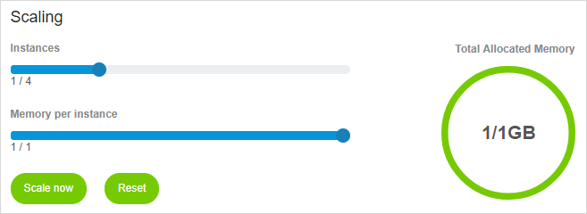
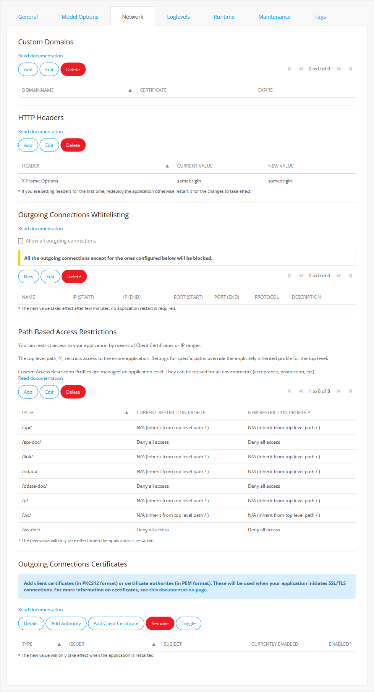
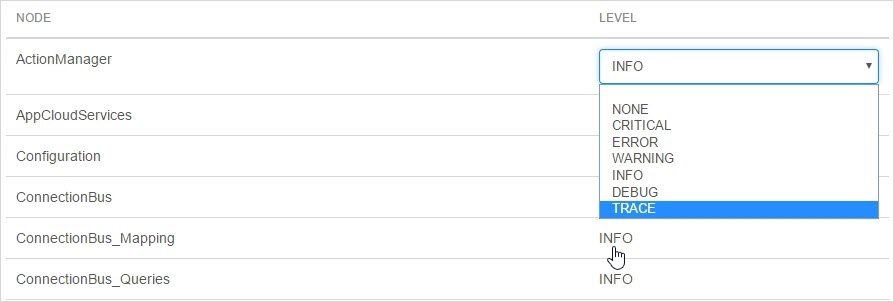
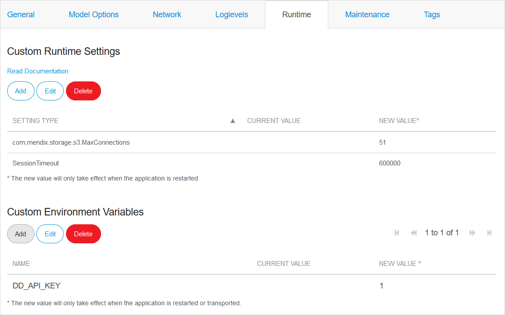

## 1 Introduction

To enter the **Environment details** page, go to the [Mendix Portal](http://home.mendix.com), select your licensed app, click **Environments**, and then click **Details** on the specific environment. 

   

## 2 General Tab

   

The view of the **General** tab depends on the Mendix Cloud version on which the app is hosted. In this tab, you can find the following information about your environment:

*  **Status**
   * White – the environment is stopped or was never deployed
   * Green – the environment is working correctly
   * Orange – the environment has warnings
   * Red – the environment is not working correctly

           

* **Running since** date – the date on which the app was started
* **Name** – the type of environment (Test, Acceptance, Production or the name of a [flexible environment](/developerportal/deploy/mendix-cloud-deploy#flexible-environments)): see section 2.2 [Naming of Environments](#naming) for more information
* **URL** – the URL of the app
* **Project ID** – the unique identifier for your Mendix app
* **Environment ID** – the unique identifier of this environment
* **Custom domains** – the custom domains of the app
* **Java Version**
   * Up to Mendix version 5.17, the version of Java is 1.7
   * In Mendix version 5.18, you can choose between Java version 1.7 and 1.8
   * From Mendix version 6, you cannot choose the Java version, and it is always version 1.8
* **Web Modeler Target** – whether this environment is the one where apps will be deployed from the Web Modeler - see [Web Modeler Deployment Settings](web-modeler-deployment-settings) for more information
* **Plan** – (*Cloud V4 only*) the type of plan covered by this licence
* **Instances** – (*Cloud V4 only*) A summary of the number and memory allocation of *instances* of this environment: see section 2.3, [Scaling...](#scaling) for more information
* **Database Status** – (*Cloud V3 only*) this is **Running** by default
* **Database Version** – the PostgreSQL version that is supporting the database
* **Region** - the region where the app is hosted
* **Mendix Cloud Version** – Mendix Cloud v3/Mendix Cloud v4

At the bottom of the page there are three overview sections. These are described below in section 2.4, [Overviews](#overviews)

### 2.1 Actions

On the right side of the screen, you can find the following action buttons:

* **Restart Application**
* **Start/Stop Application**
* **Show Logged in Users**
* **Change Admin Password**

#### 2.1.1 Logging and Debugging in Mendix Cloud v4

In Mendix Cloud v4 environments, you have two additional action buttons:

* **View Live Log**
* **Show debugger information** to show the settings to connect the debugger in your Mendix Desktop Modeler to your app. For Mendix Cloud v4, the debugger is *always* enabled.

#### 2.1.2 Logging and Debugging in Mendix Cloud v3

In Mendix Cloud v3 environments, you have two additional action buttons:

* **View Current Log**
* **Enable/Disable Debugging** to enable or disable the debugger option. For more information about enabling the debugger, see [How to Debug Microflows Remotely](/howto7/monitoring-troubleshooting/debug-microflows-remotely)

### 2.2 Naming of Environments – Flexible Environments in Mendix Cloud v4{#naming}

If you are the [Technical Contact](/developerportal/company-app-roles/technical-contact) of the app, you can rename the environments as you wish.

Click the **Change** button next to the name of the environment.

{}
The name must be at least two characters and consist of alphanumeric characters and hyphens (`a-z`, `A-Z`, `0-9`, and `-`) but cannot begin or end with a hyphen.

If you rename an environment, it may take up to 15 minutes before you can access an app via its URL. This is because the URL includes the name of the environment and the old value needs to be removed from the DNS cache. It may take considerably longer for the change to be visible worldwide.
{}

### 2.3 Scaling – Mendix Cloud v4{#scaling}

If your app is hosted in Mendix Cloud v4, you will see a section named **Instances** in the **General** tab. Click the **Change scaling** button to see the options for changing the scaling.

In **Scaling**, there are two sliders that you can control:

* Use the **Instances** slider to increase or decrease the amount from one to four instances by sliding the slider
   * The instances are meant for improved resiliency and increased processing power
   * The minimum amount of RAM memory per instances is 1GB; you can spread the RAM memory among four instances if you have more than 1GB of RAM memory
* Use the **Memory per instance** slider to increase or decrease the memory amount per instance by sliding the slider

The **Total Allocated Memory** is a process circle that shows how much memory is currently used for scaling.

If you have 1GB RAM of the **Total Allocated Memory**, you have one instance available to store your memory.

To scale your memory over multiple instances, you need more memory.

### 2.4 Overviews{#overviews}

At the bottom of the page, there are three overview grids with information about the information below.

#### 2.4.1 Deployment Package Details

In this section, you can find information about the deployment package that is currently loaded into the environment:

* **Name** of the deployment package
* **Version** of the deployment package
* **Runtime** version of Mendix used to create the app
* **Size (MB)** of the deployment package
* **Upload date** of the deployment package

#### 2.4.2 Plan Details - Mendix Cloud v4

This section shows details of the plan which applies to this environment.

#### 2.4.3 License

The license overview contains the following information:

* **Company** owning the license
* **Is Production** shows if this environment is licensed as a production environment
* **Expiration date**
* **Runtime mode** (Production, Acceptance, Test)
* **Limitations**
    * **Limitation type** (see below for details)
    * **Amount type**
    * **Number of allowed users**

The limitation types are the following:

* **Concurrent** – the number of named users that are logged in simultaneously
* **Concurrent anonymous** – the number of anonymous users that are logged in simultaneously
* **Named** – the number of named users registered in the database that are allowed to use the application

## 3 Model Options Tab

On this tab, you can edit the model options described below.

### 3.1 Scheduled Events

In this section, you can view your configured scheduled events.

If you select a scheduled event and click **Toggle**, you can switch the scheduled event off and on.

{}

You have to restart your application before the changes will be made.

{}

With scheduled events, you can let the Runtime execute a microflow at a specific moment in time. The event can also be repeated with a given interval (for example, every day).

For more information, see [Scheduled Events](/refguide/scheduled-events).

### 3.2 Constants

In this section, you can view the configured constants. Constants are used to define configuration values that can differ per environment.

To fill in a new value, select the constant and click **Edit**.

{}

You have to restart your application before the changes will be made.

{}

For more information, see [Constants](/refguide/constants).

## 4 Network Tab

{{% image_container width="50%" %}}

{}

On this tab, you can manage the elements described below.

### 4.1 Custom Domains

* **Domain name**
* **Certificate**
* **Expire** date

You can perform the following actions:

* **Create** (in which you have to provide the **domainname** and select the **certificate** from a drop-down menu)
* **Edit**
* **Delete**

For more information, see [Certificates](certificates) and [Custom Domains](custom-domains).

### 4.2 HTTP Headers

{}
This replaces the option to prevent embedding your app in an IFrame with more flexible options to set HTTP Headers.
{}

* Access-Control-Allow-Origin
* Content-Security-Policy
* Referrer-Policy
* X-Content-Type-Options
* X-Frame-Options
* X-Permitted-Cross-Domain-Policies
* X-XSS-Protection

<!-->
### 4.2 Prevent Embedding Your App in an IFrame

Your application can be embedded in another site using an IFrame. To prevent this, you can deny embedding using the setting below. This will set an X-Frame-Options header for each HTTP response from your app. Please note that Chrome will ignore the **Allow from specific domain** option.

The embedding options are:

* **Allow**
* **Never allow**
* **Allow on the same domain**
* **Allow from specific domain**

-->

### 4.3 Path-Based Access Restrictions

You can restrict access to your application by means of Client Certificates or IP ranges.

The top level path (`/`) restricts access to the entire application. Settings for specific paths override the implicitly inherited profile for the top level.

Custom access restriction profiles are managed at the application level. They can be reused for all environments (acceptance, production, etc).

The **Path based access restrictions** overview contains the following information:

* **Path**
* **Current Restriction Profile**
* **New Restriction Profile**

You can **Delete** a path or you can **Add** and **Edit** a path with the following restriction types:

* Allow all access
* Deny all access
* Custom Profile for Client Certificates and/or IP ranges
* N/A (inherit)

For more information, see [How to Restrict Access for Incoming Requests](access-restrictions).

### 4.4 Outgoing Connections Certificates

Add client certificates (in the PKCS12 format) or certificate authorities (in the PEM format). These will be used when your application initiates SSL/TLS connections.

## 5 Log Levels Tab

   

Log levels are used to distinguish the log messages and to highlight the highest priority ones so that they can receive the immediate intervention they require.

On this tab, you can perform the following actions:

* Retrieve the current log levels by clicking **Refresh**
* Change the log level type by clicking the specific level
* Click **Set all to INFO** to revert all the changes

The log level types are the following:

| Level | Color | Description
| --- | --- | --- |
| **Trace** | | More detailed information. These are only written to logs. |
| **Debug** | | Detailed information, typically of interest only when diagnosing problems. |
| **Info**  | | Confirmation that things are working as expected. |
| **Warning** | Orange | Indicates that something unexpected happened or that there is some problem in the near future (for example, "disk space low"). The application is still working as expected. |
| **Error** | Red | Due to a more serious problem, the application has not been able to perform some function. |
| **Critical** | White (text), red (background) | A serious error has occurred, indicating that the application itself may be unable to continue running. |

For more information about log levels, see [How to Set Log Levels](/howto/monitoring-troubleshooting/log-levels).

## 6 Runtime Tab{#runtime-tab}

On this tab, you can add **Custom Runtime Settings** and **Custom Environment Variables**

   

### 6.1 Custom Runtime Settings

Use the Custom Runtime Settings section to perform the following actions:

* **Add** a new runtime **setting** with a new **value**
* **Edit** the runtime setting
* **Delete** the runtime settings

For more information about runtime settings, read the [Custom Settings](/refguide/custom-settings) and [Tricky Custom Settings in Mendix Runtime](/refguide/tricky-custom-runtime-settings) documentation.

The Mendix Cloud uses runtime settings to configure the included systems for logs, backups, and database. Therefore, the following settings are **not** configurable by users:

* `com.mendix.core.localfilesystem.cleaning.isEnabled`
* `com.mendix.core.localfilesystem.cleaning.time`
* `CACertificates`
* `ClientCertificatePasswords`
* `ClientCertificates`
* `DatabaseHost`
* `DatabaseJdbcUrl`
* `DatabaseName`
* `DatabasePassword`
* `DatabaseType`
* `DatabaseUserName`
* `DatabaseUseSsl`
* `DTAPMode`
* `EnableSessionFingerprinting`
* `JavaKeyStorePassword`
* `LogFileName`
* `MaxLogFileCount`
* `MaxLogFileSize`
* `MicroflowConstants`
* `MyScheduledEvents`
* `OracleServiceName`
* `ScheduledEventExecution`
* `TempPath`
* `WebServiceClientCertificates`

### 6.2 Custom Environment Variables

Use the Custom Environment Variables to **add**, **Edit**, or **Delete** an environment variable.

Unlike the Custom Runtime Settings, the variables you add have to be chosen from a drop-down list. The variables are:

* **DD_API_KEY** – the API key used with Datadog
* **DD_LOG_LEVEL** – the log level of logging sent to Datadog
* **DATABASE_CONNECTION_PARAMS** – Additional JDBC parameters for PostgreSQL databases, see the [Mendix Cloud Foundry Buildpack](https://github.com/mendix/cf-mendix-buildpack) for more information
* **APPMETRICS_TARGET** – setting this enables business events to be sent to a different monitoring solution from the technical events 

## 7 Maintenance Tab

   

There are two types of maintenance:

* Regular weekly maintenance (which does not affect your app), during which you can change the preferred maintenance window
* Planned maintenance (which will affect your app in some ways), about which you will automatically receive an email and you can override the maintenance window if necessary

For more information about maintenance, see [Maintenance Windows: Configuration](maintenance-windows).

### 7.1 Preferred Maintenance Window

You can view and change the preferred maintenance.

### 7.2 Planned Maintenance

When a maintenance operation is planned, it will show up under **Planned Maintenance**. By default, this will be planned in your preferred maintenance window. You can override the maintenance window of a specific maintenance operation by clicking **Override**.

You will automatically receive **email notifications** about planned maintenance.

## 8 Tags Tab

You can set tags on your environment. These are arbitrary strings that are not interpreted by the Developer Portal. Tags serve two purposes:

* Custom tags can be added to metrics for third-party metrics solutions
* Tags can serve as selection criteria for grouping environments into a landscape management dashboard which can be used for third-party logging solutions

For example, you may wish to use tags when logging with *Datadog*. You can find more information on this at [Getting started with tags](https://docs.datadoghq.com/tagging/) on the *Datadog* site.
