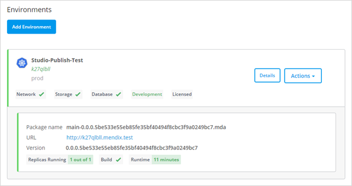
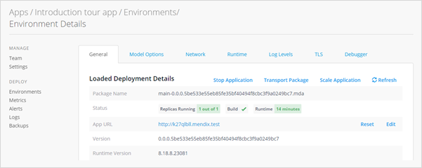
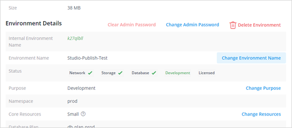
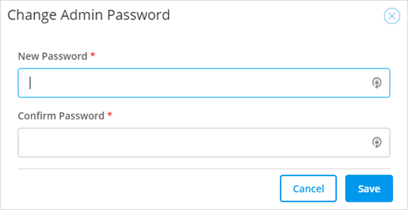
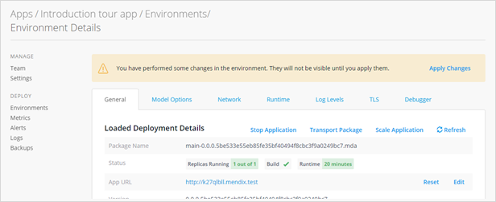
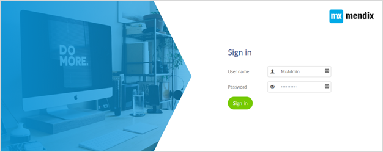
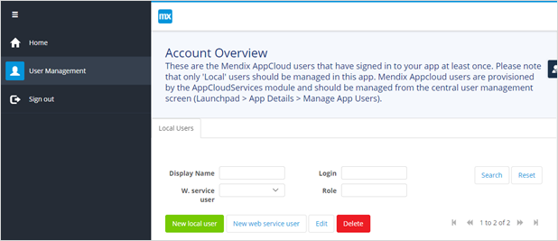
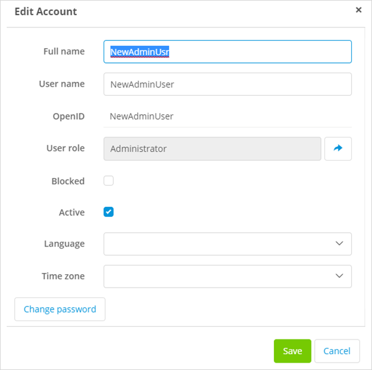
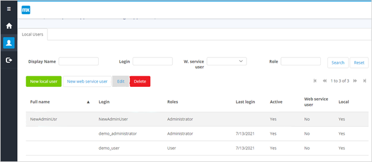

{}
This documentation is only relevant to customers deploying their Mendix app on the Tencent Cloud.
{}

{}
 For the Simplified Chinese translation, click [中文译文](https://cdn.mendix.tencent-cloud.com/documentation/deploy/tencent-local-users-in-studio.pdf).
{}

## 1 Introduction

Mendix gives you various ways to manage your App's users.

With Mendix Studio Pro, you can configure an Administrator account directly in your security settings. See [Administrator](/refguide8/administrator) for more information.

With Mendix Studio on Tencent Cloud, it’s also possible to directly publish your app to your deployment environment and manage your app’s users locally from there. For your convenience, we’ve included the “Administration” module in the starter app template to make that happen. This article guides you through accessing this and managing users.

## 2 Accessing the Administrator Account

For each app published from Mendix Studio on Tencent Cloud, a default administrator user is created.

### 2.1 Administrator Properties

In the **Administrator** tab the following properties are available:

- User name
- Password
- User role

#### 2.1.1 User Name
The user name is used to sign into the application as the Administrator.
Default: *MxAdmin*
{}
Since this is general knowledge, it is safer to change this to a custom user name after you’ve obtained access to the user administration of your app.
{}

#### 2.1.2 Password
The password is used to sign into the application as the Administrator. You can change the password from the Developer Portal after publishing your app.

#### 2.1.3 User Role
The user role assigned to the Administrator. For more information, see [User Roles](/refguide8/user-roles).
Default: *Administrator*

{}
The administrator is always created and has the System.Administrator role by default. The System.Administrator role allows users of your application to be managed.
{}

{}
When your app is deployed on Tencent Cloud, changes to the user role of the administrator account will not be applied until the administrator password is changed. See the [Action Buttons](tencent-deploy#change-admin-password) section of *Deploying a Mendix App on Tencent Cloud (腾讯云)* for instructions on changing the admin password.
{}

### 2.2 Changing the Default Administrator Password

You will want to change the default administrator password to allow you to log in and manage the users within your app.

To do this, follow the steps below:

1. Go to the Environment details page of your app by opening the Developer Portal, selecting your app, and clicking **Environments**.

    

2. Choose the environment where your app is published, and click **Details**.

    

3. Open the [General tab](tencent-deploy#environment-details) on the *Environment Details* page.

    You will see information about your running app. Most of the information is self-explanatory, but the status information gives you a quick summary of the status of the environment and the app deployed there.

    There are also buttons which allow you to perform various actions on your app and environment.
    
4. Click **Change Admin Password**.

    

5. Enter and confirm a **New Password** for the local admin user in your app.

    This enables you to change the password without having to change it in Studio Pro and redeploy the app.

    

6. Click **Apply Changes** to enable the new password.

    

## 3 Managing App Users

Using your freshly updated login credentials, you are ready to start managing your users. The *Administration* module is included in every new blank app. This section describes how to log into your newly published app and visit the **User Administration** section.

### 3.1 Introduction

The Administration module, which is included in every new blank app, contains administration functionality to manage App Users and to see App statistics like runtime information, sessions and schedules events.

The administration module allows the following functions:

* Management of User Accounts
* Read-only overview of:
    * all active sessions
    * all schedules events
    * all runtime instances
    * Runtime statistics

### 3.2 Accessing User Management

This section describes how to access the user management screen(s) from the Administration module included in your Mendix App.

1. Open your newly deployed app using its *App URL*

2. Log in with the [default Admin username](/refguide8/administrator#user-name) and your [newly changed Admin Password](/refguide8/administrator#password).

    

3. Select the **User Management** option from your App’s navigation menu. You will see this option because you are logged in as administrator.

    

{}
If you created your app using an older version of Mendix, the Administration module might not be available to you. Please consult [How to Import & Export Objects](/howto8/integration/importing-and-exporting-objects) to import the Administration module into your app and redeploy.
{}

### 3.3 Managing User Accounts

This section describes how to create and manage user accounts from the Administration module as embedded in your Mendix App.

#### 3.3.1 Creating a New Local User

Local users, their personal information, and authentication details are maintained within entirely within your Mendix app 

Click **New local user** in the User Management Overview and fill out the required fields to create a new local user.

Under **User role**, select the appropriate role. Your app is configured by default with the *Administrator* and *User* roles.

#### 3.3.2 Editing an Existing Local User

Select the user’s row in the overview and click **Edit** to edit an existing local user.

Change the user properties where necessary and click **Save**.

#### 3.3.3 Creating or Editing Web Service Users

To access web services published by your app, other apps may need to authenticate themselves with your Mendix App. 

The User Management Overview allows you to create *Web Service Users*. These are users which do not log into your app, but allow other (Mendix) apps to connect to your Mendix App [when publishing Web Services](/refguide/published-web-services). You can create dedicated a web service user account for each consumer of your Mendix App’s *Web Services*.

Simply select **New web service user** in the User Management Overview and fill out the required fields.

