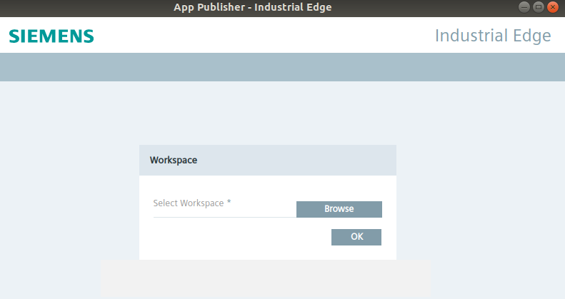
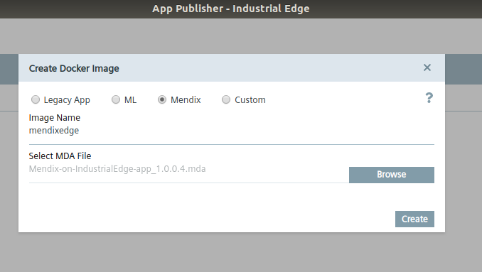
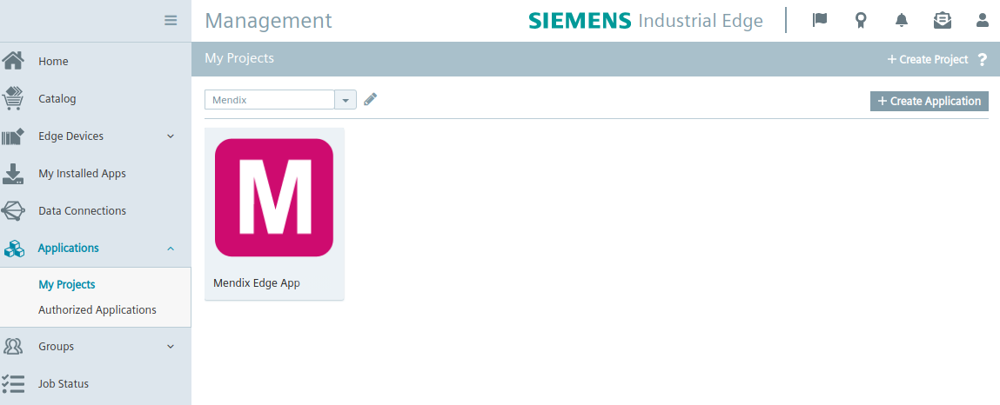
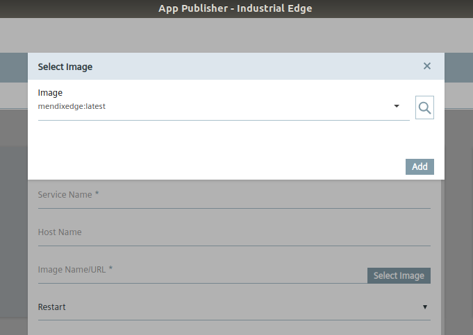

## 1 Introduction

[Industrial Edge](https://new.siemens.com/global/en/products/automation/topic-areas/industrial-edge/production-machines.html) is the SIEMENS platform to host applications from different vendors on a computing platform close to the shopfloor. Thus enables the extensions of automation, deployment of demanding streamprocessing and learning algorithms as well as the hosting from integration code to site automation.

SIEMENS Industrial Edge empowers factory operators to create custom applications on the Mendix low-code platform that run locally as Edge Apps. 

{}
This documentation is meant for Mendix developers who want to bring their app to the Industrial Edge.
{}

Siemens Industrial Edge provides [App Publisher](https://support.industry.siemens.com/cs/us/en/view/109799477), a tool installed on a development PC to convert Mendix Applications to Industrial Edge Apps. Industrial Edge Publisher is available for windows and Linux operating systems.

## 2 Prerequisites{#prerequisites}

To covert your Mendix app to Industrial Edge App you need the following prerequisites.

* A **deployment package (.mda)** for Mendix Application
* [Industrial Edge App Publisher UI/CLI ](https://support.industry.siemens.com/cs/us/en/view/109799477) installed on you developement pc. 

    App Publisher Version requirements -
    * UI Version >= 1.2.8 
    * CLI version >= 1.3.3
* [Docker](https://docs.docker.com/get-docker/) with [tcp Socket enabled](https://docs.docker.com/engine/reference/commandline/dockerd/) for Docker daemon
* [Industrial Edge Management System(IEM)](https://support.industry.siemens.com/cs/us/en/view/109799508) to deploy your application.

The following are also required if you want to test your Mendix Edge app deployed on IEM:

* [Industrial Edge Device(IED)](https://support.industry.siemens.com/cs/us/en/view/109799507) to install Mendix app deployed on IEM


## 3 Convert Mendix app to Edge App

To convert your Mendix app into an Edge app, please follow the instruction mentioned below.

### 3.1 Create a deployment package of your Mendix app

[Create deployment package(.mda)](/refguide/mxbuild) of your application

### 3.2 Create Docker Image of Mendix App using 

For all the below steps please refer to Industrial Edge App Publisher [Document](https://support.industry.siemens.com/cs/us/en/view/109799477)

#### App Publisher UI {.active}

* Select Workspace(an empty folder) which will be used by App Publisher to store application related data.


* Connect to the Docker daemon

* Connect to an Industrial Edge Management

* To create a docker image of Mendix app 
    * Click on **Create Image** and select **Mendix**
    * Enter the name of docker image to be created and click on **Browse** to select **deployment package(.mda)** of Mendix app.
    * Click on the **Create** button.


#### App Publisher CLI
  
* Connect to the Docker daemon
```shell
 ie-app-publisher-linux de c -u http://127.0.0.1:2375
```
* Create docker image of Mendix app 
```shell
ie-app-publisher-linux im c -n mendixedge:latest -f /root/mymednixapp.mda
```

Once the image is built, the next step will be to [create an Application on IEM](https://support.industry.siemens.com/cs/us/en/view/109799510)

## 4 Creating Mendix Edge App 

Now that you have to build a docker image of your Mendix application, you need to create Industrial Edge Application and its version on IEM. Please follow the below steps:

### 4.1 Creating Application on IEM

* Connect your IEM to your browser and login into it.
* [Create a Project and then under that project create an application](https://support.industry.siemens.com/cs/us/en/view/109799510).
* Once you have created an application on IEM, now we have to create a version of your IEM application


**_Note._** _You can skip this step if you want to create a standalone application, which does not require IEM connection in App Publisher._

### 4.2 Creating application Version

#### App Publisher UI

* Click on Mendix Edge Application 
* Click on **Add New Version**
* Now fill all the docker compose configurations needed for your mendix application in the wizard provided by App Publihser
* Select the image in the wizard which you have created in Step 3.2

* Click on **Save** and **Review**
 ```yaml
    version: '2.3'
        services:
            mendixapp:
                image: mendixedge:latest
                healthcheck:
                    test: ['CMD', 'curl', '-f', 'http://localhost']
                    interval: 15s
                    retries: 2
                    start_period: 10s
                    timeout: 3s
                environment:
                    - ADMIN_PASSWORD: Password1!
                    DATABASE_ENDPOINT: mysql://mendix:mendix@db:3306/mendix
                ports:
                    - 8080:8080
                links:
                    - db
            db:
                image: mysql:5.7
            environment:
                - MYSQL_USER=mendix
    - MYSQL_PASSWORD=mendix
    - MYSQL_DATABASE=mendix
    - MYSQL_ROOT_PASSWORD=root
    ports:
    - 3306:3306
```
* Click on **Validate & Create** button, it will create the version metadata your workspace which you have selected in Step 3.2
* You can still edit your application, to upload the created version click on the **Start Upload** button. Your Docker Compose Yaml for Mendix Application will look like this


**_Note._** _This is just an example, your compose file can be different depending on the application._


#### App Publisher CLI

* Initialize a Workspace, Create an empty folder, and inside that folder run below command
```shell
 ie-app-publisher-linux ws i
 ```
* Connect to an Industrial Edge Management 
```shell
 ie-app-publisher-linux em li -u "https://int.portal.t.edge.siemens.cloud" -e user@siemens.com -p P@ssword123
 ```
* List Project and its Applications to fetch the 'applicationId' which will be needed for creating a version
```shell
 ie-app-publisher-linux em pr l -k "projectId, name"
 ie-app-publisher-linux em pr la -p "758aa412254545465" -k "applicationId, title"
 ```
* Create version of Mendix application
```shell
 ie-app-publisher-linux em app cuv -a '39853716a55048c9935e451a63eecc89' -v '0.0.1' -y './docker-compose.yml' -c 'change logs' -n -n {"mendixapp":[{"name":"mendix","protocol":"HTTPS","port":"8080","headers":"","rewriteTarget":"/"}]}  -s 'mendix' -t 'FromBoxReverseProxy' -u '8080' -r '' 
 ```


## 5 Installing Your App on IED

* Make sure you have [IED added to your IEM](https://support.industry.siemens.com/cs/us/en/view/109799507)
* Connect your IEM to your browser and login into it.
* Click the tile of the app you want to install, to install a version click on the install action icon of the corresponding version.
* Select the Edge Device on which you want to install the version and click on the "Install Now" button.

_For more information on how to install please refer to this [link]((https://support.industry.siemens.com/cs/us/en/view/109799510))_


## 6 More info

See below document links for more help on Industrial Edge operations:

* [Industrial Edge Device](https://support.industry.siemens.com/cs/us/en/view/109799510)
* [Industrial Edge Management](https://support.industry.siemens.com/cs/us/en/view/109799507)
* [Industrial Edge App Publisher](https://support.industry.siemens.com/cs/us/en/view/109799477)
