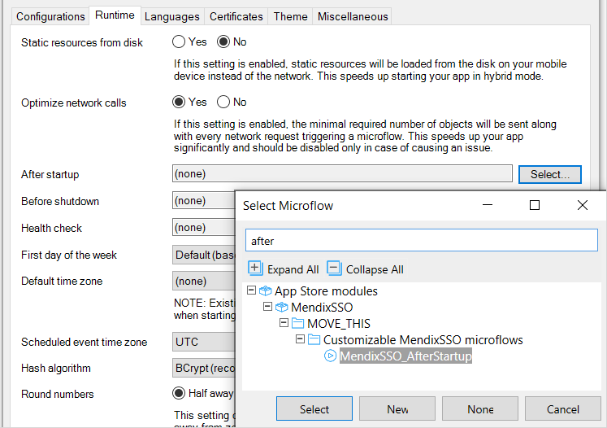

## 1 Introduction

{}[Add AppStore Link - several instances]{}

The [MendixSSO module](https://appstore.home.mendix.com) allows you to specify that users of your app can be authenticated using their Mendix account credentials.

Using Mendix accounts means that you do not need a special authorization module to support resetting and changing passwords, and makes it easy to create multiple applications which all use the same sign-on mechanism.

Mendix starter apps come with the Mendix SSO module already available. All you have to do is to set your security level to **Production** and your end-users will be able to sign on.

If your app does not have the MendixSSO module, it is available from the Mendix App Store here: [Mendix SSO](https://appstore.home.mendix.com). Follow the instructions in [How To Use App Store Content](/developerportal/app-store/app-store-content) to import it into your app and then follow the instructions in [Setting Up Mendix Single Sign-On](#setting-up), below.

If you need a newer version of the Mendix SSO module (for example, to use a new feature), then it is also available from the App Store via the same link.

You can see if your app has the Mendix SSO module by looking in the **App Store modules** section in the **Project Explorer** for your app project.

## 2 Using Mendix Single Sign-On

## 3 Removing Mendix Single Sign-On

## 4 Setting Up Mendix Single Sign-On{#setting-up}

{}
These instructions are for apps which did not originally have the MendixSSO module. For example, if you have an existing app which did not have the MendixSSO App Store module.

You do not have to follow these steps for apps (for example, starter apps) which already have Mendix SSO, or if you are upgrading an existing MendixSSO module to a newer version.
{}

To enable Mendix SSO in your app, if it does not have it set up already, you need to follow the following steps:

1. Import the MendixSSO module from the [Mendix App Store](https://appstore.home.mendix.com).

2. Add the microflow **AfterStartup_MendixSSO** to the **After startup** microflow.
    * Open **Project Settings** from the **Project Explorer**
    * Click the **Runtime** tab
    * Click **Select…** for the **After startup** microflow
    * Choose the microflow **App Store modules** > **MendixSSO** > **Public** > **Default Implementation** > **Microflows** > **AfterStartup_MendixSSO** (you can use the filter to find it quickly) and click **Select**
    
    * Click **OK** to close the **Project Settings**
    {}If there is already an After startup microflow, you should not replace it, but rather add the AfterStartup_MendixSSO microflow as the first action in the existing microflow{}

3. Add the pages **MyAccountViewEdit** and **UserOverview** to the app navigation.
    * Open **Navigation** from the **Project Explorer**
    * Click **New item** to add a new navigation item
    * Enter the following values and click **OK**
        * **Caption** – *My Account*
        * **Icon** – *Glyphicon 'user'* (click **Select…** and search for `user`)
        * **On click** – *Show a page* **App Store modules** > **MendixSSO** > **Public** > **Default Implementation** > **Pages** > **User** > **MyAccountViewEdit**
    * Repeat the above to add another **New item** with the values
        * **Caption** – *User Overview*
        * **Icon** – *Glyphicon 'lock'*
        * **On click** – *Show a page* **App Store modules** > **MendixSSO** > **Public** > **Default Implementation** > **Pages** > **Admin** > **UserOverview**

4. Turn on **Production** security level and give **User roles** *User* and *Administrator* access to the **MendixSSO** module.
    * Open **Project Security** from the **Project Explorer**
    

## 5 Modifying Mendix Single Sign-On
