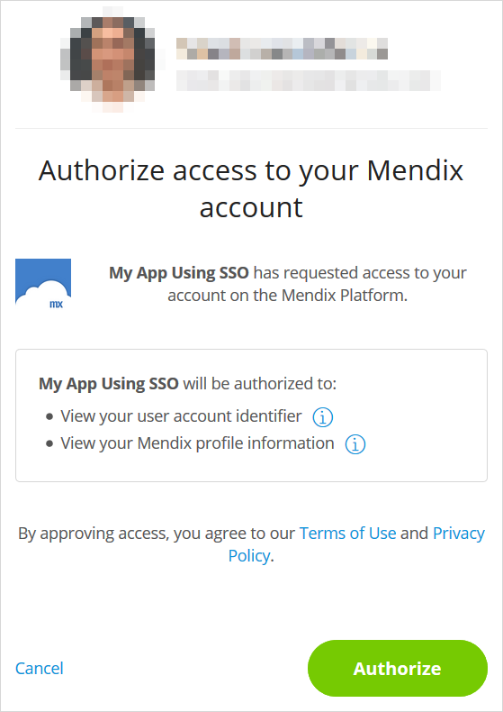
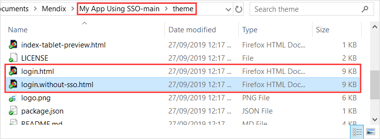
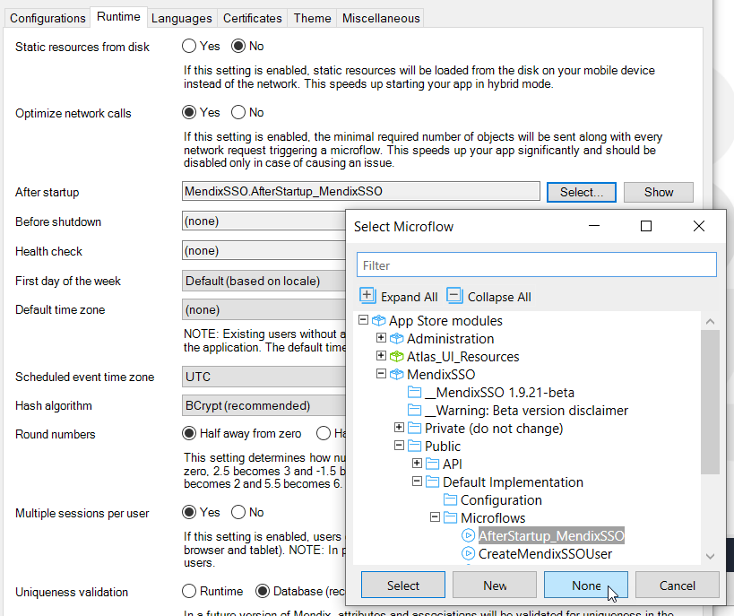
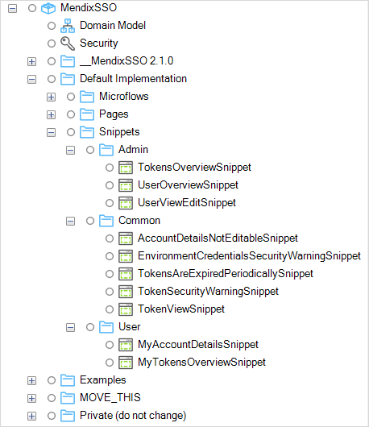
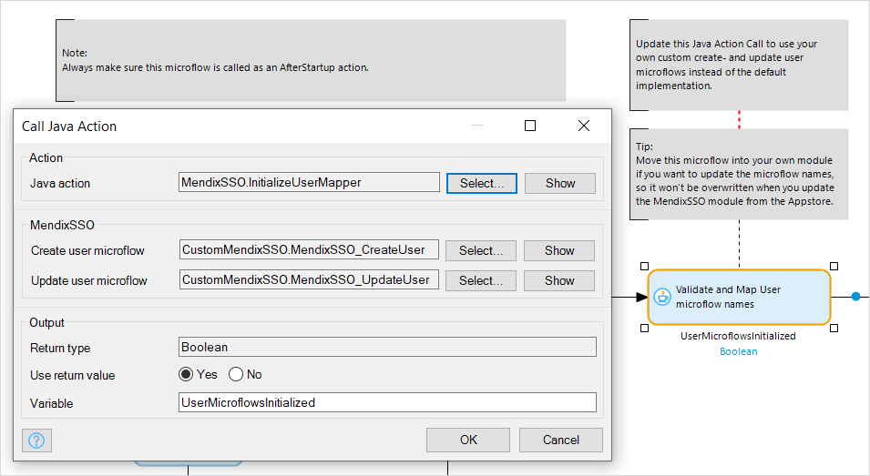
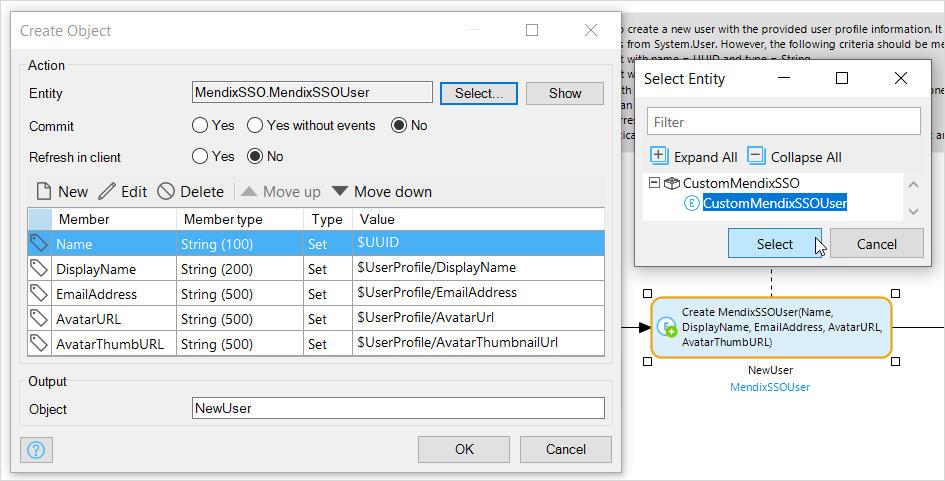
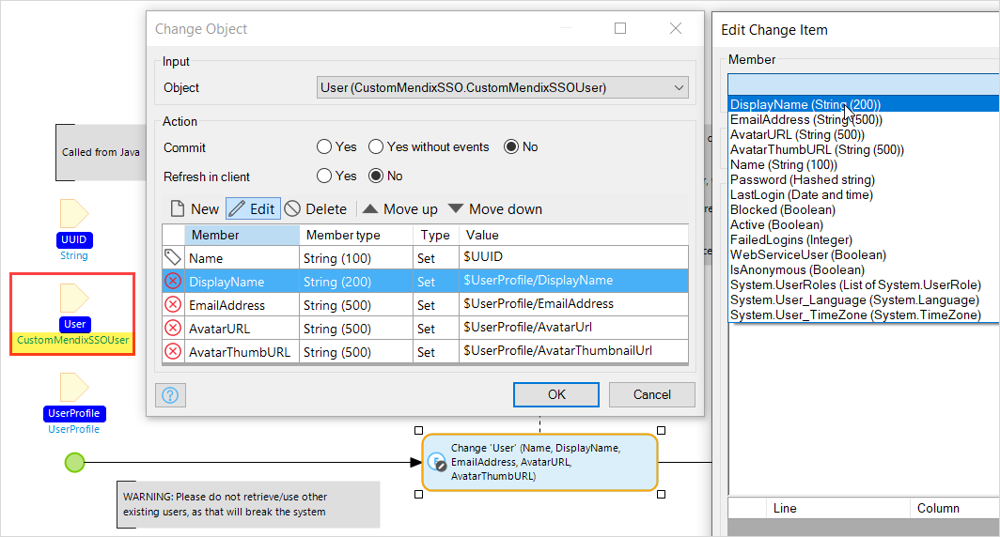
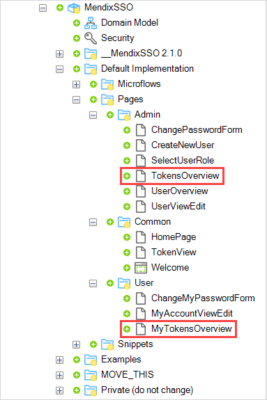
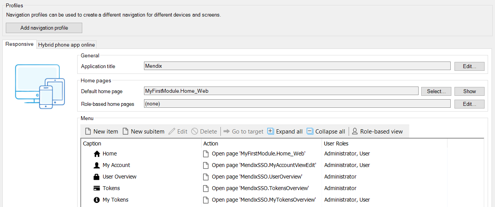
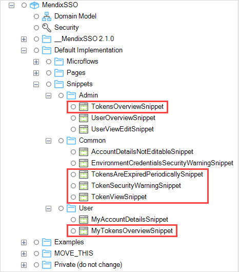

## 1 Introduction

The [Mendix SSO module](/appstore/modules/mendix-sso) enables your app end-users to sign in with their Mendix account when your app is deployed to the Mendix Cloud.

{}
Mendix Single Sign-On is only activated when your app is deployed to the Mendix Cloud. When you run your app locally, or on another cloud, you will need to use local credentials.
{}

Using Mendix accounts has the following benefits:

* You do not need a special authorization module to support resetting and changing passwords
* It is easy to create multiple applications which all use the same sign-on mechanism

In addition, the Mendix SSO module has a default implementation for user administration. This can be used in any Mendix app, but if you want to implement customized user administration this is also possible. See [Customizing Mendix SSO](#customizing), below, for more information.

We are in the process of adding the Mendix SSO module to the Mendix app templates. Where it has been added, all you have to do is to set your security level to **Production** and your end-users will be able to sign in.

You can see if your app has the Mendix SSO module, and which version it has, by looking in the **Marketplace modules** section in the **App Explorer** for your app. The version number is recorded in the **Version** constant within the module.

If your app does not have the Mendix SSO module, it is available from the Mendix Marketplace [here](https://marketplace.mendix.com/link/component/111349/). Follow the instructions in [How to Use Marketplace Content in Studio Pro](/appstore/general/app-store-content) to import it into your app and then follow the instructions in [Setting Up Mendix Single Sign-On](#setting-up), below.

If you need a newer version of the Mendix SSO module (for example, to use a new feature), then it is also available from the Marketplace via the same link.

## 2 Using Mendix SSO

{}
Mendix Single Sign-On is only activated when your app is deployed to the Mendix Cloud. When you run your app locally, or on another cloud, you will need to use local credentials.
{}

### 2.1 Signing On as an End-User

When you open an app as an end-user, and this is the first time visiting the app environment *or* you have not opened the app recently, you will see the Mendix SSO sign-on screen. You can still choose to sign-on with local user credentials, but to use your Mendix Account with Mendix SSO, click  the **Mendix Account** button.

Every app implementing Mendix SSO needs some of your profile information (like your account identifier and your display name) to work. So for each environment (for example, myapp running in acceptance), the first time you sign in as an end-user using Mendix SSO the app will ask you to authorize access. This means that the app can access certain information held in your Mendix profile as specified on the authorization page.

Click **Authorize** to continue using Mendix SSO with this app. After authorizing the app you are automatically signed in to the app.

### 2.2 Assigning End-user Roles

Give end-users access to your app through the [Manage App Users](/developerportal/collaborate/general-settings#managing-app-users) page of the Developer Portal. You can get to this page in the Developer Portal from the **General Settings** page of your app.

{}
Do not attempt to add or delete Mendix SSO users using administration functions within the app. If user access is not modified through the Developer Portal, then user access to your app will not be changed.
{}

## 3 Removing Mendix Single Sign-On

If you have an app which already has Mendix SSO activated, you can remove it using one of the methods below.

### 3.1 Deactivating Mendix Single Sign-On{#deactivating}

You can deactivate Mendix SSO in two simple steps. This will remove the end-user's ability to sign in with their Mendix account, but will leave the local user administration functions of the Mendix SSO module intact.

To deactivate Mendix SSO, follow these two steps:

1. Follow the instructions below to rename the original login file (by default *login-without-sso.html*) in the **theme** folder of your app to *login.html* — this removes the single sign-on button from your sign in screen:
    1. Open your app directory in File Explorer by selecting the menu item **App** > **Show App Directory in Explorer**.

    2. Go to the **theme** folder.
    3. Rename *login.html* to *login-with-sso.html*.
    4. Rename *login-without-sso.html* to *login.html*.
    
    

2. Follow the instructions below to remove the microflow **MendixSSO_AfterStartup** as the **After startup** microflow.
    1. Open **App Settings** from the **App Explorer**.
    2. Click the **Runtime** tab.
    3. Click **Select…** for the **After startup** microflow.
    4. Click **None**.
        
    5. Click **OK** to close the **App Settings**.
    {}If there is a different **After startup** microflow, you should not remove it. Instead remove the MendixSSO_AfterStartup microflow which is an action in the existing microflow{}

Mendix SSO will be deactivated the next time you deploy your app. You can still use Mendix SSO for local end-user administration.

### 3.2 Removing Mendix Single Sign-On

You can completely remove Mendix Single Sign-On from your app if you want to use a different method for end-user administration. However, in most cases you can just leave the module in your app and deactivate it as described above.

To completely remove Mendix SSO. do the following:

1. Perform the two steps described above in [Deactivating Mendix Single Sign-On](#deactivating).

2. Remove any references to the Mendix SSO module in the navigation profiles, accessed through the **Navigation** page of the **App Explorer**.

3. Delete the **MendixSSO** module from **Marketplace modules**.

4. Review the **Errors** pane for any other references to **MendixSSO**—there will only be additional errors if the Mendix SSO module been modified.

### 3.3 Removing Mendix SSO Java Libraries

The steps above will not remove any of the Java libraries associated with Mendix SSO.

All files installed by Mendix SSO are marked with `.MendixSSO.RequiredLib`. Once you have removed Mendix SSO from your app, files marked with `.MendixSSO.RequiredLib` can be removed safely, provided you have not created new dependencies on them by using them in your custom code.

## 4 Setting Up Mendix Single Sign-On{#setting-up}

These instructions are for apps which did not originally have the Mendix SSO module. For example, if you have an existing app which did not have the Mendix SSO Marketplace module.

{}
You do not have to follow these steps for apps (for example, app templates) which already have Mendix SSO, or if you are upgrading an existing Mendix SSO module to a newer version.
{}

To enable Mendix SSO in your app, follow these steps:

1. Import the [Mendix SSO module](https://marketplace.mendix.com/link/component/111349/) from the Mendix Marketplace.

2. Add the microflow **MendixSSO_AfterStartup** to the **After startup** microflow by performing the following steps:
    1. Open **App Settings** from the **App Explorer**.
    2. Click the **Runtime** tab.
    3. Click **Select…** for the **After startup** microflow.
    4. Choose the microflow **Marketplace modules** > **MendixSSO** > **MOVE_THIS** > **CustomizableMendixSSOMicroflows** > **MendixSSO_AfterStartup** (you can use the filter to find it quickly) and click **Select**.
        
    5. Click **OK** to close the **App Settings**.

    {}If there is already an After startup microflow, you should not replace it, but rather add the MendixSSO_AfterStartup microflow as an action in the existing microflow{}

3. To use the *default* user administration pages, add the pages **MyAccountViewEdit** and **UserOverview** to the app navigation by performing the following steps:
    1. Open **Navigation** from the **App Explorer**.
    2. Click **New item** to add a new navigation item.
    3. Enter the following values and click **OK**.
        * **Caption** – *My Account*
        * **Icon** – *Glyphicon 'user'* (click **Select…** and search for `user`)
        * **On click** – *Show a page* **Marketplace modules** > **MendixSSO** > **Default Implementation** > **Pages** > **User** > **MyAccountViewEdit**
    4. Repeat the above to add another **New item** with the values.
        * **Caption** – *User Overview*
        * **Icon** – *Glyphicon 'lock'*
        * **On click** – *Show a page* **Marketplace modules** > **MendixSSO** > **Default Implementation** > **Pages** > **Admin** > **UserOverview**

    {}If you want to implement your own administration pages, see [Customizing Mendix SSO](#customizing), below, for more information.{}

4. Turn on **Production** security level and configure **User roles** *User* and *Administrator* to have access to the appropriate **MendixSSO** module roles by performing the following steps:
    1. Open **Project Security** from the **App Explorer**.
    2. Set **Security level** to **Production**.
    3. Switch to the **User roles** tab.
    4. Select the **Administrator** user role and click **Edit**.
    5. Click **Edit** next to **Module roles**.
    6. Select the **Administrator** module role for **Marketplace modules** > **MendixSSO**.
        
    7. Click **OK** twice to return to **Project Security**.
    8. Repeat the steps above to add the MendixSSO.User module role to the **User** user role.

        The app security settings now contains these two additional module roles:

        

5. Rename the file *login-with-sso.html* in the **theme** folder of your app to *login.html* by performing the following steps — this adds the single sign-on button to your sign in screen:
    1. Open your app directory in File Explorer by selecting the menu item **App** > **Show App Directory in Explorer**.
    2. Go to the **theme** folder.
    3. Rename *login.html* to  *login-without-sso.html*.
    4. Rename *login-with-sso.html* to *login.html*.
        

Your app is now configured to use Mendix Single Sign-on when it is deployed to the Cloud.

## 5 Customizing Mendix SSO {#customizing}

{}
This section only applies to version 2 of Mendix SSO. The administration functionality is removed and the domain model has changed in Mendix SSO v3.0 and above.
{}

{}
In version 2 of the [Mendix SSO module](/appstore/modules/mendix-sso) there was a default implementation of end-user administration. This had dependencies on specific versions of Atlas UI and was removed so that Mendix SSO v3.0 and above retains compatibility with all Mendix apps, whichever UI they are using.
{}

This section explains how to use this in your apps, and how to base your own administration module on this section if you want to do things in a different way.

There are two ways you can modify the Mendix SSO module. You can use snippets from the Marketplace module Mendix SSO in your pages, or you can modify the Mendix SSO module in any way you like to support your end-user administration requirements.

These two ways are described below.

### 5.1 Using Snippets

The default Mendix SSO implementation is based on snippets. You can use these snippets in your own pages to customize the administration of the end-users. If you look at how they are used in the default implementation, you can see how to use them in your own pages. The snippets are:

* In folder **Admin**
    * **TokensOverviewSnippet** – an overview of all the tokens issued to end-users of the app
    * **UserOverviewSnippet** – an overview of all the end-users who have used the app. This will not include end-users who have been given access through the developer portal but have not yet signed in
    * **UserViewEditSnippet** – a page where details of an end-user can be seen and, where the current end-user has access, edited
* In folder **Common**
    * **AccountDetailsNotEditableSnippet** – text explaining that details of SSO end-users come from Mendix and are not editable in the app
    * **EnvironmentCredentialsSecurityWarningSnippet** – text warning that sharing credentials is a security risk
    * **TokensAreExpiredPeriodicallySnippet** – text explaining that expired tokens are deleted automatically after a period of time
    * **TokenSecurityWarningSnippet** – text explaining that tokens give access to the app for SSO end-users, and that local end-users will not have tokens
    * **TokenViewSnippet** – displays details of a token
* In folder **User**
    * **MyAccountDetailsSnippet** – a page where details of an end-user can be seen—similar to **UserViewEditSnippet** but without the additional administration capabilities
    * **MyTokensOverviewSnippet** – an overview of all the tokens issued to the current end-user of the app

### 5.2 Modifying Mendix SSO

{}
We recommend that you do not modify the version of Mendix SSO which is in the Marketplace modules section of your app. In future, you may wish to import a newer version of the module and this will overwrite any changes you make.
{}

The Mendix SSO module is written so that you can create a user entity in another module and use this entity to store the user information and as the basis of a new administration module.

#### 5.2.1 Copying the Mendix SSO Module{#copying}

To make a copy of the module, do the following:

1. Add a new module to your app. In these examples it is called **CustomMendixSSO**.

2. Create the **Module roles** *User* and *Administrator* for the new module.

3. Copy the **MendixSSOUser** entity from the **MendixSSO** module domain model, to the domain model of your new module. In these examples it is called **CustomMendixSSOUser**.

    {}You can also create an entity from scratch, provided is uses **System.User** as its generalization.{}

4. Set the entity **Access rules** for the **User** and **Administrator** module roles.

5. Move the **MOVE_THIS** folder from **MendixSSO** to existing module containing your customized user administration entity.

    This will move the following microflows:

    * MendixSSO_AfterStartup
    * MendixSSO_CreateUser
    * MendixSSO_UpdateUser

#### 5.2.2 Configuring the Copied Mendix SSO Module

You need to tell the Mendix SSO Module to use your new entity, instead of the default one. To do this, make the following changes to the microflows in your new Mendix SSO Module:

1. Update the **MendixSSO_AfterStartup** microflow in the customized user administration module to use the **MendixSSO_CreateUser** and **MendixSSO_UpdateUser** microflows in the same module. If you moved the folder from the **MendixSSO** module the names should have been updated automatically.

    

2. Update the **Create** action in the **MendixSSO_CreateUser** microflow in your user administration module to use your custom user entity, not the one in the Mendix SSO module.You will also need to update all the members which are set during the create.

    

3. Change the **End event** of the microflow to return an object of the correct type.

4.  Change the Parameter of the **MendixSSO_UpdateUser** microflow in the module to be your custom user entity instead of MendixSSOUser

5. Change the **Change object** action to set the correct members of the object.

    

6. Change the **End event** of the microflow to return an object of the correct type.

7. Set the **After startup** microflow in the **Runtime** tab of **Project > Settings** to be the **MendixSSO_AfterStartup** microflow in your user administration module.

#### 5.2.3 Using the Copied Mendix SSO Module

Mendix SSO will now use your new entity to administer the users. You can edit the domain model and write your own user administration pages and microflows to customize your user administration completely. If you need inspiration or help in designing user administration, you can refer to the default implementation in the Mendix SSO module.

{}
Remember that data which comes from the end-user's Mendix ID via SSO (for example, **EmailAddress**) will overwrite any changes you make within your app.
{}

## 6 Tokens

Mendix SSO works by providing end-users with tokens when they are authenticated. If end-users are having issues with Mendix SSO it can be useful to see the tokens, either for your own debugging or to provide information to Mendix Support.

{}
Tokens contain personal information, as well as authentication information. They should not be exposed routinely, and should only be shared on a need-to-know basis (for example, if you need help resolving an issue with SSO).

Expired tokens are periodically and automatically deleted. Bear in mind that some tokens might have been revoked by the user.

Local users don't have tokens as they don't sign in via SSO.
{}

### 6.1 Tokens in Mendix SSO v3 and Above

Tokens are held in encrypted form in the `Token` entity, and are associated with the end-user via the `Token_User` association.

You can allow an administrator to see all the tokens by displaying them on an administration page of your app.

For example, you can create a data grid sourced from the database entity `MendixSSO.Token` and display the attributes you require from the `Token` entity, and the associated `User` and `Session` entities. Remember that, in this case, the tokens will still be encrypted.

If you implement a page like this, ensure that security is set up to prevent unauthorized users accessing the page.

The **SessionID** which is associated with a **TokenType** of `ID_TOKEN` is held in jwt format, so you can decrypt it and then paste it into a [jwt decoder](https://jwt.io) to confirm what information it holds. To decrypt the token you can use the `Decrypt` microflow in the **Internal/Encryption/Implementation** folder of the MendixSSO module.

### 6.2 Tokens in Mendix SSO v2

{}
This rest of this section only applies to version 2 of Mendix SSO. The administration functionality is removed and the domain model has changed in Mendix SSO v3.0 and above.
{}

Versions of Mendix SSO below v3.0 contained a default Mendix SSO administration module with a number of pages set up to enable you to see tokens. They also contained snippets to allow you to create your own token display and administration pages. The rest of this section explains how these could be used.

#### 6.2.1 Displaying Tokens on Pages

Individual end-users can see their tokens on the MendixSSO.MyTokensOverview page of the default implementation. Administrators may want to see all active tokens – these can be seen on the MendixSSO.TokensOverview page.

If you want administrators or end-users to be able to see tokens, it is recommended that you add these to the navigation of the app. This avoids them being included in the main process flows of the app.

##### 6.2.1.1 TokensOverview Page

The TokensOverview page allows administrators to see all tokens which have been issued to end-users of the app.

The page can be used for troubleshooting – you can see the creation and expiry dates of the tokens and, by clicking **View**, you can view the values held in the tokens.

The **ID Token** is held in jwt format, so you can paste it into a [jwt decoder](https://jwt.io) to confirm what information it holds.

The page can also be used for administration. You can delete tokens which have expired, and you can also delete current tokens if they are causing unwanted issues.

Deleting tokens from the TokensOverview page will cause end-users to lose access to the app. However, they will be able to sign in again if they are still end-users of the app.

##### 6.2.1.2 MyTokensOverview Page 

The MyTokensOverview page allows end-users to see their own access tokens.

The page can be used for troubleshooting – the end-user can see the creation and expiry dates of the tokens and, by clicking **View**, they can view the values held in the tokens. This can be useful for troubleshooting if the end-user is having difficulty getting proper access to the app.

#### 6.2.2 Displaying Tokens using Snippets

The default tokens pages in the MendixSSO module are created using snippets.

You can use these snippets to create your own token administration pages. Look at the pages in the **Pages** subfolder of the **Default Implementation** folder in the Mendix SSO module for ideas on how they can be used.
