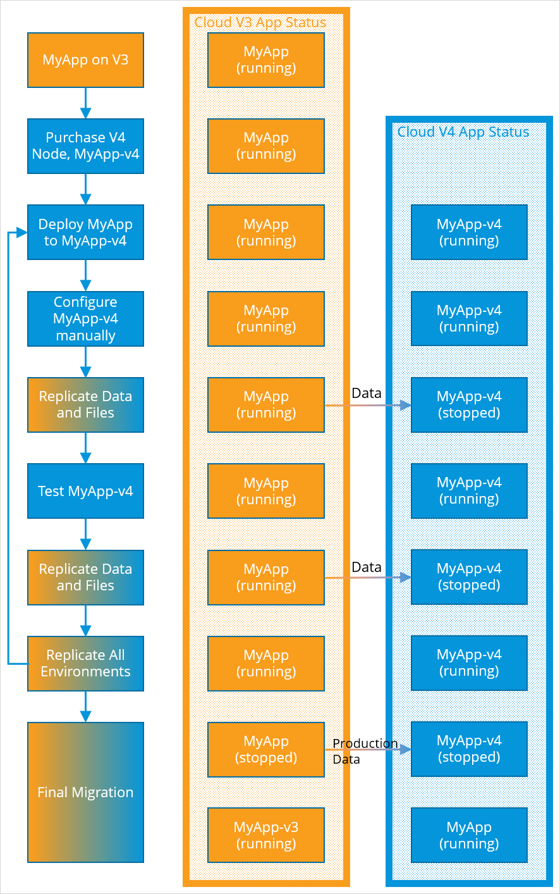
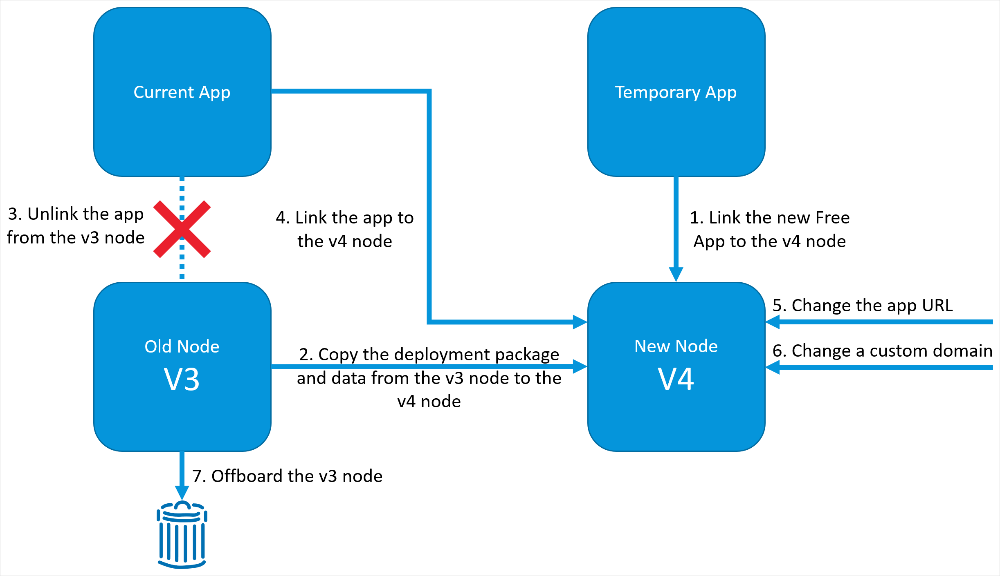
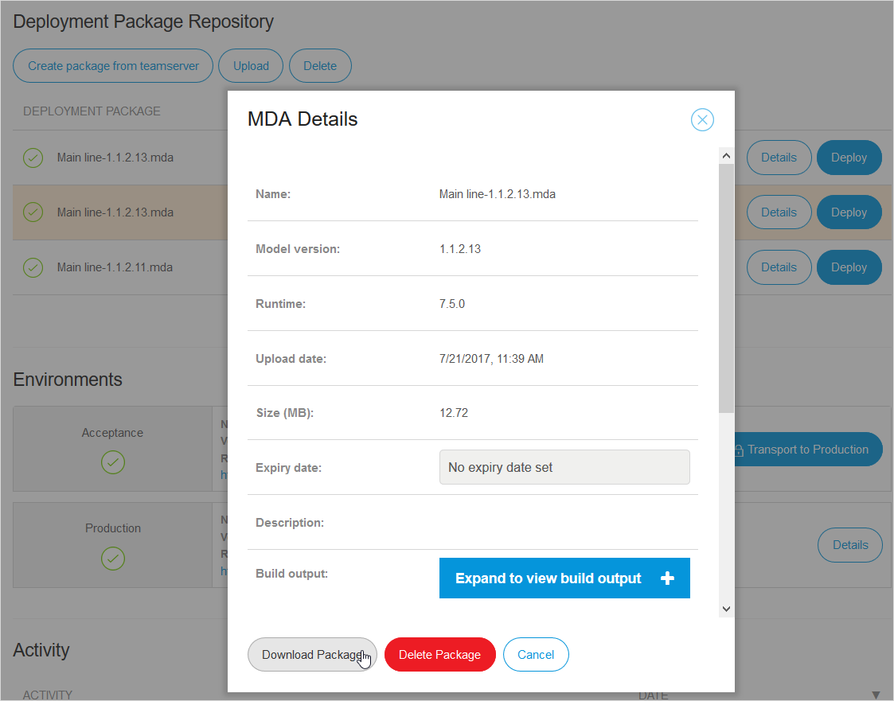
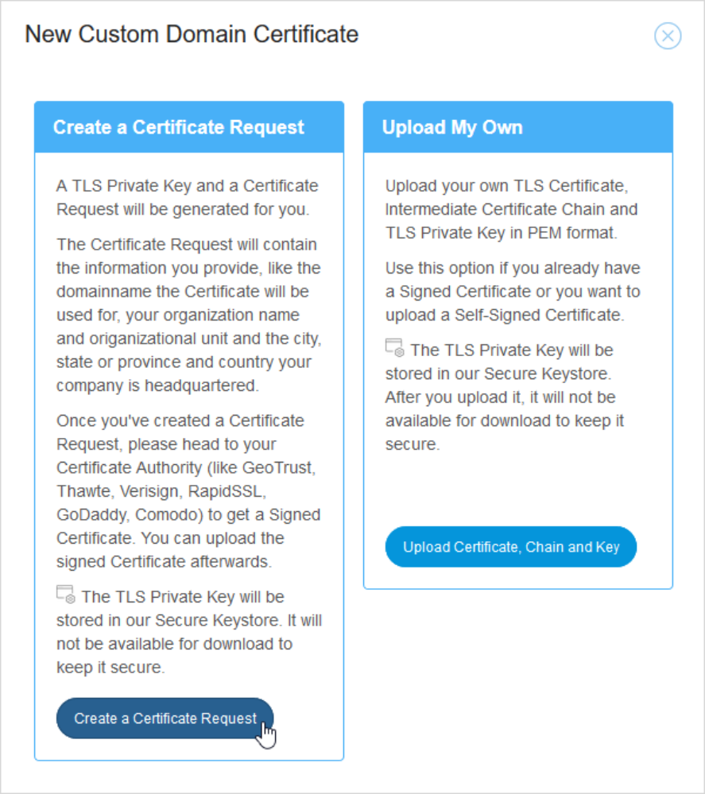

## 1 Introduction

The Mendix Cloud version 3 has been deprecated and will be turned off shortly. This document explains how to migrate your app from a Mendix Cloud v3 node to a Mendix Cloud v4 node.

**It will teach you how to do the following:**

*   Migrate your licensed app from Mendix Cloud v3 to v4

## 2 Migration considerations

You will need to take the following into account when migrating to Mendix Cloud v4:

* If you are using Mendix 7, you might want to split long-running scheduled events into smaller chunks, using a queueing system like the Amazon SQS connector to spread the work out over multiple instances
* If you use a mail server from your app, you will need to use a third-party email provider – for more information, see [Sending Email](sending-email)
* If you use an FTP server in your app, you will need to use a third-party FTP provider 
* If you are currently using a VPN to secure your app, you will have to use one of the recommended methods discussed in [Securing Outgoing Connections from Your Application](securing-outgoing-connections-from-your-application) instead

To make the most of the features of Mendix Cloud v4, we recommend that your apps are built as [12-factor apps](https://12factor.net/).

### 2.1 Other Differences Between Mendix Cloud v3 & v4

There are a few other differences between the way you develop and deploy apps in Mendix Cloud v4 and Mendix Cloud v3:

* In Mendix Cloud v4, the debugger is always active, and does not have to be activated – the **Show Debugger Information** button shows the credentials to connect Mendix Studio Pro to the debugger
    {}You can only use the debugger if your app is scaled to a single instance.{}
* In Mendix Cloud v4, the number of permitted database connections is tied to the RAM of the database environment, rather than being static.
    * The limit is roughly 100 connections per GB of database RAM – the defaults are perfectly fine for most situations, but you can use the Mendix Runtime settings **ConnectionPoolingMaxActive** and **ConnectionPoolingMaxIdle** to tweak the number of database connections that the Mendix Runtime will set up for each runtime instance.
* In Mendix Cloud v4, there are some circumstances in which your app can run out of file connections
    * The default number of file connections is 50, but this can be increased and you may need to ensure that file connections are not being held open unnecessarily – see the [Other Considerations](mxcloudv4#other-considerations) section of *Mendix Cloud v4* for further advice
* In Mendix Cloud v4, there are some monitoring features which are available in v3 which are not currently available – in particular:
    * File storage usage is not visible
    * Application CPU alerts are not sent
    * Archived logs can only be downloaded, not viewed in the browser
    * The database status is not visible on the node details screen
* Mendix Cloud v4 only supports TLS 1.2 or above for incoming requests
    * If you have external clients connecting _to_ your application running in the Mendix Cloud, these clients have to support TLS 1.2 or above to be able to make a successful connection

## 3 Prerequisites

There are two methods of doing the migration. For both of them you first need to ensure that your app is on at least **Mendix version 6.0**, otherwise the migration will fail – it is preferable to be on a supported version of Mendix, **Mendix version 7.0 and above**. For the best level of support, we recommend that you use version **7.23** which is the [long term support](/releasenotes/studio-pro/lts-mts) version of Mendix version 7.

For further prerequisites see the sections below.

## 4 Using the Migration Tool

Mendix has written a migration tool to help you transfer your data from your V3 app to a new V4 environment. It also switches to your new environment for you when it is ready to go.

{}
The migration tool is currently a [beta](/releasenotes/beta-features/) version.
{}

We strongly advise you to use this method to migrate your app to Mendix Cloud V4 as it makes the migration much easier to initiate and monitor.

The flow below shows the stages of using the migration tool, and an indication of the status of the app in both the original, Mendix Cloud V3, environment and the new Mendix Cloud V4 environment at each stage.

{{% image_container width="50%" %}}

{}

### 4.1 Prerequisites

To migrate your app from Mendix Cloud V3 to Mendix Cloud V4, you need to following prerequisites:

* Have a [Mendix Cloud](mendix-cloud-deploy) v4 node available. This **must have the subdomain name `<current-app-name>-v4`**. To request a licensed v4 Cloud Node, use the [Request New App Node](https://newnode.mendix.com/) app. In most cases, the node will have the same environments as the V3 app you are migrating
* Have the [Technical Contact](/developerportal/collaborate/app-roles#technical-contact) role for both your existing v3 and available v4 Cloud Nodes

### 4.2 Preparing the New Environment

Before doing anything else, if the Mendix Cloud V4 environment has been used for another production app in the past, ensure that you have a backup of any data you want to keep. The following steps and sections will overwrite your existing data.

Although you can replicate data into any environment, provided at least one app has previously been deployed to it, we recommend that you deploy a copy of the app you are migrating. This means you can make any changes needed to account for differences between Mendix Cloud V3 and Mendix Cloud V4. It also means that you are ready to test your data once it has been replicated.

To deploy your app to your new Mendix Cloud V4 environment, you need to do the following:

1. Deploy your app to the environment(s) on the V4 node. You may want to do this first for a test or acceptance environment before you do all of them.

    You can [create an deployment package](/refguide/create-deployment-package-dialog) of your app within Studio Pro, and upload it to the [Environments](environments) page of the new Mendix Cloud V4 app. Then use the **Deploy** option to deploy it to your chosen environment.

2. Create the application settings manually. The data replication process will only replicate data, it does not copy across other application settings. Settings you will need to set are on the [Environment Details](environments-details) page and include:

    * Number of instances
    * Scheduled Events
    * Constants
    * HTTP headers
    * Path based access restrictions
    * Outgoing connections certificates
    * Custom runtime settings
    * Custom environment variables
    * Preferred maintenance window
    * Tags

    {}You do not need to set up your **Custom Domains**. When the app is migrated to V4, it will be given the same name as your current app and so your Custom Domain will automatically pick up the V4 app.{}

### 4.3 Replicating the Data

Now that you have your new Mendix Cloud V4 environment, you can start replicating the data.

1. Open the [Migration Tool](https://v3-v4-migration.mendixcloud.com/), `https://v3-v4-migration.mendixcloud.com/`.

2. Choose the Mendix Cloud V3 app from the list of apps for which you are the technical contact.

3. The target v4 app node will be filled with the name `<current-app-name>-v4`.

4. Select the source and target environments. In most cases, these will have the same name. For example, you want to replicate data from the V3 `production` environment to the V4 `production` environment. Please note you should not check the **Force database dump restore** check box.

    

5. Ensure that the app in the target V4 environment is stopped. You cannot replicate data into an app that is running.

6. Click **Replicate data and files**.

    The replication process will copy all the data in the database, and files based on `FileDocument` entities, such as images, which are stored in the storage of the V3 appnode.

    The replication will continue to run, so any changes to the data while your V3 app is still running are reflected in the replicated data.

7. Click the **Migration** icon to see the status of your replications.

    

The migration page lists all the ongoing migrations including the following information:

* The source and target environments
* The UUID of the source production environment
* Whether the tool is current **Replicating** data to the V4 environment or is **Stopped**
* What proportion of the source data has been replicated, listed for both files and database – this will sometimes show zero
    * If replication isn't running
    * During the replication process when the process checks whether files are synchronized
* The UUID of the target production environment
* A button to **Stop replication** with an **Interrupt** option if the tool is currently replicating or a **Start replication** option if the tool is currently stopped
*  The **Migrate button** which triggers the [final migration](#final-migration)

    

### 4.4 Testing the Replicated Data

Once you have replicated your data, you should test it, to ensure that everything is working as expected.

{}You should wait before testing to ensure the replication progress has reached 100%, otherwise you may find some data is missing.{}

1. Go to the migration page of the Migration Tool.

2. Click **Stop** next to the migration you want to test.

3. Wait until the status of the migration changes to **Stopped**.

4. Go to the Environment Details page of your V4 app and start the app.

5. Test the V4 app. This will be at the same Mendix URL as your existing V3 app, but with the suffix `-v4`. For example, `<current-app-name>-v4-test` for the test environment, or `<current-app-name>-v4` for production.

6. Check that the app works as expected, and that the data which has been migrated is accessible.

    {}Any data you add to the database during the test will be overwritten when the migration process is restarted.{}

7. Stop your V4 app at the end of the test and restart the replication so you can continue to copy data from your V3 app.

### 4.5 Final Migration{#final-migration}

Once you have tested the data migration you are ready to migrate your app to Mendix Cloud V4.

{}
The final migration will only check that *production* data has been completely transferred to the new V4 app.

If you want to keep all your test and acceptance data, you need to review the migration status yourself. We recommend that you do this before initiating the final migration, but you can migrate non-production data after the final migration if necessary.
{}

{}
We recommend that you allow at least an hour between starting to replicate the data (section 4.3, above) and starting the final migration. This is because we reduce the TTL for the DNS records at the beginning of the process, but this will take some time to propagate and allow us to switch quickly between your V3 and V4 app.
{}

There are two more requirements before you can start the final migration:

* The replication process for the production environments must have transferred all the data at some point in time, even if more data has been added since — in other words, the replication process for production must have reached 100% at least once
* The replication process must be in a *Replicating* state

To do the final migration of your app from Mendix Cloud V3 to Mendix Cloud V4, do the following:

* Click **Migrate** on the migration page. This does the following:

    1. Stops the app running on Mendix Cloud V4
    2. Stops the app running on Mendix Cloud V3
    3. Runs the replication process for the *Production* environments until it reaches 100%
    4. Renames the subdomain of the original app and **all** environments to be `<current-app-name>-v3`
    5. Removes the `-v4` suffix from the subdomain name of the new V4 app and **all** environments
    6. Restarts both the new v4 app and the original v3 app.

### 4.6 Rollback

If you encounter issues with your app when running on Mendix Cloud V4, then you can revert to the Mendix Cloud V3 version. This could happen, for example, if one of the differences between V3 and V4 listed above causes an unexpected issue.

* Click **Rollback** on the migration page. This does the following

    1. Stops the app running on Mendix Cloud V4
    2. Stops the app running on Mendix Cloud V3
    3. Renames the subdomain of the app running on Mendix Cloud V4 and **all** environments to be `<current-app-name>-v4`
    4. Removes the `-v3` suffix from the subdomain name of the original V3 app and **all** environments
    5. Restarts the original v3 app

{}
This will not copy any new data from the V4 environment back to the V3 environment. Any data added to the V4 database before the rollback is effectively lost.
{}

### 4.7 Issues

The following issues might occur, or you might decide to "Rollback" a successful migration.

#### 4.7.1 Data Replication Fails or Times Out

If the replication process fails during the final migration, or it times out (the timeout is fixed at 20 minutes), then the apps and environments will not be renamed and the apps in the original V3 environments will be restarted.

It is safe to restart replicating the data to bring the data replicated back up to 100%. This should ensure that the final migration does not time out.

Please contact Mendix Support if you encounter this problem so that we can identify any common issues.

#### 4.7.2 Rename and Restart Failures

If the apps and environments cannot be successfully renamed, or the apps cannot be successfully restarted, the changes will be rolled back as described above.

## 5 Migrating the App Manually

{}
These instructions are provided in case you have problems using the migration tool above. We recommend that you use the migration tool whenever possible. Please contact [Mendix Support](https://support.mendix.com) if you are having difficulty with the migration tool and only use these instructions as a last resort.
{}

To manually migrate your app from a v3 node to a v4 node in the Mendix Cloud, follow the steps in the sections below.

### 5.1 Prerequisites

Before starting a manual migration, make sure you have completed the following prerequisites:

* Have a [Mendix Cloud](mendix-cloud-deploy) v4 node available (to request a licensed v4 Cloud Node, request one through the [Request New App Node](https://newnode.mendix.com/) app)
* Have the [Technical Contact](/developerportal/collaborate/app-roles#technical-contact) role for both your existing v3 and available v4 Cloud Nodes
* Create two new temporary Free Apps without Free App environments – instructions for unlinking a Free App from its environment are here: [Licensing Mendix Cloud Apps](licensing-apps#unlink)

### 5.2 Linking the New Free App to the v4 Node

First, link one of the new temporary apps to the cloud v4 node.

1.  In the [Developer Portal](http://sprintr.home.mendix.com), go to **Apps** and select one of your temporary apps.

2.  Once you are in the app, go to the **Environments** tab in the left menu.

3.  Click **select a node**.

    

4.  Select the v4 node by clicking **Use this Node** and link it to your app.

For more information on how to do this, see [Licensing Mendix Cloud Apps](licensing-apps#licensed-node).

### 5.3 Copying the Deployment Package and Data from the v3 Node to the v4 Node

Before migrating, you need to deploy a copy of your app to the v4 node. You can then copy the data from the v3 node to the v4 node. After copying the data, you should test the app, and correct errors if needed. Repeat this until all the errors are solved.

The following steps explain how to do this.

#### 5.3.1 Downloading and Uploading the Deployment Package

Download the deployment package of your app hosted in Mendix cloud v3 and upload the deployment package to the app hosted in Mendix cloud v4.

To download a deployment package, follow these steps:

1. Go to **Environments** of the v3 app.

2. Click **Details** for a **Deployment Package**.

3. Click **Download Package**.

    

To upload the deployment package, follow these steps:

1. Go to **Environments** of the v4 App.

2. Below the **Deployment Package Repository**, click **Upload**.

    

3. Browse and select the downloaded deployment package from your device.

4. Deploy the uploaded package and ensure that it starts.

5. Stop the app so that you can upload the backup data.

#### 5.3.2 Backing Up

{}
Ensure you have performed the last two steps in the previous section to deploy your deployment package before continuing. Making a deployment prepares the environment and ensures your data is restored to the correct locations.
{}

Transfer the backup data from the app on Mendix Cloud v3 to the app on Mendix Cloud v4 by following these steps:

1. Download a backup from your app hosted in Mendix Cloud v3 (for details, see [How to Download a Backup](/developerportal/operate/download-backup)).

    {}It is recommended that you download copies of *all* backups you want to keep. Once you have offboarded the old v3 environment, they will no longer be available.{}

2. Upload the downloaded backup to your app hosted in Mendix Cloud v4 (for details, see [How to Restore a Backup](/developerportal/operate/restore-backup)).

#### 5.3.3 Configuring the New App

Before starting your app in Mendix Cloud v4, make sure it has the same configuration as the v3 node. You can find the node settings on the [Environment Details](environments-details) page under **Model Options**, **Network**, **Runtime**, and **Maintenance**.

#### 5.3.4 Testing and Repeating

Now that the app on Mendix Cloud v4 contains your data and is configured, deploy the deployment package to an environment and start your app.

To learn how to do this, see [How to Deploy the App to an Environment](mendix-cloud-deploy#deploy-the-app-to-an-environment).

### 5.4 Unlink the App from the v3 Node

It is not possible to explicitly unlink an app from a licensed node. The only way to do this is to connect another app to the licensed node; this will unlink the existing app automatically. To do this, perform the following steps.

1. In the [Developer Portal](http://sprintr.home.mendix.com), go to **Apps** and select the second blank app you created (not the one you have linked to the v4 node).

2.  Once you are in the app, go to the **Environments** tab in the left menu.

3.  Click **select a node**.

4.  Select the v3 node containing your app by clicking **Use this Node**, and link it to your app. Your app which is currently deployed to this node will be unlinked automatically and you can now link it to the v4 node.

A more detailed example of how this works given in the [Exchanging Linked Apps Between Nodes](licensing-apps#exchange-apps) section of *Licensing Mendix Cloud Apps*.

### 5.5 Linking the App to the v4 Node

Follow these steps to link the app you detached from the v3 node, above, to the v4 Node:

{}
Make sure you have downloaded the latest backup and deployment package before linking your app to the v4 node.
{}

1.  In the [Developer Portal](http://sprintr.home.mendix.com), go to **Apps** and select the app that has been detached from the v3 node.

2.  Once you are in the app, go to the **Environments** tab in the left menu.

3.  Click **select a node**.

4.  Select the v4 node by clicking **Use this Node** and link it to your app. The currently linked (temporary) app will be unlinked automatically. The temporary app can be deleted.

For more information, see [Licensing Mendix Cloud Apps](licensing-apps).

### 5.6 Changing the App URL

To change the App URL (if you are not using a custom domain) you will need to contact [Mendix Support](https://support.mendix.com). You will need to provide the following information:

* **URL** for the new app, which is available from the *Environments* page for the new (v4) app
* **URL** for the old app, which is available from the *Environments* page for the old (v3) app
* **App ID** for the new app, which is available from the *General* page for the new (v4) app
* **App ID** for the old app, which is available from the *General* page for the old (v3) app

### 5.7 Changing a Custom Domain

If you have a custom domain which you want to transfer to your v4 deployment, you will need to bear the following information in mind.

* The CNAME configuration in the DNS provider needs to have the following format: `{customdomain}.cname.mendix.net`
* If you own the private key for your existing custom domain name, you can reuse it for your v4 deployment
    * For a TLS certificate you uploaded yourself, you will have the private key
    * If you made a certificate request to Mendix, the private key will be stored in the Mendix Secure Keystore and you will need to ask Mendix Support to arrange for the certificate to be migrated to v4
    
        The two certificate request options are shown below:
        
* When you start the app on the v4 cloud, it can take some time for the DNS servers on the web to register the new target URL and redirect your custom domain name to it — therefore you must set the TTL value to 300 seconds to speed up this process, if your TTL setting has a longer duration. This should be done some days in advance to ensure the setting is propagated to all DNS servers.

    For example, if you have a TTL of 24 hours, it will take 24 hours before the new domain will be active in the DNS. Customers who visit the custom domain through the browser will not end up at the Mendix Cloud v4 environment until 24 hours have passed. You should therefore check the TTL value a week or so before migration and change it to around 300 seconds (this is the default value we recommend).

You can find further information about setting up custom domains in [Custom Domains](custom-domains).

### 5.8 Offboarding the v3 Node

Your app is now running in Mendix Cloud v4. If everything works correctly, submit a request to [Mendix Support](https://support.mendix.com) to offboard the v3 node. This means that your v3 node will no longer be available.

{}
After your node is offboarded, it will no longer be accessible. Ensure that you have downloaded any backups or other information that you need from the node before asking for it to be offboarded.
{}

## 6 Read More

*   [Certificates](certificates)
*   [Custom Domains](custom-domains)
*   [Mendix Cloud: Deploy](mendix-cloud-deploy)
*   [How to Download a Backup](/developerportal/operate/download-backup)
*   [Licensing Mendix Cloud Apps](licensing-apps)
*   [How to Restore a Backup](/developerportal/operate/restore-backup)
