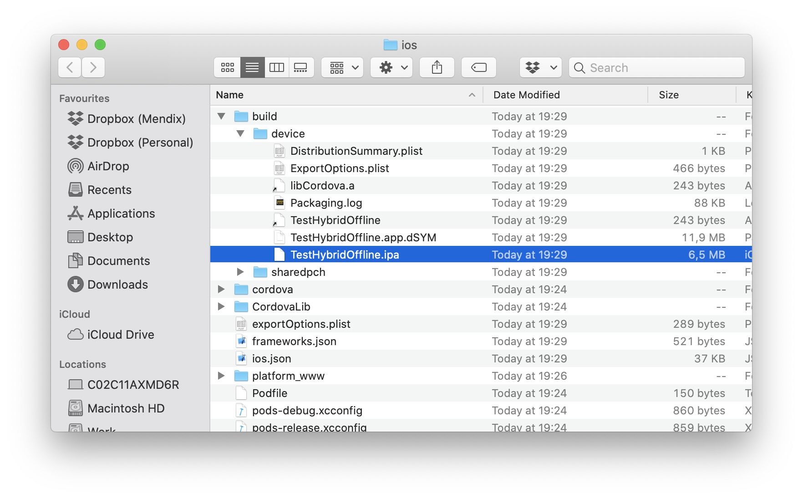
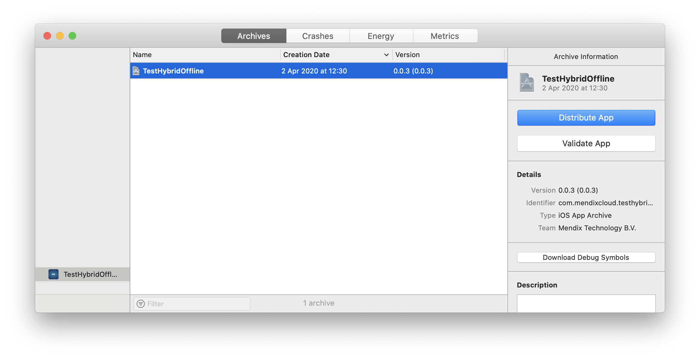
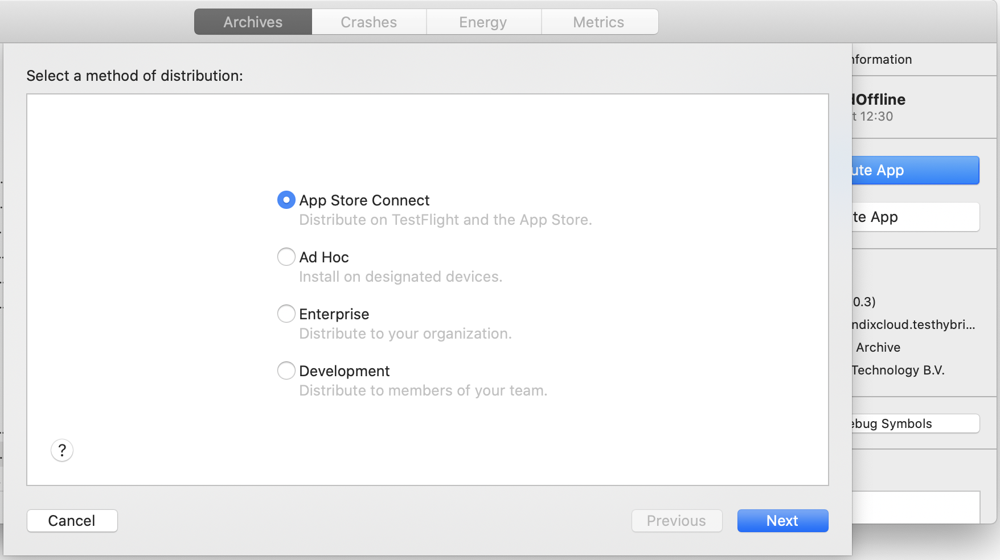
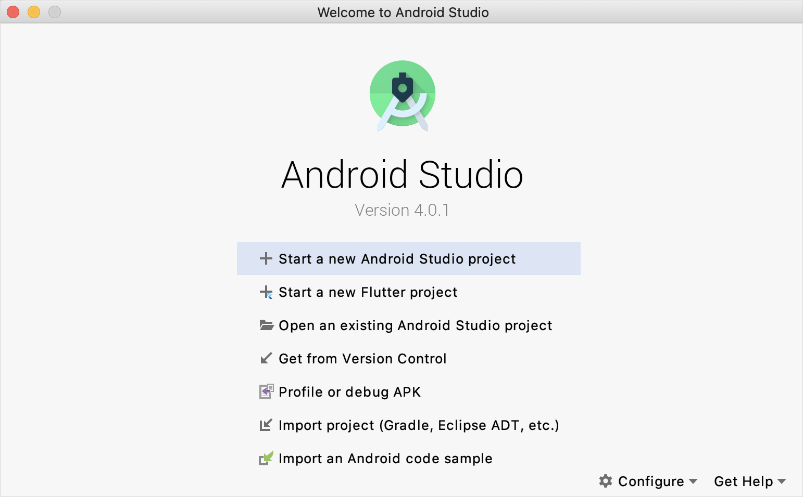
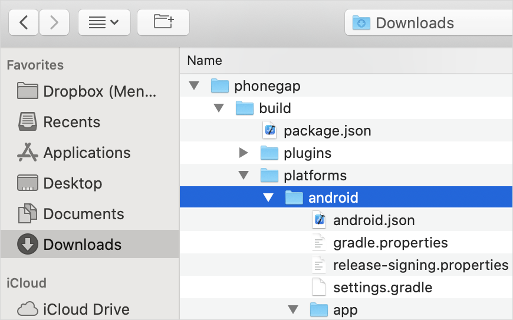
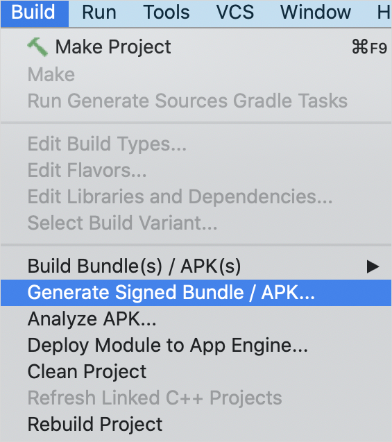
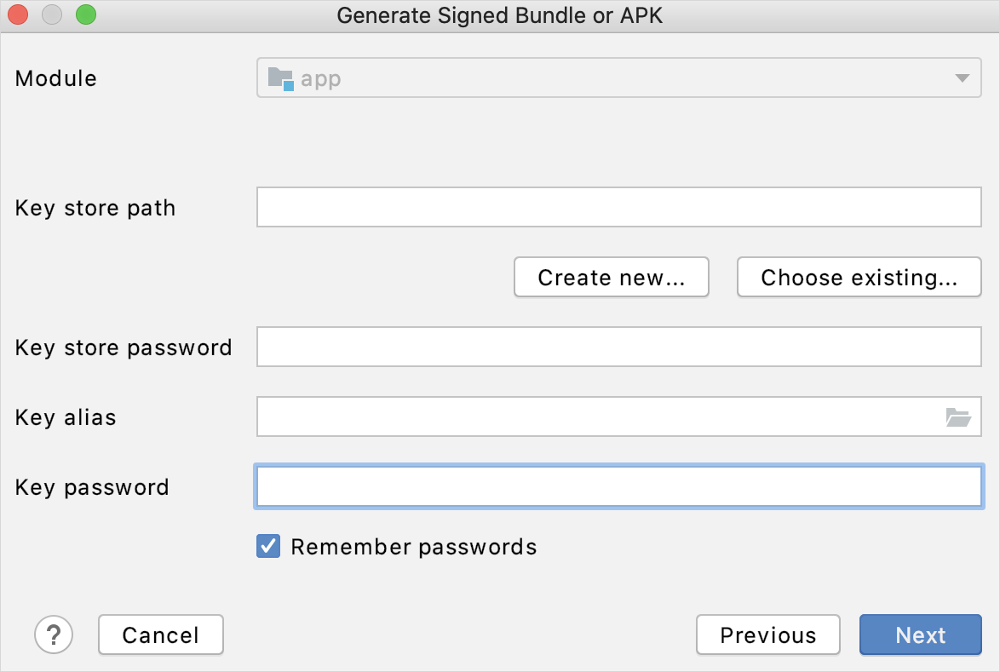
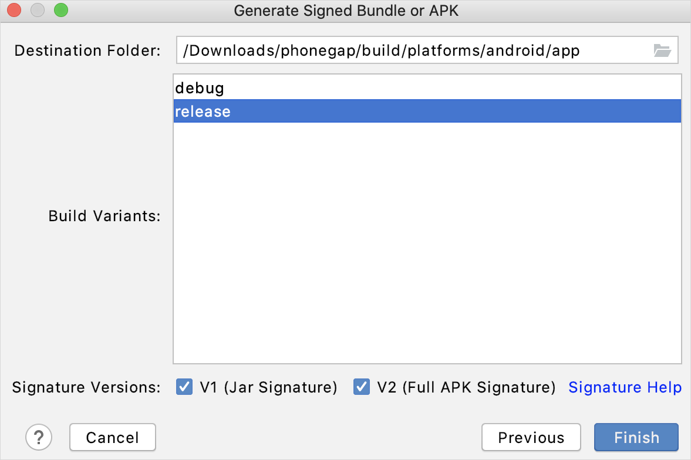

## 1 Introduction

The **Mobile App** page enables publishing your app in the Apple App Store (for iOS) and Google Play Store (for Android).

This page is divided into three tabs:

* **App Info**
* **iOS**
* **Android**

{}
Building hybrid apps in the cloud uses the PhoneGap Build service from Adobe. Because Adobe no longer maintains this service, building hybrid apps in the cloud and publishing them to app stores is no longer possible.

To build a hybrid app and publish it, see the [Doing It Yourself](#doing-it-yourself) section below for remote building or the [Building Your iOS App Locally](#building-ios-locally) and [Building Your Android App Locally](#building-android-locally) sections for local building.

To publish your app in an app store, we recommend you build native iOS apps instead. For more information, see [How to Build Native Apps](/howto/mobile/build-native-apps).
{}

## 2 App Info

In this tab, you can find the following sections:

* **General settings**
* **Profile settings**
* **Permissions**
* **Custom Phonegap/Cordova configuration**

### 2.1 General Settings

In the **General settings** section, you must provide the following information:

* The **Name** of the app
* The unique **App Identifier** (for example, `com.example.CompanyExpenses`)
* A **Description** of the app
* Whether a 5 digit PIN is enabled or disabled via the **PIN required?** check box

### 2.2 Profile Settings

If you are targeting Mendix 7.2.0 or above, please specify the navigation profiles to use on phones and tablets.

Make sure the profile identifier corresponds with the one defined in Mendix Studio Pro.

* **Phone profile**
* **Tablet profile**
* **Enable offline capabilities?** (available offline apps)

For more information, see **Availability** in [Offline](/refguide/offline-first).

### 2.3 Permissions

By default, Mendix hybrid applications require a set of device permissions. When users install the app or open the app for the first time, they will be asked to grant these permissions. You can use the check boxes below to control which permissions are requested.

The permissions that can be enabled/disabled:

* **Calendar**
* **Camera**
* **Contacts**
* **Geolocation**
* **Microphone**
* **Photo Library**

{}
Some functionality might not be available when you disable these permissions (for example, your app will not be able to use the camera widget when you disable it).
{}

### 2.4 Custom Phonegap/Cordova Configuration {#custom}

You can specify additional Phonegap/Cordova settings and plugins by adding an XML snippet below. This snippet will be inserted at the bottom of the configuration file.

For an overview of available elements and settings, refer to [Apache Cordova Phonegap Reference Config.xml](https://cordova.apache.org/docs/en/latest/config_ref/).

## 3 iOS & Android

In these tabs, you will see an overview of all the images that will be used in the app store. The images are divided into two categories:

* **Icons**
* **Splash screens**

The following image formats are supported: PNG, GIF, JPEG, and BMP. PNG is recommended, as it is compressed without loss of any information and supports transparency very well.

If you click **Edit**, you can replace the image by uploading a new file with the same dimensions as the original file.

If you do not upload any images, the default Mendix-branded images that are shown will continue to be used.

Take note of the required resolutions and file types for the image files, as the system will not allow you to upload images with different resolutions (because your app packages will not function properly).

## 4 Publish for Mobile App Stores {#publish}

On the right side of the screen, you can choose which operating system you want to publish (iOS or Android).

When you are ready to build, click **Publish for Mobile App Stores**.

This wizard will guide you through the process of creating local build app packages which can be published in  the Apple App Store and Google Play Store. The resulting mobile apps can then access native functionality such as the geo location service and the camera.

### 4.1 Doing It Yourself {#doing-it-yourself}

Once you begin the app buliding wizard and choose the correct environment, click **Download a customizable package**. The package contains all your settings, icons, and splash screens. It allows you to easily make changes, create local builds, run on emulators, and upload to the PhoneGap Build service.

For iOS please follow the instructions in [Building Your iOS App Locally](#building-ios-locally) below.

For Android please follow the instructions in [Building Your iOS App Locally](#building-android-locally) below.

### 4.2 Building Your iOS App Locally {#building-ios-locally}

**Prerequisites:**

* A Mac OSX machine
* Install [NodeJS LTS](https://nodejs.org/en/download/) using the all-in-one installation option
* Download your [local build package](/howto/mobile/customizing-phonegap-build-packages#download-local-package) from Cloud Portal and unzip it in a known location
* Register for an [Apple Developer Account](https://developer.apple.com/register/index.action)
* Install [XCode](https://apps.apple.com/us/app/xcode/id497799835?mt=12) and its command-line tools

#### 4.2.1 Prepare Your Project for Building

To prepare your project for building, follow these instructions:

1. Open a terminal window and change directory into the unzipped package folder, for example **cd /Downloads/phonegap** if it is in your Downloads folder.
1. Run `npm i && npm run package && npm run platform:ios`. This combination of commands does the following:
   * Installs all required dependencies.
   * Packages the Cordova app for deployment.
   * Adds the iOS platform to Cordova.

#### 4.2.2 Building Your Prepared Project

There are two possible ways to build your apps: the Cordova CLI or XCode. The Cordova CLI is faster and allows Cordova to fully control the your project's configuration. XCode is more involved, but XCode's UI makes it easier to detect problems in the project. You can use whichever works best for your case.

##### 4.2.2.1 Building iOS Using the Cordova CLI

**Prerequsites:**

* Your Apple Developer team's id, which can be found [here](https://developer.apple.com/account/#/membership/)

This process is shorter than using XCode but might require more work to understand why a build fails. To build using the Cordova CLI, do the following:

1. Run `npm run build -- ios --release --device --codeSignIdentity="iPhone Developer" --developmentTeam="<your-teams-id>"`. This combination of commands does the following:
   * Starts a release build that will create binaries for a physical device
   * Uses the code sign identity "iPhone Developer" for signing \* Looks up the provisioning files and certificates using the provided Apple Developer's team id
   1.1 Optionally, if you wish to build for an emulator and do a debug build use the following command instead: `npm run build -- ios --debug --emulator`.
1. When the build succeeds the generated _IPA_ file can be found in _/build/platforms/ios/build_. That folder should have the following file structure(if you did a build for an emulator an _.app_ file will be available):

   

1. The IPA generated can be now uploaded to Testflight for further testing. If you wish to do so, continue with the [Upload tools](https://help.apple.com/app-store-connect/#/dev82a6a9d79) section, on the App Store documenation.

##### 4.2.2.2 Building iOS using XCode

Using XCode can be easier than the Cordova CLI due to XCode's friendly visual interface. To build your app using XCode do the following:

1.  Under **/build/platforms/ios/** open the `.xcworkspace` file by double-clicking it. Xcode should open with the project loaded:

    

1.  Select the root element from the tree view in the left-side panel:

    

1.  The screen should change to the following view. If it does not, select the item under **Targets** on the left panel not the item under **Project** and select the tab **Signing & Certificates**:

    

1.  Both **Debug** and **Release** might have been configured for **Automatically manage signing**. Clear both check boxes to switch to manual signing. The screen should change to the following:

    

1.  Enable **Automatically manage signing** again.
1.  Select a **Team** using the drop-down menu. If you have not yet signed in with your credentials, XCode will prompt you to do so.
1.  When configured correctly all errors should be gone.
1.  Make sure you select the target to be your app's build target and designate **Generic iOS Device** as a device:

    

1.  Select **Product** and then **Archive** from the menu bar:

    

1.  After the process finishes successfully the **Organizer** view will come up. Your app should be selected and your latest **Archive** visible. You can always open the organizer yourself through XCode's **Window** menu:

    

1.  You can now use the **Distribute App** button to distribute your app to the appstore or archive it for local distribution:

    

### 4.3 Building Your Android App Locally {#building-android-locally}

**Prerequisites:**

* Install [AndroidStudio](https://developer.android.com/studio)
* Install [NodeJS LTS](https://nodejs.org/en/download/) using the all-in-one installation option
* Install JDK 1.8
* Create a keystore using [generating-a-keystore](/refguide/managing-app-signing-keys#3-1-generating-a-keystore)
* Download the [local build package](/howto/mobile/customizing-phonegap-build-packages#download-local-package) from Cloud Portal and unzip it in a known location

#### 4.3.1 Prepare Your Project for Building

To prepare your project for building, follow these instructions:

1. Open a terminal window and change directory into the unzipped package folder, for example **cd /Downloads/phonegap** if it is in your Downloads folder.
1. Run `npm i && npm run package && npm run platform:ios`. This combination of commands does the following:
   * Installs all required dependencies.
   * Packages the Cordova app for deployment.
   * Adds the iOS platform to Cordova.

#### 4.3.2 Set Up Environmmetal Variables

To be able to run the commands to build locally, you will need to set up some required environmental variables for your system. These can be set to temporary for the current command line session or globally for your system. The variables are the following:

* **ANDROID_SDK_ROOT**, pointing to the installation folder of the Android *SDK*
* **JAVA_HOME**, ponting to the JDK 1.8 root directory
* **GRADLE_HOME**, pointing to a valid Gradle distribution directory

For the purpose of this guide we will be setting the commands to temporary for each of the commands.

#### 4.3.3 Building Your Prepared Project

There are two possible ways to build your apps: the Cordova CLI or Android Studio. The Cordova CLI is faster and allows Cordova to fully control the your project's configuration. Android Studio is more involved, but Android Studio's UI makes it easier to detect problems in the project. You can use whichever works best for your case.

##### 4.3.3.1 Building Android Using the Cordova CLI

The command to build your project locally for release is `npm run build -- android --release`.

1. Run the following command:<br />
    a. **On Mac OSX, as a single command run:**<br />

   ```
   PATH="\$PATH:/Users/<username>/.gradle/wrapper/dists/gradle-5.1.1-all/97z1ksx6lirer3kbvdnh7jtjg/gradle-5.1.1/bin" JAVA_HOME=`/usr/libexec/java_home -v 1.8\` npm run build -- android --release -- --keystore=<keystore-path> --storePassword=<keystore-password> --alias=<keystore-alias> --password=<certificate-password>
   ```

  b. **On Windows, in a command line as separate commands run:**<br />

   ```
   set PATH=%PATH%;C:\path-to-gradle-distribution

   set JAVA_HOME=C:\path-to-jdk-1.8-directory

   npm run build -- android --release -- --keystore=<keystore-path> --storePassword=<keystore-password> --alias=<keystore-alias> --password=<certificate-password>
   ```

   This command adds the gradle binary to the path, switches the JAVA JDK to be 1.8 and runs the build release command to generated a signed APK.

1. When the build succeeds the generated *APK* file can be found in `/build/platform/android/app/release`:

  

#### 4.4.3.2 Building Android Using Android Studio

Using Android Studio can be easier than the Cordova CLI due to Android Studio's friendly visual interface. To build your app using Android Studio do the following:

1. Start Android Studio:

   

1. Open an existing Android Studio project and select your projects android folder, for example **/Downloads/phonegap/build/platform/android**:

   

1. Wait for Android Studio to finish syncing your project.

1. Select the build menu and `Generate Signed Bundle / APK`:

   

1. Select the *APK* checkbox:

   

1. Select your Android keystore and complete the form with the correct keystore password, alias, and password.

   

1. Select the destination folder for the *APK*, build variant release, V1 and V2 Signature versions:

   

1. Click **Finish**.

You *APK* should now be generated and signed using Android Studio. The resulting *APK* can be found in the output folder selected and can be uploaded via the Google Play Console for further processing.

## 5 Read More

* [Deploy and Manage Guide](/developerportal/deploy)
* [Offline Reference Guide](/refguide/offline-first)
* [How to Publish a Mendix Hybrid Mobile App in App Stores](/howto/mobile/publishing-a-mendix-hybrid-mobile-app-in-mobile-app-stores)
* [Apache Cordova PhoneGap Reference Config.xml](https://cordova.apache.org/docs/en/latest/config_ref/)
