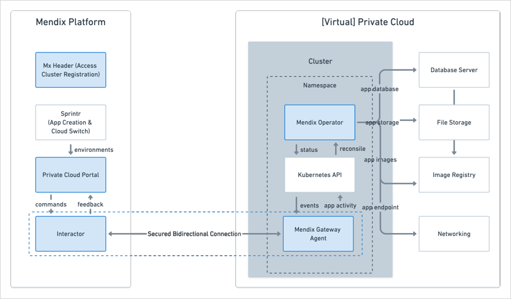
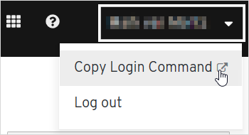
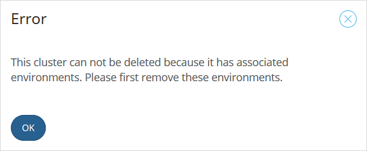
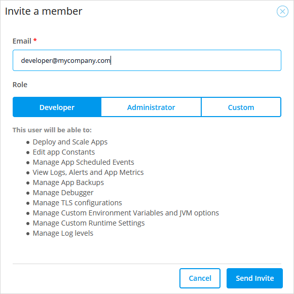
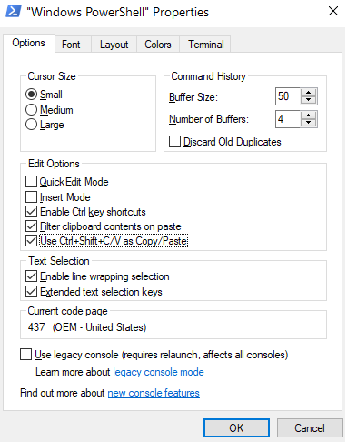

## 1 Introduction

To allow you to manage the deployment of your apps to OpenShift and Kubernetes, you first need to register a cluster in the Mendix Developer Portal. This will provide you with the information you need to deploy the **Mendix Operator** and **Mendix Agent** in your OpenShift context and create a link to the **Environments** pages of your Mendix app through the **Interactor**.

This document explains how to set up the cluster in Mendix

Once you have registered your cluster, you can invite additional team members who can then create or view environments in which their apps are deployed, depending on the rights you give them. For more information on the relationship between Mendix environments and Kubernetes clusters, see [Containerized Mendix App Architecture](#containerized-architecture), below.

## 2 Prerequisites for Registering a Cluster

To register a cluster in your OpenShift context, you need the following:

* A Kubernetes platform or OpenShift version 3.11 or above
* Administration account for your platform
* **OpenShift CLI** installation (see [Getting started with the CLI](https://docs.openshift.com/container-platform/4.1/cli_reference/getting-started-cli.html) on the RedHat OpenShift website for more information) if you are creating clusters on OpenShift
* **Bash** (Bourne-again shell) for your machine. If you are running on Windows, you can use something like [**Windows Subsystem for Linux (WSL)**](https://docs.microsoft.com/en-us/windows/wsl/faq) or the **Git Bash emulator** that comes with [git for windows](https://gitforwindows.org/).

## 3 Registering a Cluster

### 3.1 Obtaining the Script

1. Click **Cloud Settings** on the **Settings** page of your Mendix app.
    
    

2. Click **Mendix for Private Cloud**.
    
    

3. Click **Set up Mendix for Private Cloud**.
    
    

4. Select **Cluster Manager** from the **Apps** menu in the Developer Portal.

    

5. Click **Register Cluster**. 

    

6. Enter the following information:
    
  1. **Name** – The name you want to give the cluster you are registering
  
  2. **Namespace** – this is the namespace in your platform
  
  3. **Type** – choose the correct type for your cluster, for example **Kubernetes**

    

7. Click **Done**.

You will see the details of the cluster you are registering on a screen with two scripts.

The first script is the installation script which will install the Mendix operator and Mendix agent in your cluster. Once that is done, you can run the second script which allows you to configure your cluster.

### 3.2 Running the Installation Script

You will need to have administrator rights to your private cloud platform. This means you will have to log in before you run the installation script. The instructions below are for the OpenShift platform; a similar process will be required for other platforms.

#### 3.2.1 Logging in to OpenShift

To run the installation script on OpenShift, you must sign in to OpenShift using the OpenShift CLI, and then run a Bash script in Bash.

You can do this as follows:

1. Sign in to the OpenShift Console.

2. Click **Copy Login Command** in the user drop-down.
    
    

3. Choose your IdP (Identity Provider).
    
    

4. Click **Display Token**.

5. Copy the command under **Log in with this token**.
    
    

6. Paste the command into Bash and press Enter.

#### 3.2.2 Executing the Installation Script

To execute the installation script, do the following:

1. Copy the Installation Script which has been created for you by clicking **Copy to clipboard**  

    

2. Paste the script into your bash console and press **Enter** to run the script.

The response to the script should look like the image below. You can see that the script has installed the following:

* mendix-agent
* mendix-operator

The installation is successful if the response ends with **Installation Successful**.

The Mendix operator and Mendix agent are now installed on your platform. If you look at the project resources in the OpenShift console, you can see the mendix-operator resource.

The installation script can be found in the **Installation** tab for your cluster in the cluster manager.

### 3.3 Running the Reconfiguration Script{#reconfiguration-script}

Before you deploy an app to your namespace, you will need to configure a number of services namely:

* database
* file storage
* proxy
* registry
* ingress (network)

Mendix provides you with a script which will configure these initially, and can be re-run any time that you want to change how these are configured.

1. Copy the **Reconfiguration Script** which has been created for you by clicking **Copy to clipboard**. 

    

2. Press **Enter** to start the script.

The script will ask you a series of questions. Type the number corresponding to your choice, or enter the value required.

#### 3.3.1 What do you want to do?

Choose **1** if this is the initial configuration and you will be led through all the items which you need to configure.

Choose **2** if you have a configuration already but want to reconfigure part of it. If you choose this option, you will then be able to navigate directly to the thing you want to configure, namely one of the following:

* Database
* Storage
* Ingress
* Registry
* Proxy

When you reconfigure your cluster with databases or storage, you will add new services in addition to any services which are already set up. These plans are then added to the Developer Portal and can be used when creating environments for an app, unless you specifically deactivate them.

You can return to this initial question from any of the other questions by choosing the option **Go back to the start** where it is available.

#### 3.3.2 Pick a database type

**Postgres** will enable you to enter the values to configure a PostgreSQL database. You will need to provide all the information about your PostgreSQL database such as host, port, user, database, and password.

**Ephemeral** will enable you to quickly set up your environment and deploy your app, but any data you store in the database will be lost when you restart your environment.

#### 3.3.3 Pick a storage type

**Minio** will connect to an S3-compatible object storage. You will need to provide all the information about your Minio storage such as endpoint, access key, and secret key.

**Amazon S3** will connect to an S3 bucket in AWS. You will need to provide all the information about your Amazon S3 storage such as plan name, region, access key, and secret key.

**Ephemeral** will enable you to quickly set up your environment and deploy your app, but any data objects you store will be lost when you restart your environment.

#### 3.3.4 Pick an ingress type

**OpenShift Route** will set up an OpenShift Route. This can only be used for OpenShift clusters.

**Ingress** will configure ingress according to the additional domain name you supply.

Both forms of ingress can have TLS enabled or disabled.

#### 3.3.5 Pick a registry type

You can choose one of the following registry types. OpenShift registries can only be used for clusters on the OpenShift platform, but AWS ECR can also be used for clusters on OpenShift. For some of these registries you may need to supply additional information such as the pull URL, push URL, name, and secret.

* OpenShift 3 Registry
* OpenShift 4 Registry
* Amazon Elastic Container Registry (AWS ECR)
* Generic registry with authentication (this should either be *Public* or should have image pull secrets enabled).
* Generic registry without authentication

#### 3.3.6 Do you want to configure the proxy

Choose **Yes** if you want to configure the proxy and you will be asked for the information required.

### 3.4 Confirming Cluster Configuration

When the cluster is configured correctly, its status will become **Connected**. You may need to click the **Refresh** button if the screen does not update automatically.

## 4 Cluster Management

Once it is configured, you can manage your cluster through the Developer Portal.

1. Go to the Cluster Manager page by clicking **Cluster Manager** in the **Apps** menu.

    

  From this page you can see a summary of your clusters with an indication of their status and how long they have been running (uptime).

2. Click the tile of the cluster you want to manage  

    

On the cluster management page, there are a number of tabs which allow you to manage aspects of your cluster:

* Apps
* Members
* Operate
* Plans
* Installation

See the sections below for more information.

You can also delete your cluster from the cluster manager by clicking the delete icon in the top right.

When you delete a cluster, this removes the cluster from the Developer Portal. However, it will not remove the namespace from your platform. You will need to explicitly delete the cluster using the tools provided by your platform.

If there are any environments associated with the cluster, you cannot delete the cluster until the environments associated with it are deleted.

### 4.1 Apps

The **Apps** tab of the cluster manager page lists all the apps which are deployed to this cluster.

Click **Details** to go to the **Environment Details** page for that app.

### 4.2 Members

By default, the cluster manager, who registered the cluster in Mendix, has full administration rights to the cluster. These are:

* Manage Environment – user can create and delete environments, and start and stop the application
* Deploy App – user can deploy a new app to the environment or start and stop existing apps
* Scale App – user can change the number of replicas
* Edit App Constants
* Manage App Scheduled Events
* View App Logs
* View App Alerts
* View App Metrics
* Manage App Backups

{}
Only the person who registered the cluster can add, activate, or deactivate plans, invite and manage users, and set up operating URLs for the cluster.
{}

The **Members** tab allows you to manage the list of members of the cluster and control what rights they have.

#### 4.2.1 Adding Members

You can invite additional members to the cluster, and configure their role depending on what they should be allowed to do.

1. The **Members** tab displays a list of current members (if any).

2. Click **Invite Member**.
    
    

3. Enter the **Email** of the person you want to invite.

4. Give them the rights they need. This can be:
    
  1. **Developer** – a standard set of rights needed by a developer, these are listed on the screen
  2. **Administrator** – a standard set of rights needed by an administrator, these are listed on the screen
  3. **Custom** – you can select a custom set of rights by checking the box next to each role you want to give to this person

5. Click **Send Invite** to send an invite to this person.
    
    

6. The user will receive an email and will be required to follow a link to confirm that they want to join this cluster. They will need to be logged in to Mendix when they follow the confirmation link.

#### 4.2.2 Editing & Removing Members

You can change the access rights for, or completely remove, existing members.

1. Click **Edit** next to the member you want to change.

2. Either:
    
  1. Make changes and click **Save**
    
  2. Click **Remove member** to remove this member completely. You will be asked to confirm this action.
        
    

### 4.3 Operate

The **Operate** tab allows you to add a set of links which are used when users request a page from the Operate category for their app in the Developer Portal, as shown below.

The following pages can be configured:

* Metrics
* Alerts
* Logs
* Backups

The specification of these pages is optional.

Open the **Operate** tab, enter the URLs relevant to your cluster, and click **Save** for each one.

### 4.4 Plans

The **Plans** tab shows you the database and storage plans which are currently configured for your cluster.

From this tab you can do the following.

#### 4.4.1 Add a Plan

Click **Add** and you will be able to enter the name of an existing plan and add it to the plans linked to this cluster. You should only use this when adding plans using the cluster Reconfiguration Script fails to add them correctly.

#### 4.4.2 Deactivate a Plan

Click **Deactivate** next to the name of the plan you wish to deactivate. You cannot remove plans from within the cluster manager, but you can deactivate them to ensure that developers cannot create environments using the plan. Any environments currently using the plan will not be affected by this setting

#### 4.4.3 Activate a Plan

Click **Activate** next to the name of the plan you wish to activate. The plan can then be used by developers when they create an environment to deploy their apps.

### 4.5 Installation

The **Installation** tab shows you the installation script and configuration script which you used to create the cluster, together with the parameters which are used to configure the agent.

You can use the **Reconfiguration Script** to change the configuration of your cluster by pasting it into a bash shell as described in [Running the Reconfiguration Script]{#reconfiguration-script}, above.

You can also copy the installation and reconfiguration scripts to retain in your own code repository, if you wish.

## 5 Current Limitations

### 5.1 Plans on AWS

If you delete your app from the OpenShift console, this will not delete the *Prod plans* you have set up on AWS. This is a feature of AWS to ensure that you only delete data explicitly.

If you do not need your data on AWS anymore, then you need to clean it up manually.

## 6 Containerized Mendix App Architecture{#containerized-architecture}

Within your cluster you can run one, or several, Mendix apps. Each app runs in a namespace. You can see the relationship between the Mendix environments and the Kubernetes namespaces in the image below.

Because you can run several Mendix apps in the same cluster, each app must have a unique name. In addition, the app cannot have the same name as the Mendix tools used to deploy the app. See Deploy an app to Private Cloud for more information.
