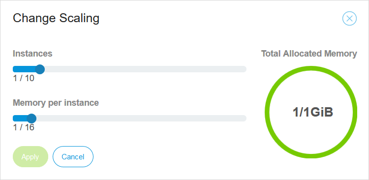
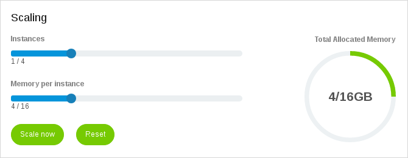

## 1 Introduction

Licensed apps in the Mendix Cloud can be scaled in various ways. Memory can be added to the application container, which is called vertical scaling. Mendix 7+ apps running on Mendix Cloud v4 can be scaled horizontally as well, in which case multiple runtime containers will run simultaneously. Incoming traffic for your app is randomly distributed over the running instances. Only the first instance will execute [scheduled events](/refguide/scheduled-events).

**This how-to will teach you how to do the following:**

* Scale your environment in Mendix Cloud v4

## 2 Prerequisites

Before starting this how-to, make sure you have completed the following prerequisites:

* Have a licensed app hosted in Mendix Cloud v4
* The Mendix version of the app is Mendix 7.0 or higher

## 3 Mendix Cloud Version

To see the cloud version on which your app is hosted, follow these steps:

1. Go to the [Developer Portal](http://home.mendix.com) and select your licensed app.
2.  Click **Environments**:

    

3.  Click **Details** for a selected environment:

    

4. Next to **Mendix Cloud Version**, you will see the version of the cloud on which your licensed app is hosted.

The scaling options on possible cloud versions are the following:

*   Mendix Cloud v3 – vertical scaling
*   Mendix Cloud v4 – vertical and horizontal scaling

## 4 Scaling Your Environment

If you want to scale your licensed app in Mendix Cloud v4, follow these steps:

1. Go to the [Mendix Portal](http://home.mendix.com) and select your licensed app.
2. Click **Environments**.
3. Click **Details** for a selected environment.
4. Set the amount of **Instances** from 1 to 4 by dragging the scroller from the left side to the right side of the screen.
5. Set the amount of **Memory per instance** that you want to use. You are not obligated to use the whole memory at once.

If you have 1GB RAM of the **Total Allocated Memory**, you have 1 instance available to utilize your memory.

To scale your memory over multiple instances you need more memory.

### 4.1 Scaling Example 1

If you have more than 1GB (for example 16GB) RAM of the **Total Allocated Memory**, you can spread the memory among 4 instances.

For example, you can scale 16GB of the total allocated memory four times with 4GB over 4 instances (4 x 4GB = 16GB).

### 4.2 Scaling Example 2

You don't need to use the whole memory at once. You can just use part of it and then use the rest of the memory later.

For example, you can use one instance and store 4GB of RAM in there. The other 12GB of RAM will be unused.

## 5 Related Content

* [Application Trends in Mendix Cloud v4](/developerportal/operate/trends-v4)
* [Deploy and Manage](index)
* [Environment Details](environments-details)
* [How to Manage Company & App Roles](/developerportal/company-app-roles/manage-roles)
* [Mendix Cloud](mendix-cloud-deploy)
* [Mendix Cloud V4](mxcloudv4)
* [Migrate to Mendix Cloud v4](migrating-to-v4)
* [Company & App Roles](/developerportal/company-app-roles/index)
* [Node Permissions](/developerportal/deploy/node-permissions)
* [Technical Contact](/developerportal/company-app-roles/technical-contact)
