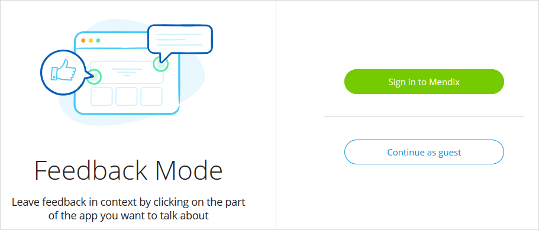
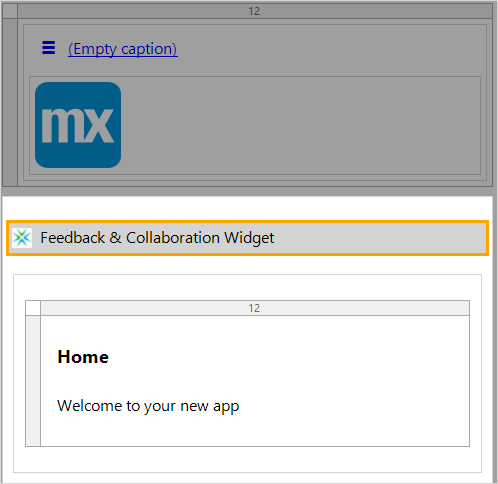
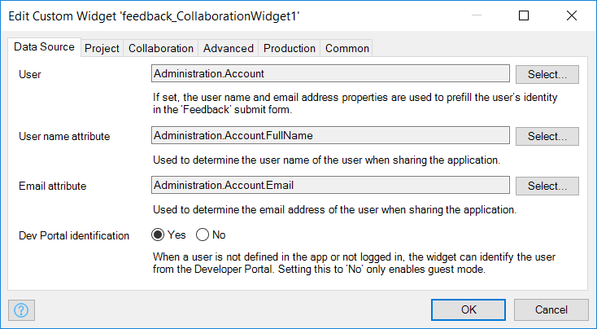

## 1 Introduction

{}
This how-to covers the [Mendix Feedback Widget](https://appstore.home.mendix.com/link/app/199/) version 6.0.0 and above. For details on earlier versions of the widget, see [How to Use the Mendix Feedback Widget](use-feedback-widget).
{}

The Mendix Feedback & Collaboration Widget enables you to collaborate more easily and quickly then ever before when developing an app project. With this widget, you make use of the fully integrated Mendix app feedback cycle as well as access editing capabilities in the Web Modeler, check out a mobile view of the app, and easily share the app via email.

**This how-to will teach you how to do the following:**

* Use the widget for leaving feedback on an app, editing an app, get a mobile view of an app, and sharing an app
* Add the widget to your app project
* Configure the Widget

## 2 Prerequisites

Before starting this how-to, make sure you have completed the following prerequisite:

* Create an app containing a working application model

## 3 Using the Widget

The Mendix Feedback & Collaboration Widget can be used in a variety of ways, which are described below.

### 3.1 Submitting Feedback on an App

When you click the **Feedback** icon, the platform first checks if you are signed in. If you are already signed in, you will be in **Feedback Mode** right away. If you are not signed in, you will need to either **Sign in to Mendix** or **Continue as a guest** to enter the feedback mode:

Once you are in feedback mode, you can click anywhere on the screen to leave a comment:

And voila! A screenshot is created automatically of the current page, which you can choose to attach to your feedback. After clicking **Send**, your feedback will go straight to the **Feedback** page of your app project in the Developer Portal. For more information, see [Feedback](index).

When you are done leaving feedback, you need to exit the feedback mode by clicking this button:

{}

For details on how to see all the feedback you have submitted, see the [Feedback](../mendix-profile/index#feedback) section of *Mendix Profile*.

{}

### 3.2 Editing an App

Clicking the **Edit** icon opens the app page in the Web Modeler. If you have permissions to edit the app, you can start editing and collaborating right away!

### 3.3 Viewing an App

When you click the **Mobile view**  icon, a pop-up window is displayed that enables viewing your app on a mobile device:

You can access this mobile view by installing the [Mendix mobile app](https://play.google.com/store/apps/details?id=com.mendix.SprintrMobile) and then scanning the QR code in the pop-up window.

For more information, see [Getting the Mendix Mobile App](/refguide/getting-the-mendix-app) and [Developing Hybrid Mobile Apps](/refguide/developing-hybrid-mobile-apps).

### 3.4 Sharing an App

When you click the **Share** icon on the widget, a pop-up window appears for sharing your app via **Email**:

{}
{}

You can add as many email addresses as you like and email your app to colleagues for further collaboration and feedback.

## 4 Adding & Configuring the Widget

You should use the latest version of the Mendix Feedback & Collaboration widget, as it will provide the most up-to-date features for leaving feedback and communicating with the App Team.

The sections below describe how to make sure you have the latest version of the widget installed and how to configure the widget in your app project.

### 4.1 Adding the Widget to Your App Project

To ensure you have the latest version of the widget included in your app, follow these steps:

1.  Download the latest version of the [Mendix Feedback Widget](https://appstore.home.mendix.com/link/app/199/) from the App Store (as accessed through the Desktop Modeler).

	{}
	{}

2.  When the latest widget is included in your app, you need to ensure that the widget is added to the homepage of the application. Open the homepage from your app's **Project** > **Navigation**:

	

3.  If the widget has not been added automatically, add it to the desired page or layout by selecting **Add widget** > **Add-on widgets** > **Feedback & Collaboration Widget** and dropping it into a position in the page:

	

### 4.2 Configuring the Widget

You can configure the widget for certain actions in your app project (for example, to allow screenshots, to hide the Mendix logo, and to hide the **Share** button). All the properties are explained in the properties dialog box for the widget:

