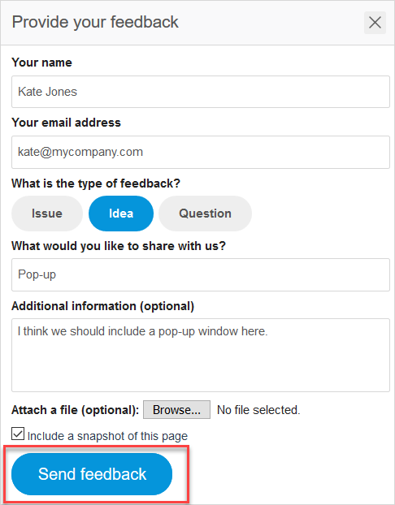
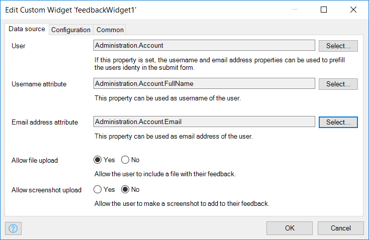

## 1 Introduction

With Mendix, you can make use of the fully integrated feedback cycle functionality. Mendix supports enabling the end-user to provide feedback out of the box. This feedback is then reviewed, processed, and converted into actionable user stories.

**This how-to will teach you how to do the following:**

* Use the widget for leaving feedback on an app
* Configure the Widget

## 2 Prerequisites

Before starting this how-to, make sure you have completed the following prerequisite:

* Create an app containing a working application model

## 3 Submitting Feedback on an App

The main purpose of the Mendix Feedback widget is to enable end-users to provide feedback on apps. By just clicking **Feedback** when you are logged in to a Mendix app, you can comment on low-priority issues, ask questions, and propose ideas for improvement. That feedback will be reviewed and processed. For details on how feedback is addressed for an app project, see [Feedback](index).

{}

Via the Feedback Widget, you can also also provide feedback on various parts of the Mendix Platform, such as the [Developer Portal](https://appstore.home.mendix.com/index3.html), [App Store](https://appstore.home.mendix.com/index3.html), [Forum](https://forum.mendixcloud.com/index4.html), [Academy](https://gettingstarted.mendixcloud.com/link/home), and documentation. However, please note that the **Feedback** button is not a support option. If there are any platform problems, contact [Mendix Support](http://support.mendix.com).

{}

To provide feedback via the Mendix Feedback Widget, follow these steps:

1. Click the **Feedback** button on the right-side of the screen.
2. Fill in the feedback you want to send to Mendix. A description of the feedback and a screenshot of the screen are optional but recommended.
3. Click **Send Feedback**:

    

After clicking **Send feedback**, your feedback will go straight to the [Feedback](feedback) page of your app project in the Developer Portal.

{}

For details on how to see all the feedback you have submitted, see the [Feedback](../mendix-profile/index#feedback) section of *Mendix Profile*.

{}

## 4 Adding the Mendix Feedback Widget to Your App Project

The Mendix Feedback Widget is automatically included in any new app that you create. To ensure you have the latest version of the Mendix Feedback Widget included in your app, follow these steps:

1. Download the latest version of the [Mendix Feedback Widget](https://appstore.home.mendix.com/link/app/199/) from the Mendix App Store.
2. When the latest Mendix Feedback Widget is included in your app, you need to ensure that the widget is added to the homepage of the application. Open the homepage from your app's **Project** > **Navigation**:

    

3. If the Mendix Feedback Widget has not been added to the page, add it to the page or layout by selecting **Add widget** > **Add-on widgets** > **Feedback Widget** and dropping it into a position in the page:

    

## 5 Configuring the Feedback Widget

To configure the widget, follow these steps:

1. Open the widget **Properties** by double-clicking the widget on the page. 
2. Select the **User** entity that is used in your application to store the name and email address of the user. Note that this object must be a specialization of the **User** entitiy within the **System** module (for example, **Account** in the **Administration** module).
3. Select the **Username attribute** that stores the name of the user and the **Email address attribute**. This will be used to automatically fill in the name and email address of the user who is logged in when submitting feedback in the app.
4. Decide whether you want to allow users to upload a file and screenshot to the feedback item (via **Allow file upload** and **Allow screenshot upload**, respectively). 

    

5. Open the **Configuration** tab of the Mendix Feedback Widget properties.
6. Ensure that the **Feedback server** is set to `https://sprintr.home.mendix.com/`.
7. Ensure that the **Project identifier** is filled in correctly. The project identifier is your **App ID**, and it is automatically filled in for the Mendix Feedback Widget. If necessary, you can find the identifier of your app in the [Developer Portal](http://home.mendix.com) by opening your app and clicking **General** under the **Settings** category:

    

8. If you have configured multiple home pages for different user roles, you need to add the Mendix Feedback Widget to each home page for the user role from which you want to gather feedback. This can easily be done by copying the configured widget to the other relevant layouts and pages.

## 6 Related Content

* [How to Configure the Mendix Feedback Widget for iOS](/howto/mobile/feedback-widget-ios)
* [How to Use the Mendix Feedback & Collaboration Widget](use-collaboration-widget)
* [Mendix Profile](../mendix-profile/index)
* [Collaboration Tools](../collaborate/index)
