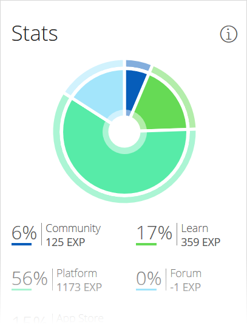
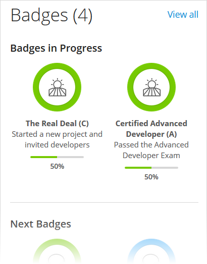
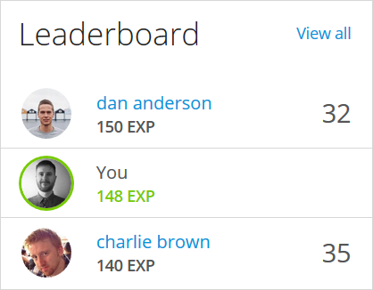

## 1 Introduction

**[VERIFY NAMING: Profile, MxProfile, Mendix Profile, Community Profile, Developer Profile]**

Your Mendix Profile is your main point of contact with members of the Mendix community. It is the page that displays your activities on the Mendix Platform as well as details about your life and background. There are plenty of ways to get more involved with the Mendix community, and your profile is a great starting point!

To access your Profile, hover over your picture on the right side of the Developer Portal navigation bar and select **My Profile** from the context menu.

**[VERIFY LINK NAME CHANGE - MY PROFILE?]**

## 2 Overview Tab

**[REVIEW BELOW]**

Your profile will open to the **Overview** tab. In the header of your profile, you see your personal information (which is also presented on the **Personal Info** card). These details can be easily edited to present accurate personal details, project roles, and skills you have gained. Click the **Settings** cog icon to edit your profile. This will take you to the edit mode, where you can edit your job function, biography, skills, industries, social media accounts, password, API keys. The header also presents your location, number of [connections](#connections), Mendix points, Mendix level, [credits ](#credits), and [badges](#badges).

Below the header, the first card you see presents your **Stats**. The chart and its legend display your points divided between various Mendix products and activities. For details on gaining points, see the [Points System FAQ](https://developer.mendixcloud.com/link/faq). When analyzing your points, be sure to also check out the [Leaderboard](#leaderboard) card on this tab to see the top Mendix community contributors!

The tabs of your Community Profile are described below.

## 3 Badges {#badges}

In addition to the **Stats** chart, on the **Overview** tab you can gain an overview of your **Badges**, which represent your achievements and progress on the Mendix Platform. You can see your **Badges in Progress** as well as **Next Badges**. The badges are color-coded based on their rarity, from green (least rare), to blue, purple, and orange (most rare). You can see all of your badges on the **Badges** tab of your profile. And for all the details on the badges—which will help you determine which next badges you can work towards—check out the [Badge Overview](https://developer.mendixcloud.com/link/badges).

## 4 Challenges

The **Challenge** card presents a featured challenge you can complete on the Mendix Platform to gain credits. Once you complete a challenge, you can claim the credits and use them in the MxShop.

**[UPDATE SCREENSHOT]**

Clicking **View all** will bring you to the **Challenges** tab of your profile, which gives you more details on your challenges and credits. You can complete these activities in any order you like.

Click **Claim Credits** **[VERIFY BUTTON NAME, GET NEW SCREENSHOT]** to claim your credits.

Completing your challenges and gaining credits is a great way to stay engaged with the Mendix community. And there are always new items available in the MxShop!

## 5 Connections {#connections}

One of the greatest strengths of Mendix is our awesome developers community, and the **Connections** card is the perfect place to start networking with fellow developers and Mendixites. When you are invited by a Mendixite to connect, you can check out their profile and make a decision to accept or ignore the invitation. You can also see a list of people you may know so that you can add further connections to your profile.

To connect with someone, click the plus icon.

**[DOCUMENT SENDING AN INVITE]**

Clicking **View All** on the card will bring you to the **Connections** tab of your profile. On this tab, you can invite friends and colleagues to Mendix in two ways:

* **Share URL** – copy the personalized invite link and share it on your personal website, blog, and social media channels, or share it directly via specific social media
* **Send invite** – send someone a Mendix invite by entering their email address and clicking **Send invite**

You will earn some Mendix swag with five successful invites!

**[VERIFY HOW BELOW IS BUILT]**

After you have invited someone to Mendix, click **View Status** to see their name and status listed at the bottom of the card. Their status is determined via these steps:

1. If you invited them via email, they will first get the **Invited** status.
2. When they click **Sign up for Mendix** and receive a confirmation email, they will get the **Confirmation e-mail sent** status.
3. When they complete the guided product introduction tour in the Mendix Web Modeler, their status will change to **Successful**.

Once five of your referred users reach the **Successful** status, you will see the **Claim your t-shirt** link on your dashboard. Click this to fill in some details and receive your awesome Mendix t-shirt. Yay!

## 6 Leaderboard {#leaderboard}

This card on your profile presents a selection of Mendix developers with the highest points.

**[UPDATE SCREENSHOT]**

Clicking **View all** takes you to the **Leaderboards** page, which presents all the boards available for viewing Mendix Platform user activity: **Top Overall**, **Top Forum**, **Top App Store**, **Top Platform**, **Top Community**, and **Top Learning**.

To earn points and climb the leaderboards, start performing different activities in the Mendix community. For example, let's say you have some time to spare while your app is deploying. You get a cup of coffee and check out the [Mendix Forum](http://forum.mendix.com). One questions pops out because you came across a similar problem a few weeks back. You decide to help the community member and post an answer to their question. Not long after, the author marks your answer as accepted. Boom! 15 points right there.

Check out the tables below which describe how to earn points.

**[NEED MAX POINTS PER DAY?]**

### 6.1 Forum Points

| Activity                                    | Points | Max. Points per Day |
| ------------------------------------------- | ------ | ------------------- |
| Have your answer marked as accepted         | 15     | n/a                 |
| Receive an upvote                           | 10     | 50                  |
| Mark an answer on your question as accepted | 2      |                     |
| Downvote someone                            | -1     |                     |
| Receive a downvote                          | -2     |                     |

### 6.2 App Store Points

| Activity                           | Points | Max. Points per Day |
| ---------------------------------- | ------ | ------------------- |
| Published an app                   | 50     | n/a                 |
| Published a new app version        | 25     | n/a                 |
| App review added                   | 5      | n/a                 |
| Download the Modeler               | 5      | 5                   |
| Download an app from the App Store | 1      | 5                   |

### 6.3 Platform Points

| Activity                                   | Points | Max. Points per Day |
| ------------------------------------------ | ------ | ------------------- |
| First member of the company                | 25     | n/a                 |
| Upload to Model Share                      | 10     | 10                  |
| Send an app invite                         | 10     | 50                  |
| Download a microflow from Model Share      | 5      | 5                   |
| Send a Platform invite                     | 5      | 50                  |
| Create a project                           | 5      | 5                   |
| Send in a feedback item                    | 2      | 10                  |
| Have your feedback item marked as accepted | 2      | 10                  |
| Commit to the Team Server                  | 2      | 10                  |
| Send a project invite                      | 2      | 20                  |
| Create a user story                        | 1      | 20                  |
| Post a message on the Buzz                 | 1      | 10                  |
| Deploy to licensed node                    | 1      | 5                   |
| Deploy to sandbox                          | 1      |                     |

### 6.4 Community Points

| Activity                               | Points | Max. per Day |
| -------------------------------------- | ------ | ------------ |
| Mendix Hackathon Winner                | 300    | n/a          |
| Reached MVP status                     | 300    | n/a          |
| Mendix Hackathon Runner-Up             | 150    | n/a          |
| Meetup Organized                       | 100    | n/a          |
| Complete Community Profile             | 50     | n/a          |
| Make Community Profile public          | 50     | n/a          |
| Add a review of Mendix to your profile | 50     | n/a          |
| Attended Mendix Hackathon              | 50     | n/a          |
| Successfully referred a friend         | 25     | n/a          |
| Attended Mendix World 2016             | 25     | n/a          |
| Meetup Attended                        | 25     | n/a          |
| GitHub pull request merged             | 15     | n/a          |
| Invite a friend                        | 5      | 50           |
| A user signed up via your referral URL | 5      | 50           |

{}

In order to receive Mendix points for your contributions to Mendix GitHub repositories (for example, [mendix / docs](https://github.com/mendix/docs)), you are required to authorize the connection to your GitHub profile. For more information on gaining Mendix points, see the [Points System FAQ](https://developer.mendixcloud.com/link/faq) and [How to Contribute to the Mendix Documentation](../documentation/contribute-to-the-mendix-documentation#GainingMendixPoints).

{}

### 6.5 Learning Points

| Activity                                           | Points | Max. per Day |
| -------------------------------------------------- | ------ | ------------ |
| Pass the Expert Developer exam                     | 100    | n/a          |
| Pass the Advanced Developer exam                   | 50     | n/a          |
| Presentation given                                 | 25     | n/a          |
| Write a Blogpost                                   | 25     | n/a          |
| Pass the Rapid Developer Exam                      | 25     | n/a          |
| Complete an online course on Getting Started       | 25     | n/a          |
| Made a large contribution to the documentation     | 15     | n/a          |
| Attend a Webinar                                   | 10     | n/a          |
| Contribute to the Mendix Documentation             | 10     | n/a          |
| Attend the classroom Advanced Developer course     | 10     | n/a          |
| Attend the classroom Rapid Developer Course        | 10     | n/a          |
| Made a small contribution to the documentation     | 5      | n/a          |
| Mark a lecture as completed in the Getting Started | 1      | n/a          |

### 6.6 Levels

When you earn enough points, you gain a level:

| Level | Points Needed |
| ----- | ------------- |
| 1     | 100           |
| 2     | 500           |
| 3     | 1000          |
| 4     | 2500          |
| 5     | 5000          |
| 6     | 8500          |
| 7     | 13000         |
| 8     | 18500         |
| 9     | 25000         |
| 10    | 32500         |

## 7 Portfolio

The **Portfolio** card presents a selection of Mendix app projects you have worked on. Click the project name to see more details about it (including a description of the app, business need, solution, results, and collaborators), or click **View all projects** to be taken to the  **Portfolio** tab, which presents a complete view of all your projects. 

To add a project to your portfolio, click **Add Project**, which will open the project editor. There are tips in the editor for what you should enter in each field. All of the fields in the project editor must be filled out before submitting the project.

If you cannot finish your project or do not want to publish it right away, click **Save as Draft** in the project editor to finish it later. The project draft will be visible only to you in your **Portfolio** tab and available for further editing.

## 8 Activity & Editing Your Profile

On the **Activity** tab, you can see a list of the most important public events for which you have gained Mendix points.

This tab also has a sidebar menu that takes you to other parts of your profile available for editing:

* **Profile**
* **Latest Messages**
* **Documents**
* **Feedback**
* **Team Server**
* **API Keys**
* **Pending Invites**

### 8.1 Profile Menu Item

**[ALL INFO IN THESE PARTS COPIED FROM CURRENT Mendix Profile DOC - VERIFY NAMING]**

In this tab, you can view and edit the following information:

* Full name
* Email
* Email notifications
* Date of birth
* Department
* Birthday
* Phone number
* Email
* OpenID – an identifier generated by Mendix to uniquely identify a user 
* Job title
* Department
* Location
* Country
* Phone number
* Website URL
* Twitter name
* LinkedIn URL
* Skype name

#### 8.1.1 Changing Your Password

You can change your password on this tab. By default, you are requested to change your password every 90 days. Only a Company Admin is allowed to change the expiration period.

These are the password requirements:

* At least eight characters long
* Constructed with at least one of the following:
	* Upper-case letter
	* Lower-case letter
	* Number
	* Special character (such as ! + @)

### 8.2 Latest Messages

In this tab, you will get an overview of all the notifications from the Buzz of which you are a part. For example, when your colleague has done the following:

* Created an app, sprint, or story
* Added a file or comment
* Joined a new app team

### 8.3 Documents

In this tab, you will get an overview of all the documents that you have shared within different apps in the Developer Portal.

### 8.4 Feedback

In this tab, you can view your the feedback you provided on the following:

* Apps of which you are a team member
* Your company’s apps of which you are not a team member (this is feedback you will not have permission to manage)
* External Mendix apps (this is feedback you will not have permission to manage)

For more information on feedback, see the [Reviewing Feedback in the Developer Portal](gathering-user-feedback#reviewing) section of *How to Use the Mendix Feedback Widget*.

### 8.5 Team Server

Changes made through the Desktop Modeler are stored in the Mendix Team Server. This tab provides an overview of the revisions you have committed.

### 8.6 API Keys

In this tab, you can view and create API keys that can be used by external applications to connect to the APIs of the Developer Portal on behalf of your user account. These keys allow you to execute operations (or have them executed on your behalf) that require authentication but for which you do not want to pass your actual password. An example of this is to use an API key to perform scripted operations on your application model with the Platform SDK.

For more information, see Mendix Platform SDK.

### 8.7 Pending Invites

In this tab, you can view your sent and received invitations.

There are two types of invitations:

* Project invitation – an invitation to join the development team to work on an app
* App invitation – an invitation to join the app as a user

### 8.8 Advanced

**[WHAT FROM ABOVE GOES HERE?]**

#### 8.8.1 Making Your Profile Public

If you have started editing your profile but it is not yet visible to other Mendix community members, syou will see a banner inviting you to make it public at the top of your profile. You can make it public by clicking **Make this profile public** under **Profile Visibility** on this tab.

Be sure to complete the following items, which are necessary to make your Profile public:

* Add an avatar
* Enter a **Function**
* Enter a **Location**
* Confirm if you are looking for a **job**, a **project**, both, or neither
* Enter a **Summary**
* Add at least 1 **Skill**
* Add at least 1 **Industry Experience** item

{}
To make a public profile private again, click Make this profile private.
{}

#### 8.8.2 Merging Your Accounts

**[CORRECT LOCATION, UNDER ADVANCED TAB?]**

With use of the Community Profile, you can merge your old Mendix account(s) into your current Mendix account. This action combines all your hard-earned points, certifications, and achievements in your efforts to climb the leaderboards.

These are the quick and easy steps to follow when merging your accounts:

Advanced settings - see screenshot

1. Click **Manage Account** on the right side of the screen.
2. Under **Merge your accounts**, enter the email address of the account you want to merge with your current account.
3. Click the send button to send a merge request.

We’ll take things from there. The email address of the merged account will be shown in this list when the accounts have been merged:

{}
With this action we only combine the accounts. We do not deactivate the old account(s). This should be done by that company’s administrator.
{}

## 9 Related Content

* [Company Admin](../companyadmin)
* [How to Deactivate and Activate Users](../howto/deactivate-users)
* [Feedback](../collaborate/feedback)
* [How to Manage Company Roles and App Roles](../howto/change-roles)
* [Mendix Platform SDK](/apidocs-mxsdk/mxsdk)
* [How to Provide Feedback on Mendix](../howto/feedback-mendix)
* [Roles Within the Company and Apps](../general/roles)
* [How to Use the Mendix Feedback Widget](../howto/gathering-user-feedback)