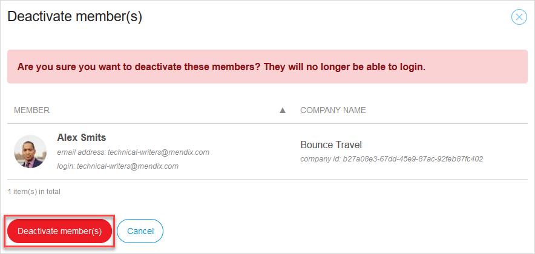
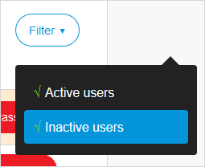
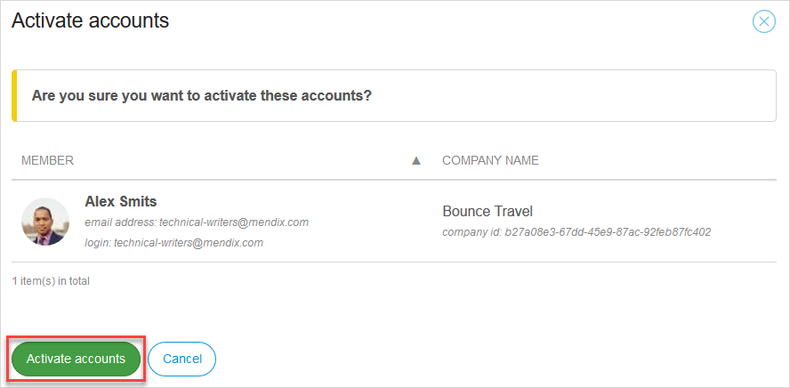

## 1 Introduction

A Company Admin can manage three tabs in the **Users** section:

## 2 Users

On the **Users** tab, the Company Admin can view, [deactivate](#deactivating), and [activate](#activating) users. 

They can also create reports about their company's users by clicking **Create Report**, view the apps of a user by clicking **Show Apps**, and reset a user's password by clicking **Reset Password**.

### 2.1 Deactivating Users {#deactivating}

For security reasons, deactivating the Mendix profile of an employee that is leaving your company is recommended. If the employee returns to your company, the Mendix profile can be activated again. 

{}
If a Mendix user moves to another company or comes from another company that is also using Mendix, the user can merge their old Mendix account(s) into the new Mendix account. This action combines all the hard-earned points, certifications, and achievements in the user's efforts to climb the leaderboards. For more information, see the [Merging Your Accounts](mendix-profile#merging) of *Mendix Profile*.
{}

Before deactivating a user, make sure the following points are true for that user:

* They do not have a **Company Contact**, **App Contact**, or **Technical Contact** role
* They are not the only **SCRUM Master** in an App Team
* They are not involved in unsolved support tickets with [Mendix Support](https://support.mendix.com)

For more information, see [How to Manage Company Roles and App Roles](/developerportal/howto/change-roles) and [Roles Within the Company and Apps](/developerportal/general/roles).

To deactivate a user, follow these steps:

1.  Select the check box for the user(s) you want to deactivate, then click **Activate / Deactivate user**.:

	

2.  In the pop-up window that appears, confirm your decision by clicking **Deactivate member(s)**:

	

The deactivated user will become inactive and will immediately disappear from the list of users on this tab. If you click **Filter** and select **Inactive**, you will see the deactivated users.

{}

You can only deactivate a user. It is not possible to delete a user completely.

{}

### 2.2 Activating Users {#activating}

To activate an inactive user, follow these steps:

Follow these steps to activate an inactive user:    

1.  Click **Filter** and select **Inactive** to see the list of company users extended with inactive (deactivated) users:

2. Select the inactive user and click **Activate / Deactivate user**.
3. In the pop-up window that appears, click **Activate accounts**.         

     

### 2.3 Create Report

You can create reports about users active in your company (either by being a member of the company or a member of an app owned by the company). You will be presented with the following options:

* **Export Users** – this report will return a list of users who are active in your company
* **Export Permissions** – this report will return a list of permissions for users active in your company's apps

You can export these reports by clicking **Export to Excel**. Note that the exports will contain further details in addition to those shown on the screen.

## 3 Security Groups {#security-groups}

This tab lists the security groups that are defined for your company. Users who are assigned to security groups will automatically be granted access to specified AppCloud apps. Company admins can set up security groups and specific app permissions for security groups.

A company admin can perform the following actions on the **Security Groups** tab:

*   Add/remove security groups
*   Set up a security group by clicking **Details** for a group, where you can do the following:
    * Add a member by clicking **Add**
    * Set up the access of a security group to apps by going to **Access To**
        * Members of this security group will be granted access to these apps automatically
        * Note that it is only possible to create policies for licensed, AppCloud-enabled apps
        * It is possible to select specific node evironments and user roles

## 4 Security History

A company admin can view all the changes made in the company on the **Security History** tab.

## 5 Related Content

* [Company Admin Overview](companyadmin-overview)
* [Company](company)
* [Apps](apps)
* [Nodes](nodes)
