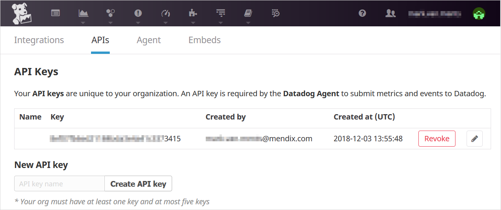
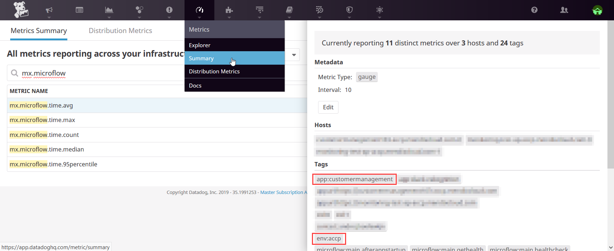
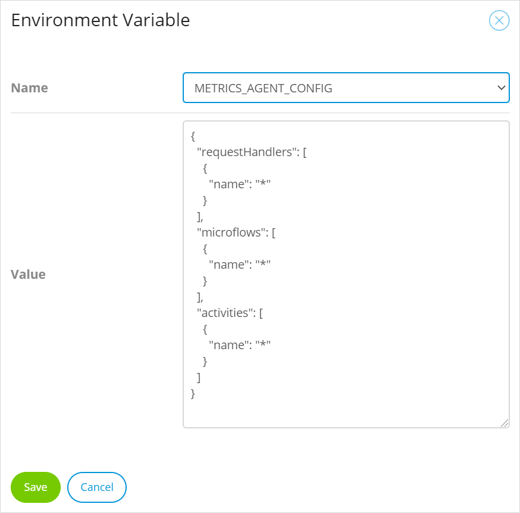

## 1 Introduction

**Datadog** is a monitoring and analysis tool for cloud applications, providing monitoring of servers, databases, tools, and services through a SaaS-based data analytics platform. You can link your Mendix Cloud v4 apps to Datadog to provide additional monitoring.

{}
Datadog logging is supported in Mendix version 7.15 and above.
{}

Two types of data are provided to Datadog:

* Data from within the Mendix app itself – this is described in [Customizing the Metrics Agent](#customizing), below
* Data from the Mendix Runtime, the Java Virtual Machine (JVM), the database, and the SaaS (Software as a Service, for example Cloud Foundry) environment – this is described in [Environment Metrics](#environment), below

This document explains how to configure your Mendix Cloud v4 app to send data to Datadog. If you want to know more about the capabilities of Datadog and, in particular, using Datadog with Mendix, have a look at the Mendix blog [Monitor Your Mendix Apps with Datadog](https://www.mendix.com/blog/monitor-your-mendix-apps-with-datadog/).

{}
Datadog is not supported in Mendix Cloud v3, nor in default deployment buildpacks for other cloud platforms.
{}

## 2 Datadog API Key{#api-key}

To make use of Datadog you will need a Datadog API key. If you already use Datadog, skip to the [Existing Datadog User](#existing-datadog-user) section to learn how to get one.

### 2.1 New Datadog User

If you are new to Datadog, you will need to get an account first.

1. Go to the Datadog site (for example, [https://www.datadoghq.com/](https://www.datadoghq.com/)) and choose **GET STARTED FREE**.
2. Enter your Datadog account details. Once you have entered your details you cannot continue until you have set up your agent.
3.  Choose the option **From Source**.

    

4.  Copy the value of *DD_API_KEY* key shown on the install script.

    

5. You now need to use this API key with your app: see [Connect Node to Datadog](#connect-node).

### 2.2 Existing Datadog User{#existing-datadog-user}

To find your existing API key, or to request a new one for your app, do the following:

1. Login to your Datadog account.
2.  Go to the **Integrations > API** screen.

    

3.  Copy an existing **API Key** or create a new one.

    

4. For more information on Datadog API keys, see the following page on the Datadog site: [How do I reset my Application Keys](https://docs.datadoghq.com/account_management/faq/how-do-i-reset-my-application-keys/) and related documentation.

## 3 Connect Node to Datadog{#connect-node}

To send your runtime information to Datadog, you need to provide the Datadog API key to your environment.

1. Go to the **Environments** page of your app in the *Developer Portal*.
2. Click **Details** to select the environment you wish to monitor with Datadog. 
3. Open the **Runtime** tab.
4. Add a **Custom Environment Variable**.
5.  Select **DD_API_KEY** from the *Name* drop-down.

	

6. Enter the Datadog **API key**, obtained in the [Datadog API Key](#api-key) section, above, as the *Value* of the Environment Variable.
7. Add a second **Custom Environment Variable**:

	* **Name**: *DD_LOG_LEVEL*
	* **Value**: *INFO*

	This will ensure that some messages are sent to Datadog. You can change the log level later once you have confirmed that Datadog is receiving them.

8.  Return to the **Environments** page for your app and *Deploy* or *Transport* your app into the selected environment.

	{}Your app must be **redeployed** before it is started as additional dependencies need to be included.<br/><br/>Restarting the app is not sufficient to start sending data to Datadog.{}

## 4 Tagging Metrics for Datadog

To identify the metrics for your app and environment in Datadog, it is recommended that you add tags for the app name and environment. Our recommendation is that you use the following tags:

* app:{app_name} – this enables you to identify all metrics sent from your app (for example, **app:customermanagement**)
* env:{environment_name} – this enables you to identify metrics sent from a particular environment so you can separate out production metrics from test metrics (for example, **env:accp**)

To set these tags, do the following:

1. Go to the **Environments** page of your app in the *Developer Portal*.
2. Click **Details** to select an environment you are monitoring with Datadog. 
3. Open the **Tags** tab.
4. Add a **Tag** – this is the string which is sent to Datadog as a tag.
  
5. **Restart** the application.

Setting these values for your app means that all metrics from this environment of your app will have these tags. For example, the tags for mx.microflow.time.avg for this set of metrics include **app:customermanagement** and **env:accp**.



You can add more tags if you want, but note that Datadog's charges include an element for [custom metrics](https://docs.datadoghq.com/developers/metrics/custom_metrics/) as described on the Datadog site.

## 5 Customizing the Metrics Agent{#customizing}

Mendix provides logging of various actions within the app. These are sent to Datadog with the namespace **mx**. Timing values are sent in milliseconds.

By default, Mendix will pass a log of *all* request handler activity to Datadog and no other information. However, by using JSON to configure the metrics agent, you can add logs of microflows and activities within microflows, and restrict which request handler calls are sent.

Mendix adds the following tags to metrics from microflows and activities:

* **microflow:{microflow_name}** – indicates which microflow the metric came from — the microflow name is in the format `{module}.{microflow}`
* **activity:{activity_name}** – indicates which activity the metric came from

### 5.1 Format of Metrics Agent Configuration

You can specify which request handlers, microflows, and activities are reported to Datadog using a JSON configuration with the following format (note that this is the syntax and not an example of this custom setting):

```json
{
  "requestHandlers": [
    {
      "name": "*" | "<requesthandler>"
    }
  ],
  "microflows": [
    {
      "name": "*" | "<microflow>"
    }
  ],
  "activities": [
    {
      "name": "*" | "<activity>"
    }
  ]
}
```

| Value | What Is Sent | Note |
| --- | --- | --- |
| `"name": "*"` | All | Default |
| `"name": "<requesthandler>"` | All request handler calls of this type | click **Request Handlers<sup><small>1</small></sup>** below to see the list of options |
| `"name": "<microflow>"` | Each time this microflow is run | The format is `<module>.<microflow>`<br />For example, `TrainingManagement.ACT_CancelScheduledCourse` |
| `"name": "<activity>"` | All activities of this type | click **Activities<sup><small>2</small></sup>** below to see the list of options |

**<details><summary><sup><small>[1]</small></sup>Request Handlers (click to see list)</summary>**

The following Mendix *request handler* calls will be passed to Datadog:

| Request Handler | Call Type | Namespace |
| --- | --- | --- |
| `WebserviceRequestHandler` | SOAP requests | `mx.soap.time` |
| `ServiceRequestHandler` | OData requests | `mx.odata.time` |
| `RestRequestHandler` | REST requests | `mx.rest.time` |
| `ProcessorRequestHandler` | REST, ODATA, SOAP **doc** requests | `mx.client.time` |
| `ClientRequestHandler` | `/xas` requests (general queries for data in data grids, sending changes to the server, and triggering the execution of microflows) | `mx.client.time` |
| `FileRequestHandler` | File upload/download requests | `mx.client.time` |
| `PageUrlRequestHandler` | `/p` requests | `mx.client.time` |

You can find help in analyzing some of these values in [Trends in Mendix Cloud v4](trends-v4).
</details>

**<details><summary><sup><small>[2]</small></sup>Activities (click to see list)</summary>**

The following Mendix *activities* can be passed to Datadog:

* `CastObject`
* `ChangeObject`
* `CommitObject`
* `CreateObject`
* `DeleteObject`
* `RetrieveObject`
* `RollbackObject`
* `AggregateList`
* `ChangeList`
* `ListOperation`
* `JavaAction`
* `Microflow`
* `CallRestService`
* `CallWebService`
* `ImportWithMapping`
* `ExportWithMapping`
</details>

**Example**

The following example will send logs for:

* All request handlers
* The microflow `After_Startup` in the module `Administration`
* The `CreateObject` and `DeleteObject` activities

```json
{
  "requestHandlers": [
    {
      "name": "*"
    }
  ],
  "microflows": [
    {
      "name": "Administration.After_Startup"
    }
  ],
  "activities": [
    {
      "name": "CreateObject"
    },
    {
      "name": "DeleteObject"
    }
  ]
}
```

### 5.2 Passing a Configuration to the Metrics Agent

You pass the configuration to the metrics agent by adding a *Custom Runtime Setting* to your Mendix Cloud environment.

1. Go to the **Environments** page of your app.
2. Click **Details** next to the environment you have configured for Datadog.
3. Add a **Custom Environment Variable** *METRICS_AGENT_CONFIG* with the value of the JSON required for your configuration.

	

4. Click **Save**.
5. Restart your app to apply the new settings.

## 6 Environment Metrics{#environment}

As well as information from within the Mendix app (identified by the namespace *mx*), your app environment will also provide metrics in the following namespaces:

* database – metrics on the database performance
* datadog  – metrics on datadog usage
* jmx – metrics from the Mendix runtime
* jvm – metrics from the Java virtual machine in which the Mendix runtime runs
* postgresql – database metrics specific to PostgreSQL databases
* synthetics – metrics specifically labelled as coming from tests (see the Datadog documentation [Synthetics](https://docs.datadoghq.com/synthetics/))
* system – metrics from the base system running on the platform or PaaS (see the Datadog documentation [System Check](https://docs.datadoghq.com/integrations/system/))

### 6.1 Useful Metrics for Mendix Apps

The following metrics are useful when monitoring the performance of your Mendix app:

* database.diskstorage_size
* jvm.heap_memory
* jvm.heap_memory_committed
* jvm.heap_memory_init
* jvm.heap_memory_max
* jvm.non_heap_memory
* jvm.non_heap_memory_committed
* jvm.non_heap_memory_init
* jvm.non_heap_memory_max
* postgresql.connections
* postgresql.database_size
* postgresql.max_connections
* postgresql.percent_usage_connections

Note that the absolute values are often not useful, but looking at trends over time can indicate performance issues or future action which might be required. Some of these trends are similar to those described in [Trends in Mendix Cloud v4](trends-v4).

## 7 Additional Information

### 7.1 Log Levels

The valid values for **DD_LOG_LEVEL** are:

* CRITICAL
* ERROR
* WARNING
* INFO
* DEBUG

### 7.2 Datadog Events Log

The Datadog Events log contains events which come from your app: those are the same events that would appear in the Mendix Console. It does not contain events from the environment.


### 7.3 Datadog Agent not Started

If you configure your app for Datadog but the Datadog agent is not started, the events will be sent to the app log files.

### 7.4 Datadog Environment Variables

If you configure your app for Datadog, a Datadog Agent is started for you. You can set additional environment variables according to the [Datadog Agent documentation](https://docs.datadoghq.com/agent/guide/agent-configuration-files/).

Some environment variables are pre-provisioned for you according to the [Mendix Buildpack documentation](https://github.com/mendix/cf-mendix-buildpack#datadog). Depending on the variable, you have the choice to override the preset value.

### 7.5 Datadog Issues

If you have any issues related to accessing Datadog, please contact their support here: [Support | Datadog](https://www.datadoghq.com/support/), or by email at [support@datadoghq.com](mailto:support@datadoghq.com).

## 8 Read More

* [Metrics](metrics)
