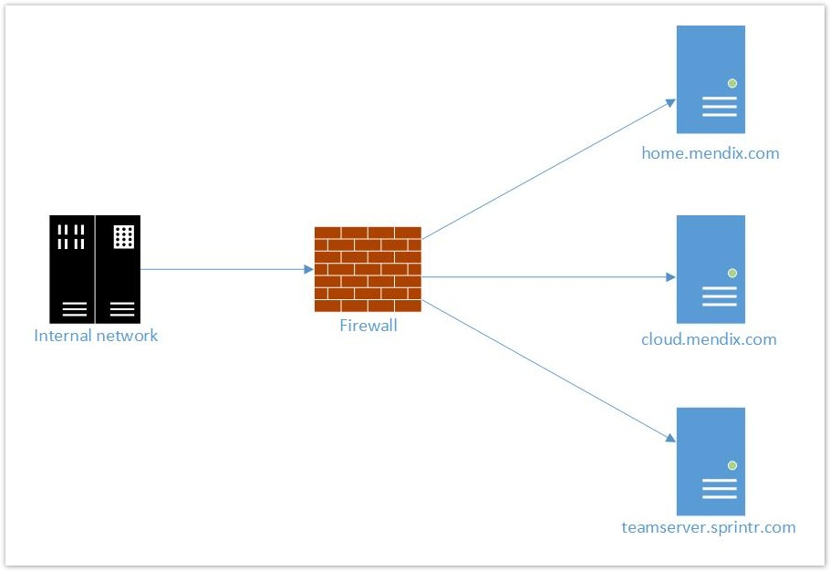

## 1 Introduction

The Mendix Modeler needs to connect to Team Server, which is where all your projects are stored. Before you continue with this how-to, make sure that you are logged in to Mendix at [home.mendix.com/home/](https://home.mendix.com/home/). If you do not have an account, you can sign up here: [http://www.mendix.com/try-now/?utm_source=documentation&utm_medium=community&utm_campaign=signup](http://www.mendix.com/try-now/?utm_source=documentation&utm_medium=community&utm_campaign=signup).

**This how-to will teach you how to do the following:**

*   How to troubleshoot network issues when downloading projects from and uploading projects to Team Server
*   Which permissions and settings are required to connect to Team Server

## 2 Prerequisites

Before starting this how-to, make sure you have completed the following prerequisites:

*   A Mendix account - sign up for one [here](http://www.mendix.com/try-now/?utm_source=documentation&utm_medium=community&utm_campaign=signup)
*   Mendix Modeler installed - download the Mendix Modeler [here](https://appstore.mendix.com/)
*   Download or upload a Team Server project in the Mendix Modeler

## 3 Identifying Blocking Network Issues

When you download or upload a Team Server project the Mendix Modeler is unable to connect to Team Server and displays an error dialog window without an error message.

Mendix is aware that the error stated above does not provide any relevant information. We are currently working to solve this.

### 3.1 Downloading a Team Server Project

Being unable to download the Team Server project would indicate that the security configuration of your company network is blocking access to `https://home.mendix.com` and `https://teamserver.sprintr.com/`. If this solution does not work, please submit a request with Mendix Support at [support.mendix.com](https://support.mendix.com/).

## 4 Enabling Firewall Access to Team Server

Team Server is implemented using Subversion and the Mendix Modeler uses the HTTPS (TCP) protocol to communicate with that server. To access Team Server from within the Modeler the network at your location needs the following settings:

*   The HTTPS port (TCP 443) needs to be open
*   The HTTP port (TCP 80) needs to be open
*   WebDAV - verbs within the HTTP protocol - needs to be enabled on the proxy server (if any)

You can look up the IP address of [https://teamserver.sprintr.com/](http://teamserver.sprintr.com/), however, Mendix reserves the right to, at any time and without notification to the customer, change the IP address. This could happen if we move to a different infrastructure for example.

If needed, inform your IT department that the Mendix Modeler connects to [https://teamserver.sprintr.com/](https://teamserver.sprintr.com/). This will enable them to determine the correct firewall/proxy settings.

The Mendix Modeler connects with the domains stated below over HTTPS on port 443. These domains should be added to the firewall white list:

*   [home.mendix.com](http://mendix.com/) – enables logging in to and use the Mendix Modeler
*   [cloud.mendix.com](http://cloud.mendix.com/) and [cloud.home.mendix.com](http://cloud.home.mendix.com/) – enables deploying your app to the Mendix Cloud
*   [teamserver.sprintr.com](http://teamserver.sprintr.com/) – enables accessing Team Server and downloading, uploading, and committing Team Server projects in the Mendix Modeler

## 5 Related Content

*   [Open Project Dialog](/refguide6/open-project-dialog)
*   [Download From Team Server Dialog](/refguide6/download-from-team-server-dialog)
*   [Upload A Project To Team Server](/refguide6/upload-to-team-server-dialog)
*   [How to Submit Support Requests](submit-support-request)
