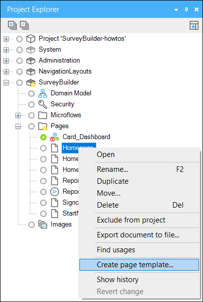
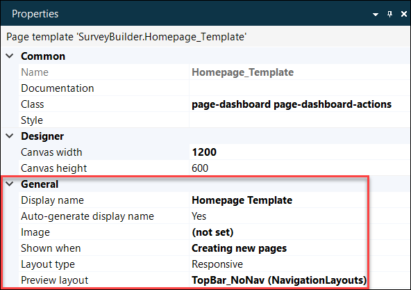
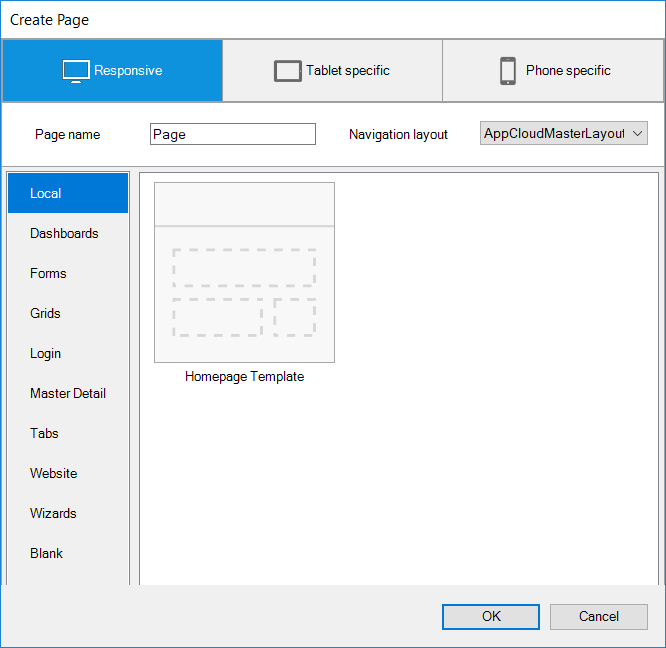
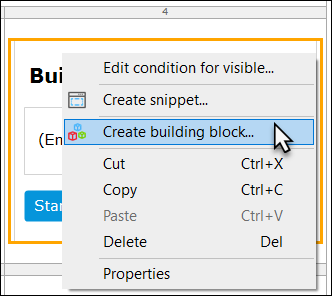
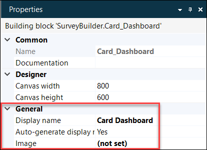
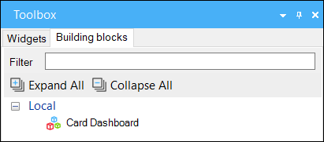
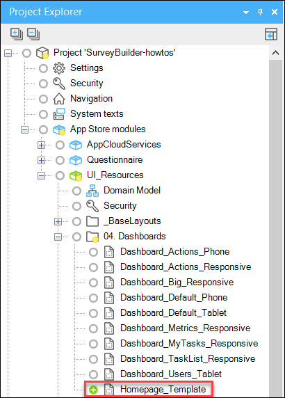
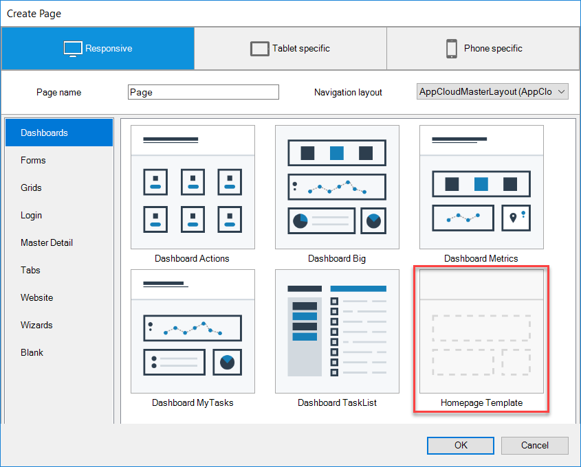
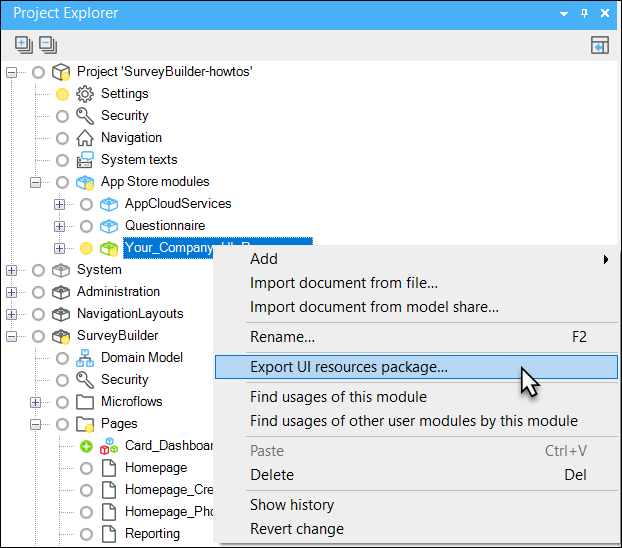

## 1 Introduction

Creating Atlas UI resources for your company is a great way to keep your company apps in sync with your company brand. It’s easier to scale and manage apps throughout your app landscape when all the resources are neatly organized in a single module. In this how-to, we will go through all the steps of creating your own UI Resources.

## 2 Creating Page Templates

The Atlas UI resources include a large variety of page templates to use. When creating an app, a lot of pages you create will be custom-made, and developers may want to reuse these page templates within the app or in other apps without having to start from scratch. This is now possible in the Mendix Desktop Modeler.

In the example below, we’ll go through the steps of creating a new page template and talk about how the page template behaves in a local project and in the **UI Resources** module.

### 3.1 Example Scenario

In the Desktop Modeler, go to the **Project Explorer** of your app and right-click the page you want to use as the page template. In this example, we are using a dashboard page.

Name the page template you want to create. Select your layout type. Responsive layouts are best when your app will be viewed on multiple screen sizes, tablet and phone types are best for their respective devices, and popup layout types should be chosen when you would like the content of your page to be seen in a popup. The preview layout is the default layout that will be used when creating the page template.

The page template is now a new document type in the module with its own icon. In the page templates properties pane, a few features have been created.

* Display name
  The name of the page template, which will be shown in the "create page" dialogue.
* Image
  The page template preview image, which will be shown in the "create page" dialogue.
* Show when
  There are three options for when to show the page template. Creating new pages (default), generating edit pages and generating select pages.
* Layout type
  Layout type is needed to categorize the page as suitable for a responsive, tablet, phone or popup type.
* Preview layout
  Default layout that will be used when creating the page template.

When you create a new page in the module, it will now also show the created page template. The example below shows how the page template has been added to the “Local” category. Everything that has been created will stay “Local” until we move the page templates in the UI Resources module.

Page templates in Atlas UI are all built with building blocks. In the next step, we will walk you through the steps of creating building blocks.

#### Creating Building Blocks

Building blocks are single-purpose user interface elements, comprised of multiple widgets. Multiple building blocks are usually used together on one page. Atlas UI comes with a variety of building blocks like cards, forms, headers, controls and more.

Every page can contain building blocks by grouping widgets together. In our example, we have a building block that consists of a container, title, text and a button. This is a simple building block that is used often in apps.

Go to a page and select a group of widgets that can be used as a building block. Right mouse click on the container or parent widget that includes the widgets and click on “Create building block”.

Name the building block you want to create.

The building block is now a new document type in the module with its own icon. In the building block properties pane two features have been created.

* Display name
  The name of the building block that will show in the toolbox pane of the Mendix Web Modeler.
* Image
  The building block preview image that will be shown in the toolbox pane of the Mendix Web Modeler.

The building block is now available in the toolbox, where users can drag and drop it and other building blocks onto the page. The example below shows that the building block has been added to the “Local” category. Everything that has been created will stay “Local” until we move the building block in the UI Resources module.

Moving from Local to Atlas UI Resources

Now that it’s clear how to create page templates and building blocks, it would be good to know how we can get our resources from “Local” to a module that can be shared with our apps and users. Let’s begin by placing our page template inside the “Atlas_UI_Resources” module under App Store Modules.

In our example, the new page template has been added to the dashboard category. When we now create a new page in the Mendix Desktop Modeler, the “Homepage Template” has been added to the create page dialogue under “Dashboards”.

Atlas UI Resources has been sorted with folders in the module that can be renamed and used as categories for page templates and building blocks. The sorting is done using numbers in front of the name which can be altered to change the order in which they appear. Page templates and building blocks can be placed inside the same folder to reuse the same category names.

Using an underscore (See the example for "Layouts") ensures the folder doesn’t get added to the categories for page templates or building blocks.

#### Export Company Atlas UI Resources

When the resources are ready to be shared with multiple developers or apps, the module can be exported from the project explorer. You are free to change the name of module as long as the module has been exported as a UI resource package.

The module can now be imported in other apps or be uploaded to the Mendix App Store. There is an option to make the resource module available for private use only so everybody in the company can benefit from and extend this module.
