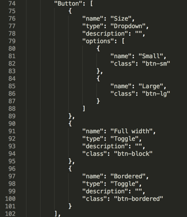

## 1 Introduction

There is a customizable **settings.json** file for Atlas UI that can be found in the **theme** folder of your Mendix project. This file allows you to do the following:

* Enable page templates for the Web Modeler and Atlas UI
* Configure design properties that can be used in the Web Modeler

By default, every Mendix Atlas UI app has this file in the **theme** folder.

**This how-to will teach you how to do the following:**

* Enable page templates
* Configure design properties

## 2 Enabling Page Templates for Web Modeler and Atlas UI

The first line in the **settings.json** file enables the resources, page templates, and building blocks that are integrated with Atlas UI, the Web Modeler, and the Desktop Modeler:

 ```"pageTemplates" : "WebModeler"```

If this line is deleted, the old Mendix UI Framework resources will be loaded in the Mendix Web Modeler and Desktop Modeler. If you do not want to use Atlas UI, it is possible to delete this line.

## 3 Configuring Design Properties for Use in the Web Modeler

Design properties are created to give your users and widgets more power in the Web Modeler. Atlas UI contains a design properties file that can be added extended with your own custom design properties.

The example below shows the design property of a `"Button"`. The detailed Sass information can be found in this file: */theme/styles/sass/lib/components/_buttons.scss*.

* `"name"` – the name of the design property
* `"type"` – the type of design property (for example, `Dropdown`, `Toggle`, `Input`)
* `"description"` – a brief explanation of the design property
* `"options"` – the array of options that shows the name and CSS class specified in the Sass files for Atlas UI



These design properties are used in the Web Modeler to give you more power when you use widgets:


## 4 Related Content

* [How to Get Started with Atlas UI](start-with-mendix-and-atlasui)
* [How to Create Company Atlas UI Resources](create-company-atlas-ui-resources)
* [How to Create Custom Preview Images for Building Blocks and Page Templates](create-custom-preview-images-for-building-blocks-and-page-templates)
* [How to Migrate Existing Projects to Atlas UI](migrate-existing-projects-to-atlasui)
* [How to Share Company Atlas UI Resources](share-company-atlas-ui-resources)