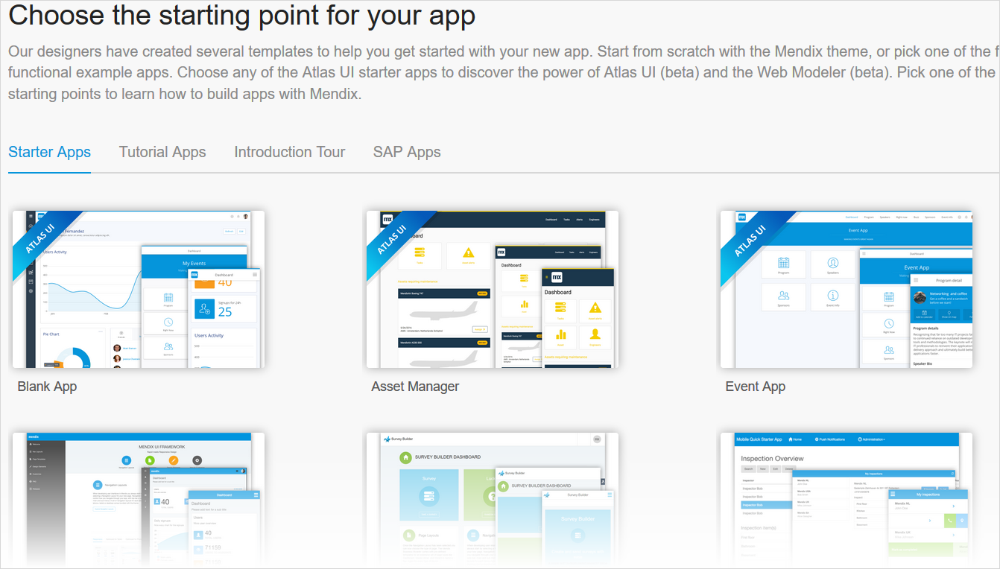
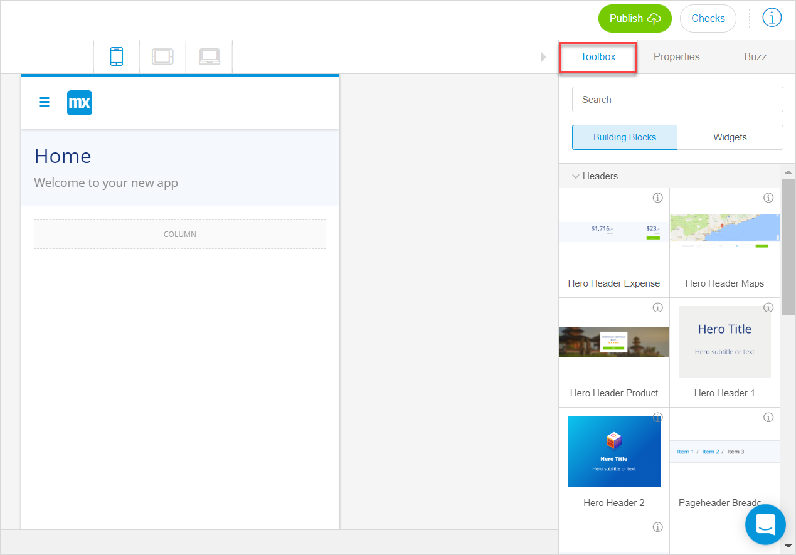
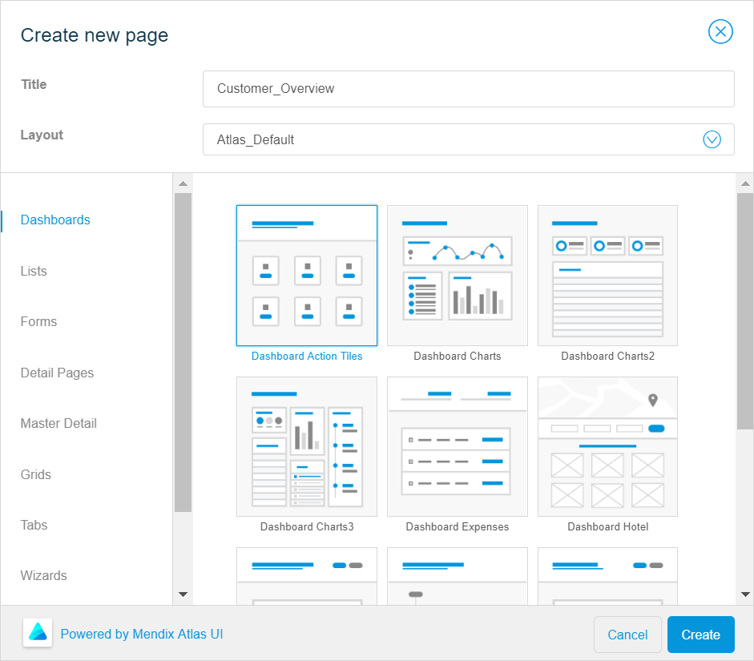

## 1 Introduction

The Mendix Web Modeler is a powerful collaborative tool that lets you build your application in the cloud together with your team. When you log into the Web Modeler for the first time, you get the option to choose a starter app that is fully Atlas-enabled.

**This how-to will teach you how to do the following:**

* Choose a starter app
* Edit your app in the Web Modeler
* Choose a page template
* Customize your theme

## 2 Prerequisite

Before starting this how-to, make sure you have completed the following prerequisites:

* Have a Mendix account (sign up [here](https://www.mendix.com/try))

## 2 Choosing Your Starter App

In the [Mendix Developer Portal](https://sprintr.home.mendix.com/index.html), click **Create App**. On the **Starter Apps** tab, there are a number of apps marked with **ATLAS UI** that are Atlas UI-based. You can select one to get started.

For more information about Atlas UI, see [Atlas UI](index). 

## 3 Editing Your App in the Web Modeler

You now have access to your app **Buzz** in the [Developer Portal](/developerportal). From **Buzz**, you can open the [Mendix Web Modeler](/web-modeler/general-wm) clicking **Edit App** in the top-right corner of the screen:

{}

{}

Note that when you click **Edit App** for any Atlas UI app, it will automatically open in the Web Modeler. If you need to edit the app in the Desktop Modeler, click the drop-down menu on the **Edit App** button and select **Edit in Desktop Modeler**.

## 4 Exploring the Mendix Web Modeler

Your app is ready to be built. In the **Toolbox** in the [page editor](/web-modeler/page-editor-wm), you will find building blocks and widgets you can build your pages with. 

All these resources have been created with Atlas UI. Each building block has an information icon that directs you to the Atlas UI website for the relevant information:

## 5 Choosing a Page Template

You can choose a page template when you create a new page. For information on how to create a new page and perform other basic functions, see section [3 Performing Basic Functions](/web-modeler/page-editor-wm#page-editor-basic-functions) in Page Editor in the *Web Modeler Guide*. 

For example, **Dashboard Action Tiles**, **Dashboard Charts**, **Dashboard Expenses** are page templates. 

Once the page is created, you can customize it.

## 6 Customizing Your Theme

The **[Theme Customizer](/web-modeler/theme-customizer-wm)** allows you to customize your app in the Web Modeler. For more information on how you can style your app with it, see [Theme Customizer](/web-modeler/theme-customizer-wm) in the *Web Modeler Guide*. 

## 7 Read More

* [How to Create Custom Preview Images for Building Blocks & Page Templates](create-custom-preview-images-for-building-blocks-and-page-templates)
* [How to Extend Design Properties to Customize the Web Modeler Experience](extend-design-properties-to-customize-the-web-modeler-experience)
* [How to Migrate Existing Projects to Atlas UI](migrate-existing-projects-to-atlasui)
* [How to Share Company Atlas UI Resources](share-company-atlas-ui-resources)
* [Web Modeler General Info](/web-modeler/general-wm) 
* [Page Editor in the Web Modeler](/web-modeler/page-editor-wm)
* [Theme Customizer in the Web Modeler](/web-modeler/theme-customizer-wm)