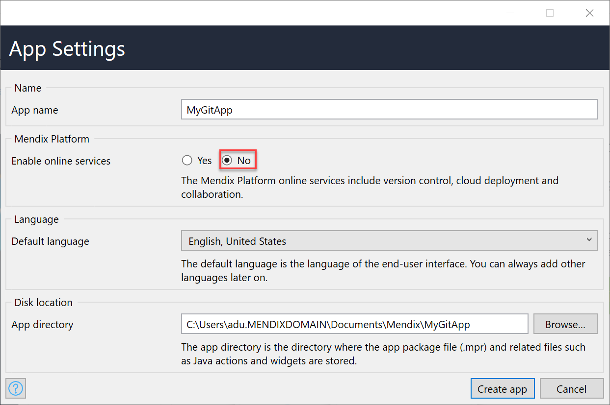
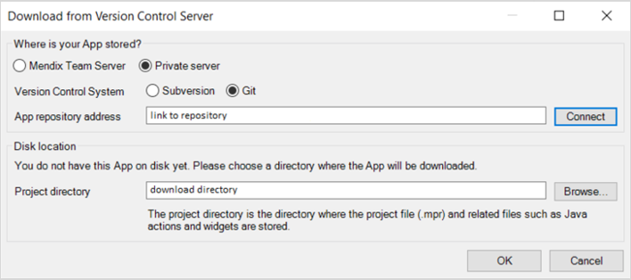
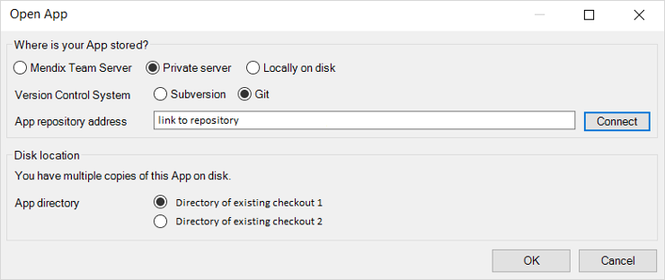
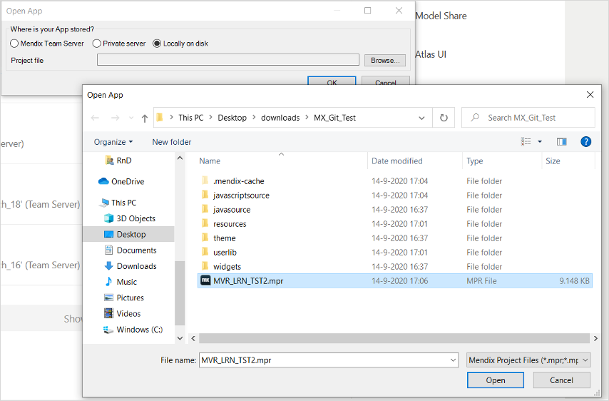
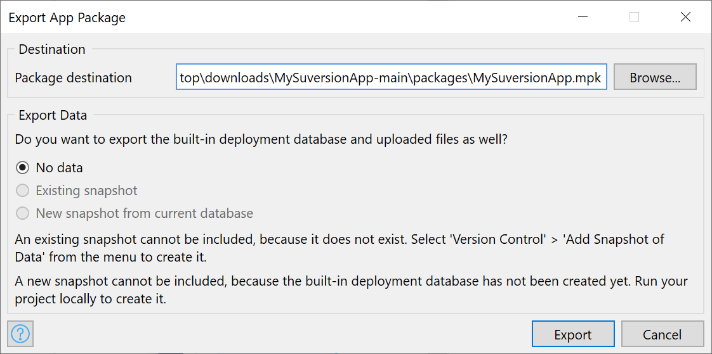
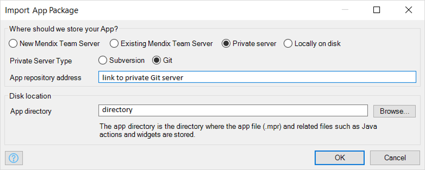

## 1 Introduction

When developing Mendix applications, changes to these applications are stored in a version control system. This system is called [Team Server](/developerportal/develop/team-server) and is part of the Mendix Platform. This means that the application's files are stored in the Mendix online environment. For more information, see the [Version Control Reference Guide](/refguide/version-control).	

While using Team Server is the recommended for most Mendix developers, you may prefer to store your application's files in a system controlled by your own organization. For version control, Mendix uses the [Subversion](https://subversion.apache.org) system (also known as SVN) and [Git](on-premises-git-howto). This how-to describes how to work with Git version control system.	

{}	
This how-to will not describe how to set up a Git server from scratch; typically, this will be taken care of by the IT department of your organization.	
{}

{}	
You will not be able to use Mendix Studio for collaborative development if you use an on-premises version control server. Collaborative development between Studio and Studio Pro will only work if you use the Mendix Team Server.	
{}	

**This how-to will teach you how to do the following:**	

* Configure your Mendix apps to work with Git (on-premises) version control system	

## 2 Prerequisites

Before starting this how-to, make sure you have completed the following prerequisites:

* Make sure you have the right server provider. We currently only support Git Private Server. For more information, see the [Preparing Your Repository](#preparing-your-repo) section. 
* You have a feature flag enabled. For more information, see the [Enabling a Feature Flag](#enable-feature-flag) section.
* You have an unversioned Mendix app. For more information, see the [Creating an App](#create-app) section.

## 3 Supported Authentication Mechanisms

Currently, we only support HTTP Basic authentication for Git service providers. With most providers this takes the form of using of Personal Access Tokens (PATs).

To use PAT (or another equivalent), you need to specify it in the **Password** field when Studio Pro requests credentials for the version control server:

For instruction on how to set up Personal Access Tokens, see the [Supported Git Service Providers](#supported-providers) section below.

## 3 Supported Git Service Providers {#supported-providers}

### 3.1 Azure Repos and Azure DevOps Server 

We support both Microsoft’s [Azure Repos](https://azure.microsoft.com/en-us/services/devops/repos/) hosted Git service, and Azure DevOps Server (former Team Foundation Server) which is an on-premises solution for hosting your Git repos on private infrastructure.

To get a PAT for your user account, see the [Use personal access tokens](https://docs.microsoft.com/en-us/azure/devops/organizations/accounts/use-personal-access-tokens-to-authenticate?view=azure-devops&tabs=preview-page) instructions in the Microsoft documentation.

You need `Code (full)` permission for your token.

### 3.2 GitHub 

We support GitHub’s hosting solutions, including the free GitHub.com cloud-hosted service and GitHub Enterprise, both hosted (Enterprise Cloud) and on-premises (Enterprise Server).

To get a PAT for your user account, see the [Creating a personal access token](https://docs.github.com/en/free-pro-team@latest/github/authenticating-to-github/creating-a-personal-access-token) instructions in the GitHub documentation. 

You need `repo` permissions for your token.

### 3.3 GitLab 

We support all tiers of GitLab’s service, including GitLab.com, GitLab Community Edition, and GitLab Enterprise Edition.

To get a PAT for your user account , see the [Personal access tokens](https://docs.gitlab.com/ee/user/profile/personal_access_tokens.html) instructions in the GitLab documentation. 

You need `write_repository` permission for the token.

### 3.4 BitBucket 

We support all tiers of Atlassian’s BitBucket service, including BitBucket.org, BitBucket Server, and BitBucket Data Center on-premises solutions.

On BitBucket.org, the Personal Access Tokens are called App Passwords.

To setup an App Password for your BitBucket.org account, see the [App passwords](https://support.atlassian.com/bitbucket-cloud/docs/app-passwords/) instructions.

BitBucket Server and BitBucket Data Center, on the other hand, still use the term Personal Access Tokens. To set up a personal access token, see [Personal access tokens](https://confluence.atlassian.com/bitbucketserver/personal-access-tokens-939515499.html) instructions.

In both cases you need `repository write` permission.

### 3.5 AWS CodeCommit 

We have a known compatibility issue with AWS CodeCommit in Git Technology Preview for Studio Pro. We are working to resolve the issue in the next release.

## 4 Setting Up the Environment

This section describes how to configure a Git versioned app in Studio Pro. You need a Git server and an initially unversioned Mendix app.

### 4.1 Preparing Your Repository {#preparing-your-repo}

Studio Pro is able to use the following Git server providers:

* Azure DevOps Server
* Azure Repos
* GitHub.com
* GitHub Enterprise Edition
* GitLab.com
* GitLab EE
* GitLab CE
* BitBucket.org
* BitBucket Server
* BitBucket Data Center

You need to create a private repository in the selected provider and create a Personal Access Token (PAT) to provide access to it. The PAT is used as a password.

To interact with this private repository from Studio Pro, you need a link to the repository and a PAT.

For more information on PAT, see the [Supported Git Service Providers](#supported-providers) section above.

### 4.2 Enabling a Feature Flag {#enable-feature-flag}

To use Git, you need to start Studio Pro with a specific feature flag. Navigate to the directory where Studio Pro is located, specifically where the **studiopro.exe** file is. There are two ways to enable the feature flag: 

1. **The command-line method** – Open the command line at that location (or navigate to it from the command line) and type the following command: `studiopro.exe --enable-git-support`.

2. **The shortcut method** – do the following:

    1. Right-click the file and click **Create shortcut**. If you are asked to save it on the Desktop, click **Yes**. 

    2. Once the shortcut is created, right-click it and select **Properties**.
    3. At the end of the **Target** field, add the feature flag `--enable-git-support` after a space:

        

    1. Click **OK**.
    2. Start Studio Pro by double-clicking the shortcut.        
    3. Once Studio Pro is opened, go to **Edit > Preferences > Version Control** and make sure to activate private version control for Git. The name and email values will be used to identify your commit:

        

Studio Pro now is set up to support Git.

### 4.3 Creating an App {#create-app}

Create an unversioned app in Studio Pro:

Once the app is created, you can upload it to your private Git repository. For more information on how to upload it, see the [Uploading to the Private Git Server](#upload-to-private-git-server) section below.

### 4.4 Downloading from a Private Repository

Now that you have a Git app on your server, you can download it to another directory or one of your team members can download it on their machine. Follow the steps below:

1. Under **Version Control > Download from Version Control Server**, select the **Private server** option and enter the URL of your repository, which contains the app you want to download. If you are not sure what URL to use, you can find this info in your Git server.
2.  If you have both Subversion and Git enabled for the private version control in your preferences in Studio Pro, specify which version control system your repository uses. For this case, enable the **Git** radio button:

    

3.  Enter the link to the repository in the **App repository address** and click **Connect**. Now you will have the option to change the directory where the app is downloaded to:

	

4. Click **OK**. 
5.  In the **Sign In** dialog box, enter your credentials:

	

6. Enter username (it can be anything except empty) and use the PAT you saved earlier as the password. 

The app is downloaded and ready to be used with version control.

### 4.5 Opening the Existing Git App

There are a few ways to open a Git Mendix app, as long as you have Studio Pro started up with the [git feature flag](#enable-feature-flag).

#### 4.5.1 Recent Apps List

In your **Recent Apps** list, you can click the app name and the app will open.

#### 4.5.2 Recent Apps Menu

Under **File** > **Recent Apps**, you can select the app and open it.

#### 4.5.3 Open App Form

The **Open App** form is accessible from two different places:
* **Open App** button on the **My Apps** tab
* Under menu **File > Open App**

In a form, there are two ways to open a Git app, by opening it from a previous checkout or by opening it locally on disk:

For the previous checkout method do the following:

1. Open from previous checkout.
2. Enable the **Private server** radio button and enter the link to the repository. 
3. Click **Connect**. 
4.  If you have checked out the app at least once, you can then pick one of the existing locations on disk and the app will open (shown here with two previous checkouts):

	
	

For the previous local disk method do the following:

1. Select the **Locally on disk** option.
2. In a file browser dialog box, browse to the directory containing your app and double-click the *.mpr* file (or select it and click **Open**):

	
   
### 4.6 Uploading to the Private Git Server {#upload-to-private-git-server}

Once you have an unversioned app, you can upload it to your private team server. 

{}
The repository has to be completely empty (including README.md and. gitignore files), or the upload will fail.
{}

To upload your app, do the following:

1.  Open the app in Studio Pro and go to **Version Control > Upload to Version Control Server**:

    
    
2. In the **Upload to Version Control Server** dialog box, select **Private server**. 
3. Select **Git** as the private server type (if you have both **Subversion** and **Git** enabled in the **Preferences Form**). 
4.  Enter the link to the repository you want to upload this app to and click **OK**:

    
    It might ask you to sign into the server, depending on whether you have previously signed in and choose to stay logged in.
5.  You can see the upload process in the **Upload Project to Team Server** pop-up window.

The project is uploaded successfully. You can check on your private server and see that the app is now on the selected repository:

### 4.7 Moving a Subversion App to Git

If you already have an existing versioned app (with Subversion) that you would like to upload to your Git private server instead, you can export it, then re-import it, and uploading it to your server. Follow the steps below:

1. Once the app is opened, go to **File > Export App Package**. 
2.  In the **Export App Package** dialog box, browse to the location you would like to save the *.mpk* (Mendix Package) file, or accept the default location, a new **packages** folder in the root of the application folder. Take note of this location, as you will need it later. You can also rename the *.mpk* file (for example,*MyGitApp.mpk*) and the app will be named that way once you import it and upload it to the Git server:

    

3.  The **Progress** pop-up window appears, and once it is completed, you can close the project in **Studio Pro**:

    

4.  Now you can import the package again, and from there you can choose to upload it to your Git private server. Go to **File** > **Import App Package**:

    {}{}

5. Once the file browser dialog box is open, navigate to the location you save the *.mpk* file during the export process.
6. In the **Import App Package** dialog box, select **Private server** option in the **Where should we store your App?** section. 
7. In the **Private Server Type** option, select **Git** (if you have both **Subversion** and **Git** enabled in the **Preferences** form). 
8.  Enter the link to the private repository in the address textbox and click **OK**. Remember, the repository **must be completely empty**, or **Studio Pro** will not be able to upload a project to it:

    

9. Click **OK**. 

After the import process is completed, your previous Subversion app will be now versioned using Git.

Note that your previous app still exists, **Studio Pro** will simply make an unversioned copy and upload it to your private Git server. So, in your **Recent Apps** list, you will still see both:

## 5 Read More

* [Version Control Reference Guide](/refguide/version-control)
* [Team Server Overview](/developerportal/develop/team-server)
* [Upload to Version Control Server Reference Guide](/refguide/upload-to-version-control-dialog)

