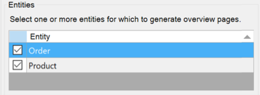
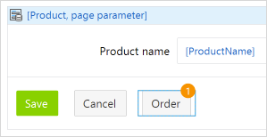
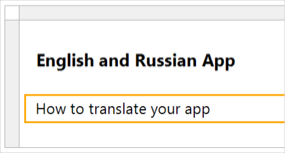
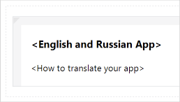
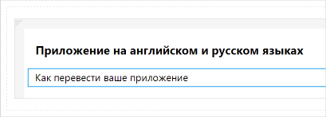
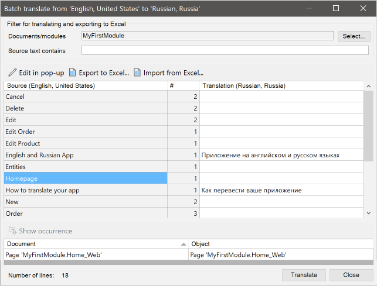

## 1 Introduction

Delivering your Mendix app in multiple languages is an important capability for reaching a wide audience. Most of the text that the end-user sees is stored as translatable texts (for example, labels, button names, and menu items). Using the language features of Mendix, you can quickly make your app multilingual and translate the content to many other languages.

**This how-to will teach you how to do the following:**

* Add a new language to your app
* Change the working language
* Translate individual items of text
* Translate multiple items of text in one operation
* Change multiple items of text in one operation
* Copy a translation from one language to another

It is assumed that you know the basics of creating new apps and editing them.

## 2 Creating a Sample App

To demonstrate working with languages, you will create a new app from the blank app template. You will add some text to this app, as an example, but the app you create is to demonstrate the language features of Mendix and is not intended to be run.

When you create an app from a Mendix template, there is one language available. This is **English, United States**, which you will usually set to be the **Default language**. This is the language which will be displayed when an end-user has no language selected, or when your app does not support their selected language.

To create your app, do the following:

1. Create a new app using the **Blank App** template. If given the option, leave the **Default language** as **English, United States**.
2. Open the app in Studio Pro.
3. Create a domain model in MyFirstModule with two entities:

	* **Order** with the integer attribute **OrderNumber**
	* **Product** with the string attribute **ProductName**
	
		

4. Right-click one of the entities and select **Generate overview pages**.
5. In the **Generate pages** dialog box, ensure both entities are selected and click **OK**.

	
	
	This generates some pages containing text for you to translate.

6. Open the page **Product_NewEdit** and add a new **Button** widget.
7. Label the new button **Order**. You will use this button to allow the end-user to order the product they are viewing. Ignore the warnings about the setup of this button, if any.

	

8. Open the page **Home_Web** and put some text into the title and subtitle.

	

You now have an app with some translatable texts.

## 3 Adding App Languages

You can now add an additional language to your app.

If you want to create the whole app in a language other than the current default, it is best to do this before you start creating the app. If you want to add alternative languages, it is best to do this when your app is nearing completion, as it reduces the amount of work needed to do the translation from the default language, especially if there is already a translation for that language.

To add an additional language, do the following:

1. Select the menu item **Language** > **Language settings**. The **App Settings** dialog box opens.

2. Click **Add** to open the **Add Language** dialog box.  

3. Select a **Language**. In this example, we select **Russian, Russia**, but you can use any language you like.

  {}
  We recommend that you do *not* choose **Dutch, Netherlands**, as this already contains translations for many of the translatable texts.
  {}

4. Click **OK** to save the changes and close the **Add Language** dialog box.

   In the **App Settings** window, the default language is still **English, United States**. This is the language that the end-user see if they do not choose Russian as their language.
   
   

5. Click **OK** to close the **App Settings** dialog box.

## 4 Changing the Current Language

The current language is the language of the dictionary where any text you enter is stored. At the lower-right corner of the Studio Pro window, the language indicator shows which language is the current language.

To change your current language to Russian, do the following:

1. Click the language indicator at the lower-right corner of the Studio Pro window.
2. Select **Russian, Russia** to make that your current language.

	

{}
If you do further development later on, remember to change back to your default language so that any new text is recorded there and not in a translated dictionary.
{}

## 5 Translating an Individual Piece of Text

Now that your current language is Russian, you can translate some of the texts into that language.

1. Open the **Home_Web** page in Studio Pro.

	The untranslated texts appear in the default language (English, United States) between angle brackets `<>`.
	
	
	
2. Enter your translation for the two text items on the page.

	

You have now added a translation for these two pieces of text.

## 6 Using Batch Translate

You could translate each piece of text individually. However, there are texts which appear multiple times, for example **Cancel**, **Delete**, and **Edit**.

Mendix offers you a way to add a translation for all occurrences of a text at once.

### 6.1 Translating Multiple Texts {#translate-multiple-texts}

To translate multiple occurrences and multiple texts from the default language, English, to Russian in a single operation, do the following:

1. Select the menu option **Language** > **Batch Translate**. The **Batch Translate** dialog box opens.

2. Select **English, United States (default)** as the **Source language** and **Russian, Russia** as the **Destination language**.

3. Click **OK**.

	The **Documents/modules** field is set to **(all)**. You initially want to work just on your module, rather than everything.
	
4. Click **Select** next to **Documents/modules**. The **Select Documents/Modules** dialog box opens.

5. Make sure that only the module **MyFirstModule** is selected. This restricts batch translation to this module.

   

6. Click **OK**. You can now see all the translatable texts in your module. The **Translation (Russian, Russia)** column shows the individual translations you made in the previous section. The **#** column shows the number of times each text appears in the selected module(s).

   

7. Enter translations in the **Translation (Russian, Russia)** column for a few terms: **Cancel**, **Delete**, and **Edit**, for example.

   

8. Click **Translate** to save the current translations.

9. **Close** the batch translate dialog box.

10. Go to the page **Product_NewEdit**. You will see that these terms now have Russian translations.

   

### 6.2 Dealing With More Complex Translations

Sometimes a single word in the source language does not have a single translation in the destination language.

Follow the steps below to see how to deal with this situation:

1. Follow steps **1** through **6** in the [previous section](#translate-multiple-texts) to again see a list of texts in your module which can be translated from **English, United States** to **Russian, Russia**.
2. In the **Source text contains** field, enter *Order*.
3. Click the translatable text `Order`. The **#** column shows that there are three places that this text is used – they are listed in the **Show occurrence** section.

	
	
	The **Object** column shows that one of the locations of the text `Order` is an action button on the **Product_NewEdit** page. This is the button we added to allow the end-user to order the product.

4. In the **Show occurrence** section, double-click the row of **Action button 'actionButton3'**. The **Product_NewEdit** page opens with the button **Order** selected. This confirms that this is the button we want to use to order a product.

	

The text `Order` is being used to refer to the Order entity, but also the command to order a product. In Russian these are two different words.

To solve this issue, you can do the following:

1. Click **Translate** to save any translations you have made, if any.

2. Close the **Batch translate** dialog box.

3. Go to the page **Product_NewEdit**.

4. Edit the text on the button to reflect the verb *to order*. In Russian this is `заказать`.

  

5. Reopen the **Language** > **Batch Translate** dialog box and search for *Order* in the module **MyFirstModule**.

  Now the translations for *Order* have been split between the one with the translation `заказать` and the one with no translation.

  

6. Change the remaining entries for *Order* to `Заказ`, the Russian for *an order*.

  

7. Click **Translate** to save the translation and **OK** to close the **Batch translate** dialog box.

You can now check that the correct translation has been applied to the other instances of *Order*, for example on the **Order_Overview** page.

## 7 Replacing Text in Current Language

Once you have made some translations, you may want to look at just the translations to check for spelling or consistency. To do this, use **Batch replace**.

To use batch replace, do the following.

1. Ensure that your current language is the language you want to review. Batch replace works on the currently selected language.

2. Select the menu item **Language** > **Batch replace**.

	You see all the translations which are in the current language dictionary. You can limit these to a module and search them for specific words as before. You can also see where each text is used, so you can view it in context.
	
	
	
	You can see that you have been inconsistent with use of capital letters. So you need to make it more consistent.

3. Enter the new text in the **Replace with** column.

	

4. Click **Replace** to update the translation dictionary.

5. **Close** the dialog box.

## 8 Copying to a New Language

Having translated your app, you may want to translate it into another related language (for example **Dutch, Netherlands** into **Dutch, Belgium**, **English, United States** into **English, United Kingdom**, or **Russian, Russia** into **Belarusian, Belarus**). Many of the translations will be the same, so you do not want to type them again.

To copy our Russian translations into a Belarusian dictionary, you can do the following:

1. Go to **Language > Language Settings**. The **App Settings** dialog box opens.

2. Click **Add** to add **Belarusian, Belarus** as an app language.

  

3. Click **OK** to save the changes and close the **App Settings** dialog box.

4. Go to **Language** > **Language Operations**. The **Language Operations** dialog box opens.

5. Select **MyFirstModule**. In the **Russian, Russia** column, it shows **11**. This means there are 11 translations in the Russian dictionary.

6. Select **Copy** for the **Operation**.

7. Select **Russian, Russia** as the **Source language**.

8. Select **Belarusian, Belarus** as the **Destination language**.

9. Click **Apply**. Now in the **Belarusian, Belarus** column, it shows **11** , too. Your Russian texts are copied to the Belarusian dictionary. You can use batch replace to review them or use batch translate to change any cases where the Russian and Belarusian translations are different.

10. **Close** the **Language Operation** dialog box.

## 9 Other Considerations

Now you know how to make translations of translatable texts, there are a couple of other things you may wish to investigate.

### 9.1 Completeness

You probably want to know if you miss any text that should have been translated. It is a big task to go through your app manually and check every piece of text.

Mendix provides you with a completeness check for your languages. You can set this by editing the language in **Language Settings**. You then receive warnings about all text which has not been translated into that language. There is always a completeness check for the default language.

For more information, see [Advanced Language Settings](/refguide/language-settings#advanced) in the *Language Settings* reference guide.

### 9.2 Sharing Translations With Other Apps

You have seen how you can create translations easily and even copy your new translation to a new language in the current app.

What if you have several apps and want to add Russian to all of them? Maybe you want to translate your own modules from scratch, but you will not want to translate the system module, administration module, and Atlas UI all over again, as they do not change and you already have perfect translations for these.

Mendix allows you to export a translation to an Excel file, either for the whole app or just selected modules. You can then import this translation to another app and have your translation available to you.

For more information, see [Exporting & Importing Text](/refguide/batch-translate#export-import) in the *Batch Translate* reference guide.

## 10 Read More

* [Language Menu](/refguide/translatable-texts)
