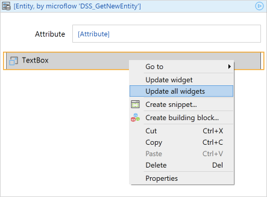
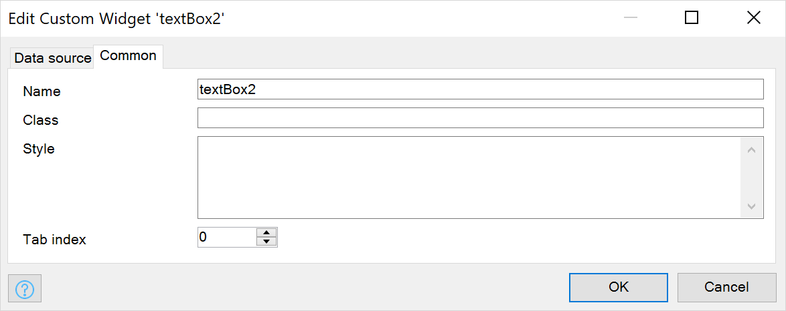
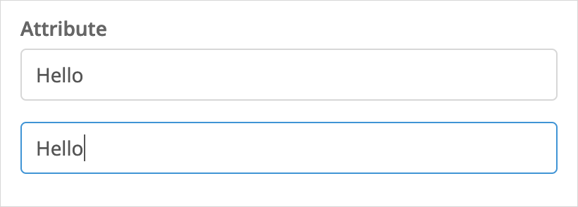
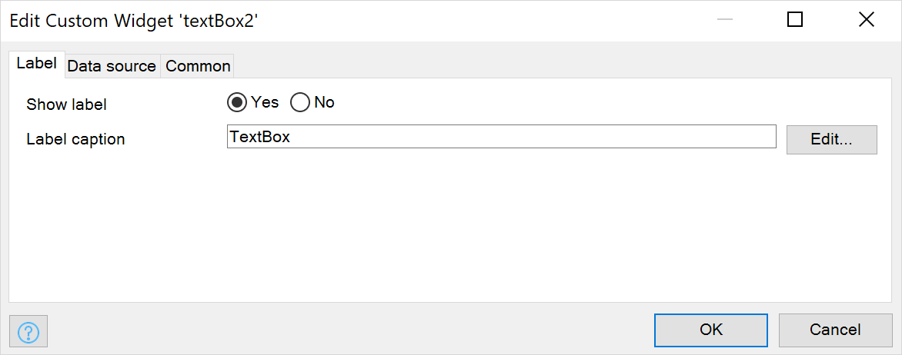
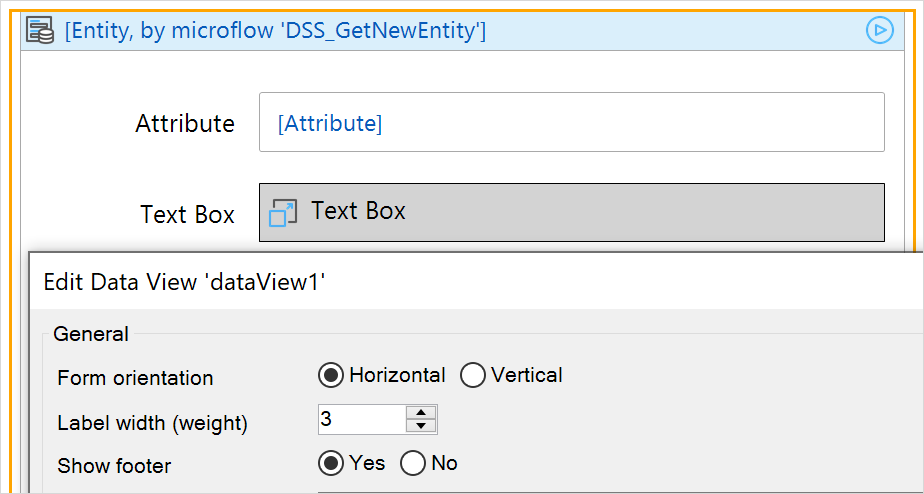
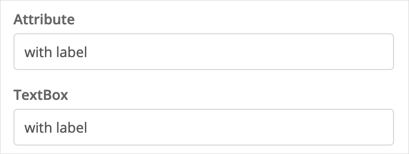

## 1 Introduction

Pluggable widgets are the new generation of custom-built widgets. These widgets are based on React and use a different architecture than the older custom widgets based on Dojo. With pluggable widgets, you can develop powerful tools in simple, precise ways. In the first part of this series, you will learn to create a text input widget step by step.

**This how-to will teach you how to do the following:**

* Generate a widget structure
* Create a basic text input widget
* Add a label

**Are you in a hurry?** 

Clone this [code sample](https://github.com/mendix/text-box-sample) from GitHub with the basic and advanced features already implemented.

## 2 Prerequisites

Before starting this how-to, make sure you have completed the following prerequisites:

* Install [Node.js](https://nodejs.org/en/about/) (a version below 10, preferably 8)
	* For Windows, install using the [official installer](https://nodejs.org/dist/latest-v8.x/)
	* For Mac, install using [Homebrew](https://brew.sh/) by executing these commands:
		* `/usr/bin/ruby -e "$(curl -fsSL https://raw.githubusercontent.com/Homebrew/install/master/install)"`
		* `brew install node@8`
* Install [npm](https://www.npmjs.com/) with the following command: `npm install npm@latest -g`
* Install [Yeoman](https://yeoman.io/) with the following command: `npm install yo -g`
* Install the Mendix Pluggable Widget Generator with the following command: `npm install @mendix/generator-widget -g`
* Install an integrated development environment (IDE) of your choice (Mendix recommends [Microsoft Visual Studio Code](https://code.visualstudio.com/))
* Have a basic understanding of [TypeScript](https://www.typescriptlang.org/)

## 3 Creating a TextBox Input Widget

The following steps will teach you to build a pluggable input widget, and show you how to use the new pluggable widget API.

### 3.1 Creating a Test Project{#creating-a-test-project}

1.  Open Mendix Studio Pro and create a new test project by selecting **File > New Project** from the top menu bar. Select the starter app **Blank**, which is the last option on the last page. Then click the **Use this starting point** button, and on the **App Settings** dialog box click **Create app**.
	
	Optionally you may remove all unused custom widgets to optimize the debugging process. Select **Project > Show Project Directory in Explorer** from the Mendix Studio Pro menu and open the **widgets** folder. Then, delete all the files in this folder. 
	
	To resolve the errors this incurs:<br />
	a. Press <kbd>F4</kbd> to refresh your app.<br />
	b. Double-click the errors in the bottom menu to see their locations.<br />
	c. Delete the widgets those errors bring you to.

2.  Create a test case for the new widget:<br />
	a. In the domain model of **MyFirstModule**, add a new entity.<br />
	b. Add a new attribute of type **String**.<br />
	c. Open **MyFirstModule’s** **Home** page.<br />
	d. There, add a **Data view** widget, double-click the widget, and give it a data source microflow by selecting **Data source** > **Type** > **Microflow**.<br />
	e. Next to the microflow field click the **Select** button, and click **New**.<br />
	f. Provide the name *DSS_CreateTestObject* to this new microflow.<br />
	g. Click the **Show** button. This will open the microflow editor. Then click the **OK** button to close the dialog box.<br />
	h. Add a new **Create object** action on your microflow.
3. Open the new **Create Object** action's properties by double clicking it. For its **Entity**, click the **Select** button and choose the entity you created above. Then click the **OK** button to close the dialog box.
4. Right click on the **Create Entity** activity, then click **Set $NewEntity as Return Value**.
5. Go back to the home page, open the **Add Widget** menu, and then add a **TextBox** widget inside the data view.
6.  Open the Textbox's properties and select the **Datasource Attribute (path)** string attribute you created above. Then click the **OK** button to close the dialog box. The end result should look like this:

	
	
	

### 3.2 Widget Scaffolding

The Pluggable Widget Generator is the quickest way to start developing a widget. It creates a widget’s recommended folder structure and files.

Using a terminal or command line, navigate to your new Mendix app project’s folder, create a new folder named *CustomWidgets*, and start the generator using:

```
mkdir CustomWidgets
cd CustomWidgets
yo @mendix/widget TextBox
```

The generator will ask some questions in the setup. Select the **TypeScript, For web and hybrid mobile apps, Empty widget, No unit test,** and **No end-to-end tests** options:


### 3.3 Adding the Attribute

Open the **(YourMendixProject)/CustomWidgets/TextBox** folder in your IDE of choice. From now on, all file references will be relative to this path. To set up your new widget, first you must use an attribute of the context object and display that attribute in an input field: 

1. To prevent future errors, remove the file *src/components/HelloWorldSample.tsx*.
2. Edit *src/TextBox.xml* to remove the `sampleText` property and add the property `Text attribute`:

	```xml
	<?xml version="1.0" encoding="utf-8" ?>
	<widget id="mendix.textbox.TextBox" pluginWidget="true" needsEntityContext="true" supportedPlatform="Web" offlineCapable="true" xmlns="http://www.mendix.com/widget/1.0/" xmlns:xsi="http://www.w3.org/2001/XMLSchema-instance" xsi:schemaLocation="http://www.mendix.com/widget/1.0/ ../xsd/widget.xsd">
		<name>Text Box</name>
		<description>Edit text input</description>
		<icon/>
		<properties>
			<propertyGroup caption="Data source">
				<property key="textAttribute" type="attribute">
					<caption>Text attribute</caption>
					<description/>
					<attributeTypes>
						<attributeType name="String"/>
					</attributeTypes>
				</property>
			</propertyGroup>
		</properties>
	</widget>
	```
	
	Explaining the code:
	
	* The property `pluginWidget=true` will make the widget work with the new widget API
	* The `needsEntityContext=true` is set up to allow the attribute to be taken from context
	* The property of the type attribute only allows the selection of string attributes from the domain model
3. The typescript typing based on the XML will be generated automatically. Start the development process with the following command: `npm run dev`.

	This process will bundle the widget and generate the properties into *typings/TextBoxProperties.d.ts*.
	
	{}The console will show the error below, as we did not implement our `TextInput` component. We will solve the error in section 3.5 of this how-to:{}
	
	```
	ERROR in ./src/TextBox.tsx
		Module not found: Error: Can't resolve './components/HelloWorldSample' in 'C:\Users\john.doe\textboxtest-main\CustomWidgets\TextBox\src'
		@ ./src/TextBox.tsx 14:0-28:2
	```

4. Create a new file, *components/TextInput.tsx*. This will be the display component. A display component does not interact with APIs and can be re-used in any React application. Paste the following code into *TextInput.tsx*:

	```ts
	import { Component, ReactNode, createElement } from "react";
	
	export interface InputProps {
		value: string;
	}
	
	export class TextInput extends Component<InputProps> {
		render(): ReactNode {
			return <input type="text" value={this.props.value} />;
		}
	}
	```
	
	Explaining the code:
	
	* The interface defines the properties of the React components – the value is passed to the component and it will render an HTML input element with the given value
	* The component is a class extending `Component` and should be exported to be used in other components
	* The render method is the only required function in a component, and it will return the expected DOM for the browser (for more information, see React’s [component documentation](https://reactjs.org/docs/react-component.html))
5. The container component *TextBox.tsx* receives the properties in the runtime, and forwards the data to the display component. The container works like glue between the Mendix application and the display component. Override the class lines in *TextBox.tsx* until they look like this:

	```ts
	import { Component, ReactNode, createElement } from “react”; 
	import { TextInput } from "./components/TextInput";
	class TextBox extends Component<TextBoxContainerProps> {
		render(): ReactNode {
			const value = this.props.textAttribute.value || "";
			return <TextInput value={value} />;
		}
	}
	```
	
	Be sure all the imports are included before moving on from this step.
	
	Explaining the code:
	
	* The `textAttribute` is an object that will automatically have the actual data stored in the attribute – when the data is changed, it will cause an update of the component, and the new data will be displayed in the input
6. Override the class lines in *Textbox.webmodeler.tsx* until they look like this:

	```ts
	import { TextInput } from "./components/TextInput";
	
	declare function require(name: string): string;
	
	// eslint-disable-next-line @typescript-eslint/class-name-casing
	export class preview extends Component<TextBoxPreviewProps> {
		render(): JSX.Element {
			return <TextInput value={this.props.textAttribute} />;
		}
	}
	```
	
	Before moving on from this step, you should remove the import lines concerning "Hello World" sample text from *TextBox.webmodeler.tsx* and *TextBox.tsx*, as these lines are no longer in use.	
7.  Add a test widget to the project home page:<br />
	a. To find your widget for the first time you need to refresh from the files system. Use <kbd>F4</kbd> or select **Project > Synchronize Project Directory** from the Mendix Studio Pro menu.<br />
	b. Navigate to **Home > Add widget** in the editor menu.<br />
	c. Select the newly-created **TextBox** widget at the bottom of the list.<br />
	d. Place the widget below the standard text widget.<br />
	e. Open the widget properties. In the **Data source** tab **select** the **Text attribute** from the attribute created in [Creating a Test Project](#creating-a-test-project) above.

	The end result will be similar to the screenshot below:
	
	
	
	{}The widgets in Studio and Studio Pro are not automatically updated. To refresh them press <kbd>F4</kbd> or select **Project > Synchronize Project Directory** from the Mendix Studio Pro menu to reload the widgets from the file system. Then right-click the widget and select **Update all widgets** to update the newly-changed properties in the widget.{}
8. On the test project **Home** page, create a data view with an attribute. Add a **Text box** input widget and one of your newly-created **TextBox** widgets next to each other to compare them. Select the same attribute in both widgets.
9.  When running the project, the new widget is already functional. The first text box is a standard Text box widget and the second is our pluggable widget. When data is changed in the first input and the cursor is moved to the next widget, the data of our widget is also updated: 

	

### 3.4 Adding Style

The input works, but the styling could be improved. In the next code snippets, you will add the default styling to make your TextBox widget look like a Mendix widget. Also, you need to pass the `Class`, `Style` and `Tab index` properties from the `Common` tab which originate from the **Edit Custom Widget** dialog box:



1. In *TextBox.tsx* pass the properties from the runtime to the `TextInput` component:

	```ts
	class TextBox extends Component<TextBoxContainerProps> {
		render(): ReactNode {
			const value = this.props.textAttribute.value || "";
			return <TextInput
				value={value}
				style={this.props.style}
				className={this.props.class}
				tabIndex={this.props.tabIndex}
			/>;
		}
	}
	```

2. In *components/TextInput.tsx* add the attributes to the interface and render them in the input:

	```ts
	import { CSSProperties, Component, ReactNode, createElement } from "react";
	import classNames from "classnames";
	export interface InputProps {
		value: string;
		className?: string;
		index?: number;
		style?: CSSProperties;
		tabIndex?: number;
	}
	export class TextInput extends Component<InputProps> {
		render(): ReactNode {
			const className = classNames("form-control", this.props.className);
			return <input
				type="text"
				className={className}
				style={this.props.style}
				value={this.props.value}
				tabIndex={this.props.tabIndex}
			/>;
		}
	}
	```
	
	Explaining the code:
	* The style property is a React style object which can be passed to an HTML element directly
	*  `classNames` is an external utility function which dynamically creates and combines class names; it must be imported before it can be used (for the full API, see the property’s [documentation](https://github.com/JedWatson/classnames))
	* Each property with a question mark is optional
3.  Your efforts will result in a well-styled input widget:

	

### 3.5 Making the Input Labeled

While the Mendix input widgets come with labels, you will need to add one to TextBox manually. With the new API it is easy to add a label to any widget.

1.  In the *TextBox.xml* file add attribute `<systemProperty />` inside the existing property group:

	```xml
	<systemProperty key="Label" />
	```

	This will add the **Show label** radio buttons in the widget properties tab **Data source**. When **Show label** is set to true it will automatically render the label for you in the page editor and the browser:

	

2.  In the page editor the label is previewed:

	

3.  This will result in a label above or next to the input depending on the available space, data view `Form orientation`, and the `Label width (weight)`:

	

### 3.6 Handling Updates

The value from the attribute can be displayed and updated using the other input, however you cannot change the value directly from within your widget. You can close the loop by following these steps. 

1. In *TextBox.tsx* create a function that will update the attribute, and pass it to the `TextInput` component:

	```ts
	class TextBox extends Component<TextBoxContainerProps> {
		private readonly onUpdateHandle = this.onUpdate.bind(this);
		render(): ReactNode {
			const value = this.props.textAttribute.value || "";
			return <TextInput
				value={value}
				style={this.props.style}
				className={this.props.class}
				tabIndex={this.props.tabIndex}
				onUpdate={this.onUpdateHandle}
			/>;
		}
		private onUpdate(value: string) {
			this.props.textAttribute.setValue(value);
		}
	}
	```
	
	Explaining the code: 
	
	* JavaScript can pass functions from one object to another – this way, the Mendix API stays in the container `TextBox component` and provides a function to the display component to pass updates back to the attribute
	* When a function is passed to another component, the function might have a scoping issue – this can be solved by binding the context `this` to the function before passing it to the display component (for more information, see this [freeCodeCamp blog post](https://medium.freecodecamp.org/this-is-why-we-need-to-bind-event-handlers-in-class-components-in-react-f7ea1a6f93eb))
2. In *components/TextInput.tsx* handle the change events of the input and pass the new value to the `onUpdate` function of the container component:

	```ts
	import { CSSProperties, ChangeEvent, Component, ReactNode, createElement } from "react";
	import * as classNames from "classnames";
	export interface InputProps {
		value: string;
		className?: string;
		index?: number;
		style?: CSSProperties;
		tabIndex?: number;
		onUpdate?: (value: string) => void;
	}
	export class TextInput extends Component<InputProps> {
		private readonly handleChange = this.onChange.bind(this);
		render(): ReactNode {
			const className = classNames("form-control", this.props.className);
			return <input
				type="text"
				className={className}
				style={this.props.style}
				value={this.props.value}
				tabIndex={this.props.tabIndex}
				onChange={this.handleChange}
			/>;
		}
		private onChange(event: ChangeEvent<HTMLInputElement>) {
			if (this.props.onUpdate) {
				this.props.onUpdate(event.target.value);
			}
		}
	}
	```
	
	Explaining the code: 
	
	* The input's `value` is set by the `this.prop.value`, and this property is not changed directly; the update function will use the `setValue` to trigger a re-render with the updated property
	* There are two ways of handling input changes in React: [controlled components](https://reactjs.org/docs/forms.html#controlled-components) or [uncontrolled components](https://reactjs.org/docs/uncontrolled-components.html)
	* The `onUpdate` function is optional and it should be checked for availability before executing it
	* The custom widget TextBox will still not pass text to the Text box widget after this step – it will gain this functionality in [Build a Text Box Pluggable Widget: Part 2 (Advanced)](create-a-pluggable-widget-two).

Congratulations, you have now made a fully functional input widget!

Continue with the next tutorial to learn how to add validation feedback,  custom validations, and an on-change event activity. You will also learn how to handle a read-only state, improve web accessibility, and make a Mendix Studio or Mendix Studio Pro preview.

## 4 Read More

* [Build a Text Box Pluggable Widget: Part 2 (Advanced)](create-a-pluggable-widget-two)
* [Write JavaScript Actions](write-javascript-actions)
* [Mendix Client API](https://apidocs.mendix.com/7/client/)